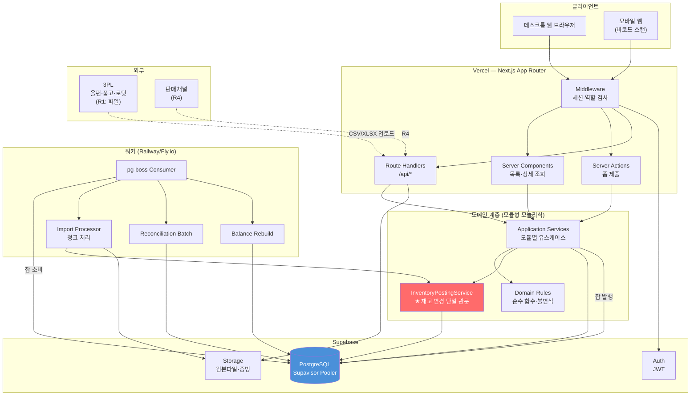
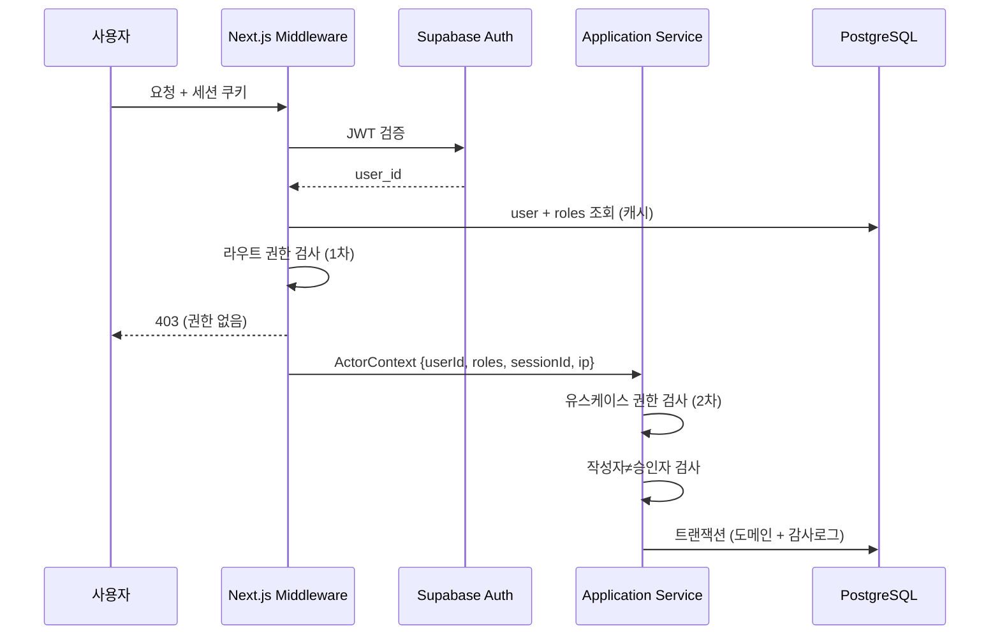
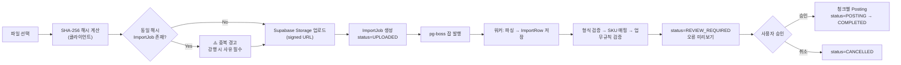
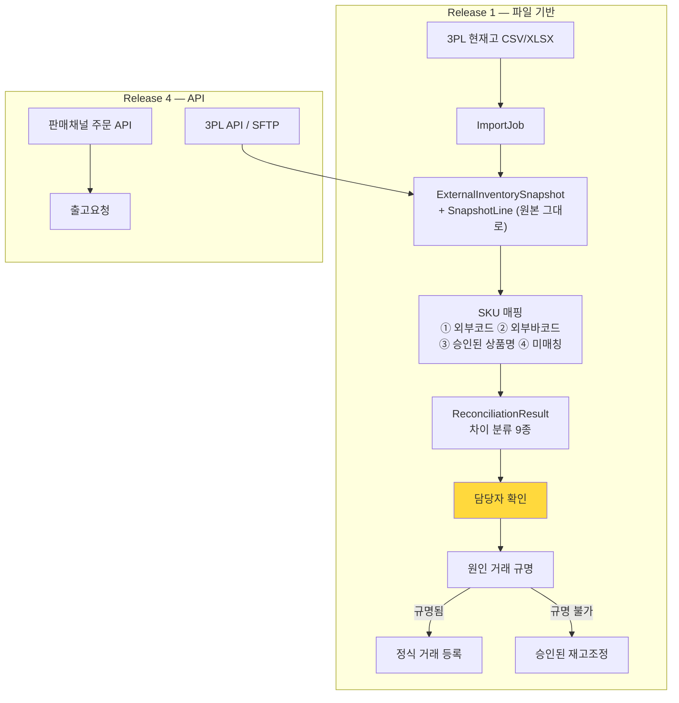
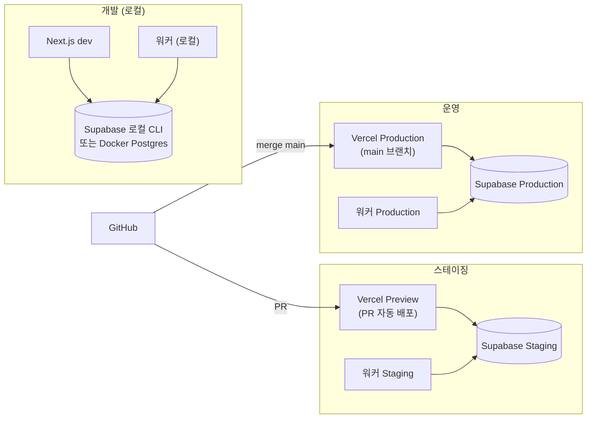
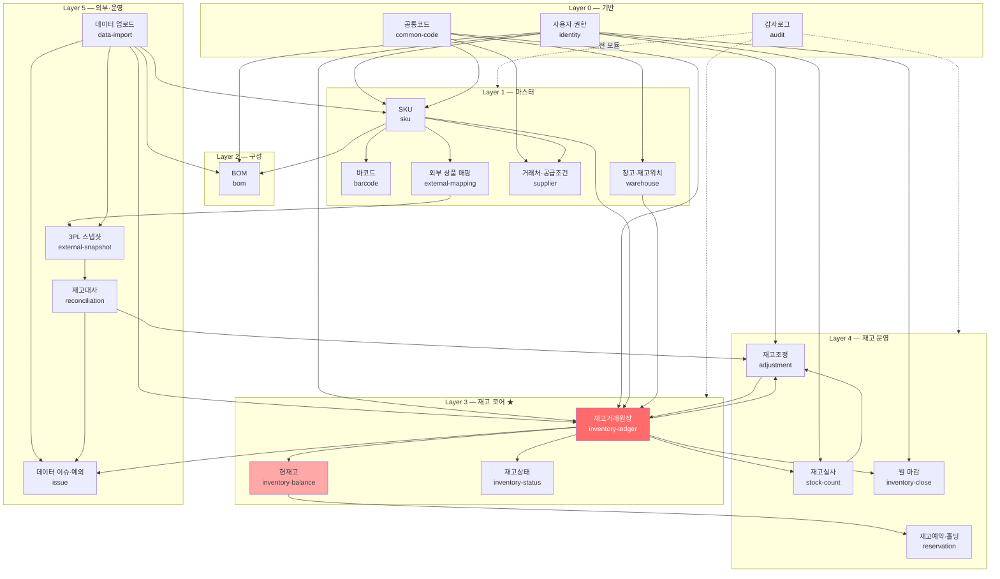
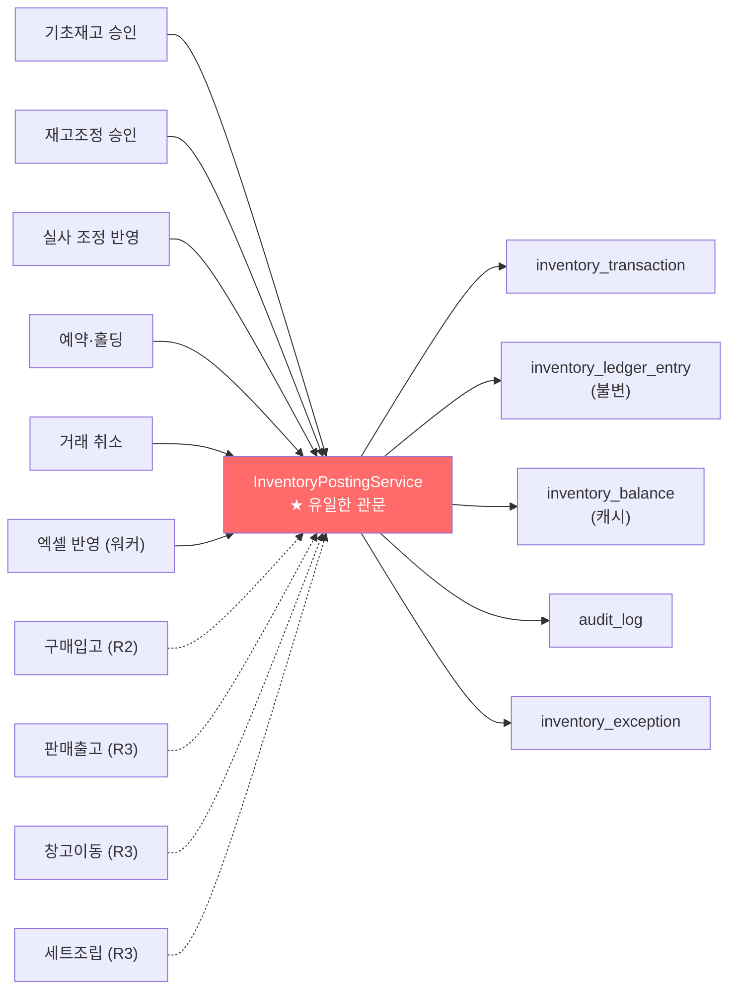

# DEEPPOINT SCM OS — 설계검토 03. 시스템 아키텍처 · 도메인 모듈 구조

---

# 4. 시스템 아키텍처

## 4.1 기술구성 평가

제시하신 기본안을 평가하고, 변경이 필요한 3가지를 제안한다.

### 유지 (적절함)

| 기술 | 판정 | 근거 |
|---|---|---|
| **Next.js (App Router) + TypeScript** | ✅ 유지 | 내부 업무 시스템에 적합. Server Component로 목록 조회 SSR, Server Action으로 폼 처리 |
| **PostgreSQL** | ✅ 유지 | `DECIMAL(18,6)`, 조건부 UNIQUE 인덱스(`WHERE`), `SELECT FOR UPDATE`, 윈도우 함수, `advisory lock` — 재고원장 요구를 전부 충족. 대안(MySQL)은 조건부 UNIQUE 미지원이라 부적합 |
| **Prisma** | ✅ 유지 (조건부) | 타입 안전성·마이그레이션 우수. 단 §4.10 제약 참조 |
| **Supabase Auth** | ✅ 유지 | 소수 내부 사용자에 적합. 단 §4.6 RLS 주의 |
| **Supabase Storage** | ✅ 유지 | 증빙파일·원본 엑셀 보관. RLS + signed URL |
| **Tailwind + shadcn/ui** | ✅ 유지 | 데이터 그리드·폼 중심 화면에 적합 |
| **Zod** | ✅ 유지 | API DTO 검증 + 엑셀 행 검증에 동일 스키마 재사용 가능 |
| **Vitest / Playwright** | ✅ 유지 | |
| **Vercel / GitHub** | ✅ 유지 (조건부) | §4.2 참조 |

### 변경 제안 1 — 비동기 작업 실행 환경 (⚠️ 필수)

| 항목 | 내용 |
|---|---|
| **문제** | Master PRD §14.2가 "엑셀 업로드 10,000행 2분 이내"를 요구하나, Vercel Serverless Function은 실행시간 상한(Hobby 10s, Pro 기본 60s·최대 300s)이 있다. 10,000행 파싱 + SKU 매핑 + 업무규칙 검증 + 원장 반영은 단일 함수에서 완주 불가하며, 중간 타임아웃 시 **부분 반영**되어 P10(원자성)을 위반한다. |
| **권장안** | **pg-boss (PostgreSQL 기반 잡 큐) + 전용 워커 프로세스** |
| **구성** | ① Next.js API가 `ImportJob`을 생성하고 pg-boss에 잡 발행 → 즉시 `202 Accepted` 반환 <br> ② 워커가 잡을 소비해 **청크(500행) 단위**로 처리, 각 청크가 독립 DB 트랜잭션 <br> ③ 진행률을 `ImportJob.processed_rows / total_rows`로 갱신, 프론트는 폴링 <br> ④ 실패 청크만 재시도 (`ImportRow.status`가 행 단위 멱등성 보장) |
| **워커 호스팅** | Railway / Fly.io 소형 인스턴스 1대 (월 $5~10). 또는 Supabase Edge Function(Deno, 최대 400s) |
| **장점** | 별도 인프라(Redis/SQS) 불필요 — 큐가 이미 쓰는 Postgres 안에 있음. 잡 상태가 DB에 있어 감사·재실행이 쉬움. 트랜잭션 경계가 명확 |
| **단점** | Vercel 외 런타임 1개 추가 (배포·모니터링 대상 증가). 큐 부하가 DB에 얹힘(본 규모에서는 무시 가능) |
| **대안** | Vercel Cron(1분 주기) + `/api/jobs/drain` 이 큐를 청크 드레인 — 인프라 0 추가지만 지연이 최대 1분이고 함수 시간 제약이 여전. **소규모 파일에는 충분하나 마이그레이션에는 부적합** |
| **결론** | **pg-boss + 전용 워커.** 마이그레이션(490 SKU + 383 BOM + 15,667 출고이력)과 3PL 대사가 상시 배치이므로 워커가 있는 편이 총비용이 낮다 |

### 변경 제안 2 — DB 연결 풀링 (⚠️ 필수)

| 항목 | 내용 |
|---|---|
| **문제** | Vercel Serverless는 요청마다 새 인스턴스가 뜰 수 있어 Postgres 커넥션이 폭증한다. Supabase 기본 커넥션 한도(소형 플랜 ~60)를 쉽게 초과한다. |
| **권장안** | **Supabase Supavisor(transaction mode) 경유 + Prisma `directUrl` 분리** |
| **구성** | `DATABASE_URL` = Supavisor pooler (`?pgbouncer=true&connection_limit=1`) — 런타임용 <br> `DIRECT_URL` = 직결 — `prisma migrate` / 워커용 |
| **⚠️ 파생 제약** | transaction-mode pooler에서는 **세션 단위 상태가 유지되지 않는다.** → `pg_advisory_lock()`(세션 락) **사용 불가**. 재고 동시성 제어는 반드시 **트랜잭션 내 행 잠금(`SELECT … FOR UPDATE`)** 또는 **조건부 원자 UPDATE**로 구현한다. `pg_advisory_xact_lock()`(트랜잭션 락)은 사용 가능하나 본 설계에서는 행 잠금으로 충분 |

### 변경 제안 3 — 엑셀 파싱 라이브러리

| 항목 | 내용 |
|---|---|
| **문제** | 널리 쓰이는 `xlsx`(SheetJS) npm 배포판은 과거 프로토타입 오염 취약점 이력이 있고 최신판은 npm 레지스트리 밖에서 배포된다. |
| **권장안** | **`exceljs`** (스트리밍 리더 지원, npm 정식 배포) |
| **필수 설정** | 셀 값을 **문자열로 강제 읽기** (바코드 지수표기 방지). 대용량은 `WorkbookReader` 스트리밍으로 워커에서 처리 |

### 추가 권장 (선택)

| 기술 | 용도 |
|---|---|
| **Testcontainers (Postgres)** | Vitest 통합·동시성 테스트에 실제 Postgres 사용. 조건부 UNIQUE·행 잠금은 SQLite/mock으로 검증 불가 |
| **Sentry** | 런타임 오류 추적 (감사로그와 별개) |
| **`decimal.js`** | Prisma Decimal 그대로 사용. **`Number()` 변환 금지** (1/30 = 0.0333333… 정밀도 손실) |
| **`@tanstack/react-table`** | 15개 화면 대부분이 대형 그리드. shadcn/ui Table 위에 얹음 |

## 4.2 전체 아키텍처



**핵심 불변식**: 재고를 변경하는 모든 경로는 반드시 `InventoryPostingService`를 통과한다. API Route, Server Action, 워커, 마이그레이션 도구 어느 것도 `inventory_ledger_entry` / `inventory_balance`에 직접 쓰지 않는다.

## 4.3 프론트엔드 구조

```
src/app/
├─ (auth)/
│  └─ login/                         로그인
├─ (app)/                            인증 필수 레이아웃 (사이드바 + 권한 가드)
│  ├─ dashboard/                     재고 대시보드
│  ├─ master/                        기준정보
│  │  ├─ skus/[id]/                  SKU 목록·상세·등록·승인
│  │  ├─ external-mappings/          외부 상품 매핑
│  │  ├─ boms/[id]/                  BOM 목록·상세·승인·전개·원가
│  │  ├─ suppliers/[id]/             거래처·공급조건·가격이력
│  │  ├─ warehouses/[id]/            창고·로케이션
│  │  └─ codes/                      공통코드
│  ├─ inventory/                     재고
│  │  ├─ balances/                   현재고 조회
│  │  ├─ ledger/                     재고거래원장
│  │  ├─ statements/                 일별·월별 수불부
│  │  ├─ projection/                 예상재고
│  │  ├─ opening-balance/            기초재고
│  │  ├─ adjustments/[id]/           재고조정
│  │  ├─ counts/[id]/                재고실사
│  │  ├─ holds/                      예약·홀딩
│  │  ├─ closes/                     월마감
│  │  └─ reconciliations/            3PL 재고대사
│  ├─ data/
│  │  ├─ imports/[jobId]/            엑셀 업로드 · 진행률 · 오류행
│  │  ├─ issues/                     데이터 오류
│  │  └─ exceptions/                 재고 예외
│  └─ admin/
│     ├─ users/  roles/              사용자·권한
│     └─ audit-logs/                 감사로그
└─ api/                              Route Handlers
```

**규칙**
- 비즈니스 로직을 컴포넌트·Route Handler에 작성하지 않는다 (SKU·BOM PRD §2.6).
- Server Component는 **조회 서비스만** 호출한다.
- 변경은 Server Action → Application Service 경로만 허용.
- 권한은 ① Middleware(라우트 진입) ② Application Service(유스케이스) 두 겹에서 검사한다. UI 숨김은 보안이 아니다.
- 공통 컴포넌트: `DataGrid`(검색·정렬·페이지·엑셀다운로드), `ApprovalBar`(승인/반려), `StatusBadge`, `QuantityCell`(Decimal 표시), `AuditTrailPanel`, `ImportWizard`(5단계).

## 4.4 백엔드 · 도메인 서비스 구조

**모듈형 모놀리식** — 모듈 간 호출은 반드시 `application/` 의 공개 인터페이스를 통한다. 다른 모듈의 `infrastructure/`나 Prisma 모델을 직접 참조하지 않는다.

```
src/modules/<module>/
├─ domain/            엔티티·값객체·불변식·상태전이. 순수 함수, DB·프레임워크 의존 없음
│  ├─ entities/
│  ├─ rules/          예: bom-cycle-detector.ts, stock-status-transition.ts
│  └─ errors/         도메인 오류 (오류코드 보유)
├─ application/       유스케이스. 트랜잭션 경계. 권한 검사. 감사로그 기록
│  ├─ commands/       CreateSku, ApproveBom, PostAdjustment …
│  ├─ queries/        읽기 전용 (다른 모듈 조회 허용)
│  └─ ports/          리포지토리 인터페이스
├─ infrastructure/    Prisma 리포지토리 구현, 외부 어댑터
└─ presentation/      Zod DTO, Route Handler, Server Action, 화면 컴포넌트
```

**공유 계층**
```
src/shared/
├─ db/              PrismaClient, 트랜잭션 헬퍼(withTransaction)
├─ auth/            세션, 역할 가드, ActorContext
├─ audit/           AuditLogger (모든 모듈이 사용)
├─ jobs/            pg-boss 클라이언트, 잡 정의
├─ excel/           exceljs 리더·라이터, 셀 정규화(문자열 강제)
├─ decimal/         Decimal 유틸 (number 변환 금지 lint 규칙 포함)
└─ errors/          공통 오류코드 체계
```

## 4.5 데이터베이스

| 항목 | 결정 |
|---|---|
| 엔진 | PostgreSQL 15+ (Supabase) |
| 스키마 | 단일 `public` 스키마. 모듈 경계는 코드로 강제 |
| 수량 타입 | `DECIMAL(18,6)` — **float 절대 금지** |
| 금액 타입 | `DECIMAL(18,4)` + `currency VARCHAR(3)` |
| 비율(로스율) | `DECIMAL(8,6)` |
| 시각 | `TIMESTAMPTZ` (UTC 저장) |
| 업무일자 | **`business_date DATE`** — `(occurred_at AT TIME ZONE 'Asia/Seoul')::date`. 집계·마감의 유일한 기준 |
| PK | UUID v7 권장 (시간 정렬성 → 인덱스 지역성). v4도 무방 |
| 문서번호 | 별도 `VARCHAR` (`TX-20260901-000123`), 사람이 조회하는 용도 |
| 삭제 | 물리삭제 없음. 상태값 + `deleted_at` (마스터만) |
| 원장 불변성 | `inventory_ledger_entry`에 **UPDATE/DELETE 차단 트리거** (최종 방어선) |
| NULL 정규화 | `lot_no`/`serial_no`/`owner_code` = `NOT NULL DEFAULT ''` 또는 `'DEEPPOINT'`, `expiry_key DATE NOT NULL DEFAULT '9999-12-31'` |

## 4.6 인증 · 권한



| 항목 | 결정 |
|---|---|
| 인증 | Supabase Auth (이메일 + 비밀번호). 사내 소수 사용자 |
| 인가 | **애플리케이션 계층 RBAC.** 역할 = `ADMIN`, `SCM_LEADER`, `SCM_STAFF`, `FINANCE`, `EXECUTIVE` |
| 권한 모델 | `Role` ↔ `Permission`(문자열 키, 예 `sku.approve`) N:M. `UserRole`로 사용자에 부여 |
| **⚠️ RLS 주의** | Prisma는 service role로 접속하므로 **RLS를 우회한다.** 따라서 테이블 RLS에 권한을 의존해서는 안 되며, 권한은 전적으로 Application Service에서 강제한다. RLS는 **Supabase Storage 버킷에만** 적용 |
| 작성자≠승인자 | `system_setting.allow_self_approval` (기본 false). **재고조정·음수재고 예외·마감해제는 override 불가로 하드코딩** (§00 D-07) |
| 재인증 | 월마감 해제, 음수재고 예외 승인, 마이그레이션 실행 시 비밀번호 재입력 |

## 4.7 파일 업로드 · 저장



| 항목 | 결정 |
|---|---|
| 저장소 | Supabase Storage. 버킷 `imports/`(원본), `evidence/`(증빙), `exports/`(다운로드) |
| 원본 보존 | **삭제 금지.** 파일 해시·업로더·업로드일시 저장 (재고 PRD §20.4) |
| 중복 방지 | SHA-256 해시 UNIQUE 검사 → 경고. 강행 시 사유 필수 + 감사로그 |
| 행 추적 | `ImportRow.source_row_no` (원본 엑셀 행번호) 필수 |
| 오류행 다운로드 | 원본 컬럼 + `error_code`·`error_message` 컬럼 추가한 xlsx 생성 |
| 접근 통제 | signed URL (만료 5분). 다운로드도 권한 검사 후 발급 |

## 4.8 비동기 작업

| 잡 | 트리거 | 처리 | 재시도 |
|---|---|---|---|
| `import.parse` | 파일 업로드 | 파싱 → `ImportRow` 저장 | 3회 (지수 백오프) |
| `import.validate` | 파싱 완료 | 청크 500행 검증 | 3회 |
| `import.post` | 사용자 승인 | 청크 500행 원장 반영 | 3회, **행 단위 멱등** |
| `balance.rebuild` | 수동 / 정합성 경보 | 원장 전량 재집계 → balance 대조 | 1회 |
| `reconciliation.run` | 스냅샷 업로드 완료 | 내부·외부 대사, 차이 분류 | 3회 |
| `close.validate` | 마감 요청 | 8종 사전검증 | 1회 |
| `statement.snapshot` | 일 1회 (Cron 02:00 KST) | 일별 마감재고 스냅샷 | 3회 |
| `export.generate` | 엑셀 다운로드 요청 | 대량 결과 생성 → Storage | 2회 |

**멱등성**: 모든 잡은 `job_key`(= 대상 엔티티 ID + 잡 종류)를 가지며, pg-boss `singletonKey`로 중복 실행을 막는다. 청크 처리는 `ImportRow.status`가 `POSTED`인 행을 건너뛴다.

## 4.9 외부 3PL · 채널 연동



| 원칙 | 구현 |
|---|---|
| **3PL 재고는 원장을 덮어쓰지 않는다** | `ExternalInventorySnapshot` → `ReconciliationResult` 경로만 존재. balance 직접 UPDATE 코드 없음 |
| **상품명만으로 자동 반영 금지** | 매핑 우선순위 4단계. `mapping_status = REVIEW_REQUIRED`(상품명 기반)는 자동 반영 불가 플래그 |
| **수량 차이만으로 자동 조정 금지** | 대사 결과는 **항상 사람의 확인**을 거친다 (재고 PRD §19.5) |
| **중복 수집 방지** | 파일 해시 + `idempotency_key` |
| 어댑터 | 3PL별 컬럼 매핑을 `external_system_column_map`으로 설정화 (코드 수정 없이 신규 3PL 추가) |

> ✏️ **2026-08-10 설계복구 (SKU 해석 서비스, T05-3)**: 위 흐름도의 `SKU 매핑 ① 외부코드 ② 외부바코드 ③ **승인된 상품명** ④ 미매칭` 에서 3단계는 **별도 approval workflow 를 뜻하지 않는다** — repository 에 매핑 승인 컬럼·API·감사 action 이 전무하므로 발명하지 않는다. T05-3 V1 은 상품명 일치 매핑을 **후보로만** 사용하고, 단일 후보여도 `autoApplicable=false` / `requiresReview=true` / `resolutionStatus=REVIEW_REQUIRED` 로 반환해 위 **"상품명만으로 자동 반영 금지"** 원칙을 그대로 지킨다. 바코드·상품명의 다중 후보는 **distinct SKU 수**로 판정해 `AMBIGUOUS`, 코드↔바코드 불일치는 `CONFLICT` 이며 어떤 경우에도 후보를 임의 선택하지 않는다. resolver 는 REST 미노출 internal service 이고 **어떤 쓰기도 하지 않는다**(미매칭 예외 영속화는 T17-2 소관). 규칙 전문은 **`14_설계복구_ExternalMappingResolver.md`**.

## 4.10 감사로그

| 항목 | 결정 |
|---|---|
| 기록 위치 | `audit_log` 단일 테이블 (`entity_type` + `entity_id` 다형 참조) |
| 기록 시점 | **도메인 트랜잭션과 동일 트랜잭션 내**. 별도 트랜잭션 금지(로그 유실) |
| 기록 방식 | `AuditLogger.record()` 를 Application Service에서 명시 호출. **DB 트리거로 자동 생성하지 않는다** — 변경 사유·승인자·요청ID를 트리거가 알 수 없기 때문 |
| 필수 필드 | 대상 테이블·ID, 액션, 변경 전/후 값(JSONB), 변경자, 일시, 사유, 승인자, 요청ID, 세션·IP |
| 대상 | SKU·BOM 승인/변경, 바코드 중복승인, 외부매핑, 원장거래 생성·취소, 조정·실사, 월마감·해제, 3PL 대사 해결·면제, 음수재고 예외, 파일 업로드·반영, 가격이력 |
| 보존 | 삭제·수정 불가. 트리거로 UPDATE/DELETE 차단 |

## 4.11 오류 · 예외처리

**3계층 오류 체계**

| 계층 | 유형 | HTTP | 처리 |
|---|---|---|---|
| `DomainError` | 업무규칙 위반 (`INSUFFICIENT_STOCK`, `BOM_CYCLE_DETECTED`, `CLOSED_PERIOD`) | 422 | 오류코드 + 한국어 메시지 + 관련 엔티티. 사용자에게 그대로 표시 |
| `AuthorizationError` | 권한 없음 | 403 | 감사로그 기록 |
| `ConflictError` | 동시성 충돌 (`SERIALIZATION_FAILURE`, 40001) | 409 | **자동 재시도 3회** (지수 백오프 50/100/200ms) 후 사용자 통지 |
| `ValidationError` | Zod 스키마 위반 | 400 | 필드별 오류 |
| `IdempotencyConflict` | 멱등키 중복 | 200 | **기존 결과 반환** (오류 아님) |
| `SystemError` | 예기치 못한 오류 | 500 | Sentry 전송, 사용자에게는 추적ID만 |

**업무 예외(Exception)와 시스템 오류(Error)의 구분**
- 시스템 오류 → 롤백 + 로그 + Sentry
- 업무 예외 → **`InventoryException` / `DataIssue` 큐에 등록**되어 담당자가 처리 (음수재고, 미매칭 SKU, 대사 차이, 원인문서 누락 등). 이것은 오류가 아니라 **워크플로우**다.

## 4.12 배포 · 환경 분리



| 환경 | DB | 데이터 | 배포 |
|---|---|---|---|
| **개발** | Supabase CLI 로컬 / Docker Postgres | 시드 데이터 (합성) | 로컬 |
| **스테이징** | Supabase 별도 프로젝트 | **운영 데이터 마스킹 사본 + 실제 엑셀 이관 리허설** | PR 머지 시 자동 |
| **운영** | Supabase 운영 프로젝트 | 실데이터 | `main` 머지 + **수동 승인 게이트** |

| 항목 | 결정 |
|---|---|
| 마이그레이션 | `prisma migrate deploy` — CI에서 스테이징 자동, **운영은 수동 승인 후 실행** |
| 시크릿 | Vercel 환경변수 + Supabase 프로젝트별 분리. `.env`는 커밋 금지 |
| 롤백 | Vercel 즉시 롤백. **DB 마이그레이션은 역방향 스크립트를 항상 함께 작성** |
| CI 게이트 | `tsc --noEmit` → `eslint` → `vitest` → `prisma migrate diff` 검사 → `playwright` (스테이징) |
| **마이그레이션 리허설** | 운영 이관 전 **스테이징에서 전체 이관을 최소 2회 완주**하고 검증보고서를 비교한다 |

---

# 5. 도메인 및 모듈 구조

## 5.1 모듈 의존관계



**의존 규칙**
1. 상위 Layer는 하위 Layer만 참조한다. 역방향 참조 금지.
2. 같은 Layer 내 참조는 `application/queries`(읽기)만 허용.
3. **`inventory-ledger`는 어떤 상위 모듈도 참조하지 않는다.** 조정·실사·대사가 원장을 호출하지, 원장이 그들을 호출하지 않는다.
4. `audit`은 전 모듈이 사용하지만 어떤 모듈도 참조하지 않는다.

## 5.2 모듈별 책임

### Layer 0

| 모듈 | 책임 | 의존 | 핵심 규칙 |
|---|---|---|---|
| **사용자·권한** `identity` | 사용자, 역할, 권한 매핑, 세션, `ActorContext` 생성, 작성자≠승인자 판정 | — | 권한 키는 `<도메인>.<액션>` 문자열. 역할 5종 |
| **공통코드** `common-code` | 브랜드·대분류·소분류·부자재분류·품목구분·단위·외부시스템·재고상태·거래유형·출고목적·판매채널·조정사유 | — | 코드는 계층형(`code_group` + `code`). 사용 중인 코드는 비활성만 가능, 삭제 불가 |
| **감사로그** `audit` | 변경 이력 기록·조회 | — | 도메인 트랜잭션 내 동기 기록. 불변 |

### Layer 1 — 마스터

| 모듈 | 책임 | 의존 | 핵심 규칙 |
|---|---|---|---|
| **SKU** `sku` | SKU CRUD, 상태 전이(DRAFT→PENDING→ACTIVE 등), 승인, 코드 추천, 재고관리 설정, 대량 업로드 | identity, common-code, audit | ① `sku_code` 전역 UNIQUE ② 거래 사용 후 코드 변경 불가 ③ `ARCHIVED`는 거래·BOM 미사용 시만 ④ 현재고 필드를 갖지 않음 |
| **바코드** `barcode` | SKU별 다중 바코드, 타입, 대표 지정, 중복 검증·예외 승인 | sku, identity | ① **문자열 저장** ② 활성+비예외 바코드 조건부 UNIQUE ③ SKU당 대표 최대 1개 ④ 삭제 대신 비활성 |
| **외부 상품 매핑** `external-mapping` | 내부 SKU ↔ ERP/WMS/3PL/채널 코드·상품명 | sku, common-code, warehouse | ① 동일 외부시스템 내 외부코드는 1 SKU ② 상품명 기반은 `REVIEW_REQUIRED`, **자동 원장 반영 불가** ③ 외부 상품명이 `sku_name`을 덮어쓰지 않음 |
| **거래처·공급조건** `supplier` | 공급업체·제조사, 공급업체별 SKU(MOQ·리드타임·사급/턴키·발주단위), 가격이력 | sku, warehouse, common-code | ① 가격은 **이력 테이블**, BOM 라인에 고정 저장 금지 ② 리드타임 nullable, 0 대체 금지 ③ 적용기간 중첩 검증 |
| **창고·재고위치** `warehouse` | 창고, 로케이션, 창고유형(INTERNAL/THREE_PL/SUPPLIER_SITE/OVERSEAS/VIRTUAL/IN_TRANSIT) | common-code | ① 창고 생성 시 **`DEFAULT` 로케이션 자동 생성** ② `UNIQUE(warehouse_id, location_code)` ③ `IN_TRANSIT` 가상창고는 시스템 예약 |

### Layer 2

| 모듈 | 책임 | 의존 | 핵심 규칙 |
|---|---|---|---|
| **BOM** `bom` | 헤더·라인, 버전·적용기간, 승인·활성화, 순환 검증, 다단계 전개, 원가 계산, 대량 업로드 | sku, supplier, warehouse, identity | ① 활성 BOM 직접 수정 금지 → 신규 버전 ② 동일 상위 SKU·기간에 ACTIVE 1개 ③ 순환 차단 ④ `quantity_per` > 0 필수 ⑤ **`pack_quantity` ≠ `quantity_per`** ⑥ 소요량 없으면 1 가정 금지 ⑦ 원가는 기준일 유효 가격이력으로 재계산 |

> ✏️ **2026-08-13 설계복구 (BOM, T07)**: 위 불변식 7종의 구현 계약은 **`18_설계복구_BOM.md`** 가 확정한다 — ①·② → **§D-6·§D-7**(`ACTIVE` 는 "적용기간 발효 승인"이며 교체는 predecessor `effectiveTo` 마감으로 한다) · ③ → **§D-13**(path 기반 DFS, 살아 있는 4 status 만 그래프, 5개 시점 검사, `maxLevel=10`) · ④ → **§D-10** · ⑤·⑥ → **§D-10·§D-19**(`packQuantity` 는 UI 추천값 생성에만 쓰고 원가에서 다시 나누지 않는다) · ⑦ → **§D-23·§D-24**(asOf 유효 `isPrimary` SupplierSku → `resolveEffectiveSupplierPrice` 재사용). 의존 모듈의 `warehouse` 는 **T08 미착수이므로 FK 없는 staged scalar** 다(**§D-32**).

### Layer 3 — 재고 코어 ★

| 모듈 | 책임 | 의존 | 핵심 규칙 |
|---|---|---|---|
| **재고거래원장** `inventory-ledger` | **`InventoryPostingService`** (재고 변경 단일 관문), 거래 헤더·원장행 생성, 멱등성, 반대거래, 마감기간 검사 | sku, warehouse, common-code, identity, audit | ① 원장행 INSERT only ② 원인문서 필수(기초재고 제외) ③ 멱등키 조건부 UNIQUE ④ 취소는 반대거래 ⑤ 집계 시 `status` 필터 안 함 ⑥ 상태이동은 합계 0인 쌍 |
| **현재고** `inventory-balance` | balance 캐시 갱신·조회, 특정일 기준 조회, 원장 재구축·검증 | inventory-ledger | ① **Posting Service만 갱신** ② 재고키 전체 UNIQUE (NULL 정규화) ③ 원장에서 언제든 재구축 가능 ④ 직접 UPDATE API 없음 |
| **재고상태** `inventory-status` | 상태 정의·전이 규칙 검증 | common-code | 허용 전이표(재고 PRD §6) 외 차단. 상태 변경은 필드 수정이 아니라 버킷 이동 거래 |

> ✏️ **2026-09-01 설계복구 (T2-5) — module root CLARIFIED**: 위 표의 **책임·의존·핵심 규칙은 그대로 유효하다.** 바뀌는 것은 **디렉터리 root 하나**다 — 실제 production root 는 **`src/modules/inventory`** 이며 그 아래 `application` / `domain` / `infrastructure` / `presentation` 4계층을 쓴다. 따라서 이 문서의 `inventory-ledger` · `inventory-balance` · `inventory-status` 표기(위 표, §5.1 의존 규칙 3, §5.1 다이어그램 노드, §5.3 강제 수단 1)와 `docs/04 §8.0` 의 경로 `src/modules/inventory-ledger/application/services/InventoryPostingService.ts` 는 **논리적 책임 분해로 읽고, 물리 경로로는 `src/modules/inventory` 를 쓴다.** 근거: 이 문서는 `CHANGELOG_v0.2.md` 가 *"미수정 파일 — `02`(아키텍처·모듈구조)"* 로 명시한 **v0.1 시점 기록**이고, 그보다 뒤인 `T0-5` 가 merge 한 `eslint-rules/inventory-boundary.ts` 는 허용 경로를 **`src/modules/inventory/infrastructure/**`** 로 고정하며 15개 테스트(`tests/eslint-rules/inventory-boundary.test.ts`)가 이를 지키고 있다 — 그것이 최신 **executable** architecture contract 다. `inventory-ledger/` 를 물리 경로로 쓰면 `T2-9`·`T2-10` 이 원장·잔고 모델을 import 하는 순간 그 lint 가 차단한다. ⛔ 원문을 삭제하지 않는다. ⛔ 이 clarification 은 **경로만** 바꾼다 — 업무규칙·검증규칙·DTO semantics·task 소유권은 **하나도 바뀌지 않는다.** `InventoryPostingService` 가 재고 변경의 **단일 관문**이라는 §4.2 불변식도 그대로다.

### Layer 4 — 재고 운영

| 모듈 | 책임 | 의존 | 핵심 규칙 |
|---|---|---|---|
| **재고예약** `reservation` | 예약(AVAILABLE→RESERVED), 해제, 홀딩·해제, 만료 | inventory-balance, inventory-ledger | ① 가용 초과 예약 차단 ② 동일 주문라인 중복 예약 차단 ③ **R1은 수동 홀딩만 실동작** ④ 프로모션 확보는 HOLD 아닌 RESERVED 우선 |
| **재고조정** `adjustment` | 조정 요청·승인·반영. 수량/상태/LOT/유통기한/창고 정정 | inventory-ledger, identity | ① 사유코드·증빙·승인 필수 ② LOT·창고 정정은 **감소+증가 쌍** ③ 마감월 조정은 관리자 추가승인 ④ 요청자≠승인자 (override 불가) |
| **재고실사** `stock-count` | 실사계획, 기준시점 장부 스냅샷, 실사수량 입력, **롤포워드** 차이 계산, 승인, 조정 반영 | inventory-ledger, adjustment | ① 시작 시 장부 스냅샷 ② `조정필요 = 실사수량 − 기준시점 장부 − 기준시점 이후 순거래` ③ 승인 전 조정거래 생성 금지 |
| **월 마감** `inventory-close` | 사전검증 8종, 마감, 마감 스냅샷, 해제 | inventory-ledger, 전 재고 모듈 | ① 마감 후 해당 월 `business_date` 거래 차단 ② 해제는 관리자 + 사유 ③ 창고별 진행상태는 `inventory_close_warehouse` |

### Layer 5 — 외부 · 운영

| 모듈 | 책임 | 의존 | 핵심 규칙 |
|---|---|---|---|
| **3PL 스냅샷** `external-snapshot` | 외부 현재고 원본 저장 (헤더+라인) | external-mapping, warehouse | 원본 그대로 보존. 가공값 저장 금지 |
| **재고대사** `reconciliation` | 내부·외부 비교, 차이 분류 9종, 담당자 배정·해결 | external-snapshot, inventory-balance, adjustment | ① **자동 조정 금지** ② 원인 거래 우선 규명 ③ 허용오차 기본 0 |
| **데이터 업로드** `data-import` | `ImportJob`/`ImportRow`, 해시 중복 방지, 열 매핑, 검증, 청크 반영, 오류행 다운로드 | 전 마스터 + inventory-ledger | ① 스테이징 필수, 즉시 반영 금지 ② 원본행번호 보존 ③ 부분 반영 허용 ④ 행 단위 멱등 |
| **데이터 이슈·예외** `issue` | `DataIssue`(마스터) + `InventoryException`(재고) 큐 | 전 모듈 | 상태머신 OPEN→ASSIGNED→IN_PROGRESS→RESOLVED/WAIVED→REOPENED |

## 5.3 재고 변경 경로의 단일화



**강제 수단**
1. `inventory_ledger_entry` / `inventory_balance` 리포지토리를 `inventory-ledger` 모듈 **내부에만** 노출한다.
2. ESLint `no-restricted-imports` 로 다른 모듈이 해당 Prisma 모델을 import하지 못하게 막는다.
3. DB 트리거로 `inventory_ledger_entry`의 UPDATE/DELETE를 차단한다 (최종 방어선).
4. 범용 원장 생성 API(`POST /api/inventory/transactions`)를 **외부에 노출하지 않는다** (재고 PRD §27.2).
