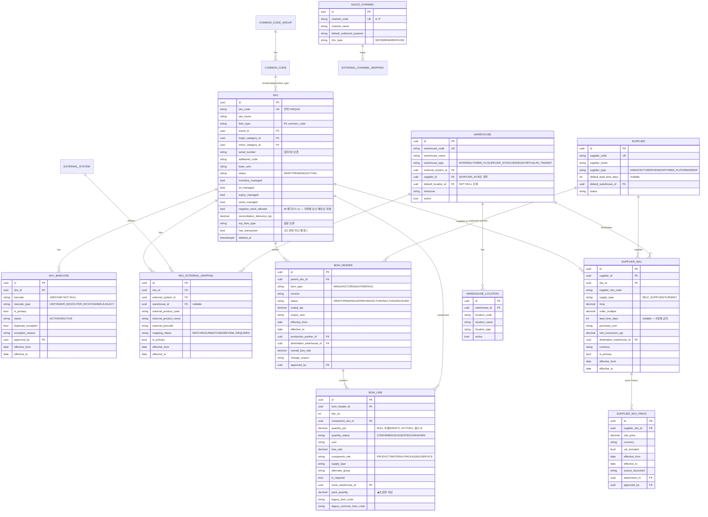
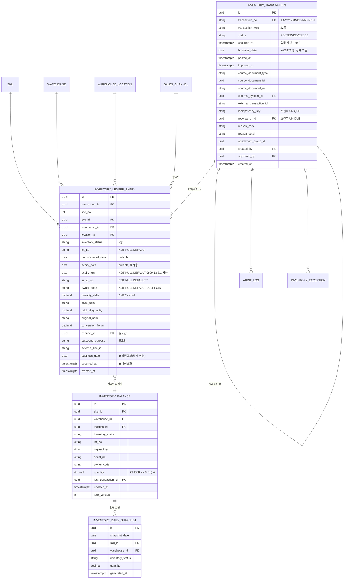
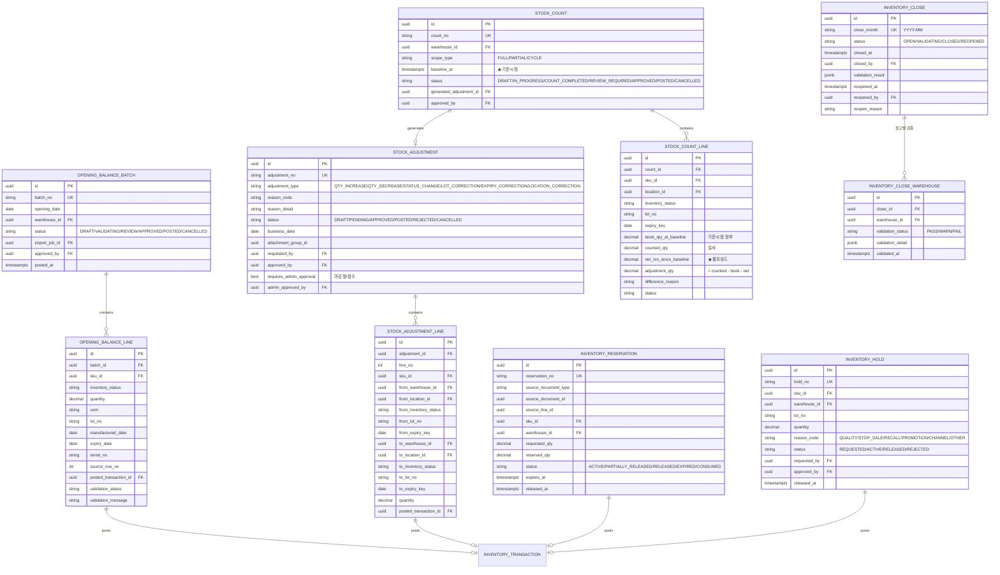
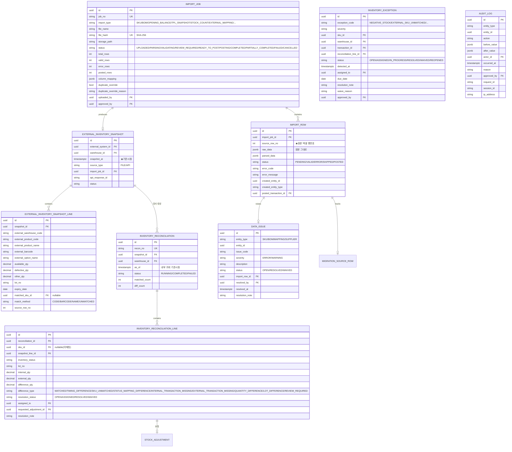

# DEEPPOINT SCM OS — 설계검토 04. ERD 초안 · Prisma Schema 초안

---

# 6. ERD 초안

## 6.0 공통 설계 규약

| 항목 | 규약 |
|---|---|
| **PK** | 전 테이블 `id UUID` (v7 권장). 애플리케이션 생성 |
| **문서번호** | 사람이 조회하는 번호는 별도 컬럼 (`transaction_no`, `adjustment_no` …). `UNIQUE` |
| **수량** | `DECIMAL(18,6)` — float 금지 |
| **금액** | `DECIMAL(18,4)` + `currency VARCHAR(3)` |
| **비율** | `DECIMAL(8,6)` |
| **시각** | `TIMESTAMPTZ` (UTC 저장) |
| **업무일자** | `business_date DATE` = `(occurred_at AT TIME ZONE 'Asia/Seoul')::date`. **집계·마감의 유일한 기준** |
| **감사 컬럼** | `created_at`, `created_by`, `updated_at`, `updated_by` (원장·이력 테이블은 `created_*`만) |
| **삭제정책** | ① 원장·확정 문서 = **물리삭제 불가**(트리거 차단) ② 마스터 = `status`/`active` + `deleted_at` 소프트 삭제 ③ 스테이징(`import_row`) = 보존기간 후 배치 삭제 가능 |
| **NULL 정규화** | 재고키 구성 컬럼은 NOT NULL + 센티넬 (`lot_no=''`, `serial_no=''`, `owner_code='DEEPPOINT'`, `expiry_key='9999-12-31'`) |
| **외부 연동 키** | `external_system_id` + `external_*_code/id` + `idempotency_key` |

## 6.1 전체 테이블 목록 (47개)

### Layer 0 — 기반 (9)

| # | 테이블 | 목적 |
|---|---|---|
| 1 | `user` | 시스템 사용자. Supabase Auth `auth.users.id` 미러 |
| 2 | `role` | 역할 (ADMIN / SCM_LEADER / SCM_STAFF / FINANCE / EXECUTIVE) |
| 3 | `permission` | 권한 키 (`sku.approve`, `inventory.adjust.approve` …) |
| 4 | `role_permission` | 역할↔권한 N:M |
| 5 | `user_role` | 사용자↔역할 N:M |
| 6 | `system_setting` | 시스템 설정 (`allow_self_approval` 등) |
| 7 | `audit_log` | 전 모듈 변경 이력 (불변) |
| 8 | `common_code_group` | 코드 그룹 (BRAND, MAJOR_CATEGORY, ITEM_TYPE …) |
| 9 | `common_code` | 코드 값 (계층형) |

### Layer 1 — 마스터 (11)

| # | 테이블 | 목적 |
|---|---|---|
| 10 | `sku` | **품목 마스터.** 490건 이관 |
| 11 | `sku_barcode` | SKU별 다중 바코드 |
| 12 | `external_system` | 외부시스템 정의 (LEGACY_ERP, EBUT_MANAGER, OLPUN, PUMGO, RODIT, OLIVEYOUNG …) |
| 13 | `sku_external_mapping` | 내부 SKU ↔ 외부 상품코드·상품명 |
| 14 | `supplier` | 공급업체·제조사 (40개사) |
| 15 | `supplier_sku` | 공급업체별 SKU 공급조건 (MOQ·리드타임·사급/턴키) |
| 16 | `supplier_sku_price` | 가격 이력 |
| 17 | `warehouse` | 창고 (3PL·제조사보관·가상·이동중) |
| 18 | `warehouse_location` | 창고 내 로케이션 |
| 19 | `sales_channel` | 판매채널 마스터 (16채널) |
| 20 | `external_channel_mapping` | 외부 판매처명·입고지 → 채널 매핑 |

### Layer 2 — BOM (2)

| # | 테이블 | 목적 |
|---|---|---|
| 21 | `bom_header` | BOM 버전·적용기간·상태 |
| 22 | `bom_line` | BOM 구성품 라인 |

### Layer 3 — 재고 코어 (4) ★

| # | 테이블 | 목적 |
|---|---|---|
| 23 | `inventory_transaction` | **거래 헤더.** 업무 사건 1건 |
| 24 | `inventory_ledger_entry` | **원장 행 (불변).** 실제 재고 증감 |
| 25 | `inventory_balance` | 현재고 **캐시**. 원장에서 재구축 가능 |
| 26 | `inventory_daily_snapshot` | 일별 마감재고 스냅샷 (조회 성능용) |

### Layer 4 — 재고 운영 (10)

| # | 테이블 | 목적 |
|---|---|---|
| 27 | `inventory_reservation` | 예약 (AVAILABLE→RESERVED) |
| 28 | `inventory_hold` | 홀딩 |
| 29 | `opening_balance_batch` | 기초재고 배치 |
| 30 | `opening_balance_line` | 기초재고 라인 |
| 31 | `stock_adjustment` | 재고조정 요청 헤더 |
| 32 | `stock_adjustment_line` | 조정 라인 (변경 전/후 재고키) |
| 33 | `stock_count` | 재고실사 헤더 |
| 34 | `stock_count_line` | 실사 라인 (장부·실사·롤포워드) |
| 35 | `inventory_close` | 월마감 (회사 단위) |
| 36 | `inventory_close_warehouse` | 창고별 마감 검증 진행 |

### Layer 5 — 외부·운영 (9)

| # | 테이블 | 목적 |
|---|---|---|
| 37 | `external_inventory_snapshot` | 3PL 현재고 스냅샷 헤더 |
| 38 | `external_inventory_snapshot_line` | 스냅샷 라인 (원본 그대로) |
| 39 | `inventory_reconciliation` | 대사 실행 헤더 |
| 40 | `inventory_reconciliation_line` | 대사 결과 (= 지시서의 `ReconciliationResult`) |
| 41 | `import_job` | 파일 업로드 잡 |
| 42 | `import_row` | 업로드 행 스테이징 |
| 43 | `data_issue` | 마스터 데이터 이슈 (SKU/BOM/매핑) |
| 44 | `inventory_exception` | 재고 예외 큐 |
| 45 | `attachment` | 첨부파일 (증빙) |

### 마이그레이션 지원 (2)

| # | 테이블 | 목적 |
|---|---|---|
| 46 | `migration_source_row` | 원본 엑셀 행 ↔ 생성 엔티티 추적 |
| 47 | `legacy_sop_plan` | 기존 S&OP 계획값 참조 보관 (long format, 원장 전환 금지) |

> **지시하신 Prisma 모델 목록과의 대응**
> `InventoryAdjustment` → `stock_adjustment` + `stock_adjustment_line` (헤더/라인 분리)
> `ReconciliationResult` → `inventory_reconciliation_line`
> **추가**: `InventoryLedgerEntry`(필수 — §00 C-08), `InventoryHold`, `OpeningBalanceBatch/Line`, `InventoryException`, `InventoryDailySnapshot`, `SalesChannel`, `ExternalSystem`, `Attachment`

## 6.2 ERD — Layer 1·2 (마스터 · BOM)



### 고유조건 · 인덱스 (Layer 1·2)

| 테이블 | 고유조건 | 인덱스 |
|---|---|---|
| `sku` | `UNIQUE(sku_code)` **전역** | `(status)`, `(item_type)`, `(brand_id, major_category_id, minor_category_id)`, GIN trigram `(sku_name)` |
| `sku_barcode` | **조건부**: `UNIQUE(barcode) WHERE status='ACTIVE' AND duplicate_exception=false` <br> **조건부**: `UNIQUE(sku_id) WHERE is_primary=true AND status='ACTIVE'` | `(sku_id)`, `(barcode)` |
| `sku_external_mapping` | **조건부**: `UNIQUE(external_system_id, external_product_code) WHERE external_product_code<>'' AND effective_to IS NULL` <br> **조건부**: `UNIQUE(sku_id, external_system_id) WHERE is_primary=true` | `(sku_id)`, `(external_system_id, mapping_status)` |
| `supplier_sku` | `UNIQUE(supplier_id, sku_id, effective_from)` <br> **조건부**: `UNIQUE(sku_id) WHERE is_primary=true AND effective_to IS NULL` | `(sku_id)` |
| `supplier_sku_price` | `UNIQUE(supplier_sku_id, effective_from)` | `(supplier_sku_id, effective_from DESC)` |
| `bom_header` | `UNIQUE(parent_sku_id, version)` <br> **EXCLUDE 제약**: 동일 `parent_sku_id`의 `status='ACTIVE'` 적용기간 중첩 금지 (`daterange` GiST) | `(parent_sku_id, status)`, `(status, effective_from)` |
| `bom_line` | `UNIQUE(bom_header_id, line_no)` <br> `UNIQUE(bom_header_id, component_sku_id, alternate_group)` | `(component_sku_id)` — 역전개용 |
| `warehouse_location` | `UNIQUE(warehouse_id, location_code)` | |
| `external_channel_mapping` | `UNIQUE(external_system_id, mapping_type, external_value)` | |

> **적용기간 중첩 차단**: PostgreSQL `EXCLUDE USING gist (parent_sku_id WITH =, daterange(effective_from, effective_to, '[)') WITH &&) WHERE (status = 'ACTIVE')`. Prisma가 지원하지 않으므로 **raw SQL 마이그레이션**으로 추가한다.

> ✏️ **2026-08-10 설계복구 (외부 상품 매핑 스키마, T05-1)**: 위 `sku_external_mapping` 행의 **조건부 UNIQUE 2종**이 authoritative 다(모델 선언 주석에는 1종만 있다). 두 predicate 는 원문 그대로 구현했고 index 이름은 문서에 없어 **`ux_external_mapping_code` · `ux_external_mapping_primary`** 로 확정했다. 특히 primary 쪽에 `AND effective_to IS NULL` 을 **추가하지 않으며**, code 쪽에 `external_product_code IS NOT NULL` 도 **추가하지 않는다**(`NULL <> ''` 는 NULL 이라 partial index 대상에서 이미 제외된다). 한편 `SkuExternalMapping.warehouseId` 는 `Warehouse`(T08-1) 가, `ExternalSystem.snapshots` 는 `ExternalInventorySnapshot`(T17-1) 이 아직 없어 T05-1 을 PRE-FLIGHT BLOCKED 로 보고했다 — `warehouseId` 는 **scalar 컬럼만** 만들고 FK/relation 은 T08-1 에서, `snapshots` 는 T17-1 에서 양방향으로 추가한다. 감사 컬럼은 §공통 규약의 4종이 아니라 **각 모델의 명시 선언**을 따른다(`SkuExternalMapping` = `createdAt` 만, `ExternalSystem` = 없음). 전문은 **`12_설계복구_외부상품매핑스키마.md`**.

> ✏️ **2026-08-12 설계복구 (거래처·공급조건 스키마, T06-1)**: 위 `supplier_sku` 행의 **조건부 UNIQUE** 는 원문 그대로 채택하며 index 이름은 문서에 없어 **`ux_supplier_sku_primary_current`** 로 확정했다 — key 는 `sku_id` **단독**이라 공급업체가 달라도 현행 대표는 SKU 당 1개이고, `effective_to IS NULL` predicate 덕분에 **종료된 과거 대표는 새 대표를 막지 않는다**(같은 표의 `sku_barcode` 는 `status='ACTIVE'`, `sku_external_mapping` 은 predicate 자체가 없어 셋이 서로 다르다 — 복사 금지). ⛔ 원문에 없는 `effective_from <= CURRENT_DATE` 를 추가하지 않으므로 **미래 시작 대표도 이 UNIQUE 대상**이며, 그 한계(예약 대표 불가)를 수용한다. 한편 `supplier_sku` / `supplier_sku_price` 의 위 `UNIQUE(... effective_from)` 은 **동일 시작일 중복만** 막고 부분중첩·완전포함·open-ended 중첩은 통과시켜 backlog T06-1 완료조건 `적용기간 중첩 차단`(`07:93`, v0.2 `중첩 INSERT 실패`)에 미달한다. 따라서 **`supplier_sku` 에 한해** `EXCLUDE USING gist (supplier_id WITH =, sku_id WITH =, daterange(effective_from, effective_to, '[)') WITH &&)` 를 raw SQL 로 추가하고(constraint `supplier_sku_effective_period_excl`, **`btree_gist` 프로젝트 최초 도입**), 기존 UNIQUE 는 **삭제하지 않고 함께 유지**한다. ⛔ `supplier_sku_price` 에는 EXCLUDE 를 걸지 않는다 — 가격의 계약은 `05 §10.6` 의 "**적용일 중복** 차단 + 이전 가격 `effectiveTo` **자동 마감**" 이며 자동 마감은 T06-3 application 의 몫이다. 적용기간은 두 테이블 모두 **half-open `[effective_from, effective_to)`** 이므로 경계가 맞닿는 기간(`~02-01` 과 `02-01~`)은 겹치지 않고, `effective_to = effective_from` 인 길이 0 구간은 CHECK 로 금지한다. 전문은 **`17_설계복구_거래처공급조건.md`**.

## 6.3 ERD — Layer 3 (재고 코어) ★



### 고유조건 · 인덱스 · 제약 (재고 코어)

| 테이블 | 제약 | 사유 |
|---|---|---|
| `inventory_transaction` | `UNIQUE(transaction_no)` | 문서번호 |
| | **조건부** `UNIQUE(idempotency_key) WHERE idempotency_key IS NOT NULL` | 외부 중복 반영 차단 |
| | **조건부** `UNIQUE(reversal_of_id) WHERE reversal_of_id IS NOT NULL AND status='POSTED'` | **한 거래는 한 번만 취소** (§00 C-05) |
| | `CHECK (transaction_type='OPENING_BALANCE' OR source_document_type IS NOT NULL)` | 원인문서 필수 (P7) |
| | 인덱스 `(business_date)`, `(transaction_type, business_date)`, `(source_document_type, source_document_id)`, `(external_system_id, external_transaction_id)` | |
| `inventory_ledger_entry` | `UNIQUE(transaction_id, line_no)` | |
| | `CHECK (quantity_delta <> 0)` | 무의미 행 방지 |
| | **트리거**: `BEFORE UPDATE OR DELETE → RAISE EXCEPTION` | **불변성 최종 방어** (P3) |
| | 인덱스 **`(sku_id, warehouse_id, inventory_status, lot_no, expiry_key, serial_no, owner_code, business_date)`** | 재고키 기간 집계 (핵심) |
| | 인덱스 `(business_date, transaction_id)`, `(warehouse_id, business_date)`, `(channel_id, business_date) WHERE channel_id IS NOT NULL` | 수불부 |
| `inventory_balance` | **`UNIQUE(sku_id, warehouse_id, location_id, inventory_status, lot_no, expiry_key, serial_no, owner_code)`** ← **재고키 전체** | **§00 C-09 핵심** |
| | `CHECK (quantity >= 0)` — **단, `negative_stock_allowed` SKU는 예외 처리 필요** → 앱 계층 검증 + DB는 `quantity >= 0 OR allow_negative` 형태로는 불가하므로 **CHECK 미적용, 앱 계층 + 예외큐로 보장** ✏️ *(v0.1 표기 — `negative_stock_allowed` 는 T1-1 에서 폐기, 거래별 승인 예외로만 허용)* | |
| | 인덱스 `(sku_id)`, `(warehouse_id, inventory_status)`, `(sku_id, warehouse_id)` | |
| `inventory_daily_snapshot` | `UNIQUE(snapshot_date, sku_id, warehouse_id, inventory_status)` | |

### 상태값 정의

| 대상 | 값 |
|---|---|
| **재고상태** `inventory_status` | `AVAILABLE` `RESERVED` `OUTBOUND_PENDING` `HOLD` `INSPECTION` `DEFECTIVE` `RETURN_PENDING` `DISPOSAL_PENDING` `IN_TRANSIT` |
| **거래 상태** `transaction.status` | `POSTED` `REVERSED` — **집계 시 필터하지 않음** (§00 C-10) |
| **거래유형** (22종) | 입고: `OPENING_BALANCE` `PURCHASE_RECEIPT` `PRODUCTION_RECEIPT` `RETURN_RECEIPT` `WAREHOUSE_TRANSFER_IN` `ASSEMBLY_RECEIPT` `DISASSEMBLY_RECEIPT` <br> 출고: `SALES_SHIPMENT` `B2B_SHIPMENT` `MARKETING_SHIPMENT` `CS_SHIPMENT` `SAMPLE_SHIPMENT` `EMPLOYEE_USE` `VENDOR_RETURN` `DISPOSAL` `WAREHOUSE_TRANSFER_OUT` `ASSEMBLY_CONSUMPTION` `DISASSEMBLY_CONSUMPTION` <br> 조정·상태: `STATUS_CHANGE` `STOCK_COUNT_ADJUSTMENT` `MANUAL_ADJUSTMENT` `REVERSAL` `RESERVATION` `RESERVATION_RELEASE` |
| **출고목적** `outbound_purpose` | `SALES_B2C` `SALES_B2B` `WAREHOUSE_REPLENISHMENT` `MARKETING` `CS` `SAMPLE` `EMPLOYEE_USE` `OTHER` |

## 6.4 ERD — Layer 4 (재고 운영)



| 테이블 | 주요 제약 |
|---|---|
| `opening_balance_batch` | `UNIQUE(opening_date, warehouse_id) WHERE status='POSTED'` — **동일 오픈일·창고 중복 방지** (재고 PRD §15.4) |
| `opening_balance_line` | `UNIQUE(batch_id, sku_id, inventory_status, lot_no, expiry_key, serial_no)` — 배치 내 재고키 중복 방지 |
| `stock_count_line` | `UNIQUE(count_id, sku_id, location_id, inventory_status, lot_no, expiry_key)` |
| `inventory_close` | `UNIQUE(close_month)` |
| `inventory_close_warehouse` | `UNIQUE(close_id, warehouse_id)` |
| `inventory_reservation` | `UNIQUE(source_document_type, source_line_id) WHERE status='ACTIVE'` — 중복 예약 차단 (재고 PRD §14.2) |

## 6.5 ERD — Layer 5 (외부 · 운영)



| 테이블 | 주요 제약 |
|---|---|
| `import_job` | `UNIQUE(file_hash)` — 동일 파일 재업로드 경고. `duplicate_override=true` 시에만 우회 (별도 레코드 생성, 사유 필수) |
| `import_row` | `UNIQUE(import_job_id, source_row_no)` |
| `external_inventory_snapshot` | `UNIQUE(external_system_id, warehouse_id, snapshot_at)` |
| `inventory_reconciliation_line` | 인덱스 `(reconciliation_id, difference_type)`, `(resolution_status, assigned_to)` |
| `audit_log` | **트리거**: UPDATE/DELETE 차단. 인덱스 `(entity_type, entity_id, occurred_at DESC)`, `(actor_id, occurred_at DESC)` |
| `inventory_exception` | 인덱스 `(status, severity, detected_at)`, `(sku_id, warehouse_id)` |

## 6.6 날짜 기준 정리

| 필드 | 의미 | 사용처 |
|---|---|---|
| `occurred_at` (TIMESTAMPTZ, UTC) | 실제 업무 발생 일시 | 원장 정렬, 감사, `as-of` 조회 |
| **`business_date` (DATE, KST)** | **업무일자** | **일별·월별 집계, 월마감 판정, 수불부** — 유일한 집계 기준 |
| `posted_at` | 원장 확정 반영 일시 | 반영 지연 분석 |
| `imported_at` | 외부 수집 일시 | 연동 추적 |
| `created_at` | 레코드 생성 일시 | 감사 |
| `effective_from`/`to` (DATE) | 마스터 적용기간 | BOM, 가격, 매핑, 공급조건 |
| `snapshot_at` | 3PL 스냅샷 기준시점 | 대사 |
| `baseline_at` | 실사 기준시점 | 롤포워드 |

---

# 7. Prisma Schema 초안

> 전체 구현본이 아닌 **핵심 모델 중심 초안**이다. 인덱스 일부·enum 전체·모든 관계는 구현 단계에서 보완한다.
> `@@map` 으로 snake_case 테이블명을 유지한다.

```prisma
// ─────────────────────────────────────────────────────────────
// datasource / generator
// ─────────────────────────────────────────────────────────────
datasource db {
  provider  = "postgresql"
  url       = env("DATABASE_URL")   // Supavisor pooler (?pgbouncer=true)
  directUrl = env("DIRECT_URL")     // migrate / worker 전용 직결
}

generator client {
  provider = "prisma-client-js"
  // Decimal은 decimal.js 인스턴스로 반환됨. Number() 변환 금지.
}

// ─────────────────────────────────────────────────────────────
// Enum
// ─────────────────────────────────────────────────────────────
enum SkuStatus        { DRAFT PENDING_APPROVAL REJECTED ACTIVE INACTIVE DISCONTINUED ARCHIVED }
enum BomStatus        { DRAFT PENDING_APPROVAL REJECTED APPROVED ACTIVE INACTIVE ARCHIVED }
enum BomType          { MANUFACTURING KIT REPACK }
enum ComponentRole    { PRODUCT MATERIAL PACKAGING SERVICE }
enum SupplyType       { SELF_SUPPLIED TURNKEY }
enum QuantityStatus   { CONFIRMED SUGGESTED UNKNOWN }   // ★ BOM 소요량 미확정 추적 (§00 G-02)
enum BarcodeType      { UNIT INNER_BOX OUTER_BOX CHANNEL LEGACY }
enum MappingStatus    { MATCHED UNMATCHED REVIEW_REQUIRED }
enum WarehouseType    { INTERNAL THREE_PL SUPPLIER_SITE OVERSEAS VIRTUAL IN_TRANSIT }

enum InventoryStatus {
  AVAILABLE RESERVED OUTBOUND_PENDING HOLD INSPECTION
  DEFECTIVE RETURN_PENDING DISPOSAL_PENDING IN_TRANSIT
}

enum TransactionType {
  OPENING_BALANCE PURCHASE_RECEIPT PRODUCTION_RECEIPT RETURN_RECEIPT
  WAREHOUSE_TRANSFER_IN ASSEMBLY_RECEIPT DISASSEMBLY_RECEIPT
  SALES_SHIPMENT B2B_SHIPMENT MARKETING_SHIPMENT CS_SHIPMENT SAMPLE_SHIPMENT
  EMPLOYEE_USE VENDOR_RETURN DISPOSAL WAREHOUSE_TRANSFER_OUT
  ASSEMBLY_CONSUMPTION DISASSEMBLY_CONSUMPTION
  STATUS_CHANGE STOCK_COUNT_ADJUSTMENT MANUAL_ADJUSTMENT REVERSAL
  RESERVATION RESERVATION_RELEASE
}

enum TransactionStatus { POSTED REVERSED }   // ★ 원장 집계 시 필터하지 않음 (§00 C-10)
enum OutboundPurpose   { SALES_B2C SALES_B2B WAREHOUSE_REPLENISHMENT MARKETING CS SAMPLE EMPLOYEE_USE OTHER }
enum ImportStatus      { UPLOADED PARSING VALIDATING REVIEW_REQUIRED READY_TO_POST POSTING COMPLETED PARTIALLY_COMPLETED FAILED CANCELLED }
enum IssueStatus       { OPEN RESOLVED WAIVED }
enum ExceptionStatus   { OPEN ASSIGNED IN_PROGRESS RESOLVED WAIVED REOPENED }
enum CloseStatus       { OPEN VALIDATING CLOSED REOPENED }
enum CountStatus       { DRAFT IN_PROGRESS COUNT_COMPLETED REVIEW_REQUIRED APPROVED POSTED CANCELLED }
enum AdjustmentStatus  { DRAFT PENDING_APPROVAL APPROVED POSTED REJECTED CANCELLED }
enum DifferenceType {
  MATCHED TIMING_DIFFERENCE SKU_UNMATCHED STATUS_MAPPING_DIFFERENCE
  INTERNAL_TRANSACTION_MISSING EXTERNAL_TRANSACTION_MISSING
  QUANTITY_DIFFERENCE LOT_DIFFERENCE REVIEW_REQUIRED
}

// ─────────────────────────────────────────────────────────────
// Layer 0 — 사용자·권한·감사
// ─────────────────────────────────────────────────────────────
model User {
  id           String     @id @db.Uuid          // Supabase auth.users.id 미러
  email        String     @unique
  name         String
  active       Boolean    @default(true)
  createdAt    DateTime   @default(now()) @db.Timestamptz
  updatedAt    DateTime   @updatedAt @db.Timestamptz

  userRoles    UserRole[]
  auditLogs    AuditLog[] @relation("AuditActor")
  @@map("user")
}

model Role {
  id          String           @id @default(uuid()) @db.Uuid
  roleCode    String           @unique              // ADMIN / SCM_LEADER / SCM_STAFF / FINANCE / EXECUTIVE
  roleName    String
  description String?
  userRoles       UserRole[]
  rolePermissions RolePermission[]
  @@map("role")
}

model Permission {
  id             String @id @default(uuid()) @db.Uuid
  permissionKey  String @unique                     // "sku.approve", "inventory.adjust.approve" ...
  description    String?
  rolePermissions RolePermission[]
  @@map("permission")
}

model RolePermission {
  roleId       String @db.Uuid
  permissionId String @db.Uuid
  role         Role       @relation(fields: [roleId], references: [id])
  permission   Permission @relation(fields: [permissionId], references: [id])
  @@id([roleId, permissionId])
  @@map("role_permission")
}

model UserRole {
  userId    String   @db.Uuid
  roleId    String   @db.Uuid
  grantedAt DateTime @default(now()) @db.Timestamptz
  grantedBy String?  @db.Uuid
  user User @relation(fields: [userId], references: [id])
  role Role @relation(fields: [roleId], references: [id])
  @@id([userId, roleId])
  @@map("user_role")
}

/// 불변. UPDATE/DELETE는 DB 트리거로 차단한다.
model AuditLog {
  id          String   @id @default(uuid()) @db.Uuid
  entityType  String                                  // "Sku" | "BomHeader" | "InventoryTransaction" ...
  entityId    String   @db.Uuid
  action      String                                  // CREATE / UPDATE / APPROVE / REJECT / POST / REVERSE / CLOSE ...
  beforeValue Json?
  afterValue  Json?
  actorId     String   @db.Uuid
  occurredAt  DateTime @default(now()) @db.Timestamptz
  reason      String?
  approvedBy  String?  @db.Uuid
  requestId   String?
  sessionId   String?
  ipAddress   String?

  actor User @relation("AuditActor", fields: [actorId], references: [id])

  @@index([entityType, entityId, occurredAt(sort: Desc)])
  @@index([actorId, occurredAt(sort: Desc)])
  @@map("audit_log")
}

// ─────────────────────────────────────────────────────────────
// Layer 1 — SKU · 바코드 · 외부매핑
// ─────────────────────────────────────────────────────────────
model Sku {
  id                        String     @id @default(uuid()) @db.Uuid
  /// 전역 UNIQUE (§00 C-06). 거래 발생 후 변경 불가.
  skuCode                   String     @unique @db.VarChar(80)
  skuName                   String     @db.VarChar(255)
  skuNameEn                 String?    @db.VarChar(255)
  itemType                  String     @db.VarChar(40)
  status                    SkuStatus  @default(DRAFT)

  brandId                   String?    @db.Uuid
  majorCategoryId           String?    @db.Uuid
  minorCategoryId           String?    @db.Uuid
  /// 앞자리 0 보존을 위해 문자열
  serialNumber              String?    @db.VarChar(20)
  additionalCode            String?    @db.VarChar(30)

  baseUom                   String     @default("EA") @db.VarChar(20)
  purchaseUom               String?    @db.VarChar(20)
  unitConversionQty         Decimal    @default(1) @db.Decimal(18, 6)

  inventoryManaged          Boolean    @default(true)
  sellable                  Boolean    @default(false)
  purchasable               Boolean    @default(false)
  manufacturable            Boolean    @default(false)
  lotManaged                Boolean    @default(false)
  expiryManaged             Boolean    @default(false)
  serialManaged             Boolean    @default(false)
  /// 예외 승인 하에서만 true. 기본 false (P6)
  negativeStockAllowed      Boolean    @default(false)   // ✏️ 폐기(T1-1, PENDING_v0.3 §1) — 실제 스키마에 없음
  defaultShelfLifeDays      Int?
  minimumRemainingDays      Int?
  /// 3PL 대사 허용오차 (§00 G-12). 기본 0
  reconciliationToleranceQty Decimal   @default(0) @db.Decimal(18, 6)

  /// 원문 그대로 보존. 의미 해석 없음 (§00 G-07)
  erpItemType               String?    @db.VarChar(10)
  /// 거래 사용 여부 캐시 — 코드 변경·ARCHIVED 차단 판정용
  hasTransaction            Boolean    @default(false)
  discontinuationDate       DateTime?  @db.Date
  note                      String?

  createdAt  DateTime  @default(now()) @db.Timestamptz
  createdBy  String?   @db.Uuid
  updatedAt  DateTime  @updatedAt @db.Timestamptz
  updatedBy  String?   @db.Uuid
  approvedAt DateTime? @db.Timestamptz
  approvedBy String?   @db.Uuid
  deletedAt  DateTime? @db.Timestamptz

  barcodes         SkuBarcode[]
  externalMappings SkuExternalMapping[]
  supplierSkus     SupplierSku[]
  parentBoms       BomHeader[]           @relation("BomParent")
  componentLines   BomLine[]             @relation("BomComponent")
  ledgerEntries    InventoryLedgerEntry[]
  balances         InventoryBalance[]

  @@index([status])
  @@index([itemType])
  @@index([brandId, majorCategoryId, minorCategoryId])
  @@map("sku")
}

model SkuBarcode {
  id                 String      @id @default(uuid()) @db.Uuid
  skuId              String      @db.Uuid
  /// ★ 반드시 문자열. 숫자 타입 금지 (PRD §38)
  barcode            String      @db.VarChar(100)
  barcodeType        BarcodeType @default(UNIT)
  isPrimary          Boolean     @default(false)
  countryCode        String?     @db.VarChar(10)
  channelCode        String?     @db.VarChar(30)
  status             String      @default("ACTIVE") @db.VarChar(20)
  duplicateException Boolean     @default(false)
  exceptionReason    String?
  approvedBy         String?     @db.Uuid
  effectiveFrom      DateTime?   @db.Date
  effectiveTo        DateTime?   @db.Date
  createdAt          DateTime    @default(now()) @db.Timestamptz

  sku Sku @relation(fields: [skuId], references: [id])

  @@index([skuId])
  @@index([barcode])
  @@map("sku_barcode")
  // ★ raw SQL 마이그레이션으로 조건부 UNIQUE 추가:
  //   CREATE UNIQUE INDEX ux_barcode_active ON sku_barcode(barcode)
  //     WHERE status='ACTIVE' AND duplicate_exception = false;
  //   CREATE UNIQUE INDEX ux_barcode_primary ON sku_barcode(sku_id)
  //     WHERE is_primary = true AND status='ACTIVE';
}

model ExternalSystem {
  id         String  @id @default(uuid()) @db.Uuid
  systemCode String  @unique @db.VarChar(50)   // LEGACY_ERP, EBUT_MANAGER, OLPUN, PUMGO, RODIT, ...
  systemName String
  systemType String  @db.VarChar(30)           // ERP / WMS / THREE_PL / CHANNEL
  active     Boolean @default(true)

  mappings  SkuExternalMapping[]
  snapshots ExternalInventorySnapshot[]
  @@map("external_system")
}

model SkuExternalMapping {
  id                  String        @id @default(uuid()) @db.Uuid
  skuId               String        @db.Uuid
  externalSystemId    String        @db.Uuid
  warehouseId         String?       @db.Uuid
  externalProductCode String?       @db.VarChar(150)
  /// 내부 표준 상품명(sku_name)을 절대 덮어쓰지 않는다 (PRD §38)
  externalProductName String?       @db.VarChar(500)
  externalBarcode     String?       @db.VarChar(100)
  /// REVIEW_REQUIRED(상품명 기반)는 자동 원장 반영 불가 (재고 PRD §20.5)
  mappingStatus       MappingStatus @default(REVIEW_REQUIRED)
  isPrimary           Boolean       @default(false)
  effectiveFrom       DateTime?     @db.Date
  effectiveTo         DateTime?     @db.Date
  note                String?
  createdAt           DateTime      @default(now()) @db.Timestamptz

  sku            Sku            @relation(fields: [skuId], references: [id])
  externalSystem ExternalSystem @relation(fields: [externalSystemId], references: [id])

  @@index([skuId])
  @@index([externalSystemId, mappingStatus])
  @@map("sku_external_mapping")
  // 조건부 UNIQUE(external_system_id, external_product_code) WHERE code<>'' AND effective_to IS NULL
}

// ─────────────────────────────────────────────────────────────
// Layer 1 — 거래처 · 공급조건
//
// ✏️ 2026-08-12 설계복구 (T06-1) — `17_설계복구_거래처공급조건.md` 가 우선한다.
//    아래 세 모델의 원문은 역사 기록으로 보존하되, 구현 계약은 다음과 같다:
//    ① `warehouses Warehouse[]`(Supplier) inverse 와 `default_warehouse_id` ·
//       `destination_warehouse_id` · `attachment_id` 의 **FK 는 만들지 않는다**.
//       `Warehouse` 는 T08-1, `Attachment` 는 미배정 future 이므로 세 필드는
//       **scalar-only staged field** 다(T05-1 `warehouse_id` 와 동일 패턴).
//    ② `supplierType` · `status` 는 String 그대로다 — 주석의 값들은 **예시**이며
//       enum·CommonCode·allow-list CHECK 를 만들지 않는다. blank 만 금지한다.
//    ③ `SupplierSku` 의 `unit_conversion_qty` 는 위 ERD 블록에만 있고 이 Prisma
//       블록에 없다 — **넣지 않는다**(더 구체적인 선언 우선).
//    ④ 적용기간은 **half-open `[effective_from, effective_to)`** 다. 같은 날
//       종료+시작이 허용되며 `effective_to = effective_from` 은 금지한다.
//    ⑤ 아래 `@@unique` 2종은 동일 시작일만 막아 backlog 완료조건 "적용기간 중첩
//       차단" 에 미달한다 → `supplier_sku` 에 **`EXCLUDE USING gist`**
//       (`btree_gist`, 프로젝트 최초 도입)를 raw SQL 로 추가한다. UNIQUE 는
//       **삭제하지 않고 함께 유지**한다.
//    ⑥ `supplier_sku_price` 에는 **EXCLUDE 를 걸지 않는다** — 가격의 계약은
//       "적용일 중복 차단 + 이전 가격 자동 마감"(05 §10.6)이며 자동 마감은 T06-3 다.
//    ⑦ `SupplierSkuPrice.created_by` · `approved_by` 는 **User FK ON DELETE
//       RESTRICT** 다(Sku 의 SET NULL 과 다르다) — `approved_by` 의 NULL 여부가
//       승인 상태 자체라 SET NULL 되면 승인이 뒤집힌다. `approval_status` ·
//       `approved_at` 컬럼은 만들지 않는다.
//    ⑧ Supplier·SupplierSku 에 actor 컬럼·`deleted_at` 을 두지 않는다(원 선언 유지).
// ─────────────────────────────────────────────────────────────
model Supplier {
  id                   String  @id @default(uuid()) @db.Uuid
  supplierCode         String  @unique @db.VarChar(50)
  supplierName         String  @db.VarChar(150)
  supplierType         String  @db.VarChar(30)   // MANUFACTURER / VENDOR / THREE_PL / FORWARDER
  businessRegistrationNo String? @db.VarChar(30)
  contactName          String?
  contactPhone         String?
  contactEmail         String?
  /// nullable. 0으로 대체 금지 (§00 G-03)
  defaultLeadTimeDays  Int?
  defaultWarehouseId   String? @db.Uuid
  status               String  @default("ACTIVE") @db.VarChar(20)
  note                 String?
  createdAt DateTime @default(now()) @db.Timestamptz
  updatedAt DateTime @updatedAt @db.Timestamptz

  supplierSkus SupplierSku[]
  warehouses   Warehouse[]
  @@map("supplier")
}

model SupplierSku {
  id                     String     @id @default(uuid()) @db.Uuid
  supplierId             String     @db.Uuid
  skuId                  String     @db.Uuid
  supplierSkuCode        String?    @db.VarChar(100)
  supplierSkuName        String?    @db.VarChar(255)
  supplyType             SupplyType @default(SELF_SUPPLIED)
  moq                    Decimal?   @db.Decimal(18, 6)
  orderMultiple          Decimal?   @db.Decimal(18, 6)
  /// 실측 383행 중 2행만 입력됨. nullable 필수 (§00 G-03)
  leadTimeDays           Int?
  purchaseUom            String?    @db.VarChar(20)
  destinationWarehouseId String?    @db.Uuid
  currency               String     @default("KRW") @db.VarChar(3)
  isPrimary              Boolean    @default(false)
  effectiveFrom          DateTime   @db.Date
  effectiveTo            DateTime?  @db.Date
  createdAt DateTime @default(now()) @db.Timestamptz

  supplier Supplier            @relation(fields: [supplierId], references: [id])
  sku      Sku                 @relation(fields: [skuId], references: [id])
  prices   SupplierSkuPrice[]

  @@unique([supplierId, skuId, effectiveFrom])
  @@index([skuId])
  @@map("supplier_sku")
}

model SupplierSkuPrice {
  id             String    @id @default(uuid()) @db.Uuid
  supplierSkuId  String    @db.Uuid
  unitPrice      Decimal   @db.Decimal(18, 4)
  currency       String    @default("KRW") @db.VarChar(3)
  vatIncluded    Boolean   @default(false)
  effectiveFrom  DateTime  @db.Date
  effectiveTo    DateTime? @db.Date
  sourceDocument String?   @db.VarChar(255)
  attachmentId   String?   @db.Uuid
  createdBy      String?   @db.Uuid
  approvedBy     String?   @db.Uuid
  createdAt      DateTime  @default(now()) @db.Timestamptz

  supplierSku SupplierSku @relation(fields: [supplierSkuId], references: [id])

  @@unique([supplierSkuId, effectiveFrom])
  @@index([supplierSkuId, effectiveFrom(sort: Desc)])
  @@map("supplier_sku_price")
}

// ─────────────────────────────────────────────────────────────
// Layer 1 — 창고
// ─────────────────────────────────────────────────────────────
model Warehouse {
  id                String        @id @default(uuid()) @db.Uuid
  warehouseCode     String        @unique @db.VarChar(50)
  warehouseName     String        @db.VarChar(150)
  warehouseType     WarehouseType
  externalSystemId  String?       @db.Uuid
  /// SUPPLIER_SITE(제조사 보관 사급자재)인 경우 연결 (§00 G-10)
  supplierId        String?       @db.Uuid
  /// 창고 생성 트랜잭션에서 DEFAULT 로케이션을 자동 생성해 연결 (§00 G-05)
  defaultLocationId String?       @db.Uuid
  timezone          String        @default("Asia/Seoul") @db.VarChar(50)
  address           String?
  active            Boolean       @default(true)
  createdAt DateTime @default(now()) @db.Timestamptz
  updatedAt DateTime @updatedAt @db.Timestamptz

  supplier      Supplier?           @relation(fields: [supplierId], references: [id])
  locations     WarehouseLocation[]
  ledgerEntries InventoryLedgerEntry[]
  balances      InventoryBalance[]
  @@map("warehouse")
}

model WarehouseLocation {
  id           String  @id @default(uuid()) @db.Uuid
  warehouseId  String  @db.Uuid
  locationCode String  @db.VarChar(50)     // 미사용 창고는 'DEFAULT'
  locationName String  @db.VarChar(150)
  locationType String? @db.VarChar(30)
  active       Boolean @default(true)

  warehouse Warehouse @relation(fields: [warehouseId], references: [id])

  @@unique([warehouseId, locationCode])
  @@map("warehouse_location")
}

// ─────────────────────────────────────────────────────────────
// Layer 2 — BOM
// ─────────────────────────────────────────────────────────────
model BomHeader {
  id                     String    @id @default(uuid()) @db.Uuid
  parentSkuId            String    @db.Uuid
  bomType                BomType
  version                String    @db.VarChar(20)
  status                 BomStatus @default(DRAFT)
  outputQty              Decimal   @default(1) @db.Decimal(18, 6)
  outputUom              String    @db.VarChar(20)
  effectiveFrom          DateTime  @db.Date
  effectiveTo            DateTime? @db.Date
  productionPartnerId    String?   @db.Uuid
  destinationWarehouseId String?   @db.Uuid
  /// 라인 로스율을 우선 사용, 전체 로스율은 참고값 (PRD §20.1)
  overallLossRate        Decimal?  @db.Decimal(8, 6)
  description            String?
  changeReason           String?
  createdAt  DateTime  @default(now()) @db.Timestamptz
  createdBy  String?   @db.Uuid
  approvedAt DateTime? @db.Timestamptz
  approvedBy String?   @db.Uuid
  activatedAt DateTime? @db.Timestamptz

  parentSku Sku       @relation("BomParent", fields: [parentSkuId], references: [id])
  lines     BomLine[]

  @@unique([parentSkuId, version])
  @@index([parentSkuId, status])
  @@map("bom_header")
  // ★ raw SQL: 동일 parent_sku_id 의 ACTIVE 적용기간 중첩 차단
  //   ALTER TABLE bom_header ADD CONSTRAINT ex_bom_active_period
  //     EXCLUDE USING gist (parent_sku_id WITH =,
  //                         daterange(effective_from, effective_to, '[)') WITH &&)
  //     WHERE (status = 'ACTIVE');
}

model BomLine {
  id              String          @id @default(uuid()) @db.Uuid
  bomHeaderId     String          @db.Uuid
  lineNo          Int
  componentSkuId  String          @db.Uuid
  /// ★ 원본 엑셀에 소요량이 없음(383행). DRAFT는 NULL 허용,
  ///   ACTIVE 전환 시 NOT NULL AND > 0 을 도메인에서 강제. 자동 1 입력 금지 (PRD §38)
  quantityPer     Decimal?        @db.Decimal(18, 6)
  quantityStatus  QuantityStatus  @default(UNKNOWN)
  uom             String          @db.VarChar(20)
  lossRate        Decimal?        @db.Decimal(8, 6)
  componentRole   ComponentRole
  supplyType      SupplyType?
  alternateGroup  String?         @db.VarChar(50)
  isRequired      Boolean         @default(true)
  issueWarehouseId String?        @db.Uuid
  /// ★ 포장 입수량. quantity_per 과 물리적으로 다른 컬럼 (PRD §20.2)
  packQuantity    Decimal?        @db.Decimal(18, 6)
  specification   String?
  /// 마이그레이션 추적: 완제품별 표현 코드 (예 FB-OY-CW-001-SL-01)
  legacyBomCode        String? @db.VarChar(100)
  legacyCommonBomCode  String? @db.VarChar(100)
  note            String?

  bomHeader    BomHeader @relation(fields: [bomHeaderId], references: [id])
  componentSku Sku       @relation("BomComponent", fields: [componentSkuId], references: [id])

  @@unique([bomHeaderId, lineNo])
  @@index([componentSkuId])
  @@map("bom_line")
}

// ═════════════════════════════════════════════════════════════
// Layer 3 — 재고 코어 ★
// ═════════════════════════════════════════════════════════════

/// 업무 사건 1건 = 헤더 1행. 실제 재고 변동은 InventoryLedgerEntry 에 기록한다.
model InventoryTransaction {
  id                    String            @id @default(uuid()) @db.Uuid
  transactionNo         String            @unique @db.VarChar(50)
  transactionType       TransactionType
  /// ★ 원장 집계 시 이 필드로 필터하지 않는다 (§00 C-10). UI·재취소 차단용.
  status                TransactionStatus @default(POSTED)

  occurredAt            DateTime          @db.Timestamptz
  /// ★ (occurred_at AT TIME ZONE 'Asia/Seoul')::date — 집계·마감의 유일 기준 (§00 G-08)
  businessDate          DateTime          @db.Date
  postedAt              DateTime          @default(now()) @db.Timestamptz
  importedAt            DateTime?         @db.Timestamptz

  /// OPENING_BALANCE 를 제외하면 필수 (P7)
  sourceDocumentType    String?           @db.VarChar(50)
  sourceDocumentId      String?           @db.Uuid
  sourceDocumentNo      String?           @db.VarChar(100)

  externalSystemId      String?           @db.Uuid
  externalTransactionId String?           @db.VarChar(200)
  /// 권장 형식: {system}:{extTxnId}:{extLineId}:{transactionType}
  /// REVERSAL 은 {원키}:REVERSAL:{seq} (§00 C-05)
  idempotencyKey        String?           @db.VarChar(300)

  reversalOfId          String?           @db.Uuid
  reasonCode            String?           @db.VarChar(50)
  reasonDetail          String?
  attachmentGroupId     String?           @db.Uuid

  createdBy  String   @db.Uuid
  approvedBy String?  @db.Uuid
  createdAt  DateTime @default(now()) @db.Timestamptz

  reversalOf  InventoryTransaction?  @relation("Reversal", fields: [reversalOfId], references: [id])
  reversedBy  InventoryTransaction[] @relation("Reversal")
  entries     InventoryLedgerEntry[]

  @@index([businessDate])
  @@index([transactionType, businessDate])
  @@index([sourceDocumentType, sourceDocumentId])
  @@index([externalSystemId, externalTransactionId])
  @@map("inventory_transaction")
  // ★ raw SQL:
  //   CREATE UNIQUE INDEX ux_txn_idem ON inventory_transaction(idempotency_key)
  //     WHERE idempotency_key IS NOT NULL;
  //   CREATE UNIQUE INDEX ux_txn_reversal ON inventory_transaction(reversal_of_id)
  //     WHERE reversal_of_id IS NOT NULL AND status = 'POSTED';
  //   ALTER TABLE inventory_transaction ADD CONSTRAINT ck_source_doc
  //     CHECK (transaction_type = 'OPENING_BALANCE' OR source_document_type IS NOT NULL);
}

/// ★ 불변(INSERT only). UPDATE/DELETE 는 DB 트리거로 차단한다.
model InventoryLedgerEntry {
  id            String          @id @default(uuid()) @db.Uuid
  transactionId String          @db.Uuid
  lineNo        Int

  // ── 재고키 (NULL 정규화 — §00 C-09) ──────────────────────
  skuId            String          @db.Uuid
  warehouseId      String          @db.Uuid
  locationId       String          @db.Uuid
  inventoryStatus  InventoryStatus
  lotNo            String          @default("") @db.VarChar(100)
  /// 키 전용. NULL 대신 9999-12-31 센티넬
  expiryKey        DateTime        @default("9999-12-31T00:00:00Z") @db.Date
  serialNo         String          @default("") @db.VarChar(200)
  ownerCode        String          @default("DEEPPOINT") @db.VarChar(30)
  // ────────────────────────────────────────────────────────

  /// 표시용 (nullable). 키는 expiryKey 사용
  expiryDate       DateTime?       @db.Date
  manufacturedDate DateTime?       @db.Date

  /// CHECK (quantity_delta <> 0). 증가는 양수, 감소는 음수
  quantityDelta    Decimal         @db.Decimal(18, 6)
  baseUom          String          @db.VarChar(20)
  originalQuantity Decimal?        @db.Decimal(18, 6)
  originalUom      String?         @db.VarChar(20)
  conversionFactor Decimal?        @db.Decimal(18, 6)

  /// 출고 거래만 사용 (§00 G-06)
  channelId        String?         @db.Uuid
  outboundPurpose  OutboundPurpose?
  externalLineId   String?         @db.VarChar(200)
  note             String?

  /// 집계 성능을 위한 비정규화 (헤더와 동일 값)
  businessDate DateTime @db.Date
  occurredAt   DateTime @db.Timestamptz
  createdAt    DateTime @default(now()) @db.Timestamptz

  transaction InventoryTransaction @relation(fields: [transactionId], references: [id])
  sku         Sku                  @relation(fields: [skuId], references: [id])
  warehouse   Warehouse            @relation(fields: [warehouseId], references: [id])

  @@unique([transactionId, lineNo])
  /// 재고키 기간 집계용 핵심 인덱스
  @@index([skuId, warehouseId, inventoryStatus, lotNo, expiryKey, serialNo, ownerCode, businessDate])
  @@index([warehouseId, businessDate])
  @@index([businessDate, transactionId])
  @@map("inventory_ledger_entry")
  // ★ raw SQL:
  //   ALTER TABLE inventory_ledger_entry ADD CONSTRAINT ck_qty_nonzero CHECK (quantity_delta <> 0);
  //   CREATE TRIGGER trg_ledger_immutable BEFORE UPDATE OR DELETE ON inventory_ledger_entry
  //     FOR EACH ROW EXECUTE FUNCTION raise_immutable_violation();
  //   CREATE INDEX ix_ledger_channel ON inventory_ledger_entry(channel_id, business_date)
  //     WHERE channel_id IS NOT NULL;
}

/// 조회 성능용 캐시. 원장에서 언제든 재구축 가능하며 원본이 아니다.
/// InventoryPostingService 외에는 어떤 코드도 이 테이블을 쓰지 않는다.
model InventoryBalance {
  id              String          @id @default(uuid()) @db.Uuid
  skuId           String          @db.Uuid
  warehouseId     String          @db.Uuid
  locationId      String          @db.Uuid
  inventoryStatus InventoryStatus
  lotNo           String          @default("") @db.VarChar(100)
  expiryKey       DateTime        @default("9999-12-31T00:00:00Z") @db.Date
  serialNo        String          @default("") @db.VarChar(200)
  ownerCode       String          @default("DEEPPOINT") @db.VarChar(30)

  quantity          Decimal  @default(0) @db.Decimal(18, 6)
  lastTransactionId String?  @db.Uuid
  updatedAt         DateTime @updatedAt @db.Timestamptz
  /// 낙관적 잠금 보조 (재고 PRD §23.2)
  lockVersion       Int      @default(0)

  sku       Sku       @relation(fields: [skuId], references: [id])
  warehouse Warehouse @relation(fields: [warehouseId], references: [id])

  /// ★ 재고키 전체 UNIQUE. 이것이 없으면 현재고가 조용히 쪼개진다 (§00 C-09)
  @@unique([skuId, warehouseId, locationId, inventoryStatus, lotNo, expiryKey, serialNo, ownerCode],
           name: "stock_key")
  @@index([skuId])
  @@index([warehouseId, inventoryStatus])
  @@map("inventory_balance")
}

// ─────────────────────────────────────────────────────────────
// Layer 4 — 예약 · 홀딩 · 기초재고 · 조정 · 실사 · 마감
// ─────────────────────────────────────────────────────────────
model InventoryReservation {
  id                 String    @id @default(uuid()) @db.Uuid
  reservationNo      String    @unique @db.VarChar(50)
  sourceDocumentType String    @db.VarChar(50)
  sourceDocumentId   String    @db.Uuid
  sourceLineId       String?   @db.Uuid
  skuId              String    @db.Uuid
  warehouseId        String    @db.Uuid
  requestedQty       Decimal   @db.Decimal(18, 6)
  reservedQty        Decimal   @db.Decimal(18, 6)
  status             String    @default("ACTIVE") @db.VarChar(30)
  expiresAt          DateTime? @db.Timestamptz
  releasedAt         DateTime? @db.Timestamptz
  createdAt          DateTime  @default(now()) @db.Timestamptz
  createdBy          String    @db.Uuid

  @@index([skuId, warehouseId, status])
  @@map("inventory_reservation")
  // 조건부 UNIQUE(source_document_type, source_line_id) WHERE status='ACTIVE'
}

model InventoryHold {
  id          String    @id @default(uuid()) @db.Uuid
  holdNo      String    @unique @db.VarChar(50)
  skuId       String    @db.Uuid
  warehouseId String    @db.Uuid
  lotNo       String    @default("") @db.VarChar(100)
  quantity    Decimal   @db.Decimal(18, 6)
  reasonCode  String    @db.VarChar(50)   // QUALITY / STOP_SALE / RECALL / PROMOTION / CHANNEL / OTHER
  reasonDetail String?
  status      String    @default("REQUESTED") @db.VarChar(30)
  requestedBy String    @db.Uuid
  approvedBy  String?   @db.Uuid
  releasedAt  DateTime? @db.Timestamptz
  holdTransactionId    String? @db.Uuid
  releaseTransactionId String? @db.Uuid
  createdAt   DateTime  @default(now()) @db.Timestamptz

  @@index([skuId, warehouseId, status])
  @@map("inventory_hold")
}

model OpeningBalanceBatch {
  id          String    @id @default(uuid()) @db.Uuid
  batchNo     String    @unique @db.VarChar(50)
  openingDate DateTime  @db.Date
  warehouseId String    @db.Uuid
  status      String    @default("DRAFT") @db.VarChar(30)
  importJobId String?   @db.Uuid
  createdBy   String    @db.Uuid
  approvedBy  String?   @db.Uuid
  postedAt    DateTime? @db.Timestamptz
  createdAt   DateTime  @default(now()) @db.Timestamptz

  lines OpeningBalanceLine[]
  @@map("opening_balance_batch")
  // 조건부 UNIQUE(opening_date, warehouse_id) WHERE status='POSTED' (재고 PRD §15.4)
}

model OpeningBalanceLine {
  id                  String          @id @default(uuid()) @db.Uuid
  batchId             String          @db.Uuid
  skuId               String          @db.Uuid
  inventoryStatus     InventoryStatus @default(AVAILABLE)
  quantity            Decimal         @db.Decimal(18, 6)
  uom                 String          @db.VarChar(20)
  lotNo               String          @default("") @db.VarChar(100)
  manufacturedDate    DateTime?       @db.Date
  expiryDate          DateTime?       @db.Date
  serialNo            String          @default("") @db.VarChar(200)
  /// 원본 엑셀 행번호 (재고 PRD §15.3)
  sourceRowNo         Int?
  validationStatus    String          @default("PENDING") @db.VarChar(20)
  validationMessage   String?
  postedTransactionId String?         @db.Uuid
  note                String?

  batch OpeningBalanceBatch @relation(fields: [batchId], references: [id])

  @@unique([batchId, skuId, inventoryStatus, lotNo, serialNo])
  @@map("opening_balance_line")
}

/// 지시서의 InventoryAdjustment 를 헤더/라인으로 분해한 것 (§00 C-08)
model StockAdjustment {
  id                    String           @id @default(uuid()) @db.Uuid
  adjustmentNo          String           @unique @db.VarChar(50)
  adjustmentType        String           @db.VarChar(40)
  reasonCode            String           @db.VarChar(50)
  reasonDetail          String
  status                AdjustmentStatus @default(DRAFT)
  businessDate          DateTime         @db.Date
  attachmentGroupId     String?          @db.Uuid
  /// 마감월 조정 · 음수재고 유발 시 true → 관리자 추가승인 필요
  requiresAdminApproval Boolean          @default(false)
  sourceCountId         String?          @db.Uuid
  sourceReconciliationLineId String?     @db.Uuid
  requestedBy      String    @db.Uuid
  approvedBy       String?   @db.Uuid
  adminApprovedBy  String?   @db.Uuid
  postedAt         DateTime? @db.Timestamptz
  createdAt        DateTime  @default(now()) @db.Timestamptz

  lines StockAdjustmentLine[]
  @@index([status, businessDate])
  @@map("stock_adjustment")
}

model StockAdjustmentLine {
  id           String  @id @default(uuid()) @db.Uuid
  adjustmentId String  @db.Uuid
  lineNo       Int
  skuId        String  @db.Uuid

  // 변경 전 재고키 (감소 대상). 순수 수량증가 시 NULL
  fromWarehouseId     String?          @db.Uuid
  fromLocationId      String?          @db.Uuid
  fromInventoryStatus InventoryStatus?
  fromLotNo           String?          @db.VarChar(100)
  fromExpiryKey       DateTime?        @db.Date

  // 변경 후 재고키 (증가 대상). 순수 수량감소 시 NULL
  toWarehouseId       String?          @db.Uuid
  toLocationId        String?          @db.Uuid
  toInventoryStatus   InventoryStatus?
  toLotNo             String?          @db.VarChar(100)
  toExpiryKey         DateTime?        @db.Date

  quantity            Decimal @db.Decimal(18, 6)
  postedTransactionId String? @db.Uuid
  note                String?

  adjustment StockAdjustment @relation(fields: [adjustmentId], references: [id])

  @@unique([adjustmentId, lineNo])
  @@map("stock_adjustment_line")
}

model StockCount {
  id          String      @id @default(uuid()) @db.Uuid
  countNo     String      @unique @db.VarChar(50)
  warehouseId String      @db.Uuid
  scopeType   String      @default("PARTIAL") @db.VarChar(20)
  /// ★ 실사 시작 시 고정. 롤포워드 기준 (재고 PRD §17.4)
  baselineAt  DateTime    @db.Timestamptz
  status      CountStatus @default(DRAFT)
  generatedAdjustmentId String? @db.Uuid
  createdBy   String      @db.Uuid
  approvedBy  String?     @db.Uuid
  postedAt    DateTime?   @db.Timestamptz
  createdAt   DateTime    @default(now()) @db.Timestamptz

  lines StockCountLine[]
  @@map("stock_count")
}

model StockCountLine {
  id              String          @id @default(uuid()) @db.Uuid
  countId         String          @db.Uuid
  skuId           String          @db.Uuid
  locationId      String          @db.Uuid
  inventoryStatus InventoryStatus
  lotNo           String          @default("") @db.VarChar(100)
  expiryKey       DateTime        @default("9999-12-31T00:00:00Z") @db.Date

  /// 기준시점 장부수량 (스냅샷)
  bookQtyAtBaseline   Decimal  @db.Decimal(18, 6)
  countedQty          Decimal? @db.Decimal(18, 6)
  /// 기준시점 이후 순거래수량 (롤포워드)
  netTxnSinceBaseline Decimal  @default(0) @db.Decimal(18, 6)
  /// = countedQty - bookQtyAtBaseline - netTxnSinceBaseline (재고 PRD §17.5)
  adjustmentQty       Decimal? @db.Decimal(18, 6)
  differenceReason    String?
  status              String   @default("PENDING") @db.VarChar(20)

  count StockCount @relation(fields: [countId], references: [id])

  @@unique([countId, skuId, locationId, inventoryStatus, lotNo, expiryKey])
  @@map("stock_count_line")
}

model InventoryClose {
  id               String      @id @default(uuid()) @db.Uuid
  closeMonth       String      @unique @db.VarChar(7)   // "2026-09"
  status           CloseStatus @default(OPEN)
  validationResult Json?
  closedAt         DateTime?   @db.Timestamptz
  closedBy         String?     @db.Uuid
  reopenedAt       DateTime?   @db.Timestamptz
  reopenedBy       String?     @db.Uuid
  reopenReason     String?
  createdAt        DateTime    @default(now()) @db.Timestamptz

  warehouseResults InventoryCloseWarehouse[]
  @@map("inventory_close")
}

/// §00 C-11 — 창고별 마감 검증 진행상태
model InventoryCloseWarehouse {
  id               String    @id @default(uuid()) @db.Uuid
  closeId          String    @db.Uuid
  warehouseId      String    @db.Uuid
  validationStatus String    @db.VarChar(20)   // PASS / WARN / FAIL
  validationDetail Json?
  validatedAt      DateTime? @db.Timestamptz

  close InventoryClose @relation(fields: [closeId], references: [id])

  @@unique([closeId, warehouseId])
  @@map("inventory_close_warehouse")
}

// ─────────────────────────────────────────────────────────────
// Layer 5 — 3PL 스냅샷 · 대사 · 업로드 · 이슈
// ─────────────────────────────────────────────────────────────
model ExternalInventorySnapshot {
  id               String   @id @default(uuid()) @db.Uuid
  externalSystemId String   @db.Uuid
  warehouseId      String   @db.Uuid
  /// 3PL 기준시점. 내부 재고 조회 시점과 일치시켜 비교한다
  snapshotAt       DateTime @db.Timestamptz
  sourceType       String   @db.VarChar(20)   // FILE / API
  importJobId      String?  @db.Uuid
  apiResponseId    String?  @db.VarChar(200)
  status           String   @default("LOADED") @db.VarChar(20)
  createdAt        DateTime @default(now()) @db.Timestamptz

  externalSystem ExternalSystem @relation(fields: [externalSystemId], references: [id])
  lines           ExternalInventorySnapshotLine[]
  reconciliations InventoryReconciliation[]

  @@unique([externalSystemId, warehouseId, snapshotAt])
  @@map("external_inventory_snapshot")
}

/// 3PL 원본을 가공 없이 그대로 보존한다 (재고 PRD §19.3)
model ExternalInventorySnapshotLine {
  id                    String    @id @default(uuid()) @db.Uuid
  snapshotId            String    @db.Uuid
  externalWarehouseCode String?   @db.VarChar(100)
  externalProductCode   String?   @db.VarChar(150)
  externalProductName   String?   @db.VarChar(500)
  externalBarcode       String?   @db.VarChar(100)
  externalOptionName    String?   @db.VarChar(255)
  availableQty          Decimal   @default(0) @db.Decimal(18, 6)
  defectiveQty          Decimal   @default(0) @db.Decimal(18, 6)
  otherQty              Decimal   @default(0) @db.Decimal(18, 6)
  lotNo                 String?   @db.VarChar(100)
  expiryDate            DateTime? @db.Date
  /// 매핑 결과 (원본 아님)
  matchedSkuId          String?   @db.Uuid
  matchMethod           String?   @db.VarChar(20)   // CODE / BARCODE / NAME / UNMATCHED
  sourceRowNo           Int?

  snapshot ExternalInventorySnapshot @relation(fields: [snapshotId], references: [id])

  @@index([snapshotId, matchedSkuId])
  @@map("external_inventory_snapshot_line")
}

model InventoryReconciliation {
  id            String   @id @default(uuid()) @db.Uuid
  reconNo       String   @unique @db.VarChar(50)
  snapshotId    String   @db.Uuid
  warehouseId   String   @db.Uuid
  asOf          DateTime @db.Timestamptz
  status        String   @default("RUNNING") @db.VarChar(20)
  matchedCount  Int      @default(0)
  diffCount     Int      @default(0)
  createdBy     String   @db.Uuid
  createdAt     DateTime @default(now()) @db.Timestamptz

  snapshot ExternalInventorySnapshot     @relation(fields: [snapshotId], references: [id])
  lines    InventoryReconciliationLine[]
  @@map("inventory_reconciliation")
}

/// 지시서의 ReconciliationResult 에 해당
model InventoryReconciliationLine {
  id                 String          @id @default(uuid()) @db.Uuid
  reconciliationId   String          @db.Uuid
  skuId              String?         @db.Uuid   // 미매칭이면 NULL
  snapshotLineId     String?         @db.Uuid
  inventoryStatus    InventoryStatus?
  lotNo              String          @default("") @db.VarChar(100)
  internalQty        Decimal         @default(0) @db.Decimal(18, 6)
  externalQty        Decimal         @default(0) @db.Decimal(18, 6)
  /// = externalQty - internalQty (재고 PRD §24.5)
  differenceQty      Decimal         @default(0) @db.Decimal(18, 6)
  differenceType     DifferenceType
  resolutionStatus   String          @default("OPEN") @db.VarChar(20)
  assignedTo         String?         @db.Uuid
  /// 자동 조정하지 않는다. 담당자가 명시적으로 요청한 조정만 연결 (재고 PRD §19.5)
  requestedAdjustmentId String?      @db.Uuid
  resolutionNote     String?
  resolvedBy         String?         @db.Uuid
  resolvedAt         DateTime?       @db.Timestamptz

  reconciliation InventoryReconciliation @relation(fields: [reconciliationId], references: [id])

  @@index([reconciliationId, differenceType])
  @@index([resolutionStatus, assignedTo])
  @@map("inventory_reconciliation_line")
}

model ImportJob {
  id                      String       @id @default(uuid()) @db.Uuid
  jobNo                   String       @unique @db.VarChar(50)
  importType              String       @db.VarChar(50)
  fileName                String       @db.VarChar(255)
  /// SHA-256. 동일 파일 재업로드 경고 (PRD §16.2)
  fileHash                String       @db.VarChar(64)
  storagePath             String       @db.VarChar(500)
  status                  ImportStatus @default(UPLOADED)
  totalRows               Int          @default(0)
  validRows               Int          @default(0)
  errorRows               Int          @default(0)
  postedRows              Int          @default(0)
  columnMapping           Json?
  duplicateOverride       Boolean      @default(false)
  duplicateOverrideReason String?
  errorSummary            Json?
  uploadedBy              String       @db.Uuid
  approvedBy              String?      @db.Uuid
  createdAt               DateTime     @default(now()) @db.Timestamptz
  completedAt             DateTime?    @db.Timestamptz

  rows ImportRow[]
  @@index([fileHash])
  @@index([importType, status])
  @@map("import_job")
}

model ImportRow {
  id                  String  @id @default(uuid()) @db.Uuid
  importJobId         String  @db.Uuid
  /// ★ 원본 엑셀 행번호. 오류행 다운로드·추적의 근거 (재고 PRD §20.4)
  sourceRowNo         Int
  rawData             Json
  parsedData          Json?
  /// PENDING → VALID/ERROR → POSTED/SKIPPED. 행 단위 멱등성의 근거
  status              String  @default("PENDING") @db.VarChar(20)
  errorCode           String? @db.VarChar(50)
  errorMessage        String?
  createdEntityType   String? @db.VarChar(50)
  createdEntityId     String? @db.Uuid
  postedTransactionId String? @db.Uuid

  job ImportJob @relation(fields: [importJobId], references: [id])

  @@unique([importJobId, sourceRowNo])
  @@index([importJobId, status])
  @@map("import_row")
}

model DataIssue {
  id             String      @id @default(uuid()) @db.Uuid
  entityType     String      @db.VarChar(30)   // SKU / BOM / MAPPING / SUPPLIER
  entityId       String?     @db.Uuid
  issueCode      String      @db.VarChar(50)
  severity       String      @db.VarChar(10)   // ERROR / WARNING
  description    String
  status         IssueStatus @default(OPEN)
  importRowId    String?     @db.Uuid
  resolvedBy     String?     @db.Uuid
  resolvedAt     DateTime?   @db.Timestamptz
  resolutionNote String?
  createdAt      DateTime    @default(now()) @db.Timestamptz

  @@index([status, severity])
  @@index([entityType, entityId])
  @@map("data_issue")
}

model InventoryException {
  id                     String          @id @default(uuid()) @db.Uuid
  exceptionCode          String          @db.VarChar(50)
  severity               String          @db.VarChar(10)
  skuId                  String?         @db.Uuid
  warehouseId            String?         @db.Uuid
  transactionId          String?         @db.Uuid
  reconciliationLineId   String?         @db.Uuid
  importRowId            String?         @db.Uuid
  status                 ExceptionStatus @default(OPEN)
  detectedAt             DateTime        @default(now()) @db.Timestamptz
  assignedTo             String?         @db.Uuid
  dueDate                DateTime?       @db.Date
  detail                 Json?
  resolutionNote         String?
  waiveReason            String?
  approvedBy             String?         @db.Uuid
  resolvedAt             DateTime?       @db.Timestamptz

  @@index([status, severity, detectedAt])
  @@index([skuId, warehouseId])
  @@map("inventory_exception")
}

// ─────────────────────────────────────────────────────────────
// 부속
// ─────────────────────────────────────────────────────────────
model Attachment {
  id           String   @id @default(uuid()) @db.Uuid
  groupId      String   @db.Uuid
  fileName     String   @db.VarChar(255)
  storagePath  String   @db.VarChar(500)
  contentType  String?  @db.VarChar(100)
  fileSize     Int?
  fileHash     String?  @db.VarChar(64)
  uploadedBy   String   @db.Uuid
  createdAt    DateTime @default(now()) @db.Timestamptz
  @@index([groupId])
  @@map("attachment")
}

/// 원본 엑셀 행 ↔ 생성 엔티티 추적 (마이그레이션 검증·롤백 근거)
model MigrationSourceRow {
  id             String   @id @default(uuid()) @db.Uuid
  migrationRunId String   @db.Uuid
  sourceFile     String   @db.VarChar(255)
  sourceSheet    String   @db.VarChar(100)
  sourceRowNo    Int
  entityType     String   @db.VarChar(50)
  entityId       String?  @db.Uuid
  status         String   @db.VarChar(20)
  message        String?
  createdAt      DateTime @default(now()) @db.Timestamptz

  @@index([migrationRunId, entityType])
  @@index([sourceFile, sourceSheet, sourceRowNo])
  @@map("migration_source_row")
}

/// 기존 S&OP 계획값 참조 보관 (long format). ★ 원장으로 전환하지 않는다 (재고 PRD §25.1)
model LegacySopPlan {
  id          String   @id @default(uuid()) @db.Uuid
  warehouseId String?  @db.Uuid
  skuCode     String   @db.VarChar(80)
  planYear    Int
  planMonth   Int
  rowType     String   @db.VarChar(20)   // FORECAST_OUT / ACTUAL_OUT / PLAN_IN / ACTUAL_IN / CLOSING
  channelCode String?  @db.VarChar(30)
  quantity    Decimal? @db.Decimal(18, 6)
  sourceSheet String   @db.VarChar(100)
  sourceRowNo Int
  sourceColNo Int

  @@index([skuCode, planYear, planMonth])
  @@map("legacy_sop_plan")
}
```

## 7.1 Prisma 사용 시 주의

| 항목 | 주의 |
|---|---|
| **조건부 UNIQUE** | Prisma 스키마로 표현 불가. `prisma migrate dev --create-only` 후 **raw SQL을 마이그레이션 파일에 직접 추가**한다. 위 주석에 SQL을 명기했다 |
| **EXCLUDE 제약** | 동일. BOM 적용기간 중첩 차단은 raw SQL |
| **불변성 트리거** | 동일. `inventory_ledger_entry`, `audit_log` |
| **Decimal** | `Prisma.Decimal`(decimal.js)로 반환. **`Number()` 변환 금지** — ESLint 규칙으로 차단 |
| **`@db.Date` 기본값** | `@default("9999-12-31T00:00:00Z")` 는 Prisma에서 리터럴 기본값이 제한되므로, 실제로는 raw SQL `ALTER TABLE ... ALTER COLUMN expiry_key SET DEFAULT '9999-12-31'` 로 설정하고 앱에서도 명시 세팅한다 |
| **`businessDate` 자동 계산** | Prisma는 generated column을 지원하지 않는다. **Posting Service에서 명시 계산**하고, DB에는 `CHECK` 또는 트리거로 정합성을 이중 보장한다 |
| **커넥션** | `DATABASE_URL`(pooler) / `DIRECT_URL`(직결) 분리 필수 (§02 §4.1) |
