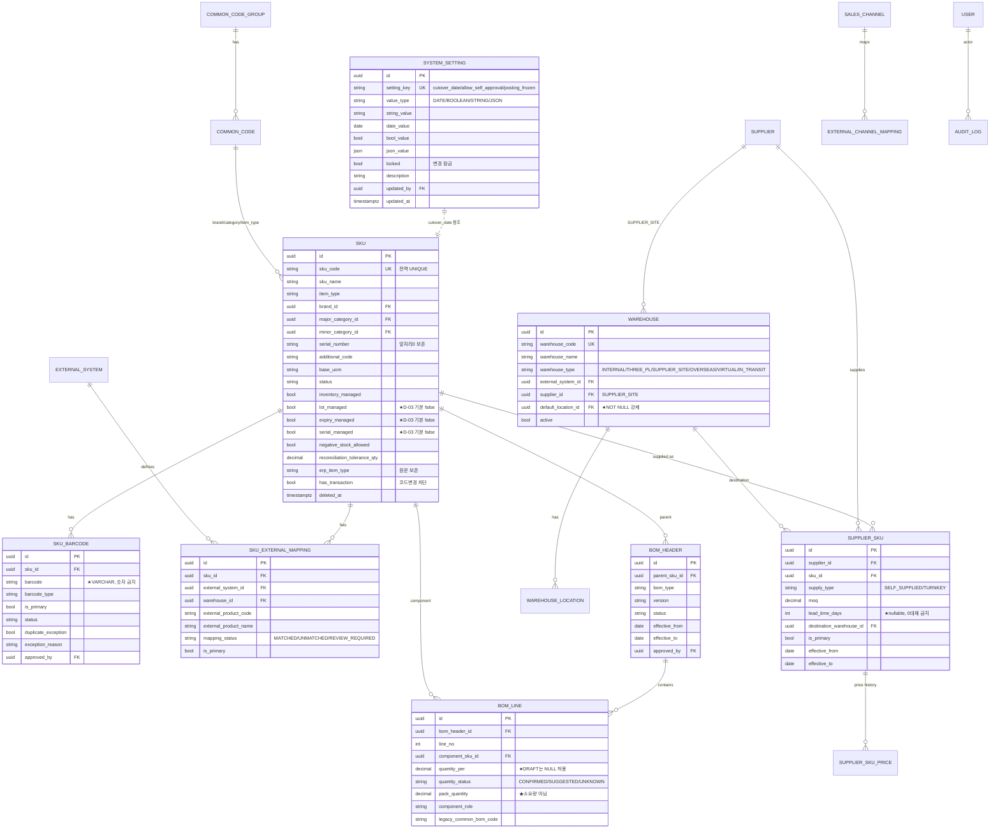
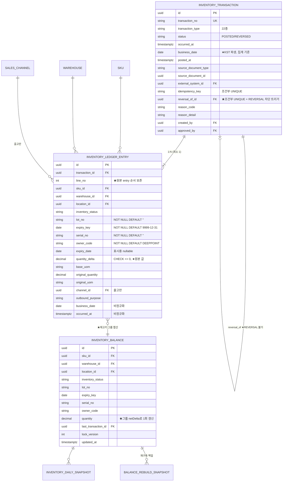

# DEEPPOINT SCM OS — 설계검토 04. ERD 초안 · Prisma Schema 초안 **(v0.2)**

> **v0.1 대비 변경** — ✏️ 표기
> ① **`SystemSetting` 모델 신설** — `cutover_date`(D-01), `allow_self_approval`(D-07), `posting_frozen`
> ② **REVERSAL 재취소 차단 트리거** 추가 (C-14)
> ③ **창고 15종 확정** (D-02) — 3PL 3 + `SUPPLIER_SITE` 11 + `IN_TRANSIT` 1
> ④ **LOT·유통기한·시리얼 기본값 전부 `false`** (D-03)
> ⑤ `LegacyShipmentHistory` 모델 추가 (D-04)
> ⑥ 테이블 47 → **49개**

---

# 6. ERD 초안

## 6.0 공통 설계 규약

| 항목 | 규약 |
|---|---|
| **PK** | 전 테이블 `id UUID` (v7 권장) |
| **문서번호** | 별도 컬럼 (`transaction_no` 등), `UNIQUE` |
| **수량** | `DECIMAL(18,6)` — float 금지 |
| **금액** | `DECIMAL(18,4)` + `currency VARCHAR(3)` |
| **비율** | `DECIMAL(8,6)` |
| **시각** | `TIMESTAMPTZ` (UTC) |
| **업무일자** | `business_date DATE` = `(occurred_at AT TIME ZONE 'Asia/Seoul')::date` |
| **감사 컬럼** | `created_at`/`created_by`/`updated_at`/`updated_by` (원장은 `created_*`만) |
| **삭제정책** | ① 원장·확정 문서 = 물리삭제 불가(트리거) ② 마스터 = 상태값 + `deleted_at` ③ 스테이징 = 보존기간 후 배치 삭제 |
| **NULL 정규화** | 재고키 구성 컬럼 NOT NULL + 센티넬 (`lot_no=''`, `serial_no=''`, `owner_code='DEEPPOINT'`, `expiry_key='9999-12-31'`) |
| **외부 연동 키** | `external_system_id` + `external_*_code/id` + `idempotency_key` |
| ✏️ **환경 의존값** | **날짜·플래그 등 운영 중 바뀌는 값은 코드가 아닌 `system_setting`에 둔다** |

## 6.1 전체 테이블 목록 (49개)

### Layer 0 — 기반 (10) ✏️ +1

| # | 테이블 | 목적 |
|---|---|---|
| 1 | `user` | 시스템 사용자. Supabase Auth 미러 |
| 2 | `role` | 역할 5종 |
| 3 | `permission` | 권한 키 |
| 4 | `role_permission` | 역할↔권한 |
| 5 | `user_role` | 사용자↔역할 |
| ✏️ 6 | **`system_setting`** | **시스템 설정 — `cutover_date`, `allow_self_approval`, `posting_frozen` 등** |
| 7 | `audit_log` | 전 모듈 변경 이력 (불변) |
| 8 | `common_code_group` | 코드 그룹 |
| 9 | `common_code` | 코드 값 |
| 10 | `attachment` | 첨부파일 |

### Layer 1 — 마스터 (11)

| # | 테이블 | 목적 |
|---|---|---|
| 11 | `sku` | 품목 마스터 (490건 이관) |
| 12 | `sku_barcode` | SKU별 다중 바코드 |
| 13 | `external_system` | 외부시스템 정의 |
| 14 | `sku_external_mapping` | 내부 SKU ↔ 외부 코드·상품명 |
| 15 | `supplier` | 공급업체·제조사 (40개사) |
| 16 | `supplier_sku` | 공급업체별 공급조건 |
| 17 | `supplier_sku_price` | 가격 이력 |
| 18 | `warehouse` | ✏️ **창고 15종** |
| 19 | `warehouse_location` | 로케이션 |
| 20 | `sales_channel` | 판매채널 16종 |
| 21 | `external_channel_mapping` | 판매처명·입고지 → 채널 |

### Layer 2 — BOM (2)

| # | 테이블 | 목적 |
|---|---|---|
| 22 | `bom_header` | BOM 버전·적용기간·상태 |
| 23 | `bom_line` | 구성품 라인 |

### Layer 3 — 재고 코어 (4) ★

| # | 테이블 | 목적 |
|---|---|---|
| 24 | `inventory_transaction` | 거래 헤더 |
| 25 | `inventory_ledger_entry` | 원장 행 (불변) |
| 26 | `inventory_balance` | 현재고 캐시 |
| 27 | `inventory_daily_snapshot` | 일별 스냅샷 |

### Layer 4 — 재고 운영 (10)

| # | 테이블 |
|---|---|
| 28~29 | `inventory_reservation`, `inventory_hold` |
| 30~31 | `opening_balance_batch`, `opening_balance_line` |
| 32~33 | `stock_adjustment`, `stock_adjustment_line` |
| 34~35 | `stock_count`, `stock_count_line` |
| 36~37 | `inventory_close`, `inventory_close_warehouse` |

### Layer 5 — 외부·운영 (9)

| # | 테이블 |
|---|---|
| 38~39 | `external_inventory_snapshot`, `external_inventory_snapshot_line` |
| 40~41 | `inventory_reconciliation`, `inventory_reconciliation_line` |
| 42~43 | `import_job`, `import_row` |
| 44 | `data_issue` |
| 45 | `inventory_exception` |
| 46 | `balance_rebuild_snapshot` |

### 마이그레이션 지원 (3) ✏️ +1

| # | 테이블 | 목적 |
|---|---|---|
| 47 | `migration_source_row` | 원본 행 ↔ 엔티티 추적 |
| 48 | `legacy_sop_plan` | S&OP 계획 참조 (long format) |
| ✏️ 49 | **`legacy_shipment_history`** | **출고 RAW 15,667행 — 분석·수요예측용. 원장 아님 (D-04)** |

## 6.2 ✏️ 창고 마스터 확정 (D-02)

| # | `warehouse_code` | 명칭 | `warehouse_type` | 비고 |
|---|---|---|---|---|
| 1 | `OLPUN` | 올펀 | `THREE_PL` | 메인 3PL, 이벗매니저 연동 |
| 2 | `PUMGO` | 품고 | `THREE_PL` | 네이버 스마트스토어 |
| 3 | `RODIT` | 로딧 | `THREE_PL` | 아마존JP/US·큐텐·쇼피 |
| 4 | `SUP_BOC` | 본코스메틱 (BOC) | `SUPPLIER_SITE` | ⚠️ Q-02 — BON과 상호 중복 |
| 5 | `SUP_IJC` | 일진코스메틱 | `SUPPLIER_SITE` | |
| 6 | `SUP_CSM` | 코스메카코리아 | `SUPPLIER_SITE` | |
| 7 | `SUP_CLB` | 갈렙이앤씨 | `SUPPLIER_SITE` | |
| 8 | `SUP_MKM` | 마케모 | `SUPPLIER_SITE` | |
| 9 | `SUP_EZC` | 이지코어 | `SUPPLIER_SITE` | |
| 10 | `SUP_CTK` | 씨티케이 | `SUPPLIER_SITE` | |
| 11 | `SUP_RBM` | 리봄화장품 | `SUPPLIER_SITE` | |
| 12 | `SUP_JPS` | 제이피에스코스메틱 | `SUPPLIER_SITE` | |
| 13 | `SUP_NNN` | 뉴앤뉴 | `SUPPLIER_SITE` | |
| 14 | `SUP_BON` | 본코스메틱 (BON) | `SUPPLIER_SITE` | ⚠️ Q-02 — BOC와 상호 중복 |
| 15 | `IN_TRANSIT` | 이동중 | `IN_TRANSIT` | 시스템 예약 가상창고 |

- 전 창고에 `DEFAULT` 로케이션 자동 생성 (총 15개)
- `SUPPLIER_SITE`는 `supplier_id` FK로 거래처와 연결
- 미르글로벌(종료), 아마존 FBA(R4)는 미등록

## 6.3 ERD — Layer 0·1 (기반·마스터)



### 고유조건 · 인덱스 (Layer 0·1)

| 테이블 | 고유조건 | 인덱스 |
|---|---|---|
| ✏️ `system_setting` | `UNIQUE(setting_key)` | — |
| `sku` | `UNIQUE(sku_code)` **전역** | `(status)`, `(item_type)`, `(brand_id, major_category_id, minor_category_id)`, GIN trigram `(sku_name)` |
| `sku_barcode` | 조건부 `UNIQUE(barcode) WHERE status='ACTIVE' AND duplicate_exception=false` <br> 조건부 `UNIQUE(sku_id) WHERE is_primary=true AND status='ACTIVE'` | `(sku_id)`, `(barcode)` |
| `sku_external_mapping` | 조건부 `UNIQUE(external_system_id, external_product_code) WHERE code<>'' AND effective_to IS NULL` <br> 조건부 `UNIQUE(sku_id, external_system_id) WHERE is_primary=true` | `(sku_id)`, `(external_system_id, mapping_status)` |
| `supplier_sku` | `UNIQUE(supplier_id, sku_id, effective_from)` <br> 조건부 `UNIQUE(sku_id) WHERE is_primary=true AND effective_to IS NULL` | `(sku_id)` |
| `supplier_sku_price` | `UNIQUE(supplier_sku_id, effective_from)` | `(supplier_sku_id, effective_from DESC)` |
| `bom_header` | `UNIQUE(parent_sku_id, version)` <br> **EXCLUDE**: 동일 `parent_sku_id`의 `ACTIVE` 기간 중첩 금지 | `(parent_sku_id, status)` |
| `bom_line` | `UNIQUE(bom_header_id, line_no)` <br> `UNIQUE(bom_header_id, component_sku_id, alternate_group)` | `(component_sku_id)` |
| `warehouse_location` | `UNIQUE(warehouse_id, location_code)` | |

## 6.4 ERD — Layer 3 (재고 코어) ★



### 제약 · 인덱스 (재고 코어)

| 테이블 | 제약 | 사유 |
|---|---|---|
| `inventory_transaction` | `UNIQUE(transaction_no)` | 문서번호 |
| | 조건부 `UNIQUE(idempotency_key) WHERE NOT NULL` | 외부 중복 차단 |
| | 조건부 `UNIQUE(reversal_of_id) WHERE NOT NULL AND status='POSTED'` | 동일 거래 1회만 취소 |
| | `CHECK (transaction_type='OPENING_BALANCE' OR source_document_type IS NOT NULL)` | 원인문서 필수 (P7) |
| | ✏️ **트리거 `trg_no_reversal_of_reversal`** | **REVERSAL 대상 취소 차단 (C-14)** |
| | 인덱스 `(business_date)`, `(transaction_type, business_date)`, `(source_document_type, source_document_id)`, `(external_system_id, external_transaction_id)` | |
| `inventory_ledger_entry` | `UNIQUE(transaction_id, line_no)` | |
| | `CHECK (quantity_delta <> 0)` | **개별 entry 기준.** 그룹 net은 0 가능 |
| | 트리거 `BEFORE UPDATE OR DELETE → EXCEPTION` | 불변성 (P3) |
| | 인덱스 **`(sku_id, warehouse_id, inventory_status, lot_no, expiry_key, serial_no, owner_code, business_date)`** | 재고키 기간 집계 (핵심) |
| | 인덱스 `(business_date, transaction_id)`, `(warehouse_id, business_date)`, `(channel_id, business_date) WHERE NOT NULL` | 수불부 |
| `inventory_balance` | **`UNIQUE(sku_id, warehouse_id, location_id, inventory_status, lot_no, expiry_key, serial_no, owner_code)`** | **C-09 핵심** |
| | 인덱스 `(sku_id)`, `(warehouse_id, inventory_status)`, `(sku_id, warehouse_id)` | |

### ✏️ REVERSAL 재취소 차단 트리거 (C-14)

```sql
CREATE OR REPLACE FUNCTION reject_reversal_of_reversal() RETURNS trigger AS $$
BEGIN
  IF NEW.reversal_of_id IS NOT NULL THEN
    IF (SELECT transaction_type
          FROM inventory_transaction
         WHERE id = NEW.reversal_of_id) = 'REVERSAL' THEN
      RAISE EXCEPTION 'REVERSAL_OF_REVERSAL_NOT_ALLOWED'
        USING HINT = '취소를 되돌리려면 원인문서를 근거로 신규 정상거래를 생성하세요.';
    END IF;
  END IF;
  RETURN NEW;
END; $$ LANGUAGE plpgsql;

CREATE TRIGGER trg_no_reversal_of_reversal
  BEFORE INSERT ON inventory_transaction
  FOR EACH ROW EXECUTE FUNCTION reject_reversal_of_reversal();
```

> 이것은 **5중 방어의 최종 방어선**이다. 1차는 도메인 `reverse()`, 2차는 Posting 검증 ⑫, 3차는 API, 4차는 화면(버튼 미노출). 트리거는 코드 우회·수동 SQL까지 막는다.

### 상태값 정의

| 대상 | 값 |
|---|---|
| **재고상태** | `AVAILABLE` `RESERVED` `OUTBOUND_PENDING` `HOLD` `INSPECTION` `DEFECTIVE` `RETURN_PENDING` `DISPOSAL_PENDING` `IN_TRANSIT` |
| **거래 상태** | `POSTED` `REVERSED` — **집계 시 필터하지 않음** (C-10) |
| **거래유형** (22) | 입고 7 / 출고 11 / 조정·상태 6 (v0.1 §6.3과 동일) |
| **출고목적** | `SALES_B2C` `SALES_B2B` `WAREHOUSE_REPLENISHMENT` `MARKETING` `CS` `SAMPLE` `EMPLOYEE_USE` `OTHER` |

## 6.5 ERD — Layer 4·5 (운영·외부)

v0.1 §6.4·§6.5와 동일. 변경 없음. 주요 제약만 재기재한다.

| 테이블 | 제약 |
|---|---|
| `opening_balance_batch` | `UNIQUE(opening_date, warehouse_id) WHERE status='POSTED'` |
| `opening_balance_line` | `UNIQUE(batch_id, sku_id, inventory_status, lot_no, expiry_key, serial_no)` |
| `stock_count_line` | `UNIQUE(count_id, sku_id, location_id, inventory_status, lot_no, expiry_key)` |
| `inventory_close` | `UNIQUE(close_month)` |
| `inventory_close_warehouse` | `UNIQUE(close_id, warehouse_id)` |
| `inventory_reservation` | `UNIQUE(source_document_type, source_line_id) WHERE status='ACTIVE'` |
| `import_job` | `UNIQUE(file_hash)` |
| `import_row` | `UNIQUE(import_job_id, source_row_no)` |
| `external_inventory_snapshot` | `UNIQUE(external_system_id, warehouse_id, snapshot_at)` |
| `audit_log` | 트리거 UPDATE/DELETE 차단 |

## 6.6 날짜 기준

| 필드 | 의미 | 사용처 |
|---|---|---|
| `occurred_at` (TIMESTAMPTZ, UTC) | 실제 업무 발생 | 원장 정렬, 감사, `as-of` |
| **`business_date`** (DATE, KST) | **업무일자** | **일별·월별 집계, 월마감, 수불부 — 유일 기준** |
| `posted_at` | 원장 반영 | 지연 분석 |
| `imported_at` | 외부 수집 | 연동 추적 |
| `effective_from`/`to` (DATE) | 마스터 적용기간 | BOM, 가격, 매핑, 공급조건 |
| `snapshot_at` | 3PL 기준시점 | 대사 |
| `baseline_at` | 실사 기준시점 | 롤포워드 |
| ✏️ **`system_setting.cutover_date`** (DATE) | **전환 기준일** | 기초재고, 오픈일 이전 거래 차단, 마이그레이션 |

---

# 7. Prisma Schema 초안 (v0.2)

> 변경된 모델·필드에 ✏️ 주석을 달았다. v0.1에서 변경 없는 모델은 v0.1 문서를 그대로 사용한다.

```prisma
datasource db {
  provider  = "postgresql"
  url       = env("DATABASE_URL")   // Supavisor pooler (?pgbouncer=true)
  directUrl = env("DIRECT_URL")     // migrate / worker 전용
}

generator client { provider = "prisma-client-js" }

// ─────────────────────────────────────────────────────────────
// Enum
// ─────────────────────────────────────────────────────────────
enum SkuStatus        { DRAFT PENDING_APPROVAL REJECTED ACTIVE INACTIVE DISCONTINUED ARCHIVED }
enum BomStatus        { DRAFT PENDING_APPROVAL REJECTED APPROVED ACTIVE INACTIVE ARCHIVED }
enum BomType          { MANUFACTURING KIT REPACK }
enum ComponentRole    { PRODUCT MATERIAL PACKAGING SERVICE }
enum SupplyType       { SELF_SUPPLIED TURNKEY }
enum QuantityStatus   { CONFIRMED SUGGESTED UNKNOWN }
enum BarcodeType      { UNIT INNER_BOX OUTER_BOX CHANNEL LEGACY }
enum MappingStatus    { MATCHED UNMATCHED REVIEW_REQUIRED }
enum WarehouseType    { INTERNAL THREE_PL SUPPLIER_SITE OVERSEAS VIRTUAL IN_TRANSIT }

enum InventoryStatus {
  AVAILABLE RESERVED OUTBOUND_PENDING HOLD INSPECTION
  DEFECTIVE RETURN_PENDING DISPOSAL_PENDING IN_TRANSIT
}

enum TransactionType {
  OPENING_BALANCE PURCHASE_RECEIPT PRODUCTION_RECEIPT RETURN_RECEIPT
  WAREHOUSE_TRANSFER_IN ASSEMBLY_RECEIPT DISASSEMBLY_RECEIPT
  SALES_SHIPMENT B2B_SHIPMENT MARKETING_SHIPMENT CS_SHIPMENT SAMPLE_SHIPMENT
  EMPLOYEE_USE VENDOR_RETURN DISPOSAL WAREHOUSE_TRANSFER_OUT
  ASSEMBLY_CONSUMPTION DISASSEMBLY_CONSUMPTION
  STATUS_CHANGE STOCK_COUNT_ADJUSTMENT MANUAL_ADJUSTMENT REVERSAL
  RESERVATION RESERVATION_RELEASE
}

enum TransactionStatus { POSTED REVERSED }
enum OutboundPurpose   { SALES_B2C SALES_B2B WAREHOUSE_REPLENISHMENT MARKETING CS SAMPLE EMPLOYEE_USE OTHER }
enum ImportStatus      { UPLOADED PARSING VALIDATING REVIEW_REQUIRED READY_TO_POST POSTING COMPLETED PARTIALLY_COMPLETED FAILED CANCELLED }
enum IssueStatus       { OPEN RESOLVED WAIVED }
enum ExceptionStatus   { OPEN ASSIGNED IN_PROGRESS RESOLVED WAIVED REOPENED }
enum CloseStatus       { OPEN VALIDATING CLOSED REOPENED }
enum CountStatus       { DRAFT IN_PROGRESS COUNT_COMPLETED REVIEW_REQUIRED APPROVED POSTED CANCELLED }
enum AdjustmentStatus  { DRAFT PENDING_APPROVAL APPROVED POSTED REJECTED CANCELLED }
enum SettingValueType  { DATE BOOLEAN STRING NUMBER JSON }              // ✏️ 신규
enum DifferenceType {
  MATCHED TIMING_DIFFERENCE SKU_UNMATCHED STATUS_MAPPING_DIFFERENCE
  INTERNAL_TRANSACTION_MISSING EXTERNAL_TRANSACTION_MISSING
  QUANTITY_DIFFERENCE LOT_DIFFERENCE REVIEW_REQUIRED
}

// ═════════════════════════════════════════════════════════════
// ✏️ 신규 — 시스템 설정 (D-01, D-07)
// ═════════════════════════════════════════════════════════════

/// 운영 중 변경되는 값은 코드가 아니라 여기에 둔다.
/// ★ 날짜 리터럴을 코드·시드·마이그레이션 스크립트에 하드코딩하지 않는다.
model SystemSetting {
  id           String           @id @default(uuid()) @db.Uuid
  settingKey   String           @unique @db.VarChar(80)
  valueType    SettingValueType
  stringValue  String?
  dateValue    DateTime?        @db.Date
  boolValue    Boolean?
  numberValue  Decimal?         @db.Decimal(18, 6)
  jsonValue    Json?
  /// true면 변경 불가. 관리자 재인증 + 사유로만 해제
  locked       Boolean          @default(false)
  description  String?
  updatedBy    String?          @db.Uuid
  updatedAt    DateTime         @updatedAt @db.Timestamptz

  @@map("system_setting")
}

// 초기 시드 (값은 비워둔다)
//  cutover_date          DATE    NULL      전환 기준일 — UAT 완료 후 관리자가 설정. 월초(1일)만 허용
//  cutover_locked        BOOLEAN false     기초재고 반영 후 true 로 잠금
//  allow_self_approval   BOOLEAN false     SKU·BOM 자가승인 허용 여부 (재고 3종은 코드에서 무조건 분리)
//  posting_frozen        BOOLEAN false     balance 재구축 중 Posting 차단
//  self_approval_scope   JSON    {...}     엔티티별 override 맵

// ─────────────────────────────────────────────────────────────
// Layer 0 — 사용자·권한·감사 (v0.1과 동일)
// ─────────────────────────────────────────────────────────────
model User {
  id        String     @id @db.Uuid
  email     String     @unique
  name      String
  active    Boolean    @default(true)
  createdAt DateTime   @default(now()) @db.Timestamptz
  updatedAt DateTime   @updatedAt @db.Timestamptz
  userRoles UserRole[]
  auditLogs AuditLog[] @relation("AuditActor")
  @@map("user")
}

model Role {
  id       String @id @default(uuid()) @db.Uuid
  roleCode String @unique                       // ADMIN / SCM_LEADER / SCM_STAFF / FINANCE / EXECUTIVE
  roleName String
  userRoles       UserRole[]
  rolePermissions RolePermission[]
  @@map("role")
}

model Permission {
  id            String @id @default(uuid()) @db.Uuid
  permissionKey String @unique                  // "sku.approve", "inventory.adjust.approve" ...
  description   String?
  rolePermissions RolePermission[]
  @@map("permission")
}

model RolePermission {
  roleId       String @db.Uuid
  permissionId String @db.Uuid
  role       Role       @relation(fields: [roleId], references: [id])
  permission Permission @relation(fields: [permissionId], references: [id])
  @@id([roleId, permissionId])
  @@map("role_permission")
}

model UserRole {
  userId    String   @db.Uuid
  roleId    String   @db.Uuid
  grantedAt DateTime @default(now()) @db.Timestamptz
  grantedBy String?  @db.Uuid
  user User @relation(fields: [userId], references: [id])
  role Role @relation(fields: [roleId], references: [id])
  @@id([userId, roleId])
  @@map("user_role")
}

/// 불변. UPDATE/DELETE는 DB 트리거로 차단.
model AuditLog {
  id          String   @id @default(uuid()) @db.Uuid
  entityType  String
  entityId    String   @db.Uuid
  action      String
  beforeValue Json?
  /// ✏️ 원장 거래의 경우 entries(원본) + groups(재고키 합산 요약) 를 함께 담는다
  afterValue  Json?
  actorId     String   @db.Uuid
  occurredAt  DateTime @default(now()) @db.Timestamptz
  reason      String?
  approvedBy  String?  @db.Uuid
  requestId   String?
  sessionId   String?
  ipAddress   String?
  actor User @relation("AuditActor", fields: [actorId], references: [id])
  @@index([entityType, entityId, occurredAt(sort: Desc)])
  @@index([actorId, occurredAt(sort: Desc)])
  @@map("audit_log")
}

// ─────────────────────────────────────────────────────────────
// Layer 1 — SKU
// ─────────────────────────────────────────────────────────────
model Sku {
  id       String    @id @default(uuid()) @db.Uuid
  skuCode  String    @unique @db.VarChar(80)     // 전역 UNIQUE (C-06)
  skuName  String    @db.VarChar(255)
  skuNameEn String?  @db.VarChar(255)
  itemType String    @db.VarChar(40)
  status   SkuStatus @default(DRAFT)

  brandId         String? @db.Uuid
  majorCategoryId String? @db.Uuid
  minorCategoryId String? @db.Uuid
  serialNumber    String? @db.VarChar(20)        // 앞자리 0 보존
  additionalCode  String? @db.VarChar(30)

  baseUom           String  @default("EA") @db.VarChar(20)
  purchaseUom       String? @db.VarChar(20)
  unitConversionQty Decimal @default(1) @db.Decimal(18, 6)

  inventoryManaged Boolean @default(true)
  sellable         Boolean @default(false)
  purchasable      Boolean @default(false)
  manufacturable   Boolean @default(false)

  /// ✏️ D-03 — 오픈 시 전 SKU 미관리로 시작. 화장품 완제품부터 순차 전환
  lotManaged    Boolean @default(false)
  expiryManaged Boolean @default(false)
  serialManaged Boolean @default(false)

  negativeStockAllowed Boolean @default(false)
  defaultShelfLifeDays Int?
  minimumRemainingDays Int?
  reconciliationToleranceQty Decimal @default(0) @db.Decimal(18, 6)

  erpItemType         String?   @db.VarChar(10)  // 원문 보존 (G-07)
  hasTransaction      Boolean   @default(false)  // 코드 변경 차단
  discontinuationDate DateTime? @db.Date
  note                String?

  createdAt  DateTime  @default(now()) @db.Timestamptz
  createdBy  String?   @db.Uuid
  updatedAt  DateTime  @updatedAt @db.Timestamptz
  updatedBy  String?   @db.Uuid
  approvedAt DateTime? @db.Timestamptz
  approvedBy String?   @db.Uuid
  deletedAt  DateTime? @db.Timestamptz

  barcodes         SkuBarcode[]
  externalMappings SkuExternalMapping[]
  supplierSkus     SupplierSku[]
  parentBoms       BomHeader[]            @relation("BomParent")
  componentLines   BomLine[]              @relation("BomComponent")
  ledgerEntries    InventoryLedgerEntry[]
  balances         InventoryBalance[]

  @@index([status])
  @@index([itemType])
  @@index([brandId, majorCategoryId, minorCategoryId])
  @@map("sku")
}

model SkuBarcode {
  id                 String      @id @default(uuid()) @db.Uuid
  skuId              String      @db.Uuid
  /// ★ 반드시 문자열. 숫자 타입 금지
  barcode            String      @db.VarChar(100)
  barcodeType        BarcodeType @default(UNIT)
  isPrimary          Boolean     @default(false)
  countryCode        String?     @db.VarChar(10)
  channelCode        String?     @db.VarChar(30)
  status             String      @default("ACTIVE") @db.VarChar(20)
  duplicateException Boolean     @default(false)
  exceptionReason    String?
  approvedBy         String?     @db.Uuid
  effectiveFrom      DateTime?   @db.Date
  effectiveTo        DateTime?   @db.Date
  createdAt          DateTime    @default(now()) @db.Timestamptz
  sku Sku @relation(fields: [skuId], references: [id])
  @@index([skuId])
  @@index([barcode])
  @@map("sku_barcode")
  // raw SQL:
  //   CREATE UNIQUE INDEX ux_barcode_active ON sku_barcode(barcode)
  //     WHERE status='ACTIVE' AND duplicate_exception = false;
  //   CREATE UNIQUE INDEX ux_barcode_primary ON sku_barcode(sku_id)
  //     WHERE is_primary = true AND status='ACTIVE';
}

// ExternalSystem / SkuExternalMapping / Supplier / SupplierSku / SupplierSkuPrice
// → v0.1과 동일 (변경 없음)

// ─────────────────────────────────────────────────────────────
// Layer 1 — 창고 (✏️ D-02)
// ─────────────────────────────────────────────────────────────
model Warehouse {
  id               String        @id @default(uuid()) @db.Uuid
  warehouseCode    String        @unique @db.VarChar(50)
  warehouseName    String        @db.VarChar(150)
  warehouseType    WarehouseType
  externalSystemId String?       @db.Uuid
  /// ✏️ D-02 — SUPPLIER_SITE(제조사 보관 사급자재) 11곳은 거래처와 연결
  supplierId       String?       @db.Uuid
  /// ✏️ G-05 — 창고 생성 트랜잭션에서 DEFAULT 로케이션을 자동 생성해 즉시 연결
  defaultLocationId String?      @db.Uuid
  timezone         String        @default("Asia/Seoul") @db.VarChar(50)
  address          String?
  active           Boolean       @default(true)
  createdAt DateTime @default(now()) @db.Timestamptz
  updatedAt DateTime @updatedAt @db.Timestamptz

  supplier      Supplier?              @relation(fields: [supplierId], references: [id])
  locations     WarehouseLocation[]
  ledgerEntries InventoryLedgerEntry[]
  balances      InventoryBalance[]
  @@map("warehouse")
}

model WarehouseLocation {
  id           String  @id @default(uuid()) @db.Uuid
  warehouseId  String  @db.Uuid
  locationCode String  @db.VarChar(50)          // 미사용 창고는 'DEFAULT'
  locationName String  @db.VarChar(150)
  locationType String? @db.VarChar(30)
  active       Boolean @default(true)
  warehouse Warehouse @relation(fields: [warehouseId], references: [id])
  @@unique([warehouseId, locationCode])
  @@map("warehouse_location")
}

// ─────────────────────────────────────────────────────────────
// Layer 2 — BOM (v0.1과 동일)
// ─────────────────────────────────────────────────────────────
model BomHeader {
  id                     String    @id @default(uuid()) @db.Uuid
  parentSkuId            String    @db.Uuid
  bomType                BomType
  version                String    @db.VarChar(20)
  status                 BomStatus @default(DRAFT)
  outputQty              Decimal   @default(1) @db.Decimal(18, 6)
  outputUom              String    @db.VarChar(20)
  effectiveFrom          DateTime  @db.Date
  effectiveTo            DateTime? @db.Date
  productionPartnerId    String?   @db.Uuid
  destinationWarehouseId String?   @db.Uuid
  overallLossRate        Decimal?  @db.Decimal(8, 6)
  description            String?
  changeReason           String?
  createdAt   DateTime  @default(now()) @db.Timestamptz
  createdBy   String?   @db.Uuid
  approvedAt  DateTime? @db.Timestamptz
  approvedBy  String?   @db.Uuid
  activatedAt DateTime? @db.Timestamptz
  parentSku Sku       @relation("BomParent", fields: [parentSkuId], references: [id])
  lines     BomLine[]
  @@unique([parentSkuId, version])
  @@index([parentSkuId, status])
  @@map("bom_header")
  // raw SQL: ALTER TABLE bom_header ADD CONSTRAINT ex_bom_active_period
  //   EXCLUDE USING gist (parent_sku_id WITH =,
  //     daterange(effective_from, effective_to, '[)') WITH &&) WHERE (status = 'ACTIVE');
}

model BomLine {
  id             String         @id @default(uuid()) @db.Uuid
  bomHeaderId    String         @db.Uuid
  lineNo         Int
  componentSkuId String         @db.Uuid
  /// ★ 원본 엑셀에 소요량 없음(383행). DRAFT는 NULL 허용,
  ///   ACTIVE 전환 시 NOT NULL AND > 0 을 도메인에서 강제. 자동 1 입력 금지
  quantityPer    Decimal?       @db.Decimal(18, 6)
  quantityStatus QuantityStatus @default(UNKNOWN)
  uom            String         @db.VarChar(20)
  lossRate       Decimal?       @db.Decimal(8, 6)
  componentRole  ComponentRole
  supplyType     SupplyType?
  alternateGroup String?        @db.VarChar(50)
  isRequired     Boolean        @default(true)
  issueWarehouseId String?      @db.Uuid
  /// ★ 포장 입수량. quantity_per 과 물리적으로 다른 컬럼
  packQuantity   Decimal?       @db.Decimal(18, 6)
  specification  String?
  legacyBomCode        String? @db.VarChar(100)
  legacyCommonBomCode  String? @db.VarChar(100)
  note           String?
  bomHeader    BomHeader @relation(fields: [bomHeaderId], references: [id])
  componentSku Sku       @relation("BomComponent", fields: [componentSkuId], references: [id])
  @@unique([bomHeaderId, lineNo])
  @@index([componentSkuId])
  @@map("bom_line")
}

// ═════════════════════════════════════════════════════════════
// Layer 3 — 재고 코어 ★
// ═════════════════════════════════════════════════════════════

model InventoryTransaction {
  id              String            @id @default(uuid()) @db.Uuid
  transactionNo   String            @unique @db.VarChar(50)
  transactionType TransactionType
  /// ★ 원장 집계 시 이 필드로 필터하지 않는다 (C-10). UI·재취소 차단용.
  status          TransactionStatus @default(POSTED)

  occurredAt   DateTime  @db.Timestamptz
  /// ★ (occurred_at AT TIME ZONE 'Asia/Seoul')::date — 집계·마감의 유일 기준
  businessDate DateTime  @db.Date
  postedAt     DateTime  @default(now()) @db.Timestamptz
  importedAt   DateTime? @db.Timestamptz

  sourceDocumentType String? @db.VarChar(50)
  sourceDocumentId   String? @db.Uuid
  sourceDocumentNo   String? @db.VarChar(100)

  externalSystemId      String? @db.Uuid
  externalTransactionId String? @db.VarChar(200)
  idempotencyKey        String? @db.VarChar(300)

  /// ✏️ C-14 — 이 값이 가리키는 거래의 transaction_type 이 REVERSAL 이면
  ///    도메인·API·DB 트리거 모두에서 차단된다.
  reversalOfId String? @db.Uuid

  reasonCode        String? @db.VarChar(50)
  reasonDetail      String?
  attachmentGroupId String? @db.Uuid

  createdBy  String   @db.Uuid
  approvedBy String?  @db.Uuid
  createdAt  DateTime @default(now()) @db.Timestamptz

  reversalOf InventoryTransaction?  @relation("Reversal", fields: [reversalOfId], references: [id])
  reversedBy InventoryTransaction[] @relation("Reversal")
  entries    InventoryLedgerEntry[]

  @@index([businessDate])
  @@index([transactionType, businessDate])
  @@index([sourceDocumentType, sourceDocumentId])
  @@index([externalSystemId, externalTransactionId])
  @@map("inventory_transaction")
  // ★ raw SQL:
  //   CREATE UNIQUE INDEX ux_txn_idem ON inventory_transaction(idempotency_key)
  //     WHERE idempotency_key IS NOT NULL;
  //   CREATE UNIQUE INDEX ux_txn_reversal ON inventory_transaction(reversal_of_id)
  //     WHERE reversal_of_id IS NOT NULL AND status = 'POSTED';
  //   ALTER TABLE inventory_transaction ADD CONSTRAINT ck_source_doc
  //     CHECK (transaction_type = 'OPENING_BALANCE' OR source_document_type IS NOT NULL);
  //   ✏️ CREATE TRIGGER trg_no_reversal_of_reversal BEFORE INSERT
  //     ON inventory_transaction FOR EACH ROW
  //     EXECUTE FUNCTION reject_reversal_of_reversal();
}

/// ★ 불변(INSERT only). UPDATE/DELETE 는 DB 트리거로 차단.
/// ✏️ 하나의 거래 안에 동일 재고키가 여러 행으로 존재할 수 있다.
///    검증·balance 갱신은 재고키 그룹의 합산값으로, 저장은 원본 행 그대로.
model InventoryLedgerEntry {
  id            String @id @default(uuid()) @db.Uuid
  transactionId String @db.Uuid
  /// 원본 entry 순서 보존 (감사 추적)
  lineNo        Int

  // ── 재고키 (NULL 정규화 — C-09) ──────────────────────────
  skuId           String          @db.Uuid
  warehouseId     String          @db.Uuid
  locationId      String          @db.Uuid
  inventoryStatus InventoryStatus
  lotNo           String          @default("") @db.VarChar(100)
  expiryKey       DateTime        @db.Date       // DEFAULT '9999-12-31' (raw SQL)
  serialNo        String          @default("") @db.VarChar(200)
  ownerCode       String          @default("DEEPPOINT") @db.VarChar(30)
  // ────────────────────────────────────────────────────────

  expiryDate       DateTime? @db.Date            // 표시용
  manufacturedDate DateTime? @db.Date

  /// CHECK (quantity_delta <> 0) — ★ 개별 entry 기준. 그룹 net 은 0 가능
  quantityDelta    Decimal @db.Decimal(18, 6)
  baseUom          String  @db.VarChar(20)
  originalQuantity Decimal? @db.Decimal(18, 6)
  originalUom      String?  @db.VarChar(20)
  conversionFactor Decimal? @db.Decimal(18, 6)

  channelId       String?          @db.Uuid      // 출고 전용
  outboundPurpose OutboundPurpose?
  externalLineId  String?          @db.VarChar(200)
  note            String?

  businessDate DateTime @db.Date                  // 비정규화 (집계 성능)
  occurredAt   DateTime @db.Timestamptz
  createdAt    DateTime @default(now()) @db.Timestamptz

  transaction InventoryTransaction @relation(fields: [transactionId], references: [id])
  sku         Sku                  @relation(fields: [skuId], references: [id])
  warehouse   Warehouse            @relation(fields: [warehouseId], references: [id])

  @@unique([transactionId, lineNo])
  @@index([skuId, warehouseId, inventoryStatus, lotNo, expiryKey, serialNo, ownerCode, businessDate])
  @@index([warehouseId, businessDate])
  @@index([businessDate, transactionId])
  @@map("inventory_ledger_entry")
  // ★ raw SQL:
  //   ALTER TABLE inventory_ledger_entry ALTER COLUMN expiry_key SET DEFAULT '9999-12-31';
  //   ALTER TABLE inventory_ledger_entry ADD CONSTRAINT ck_qty_nonzero CHECK (quantity_delta <> 0);
  //   CREATE TRIGGER trg_ledger_immutable BEFORE UPDATE OR DELETE ON inventory_ledger_entry
  //     FOR EACH ROW EXECUTE FUNCTION raise_immutable_violation();
  //   CREATE INDEX ix_ledger_channel ON inventory_ledger_entry(channel_id, business_date)
  //     WHERE channel_id IS NOT NULL;
}

/// 조회 성능용 캐시. 원장에서 언제든 재구축 가능하며 원본이 아니다.
/// ✏️ InventoryPostingService 가 재고키 그룹당 정확히 1회 갱신한다.
model InventoryBalance {
  id              String          @id @default(uuid()) @db.Uuid
  skuId           String          @db.Uuid
  warehouseId     String          @db.Uuid
  locationId      String          @db.Uuid
  inventoryStatus InventoryStatus
  lotNo           String          @default("") @db.VarChar(100)
  expiryKey       DateTime        @db.Date
  serialNo        String          @default("") @db.VarChar(200)
  ownerCode       String          @default("DEEPPOINT") @db.VarChar(30)

  quantity          Decimal  @default(0) @db.Decimal(18, 6)
  lastTransactionId String?  @db.Uuid
  updatedAt         DateTime @updatedAt @db.Timestamptz
  /// ✏️ 거래당 +1 (entry 수가 아니라 그룹 갱신 1회 기준)
  lockVersion       Int      @default(0)

  sku       Sku       @relation(fields: [skuId], references: [id])
  warehouse Warehouse @relation(fields: [warehouseId], references: [id])

  /// ★ 재고키 전체 UNIQUE. 이것이 없으면 현재고가 조용히 쪼개진다 (C-09)
  @@unique([skuId, warehouseId, locationId, inventoryStatus, lotNo, expiryKey, serialNo, ownerCode],
           name: "stock_key")
  @@index([skuId])
  @@index([warehouseId, inventoryStatus])
  @@map("inventory_balance")
}

/// balance 재구축 전 백업 (감사·원인분석용)
model BalanceRebuildSnapshot {
  id             String   @id @default(uuid()) @db.Uuid
  rebuildRunId   String   @db.Uuid
  stockKeyHash   String   @db.VarChar(400)
  skuId          String   @db.Uuid
  warehouseId    String   @db.Uuid
  quantityBefore Decimal  @db.Decimal(18, 6)
  quantityAfter  Decimal? @db.Decimal(18, 6)
  createdAt      DateTime @default(now()) @db.Timestamptz
  @@index([rebuildRunId])
  @@map("balance_rebuild_snapshot")
}

// ─────────────────────────────────────────────────────────────
// Layer 4·5 — v0.1과 동일
//   InventoryReservation / InventoryHold
//   OpeningBalanceBatch / OpeningBalanceLine
//   StockAdjustment / StockAdjustmentLine
//   StockCount / StockCountLine
//   InventoryClose / InventoryCloseWarehouse
//   ExternalInventorySnapshot / Line
//   InventoryReconciliation / Line
//   ImportJob / ImportRow
//   DataIssue / InventoryException / Attachment
//   InventoryDailySnapshot
// ─────────────────────────────────────────────────────────────

// ─────────────────────────────────────────────────────────────
// 마이그레이션 지원
// ─────────────────────────────────────────────────────────────
model MigrationSourceRow {
  id             String   @id @default(uuid()) @db.Uuid
  migrationRunId String   @db.Uuid
  sourceFile     String   @db.VarChar(255)
  sourceSheet    String   @db.VarChar(100)
  sourceRowNo    Int
  entityType     String   @db.VarChar(50)
  entityId       String?  @db.Uuid
  status         String   @db.VarChar(20)       // CREATED/SKIPPED/ERROR/DUPLICATE
  message        String?
  createdAt      DateTime @default(now()) @db.Timestamptz
  @@index([migrationRunId, entityType])
  @@index([sourceFile, sourceSheet, sourceRowNo])
  @@map("migration_source_row")
}

/// 기존 S&OP 계획값 참조 보관. ★ 원장으로 전환하지 않는다.
model LegacySopPlan {
  id          String   @id @default(uuid()) @db.Uuid
  warehouseId String?  @db.Uuid
  skuCode     String   @db.VarChar(80)
  planYear    Int
  planMonth   Int
  rowType     String   @db.VarChar(20)          // FORECAST_OUT/ACTUAL_OUT/PLAN_IN/ACTUAL_IN/CLOSING
  channelCode String?  @db.VarChar(30)
  quantity    Decimal? @db.Decimal(18, 6)
  sourceSheet String   @db.VarChar(100)
  sourceRowNo Int
  sourceColNo Int
  @@index([skuCode, planYear, planMonth])
  @@map("legacy_sop_plan")
}

/// ✏️ 신규 — D-04
/// 출고 RAW 15,667행. 분석·수요예측 이력 전용.
/// ★ 재고원장으로 전환하지 않는다 (출고번호 부재 → 멱등성 보장 불가).
model LegacyShipmentHistory {
  id            String    @id @default(uuid()) @db.Uuid
  skuCode       String    @db.VarChar(80)
  skuId         String?   @db.Uuid              // 매핑된 경우
  shopName      String?   @db.VarChar(150)      // 원본 '쇼핑몰'
  managedName   String?   @db.VarChar(255)      // 원본 '매칭관리명'
  quantity      Decimal   @db.Decimal(18, 6)
  shippedOn     DateTime  @db.Date              // 원본 '출고일'
  divisionCode  String?   @db.VarChar(10)       // 원본 '구분' A/B
  itemKind      String?   @db.VarChar(30)       // 원본 '종류'
  channelId     String?   @db.Uuid              // 매핑된 채널
  matchStatus   String    @db.VarChar(20)       // MATCHED / UNMATCHED
  sourceSheet   String    @db.VarChar(100)
  sourceRowNo   Int
  importedAt    DateTime  @default(now()) @db.Timestamptz

  @@index([skuCode, shippedOn])
  @@index([shippedOn])
  @@index([matchStatus])
  @@map("legacy_shipment_history")
}
```

## 7.1 Prisma 사용 시 주의

| 항목 | 주의 |
|---|---|
| **조건부 UNIQUE** | Prisma 미지원. `migrate dev --create-only` 후 **raw SQL을 마이그레이션 파일에 직접 추가** |
| **EXCLUDE 제약** | 동일. BOM 적용기간 중첩 차단 |
| **트리거** | 동일. ① 원장 불변성 ② `audit_log` 불변성 ✏️ ③ **REVERSAL 재취소 차단** |
| **Decimal** | `Prisma.Decimal`(decimal.js). **`Number()` 변환 금지** — ESLint 규칙 |
| **`@db.Date` 기본값** | `expiry_key` 의 `'9999-12-31'` 은 raw SQL `ALTER COLUMN ... SET DEFAULT` 로 설정하고 앱에서도 명시 세팅 |
| **`businessDate` 자동 계산** | Prisma는 generated column 미지원. **Posting Service에서 명시 계산** + DB CHECK로 이중 보장 |
| ✏️ **`system_setting` 조회 캐시** | 매 요청마다 DB를 치지 않도록 **요청 단위 메모리 캐시**. 변경 시 즉시 무효화 (`posting_frozen` 은 실시간성이 필요하므로 캐시 제외) |
| **커넥션** | `DATABASE_URL`(pooler) / `DIRECT_URL`(직결) 분리 필수 |
