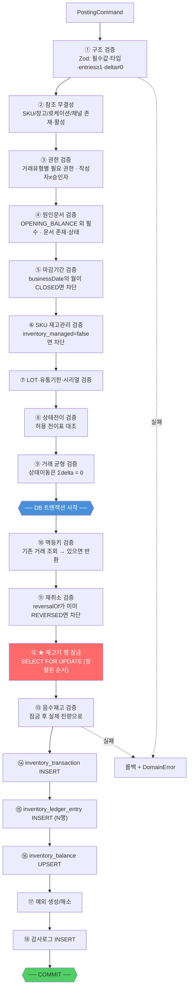
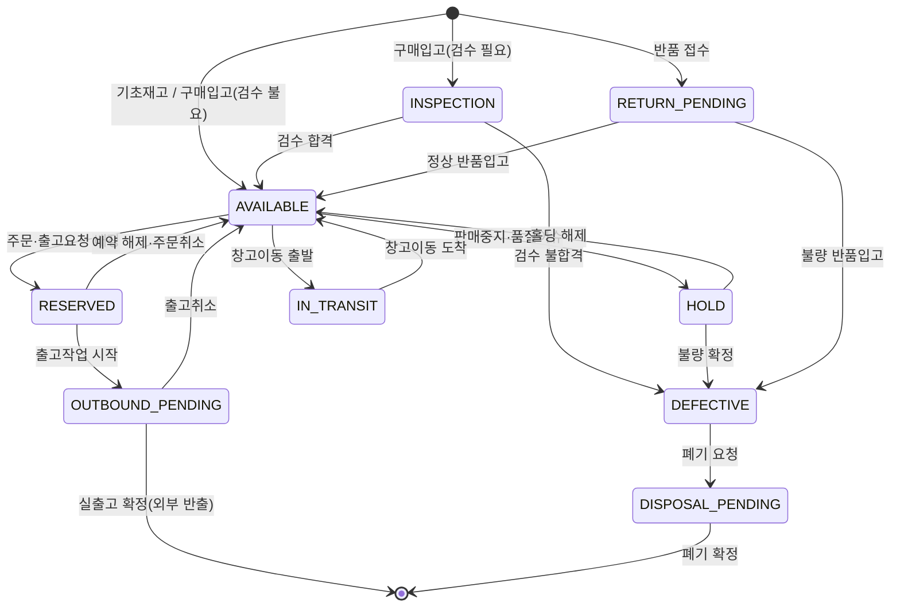
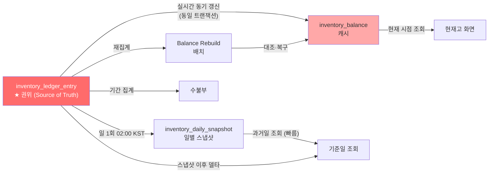
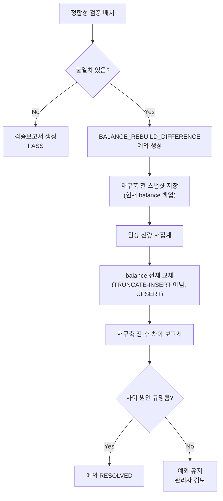

# DEEPPOINT SCM OS — 설계검토 05. 재고 Posting Service · 현재고 계산 및 캐시 전략

---

# 8. 재고 Posting Service 설계

## 8.0 위치와 원칙

```
src/modules/inventory-ledger/application/services/InventoryPostingService.ts
```

| 원칙 | 내용 |
|---|---|
| **단일 관문** | 재고를 변경하는 모든 경로(기초재고, 조정, 실사, 예약·홀딩, 취소, 엑셀 반영, 향후 입고·출고·이동·조립)는 반드시 이 서비스를 통과한다 |
| **외부 미노출** | 범용 원장 생성 REST API를 만들지 않는다 (재고 PRD §27.2). 도메인 서비스만 호출 가능 |
| **원자성** | 원장 생성 + balance 갱신 + 예외 생성 + 감사로그가 **하나의 DB 트랜잭션** |
| **짧은 트랜잭션** | 파일 I/O·외부 API 호출을 트랜잭션 안에서 하지 않는다. 검증에 필요한 참조 데이터는 트랜잭션 진입 전에 로드한다 |
| **불변식** | `Σ(entries.quantityDelta)`가 상태이동 거래(`STATUS_CHANGE`, `RESERVATION`, `WAREHOUSE_TRANSFER_*`)에서는 반드시 `0` |

## 8.1 입력값 (PostingCommand)

```typescript
interface PostingCommand {
  // ── 거래 헤더 ──────────────────────────────────────────
  transactionType: TransactionType;
  occurredAt: Date;                    // 업무 발생 일시 (UTC). businessDate는 서비스가 KST로 파생
  entries: PostingEntry[];             // 최소 1개

  // ── 원인문서 (OPENING_BALANCE 외 필수) ─────────────────
  sourceDocument?: {
    type: string;                      // OPENING_BALANCE_BATCH | STOCK_ADJUSTMENT | STOCK_COUNT |
                                       // MANUAL_HOLD_REQUEST | PURCHASE_RECEIPT | ...
    id: string;                        // UUID
    no?: string;                       // 표시용 문서번호
  };

  // ── 외부 연동 ──────────────────────────────────────────
  external?: {
    systemId: string;
    transactionId: string;
    importedAt?: Date;
  };
  idempotencyKey?: string;             // 미지정 시 external 정보로 서비스가 생성

  // ── 사유·증빙 ──────────────────────────────────────────
  reasonCode?: string;
  reasonDetail?: string;
  attachmentGroupId?: string;

  // ── 취소 ───────────────────────────────────────────────
  reversalOfId?: string;               // REVERSAL 전용

  // ── 실행 컨텍스트 ──────────────────────────────────────
  actor: ActorContext;                 // userId, roles, sessionId, ip, requestId
  approvedBy?: string;

  // ── 예외 허용 ──────────────────────────────────────────
  allowNegativeStock?: {               // 음수재고 예외 (5요건 검증됨)
    approvedBy: string;
    reason: string;
    dueDate?: Date;
  };
  allowClosedPeriod?: {                // 마감월 거래 예외
    approvedBy: string;
    reason: string;
  };
}

interface PostingEntry {
  // ── 재고키 ─────────────────────────────────────────────
  skuId: string;
  warehouseId: string;
  locationId?: string;                 // 미지정 시 창고 DEFAULT 로케이션 사용
  inventoryStatus: InventoryStatus;
  lotNo?: string;                      // 미지정 → '' 정규화
  expiryDate?: Date;                   // 미지정 → expiryKey '9999-12-31'
  manufacturedDate?: Date;
  serialNo?: string;                   // 미지정 → '' 정규화
  ownerCode?: string;                  // 미지정 → 'DEEPPOINT'

  // ── 수량 ───────────────────────────────────────────────
  quantityDelta: Decimal;              // ≠ 0. 증가 양수, 감소 음수 (기준단위)
  originalQuantity?: Decimal;          // 원본 단위 수량
  originalUom?: string;
  conversionFactor?: Decimal;

  // ── 출고 전용 ──────────────────────────────────────────
  channelId?: string;
  outboundPurpose?: OutboundPurpose;
  externalLineId?: string;
  note?: string;
}

interface PostingResult {
  transactionId: string;
  transactionNo: string;
  entryIds: string[];
  balancesAfter: StockKeyBalance[];
  exceptionsCreated: string[];
  idempotent: boolean;                 // true면 기존 거래를 그대로 반환한 것
}
```

## 8.2 검증 순서

> **순서가 중요하다.** 비용이 낮고 실패 가능성이 높은 검증을 앞에 두고, 행 잠금은 최대한 늦게 잡아 잠금 보유시간을 줄인다.



### 각 검증의 상세

| # | 검증 | 실패 시 오류코드 | 비고 |
|---|---|---|---|
| ① | 구조 (Zod) | `VALIDATION_ERROR` | `entries.length ≥ 1`, `quantityDelta ≠ 0` |
| ② | 참조 무결성 | `SKU_NOT_FOUND` / `WAREHOUSE_INACTIVE` | SKU는 `ACTIVE` 또는 `DISCONTINUED`(출고만) |
| ③ | 권한 | `FORBIDDEN` | 거래유형별 권한 매트릭스 (§8.3) |
| ④ | 원인문서 | `MISSING_SOURCE_DOCUMENT` | `OPENING_BALANCE` 제외. 관리자 수동조정도 `STOCK_ADJUSTMENT` 문서 필요 |
| ⑤ | 마감기간 | `CLOSED_PERIOD_TRANSACTION` | `businessDate`의 `YYYY-MM`이 `inventory_close.status='CLOSED'`면 차단. `allowClosedPeriod` + 관리자 권한 시 통과 |
| ⑥ | 재고관리 대상 | `SKU_NOT_INVENTORY_MANAGED` | 무형상품·임가공비는 원장 대상 아님 |
| ⑦ | LOT·유통기한·시리얼 | `LOT_REQUIRED_MISSING` 등 | §8.5 |
| ⑧ | 상태전이 | `INVALID_STATUS_TRANSITION` | §8.4 |
| ⑨ | 거래 균형 | `UNBALANCED_TRANSACTION` | 상태이동 유형만 |
| ⑩ | 멱등키 | — (오류 아님) | 기존 거래 반환, `idempotent: true` |
| ⑪ | 재취소 | `ALREADY_REVERSED` | 조건부 UNIQUE로 DB도 이중 방어 |
| ⑬ | 음수재고 | `INSUFFICIENT_STOCK` | §8.6 |

## 8.3 거래유형별 권한 · 원인문서 매트릭스

| 거래유형 | 원인문서 | 필요 권한 | 승인 필요 |
|---|---|---|---|
| `OPENING_BALANCE` | 불필요(배치 자체가 근거) | `inventory.opening.post` | SCM 리더 |
| `MANUAL_ADJUSTMENT` | `STOCK_ADJUSTMENT` | `inventory.adjust.post` | SCM 리더 (마감월·음수 시 관리자 추가) |
| `STOCK_COUNT_ADJUSTMENT` | `STOCK_COUNT` | `inventory.count.post` | SCM 리더 |
| `STATUS_CHANGE` | `STOCK_ADJUSTMENT` / `INVENTORY_HOLD` | `inventory.status.change` | SCM 리더 |
| `RESERVATION` / `RESERVATION_RELEASE` | `SALES_ORDER` / `SHIPMENT_REQUEST` (R3) | `inventory.reserve` | — |
| `REVERSAL` | 원거래 참조 | 원거래 유형과 동일 권한 | SCM 리더 |
| `PURCHASE_RECEIPT` (R2) | `GOODS_RECEIPT` | `inbound.post` | — |
| `SALES_SHIPMENT` 등 (R3) | `SHIPMENT` | `outbound.post` | — |
| `WAREHOUSE_TRANSFER_*` (R3) | `TRANSFER_ORDER` | `transfer.post` | SCM 리더 |
| `ASSEMBLY_*` / `DISASSEMBLY_*` (R3) | `ASSEMBLY_ORDER` | `assembly.post` | — |

## 8.4 재고상태 전환 검증



### 허용 전이표

| From \ To | AVAIL | RESV | OUT_PEND | HOLD | INSP | DEFECT | RET_PEND | DISP_PEND | IN_TRANSIT | 외부반출 |
|---|:-:|:-:|:-:|:-:|:-:|:-:|:-:|:-:|:-:|:-:|
| **AVAILABLE** | — | ✅ | ❌ | ✅ | ❌ | ❌ | ❌ | ❌ | ✅ | ✅ |
| **RESERVED** | ✅ | — | ✅ | ❌ | ❌ | ❌ | ❌ | ❌ | ❌ | ❌ |
| **OUTBOUND_PENDING** | ✅ | ❌ | — | ❌ | ❌ | ❌ | ❌ | ❌ | ❌ | ✅ |
| **HOLD** | ✅ | ❌ | ❌ | — | ❌ | ✅ | ❌ | ❌ | ❌ | ❌ |
| **INSPECTION** | ✅ | ❌ | ❌ | ❌ | — | ✅ | ❌ | ❌ | ❌ | ❌ |
| **DEFECTIVE** | ❌ | ❌ | ❌ | ❌ | ❌ | — | ❌ | ✅ | ❌ | ✅(반품출고) |
| **RETURN_PENDING** | ✅ | ❌ | ❌ | ❌ | ❌ | ✅ | — | ❌ | ❌ | ❌ |
| **DISPOSAL_PENDING** | ❌ | ❌ | ❌ | ❌ | ❌ | ❌ | ❌ | — | ❌ | ✅(폐기) |
| **IN_TRANSIT** | ✅ | ❌ | ❌ | ❌ | ✅ | ❌ | ❌ | ❌ | — | ❌ |

**명시적으로 금지되는 전이 (자주 시도되나 차단해야 함)**

| 금지 전이 | 사유 |
|---|---|
| `HOLD` → 외부반출 (판매출고) | 홀딩 해제 없이 출고 불가 (TC-INV-011) |
| `DEFECTIVE` → `AVAILABLE` | 불량은 재검수·조정 승인 없이 가용 복귀 불가. 필요 시 `STOCK_ADJUSTMENT` |
| `AVAILABLE` → `OUTBOUND_PENDING` | 반드시 `RESERVED`를 경유 |
| `AVAILABLE` → `DEFECTIVE` | `HOLD` 또는 `INSPECTION` 경유 |
| `RESERVED` → `HOLD` | 예약 해제 후 홀딩 |
| `IN_TRANSIT` → `DEFECTIVE` | 도착 검수(`INSPECTION`) 경유 |

**구현**: 상태이동 거래의 `entries`를 (음수 delta = from, 양수 delta = to)로 짝지어 전이표를 대조한다. 다대다 이동은 `from` 각각에 대해 `to` 조합이 모두 허용되어야 한다.

## 8.5 LOT · 사용기한 · 시리얼 검증

| SKU 설정 | 검증 규칙 | 오류코드 |
|---|---|---|
| `lotManaged = true` | 모든 entry에 `lotNo ≠ ''` 필수 | `LOT_REQUIRED_MISSING` |
| `lotManaged = false` | `lotNo`가 들어오면 **거부** (버킷 오염 방지) | `LOT_NOT_ALLOWED` |
| `expiryManaged = true` | `expiryDate` 필수 | `EXPIRY_REQUIRED_MISSING` |
| `expiryManaged = true` + 입고 | `expiryDate > occurredAt` 필수 | `EXPIRED_INBOUND` |
| `expiryManaged = true` + `minimumRemainingDays` 설정 | `(expiryDate − occurredAt) ≥ minimumRemainingDays` | `INSUFFICIENT_SHELF_LIFE` (경고 또는 차단, 설정) |
| `serialManaged = true` | `serialNo ≠ ''` 필수, **수량 절댓값 = 1** | `SERIAL_REQUIRED_MISSING` / `SERIAL_QTY_INVALID` |
| `serialManaged = true` + 입고 | 동일 `serialNo`가 이미 양수 잔량이면 거부 | `SERIAL_DUPLICATE` |
| 공통 | LOT·유통기한 **정정은 필드 수정이 아니라 버킷 이동 쌍** (`from` 감소 + `to` 증가) | `DIRECT_LOT_EDIT_FORBIDDEN` |

**정규화 규칙 (Posting 진입 시 즉시 적용)**
```
lotNo    : null | undefined | '' | '-' → ''
serialNo : null | undefined | '' | '-' → ''
ownerCode: null | undefined           → 'DEEPPOINT'
expiryKey: expiryDate ?? DATE '9999-12-31'
locationId: null → warehouse.defaultLocationId
```

## 8.6 음수재고 검증

```
잠금 후 실제 잔량 조회 → 검증
```

| 조건 | 판정 |
|---|---|
| `quantityDelta ≥ 0` | 검증 불필요 (증가) |
| `balanceAfter ≥ 0` | 통과 |
| `balanceAfter < 0` **AND** `sku.negativeStockAllowed = true` | 통과 + `NEGATIVE_STOCK` 예외 생성 (WARNING) |
| `balanceAfter < 0` **AND** `allowNegativeStock` 제공 **AND** 승인자가 `ADMIN`/`SCM_LEADER` **AND** 사유 존재 | 통과 + `NEGATIVE_STOCK` 예외 생성 (**OPEN**, 담당자·해소기한 지정) + 감사로그 |
| 그 외 | ❌ `INSUFFICIENT_STOCK` — 롤백 |

> **예외 5요건** (재고 PRD §3.2): ① 리더/관리자 권한 ② 사유 입력 ③ 승인 기록 ④ 예외 큐 생성 ⑤ 해소 담당자·기한 지정. **5개 모두** 충족해야 통과한다.

> **`IN_TRANSIT` 음수 방지**: 창고이동 도착 수량이 출발 수량을 초과하면 `IN_TRANSIT` 버킷이 음수가 된다. 이 경우 일반 음수재고와 동일하게 차단되며, 초과 도착은 별도 승인이 필요하다 (TC-INV-017).

## 8.7 동시성 제어

### 잠금 전략

```sql
-- 트랜잭션 내에서, 영향받는 모든 재고키 행을 정렬된 순서로 잠근다
SELECT id, quantity, lock_version
FROM inventory_balance
WHERE (sku_id, warehouse_id, location_id, inventory_status, lot_no, expiry_key, serial_no, owner_code)
      IN ( ... )
ORDER BY sku_id, warehouse_id, location_id, inventory_status, lot_no, expiry_key, serial_no, owner_code
FOR UPDATE;
```

| 항목 | 결정 | 근거 |
|---|---|---|
| **방식** | **비관적 행 잠금** (`SELECT … FOR UPDATE`) | 동일 재고키 동시 차감이 실제로 빈번(3PL 배치 + 수동 조정). 낙관적 잠금만으로는 재시도 폭증 |
| **⚠️ advisory lock 미사용** | Supavisor **transaction-mode pooler**에서 세션 락(`pg_advisory_lock`)은 세션이 요청마다 바뀌므로 **동작하지 않는다** | §02 §4.1 변경제안 2 |
| **데드락 방지** | 잠금 순서를 **재고키 정렬 순서로 고정**. 다중 entry 거래에서 필수 | 두 트랜잭션이 A→B / B→A로 잠그면 데드락 |
| **잠금 대상 미존재** | balance 행이 없으면 `INSERT ... ON CONFLICT DO NOTHING`으로 0 수량 행을 먼저 만들고 재잠금. 또는 `INSERT ... ON CONFLICT DO UPDATE`로 원자 갱신 | 신규 재고키 |
| **낙관적 보조** | `lock_version`을 `UPDATE ... WHERE lock_version = ?`에 병행 사용 | 캐시 재구축 배치와의 충돌 감지 |
| **격리수준** | `READ COMMITTED` (기본). 행 잠금으로 충분하며 `SERIALIZABLE`은 재시도 비용이 큼 | |
| **재시도** | `40001`(serialization) / `40P01`(deadlock) 발생 시 **3회, 지수 백오프 50/100/200ms + jitter**. 초과 시 `409 CONFLICT` | |
| **트랜잭션 시간** | 목표 < 200ms. 파일 I/O·외부 호출 금지 | 잠금 보유시간 최소화 |
| **배치 처리** | 대량 반영은 **청크 500행 = 청크당 1 트랜잭션**. 전체를 하나의 트랜잭션으로 묶지 않는다 | 잠금 경합·타임아웃 방지 |

### 원자적 UPSERT (대안·보조)

행 잠금 없이도 안전하게 갱신하는 경로 (증가 거래 전용):

```sql
INSERT INTO inventory_balance (id, sku_id, ..., quantity, last_transaction_id, lock_version)
VALUES (:id, :skuId, ..., :delta, :txnId, 0)
ON CONFLICT (sku_id, warehouse_id, location_id, inventory_status, lot_no, expiry_key, serial_no, owner_code)
DO UPDATE SET
  quantity = inventory_balance.quantity + EXCLUDED.quantity,
  last_transaction_id = EXCLUDED.last_transaction_id,
  lock_version = inventory_balance.lock_version + 1,
  updated_at = now()
RETURNING quantity;
```

**감소 거래에는 반드시 사전 `FOR UPDATE` 잠금을 쓴다.** `ON CONFLICT DO UPDATE`만으로는 음수 검증이 갱신 이후에 이뤄져 롤백이 필요해지고, 반환값 검사로 롤백하면 이미 다른 트랜잭션이 오판할 수 있다.

## 8.8 멱등성 처리

```
idempotencyKey = {externalSystemCode}:{externalTransactionId}:{externalLineId}:{transactionType}
REVERSAL       = {원키}:REVERSAL:{seq}
```

| 상황 | 처리 |
|---|---|
| 키 없음 (내부 거래) | 멱등성 미적용. 중복 방지는 원인문서 상태로 보장 (예: 배치 `status='POSTED'`면 재실행 차단) |
| 키 존재 + DB에 없음 | 정상 생성 |
| 키 존재 + DB에 있음 | **기존 `PostingResult`를 조회해 반환** (`idempotent: true`). 오류 아님 |
| 동시 요청 2건이 같은 키 | 하나는 조건부 UNIQUE 위반(`23505`) → catch 후 기존 거래 조회·반환 |
| 파일 재업로드 | `import_job.file_hash` UNIQUE로 1차 방어 + 행 단위 `import_row.status='POSTED'` 스킵으로 2차 방어 |

## 8.9 취소 및 반대거래

```
원거래:  SALES_SHIPMENT, entries = [AVAILABLE −30]
   ↓ 취소
반대거래: REVERSAL, reversal_of_id = 원거래.id
         entries = [AVAILABLE +30]   ← 부호만 반전, 재고키·LOT·채널 동일
   ↓
원거래.status = 'REVERSED'  (UI 표시용. 원장행은 그대로 남음)
```

| 규칙 | 내용 |
|---|---|
| 원거래 삭제·수정 | **금지.** 원장행은 그대로 유지 |
| 반대거래 생성 | 원거래의 모든 `entries`를 **부호만 반전**해 복제. 재고키·LOT·유통기한·시리얼·채널·출고목적 동일 |
| `occurredAt` | **취소 시점**을 사용한다 (원거래 시점 아님). 과거 마감월로 소급하지 않기 위함 |
| 재취소 차단 | `원거래.status = 'REVERSED'`면 `ALREADY_REVERSED`. DB 조건부 UNIQUE로 이중 방어 (TC-INV-013) |
| 사유 | **필수** (`reasonCode` + `reasonDetail`) |
| 음수 검증 | 반대거래도 정상 검증을 거친다. 예: 출고를 취소하면 증가이므로 통과하지만, **입고 취소는 감소이므로 재고 부족 시 차단됨** |
| 마감기간 | 반대거래의 `businessDate` 기준. 마감월이면 관리자 승인 필요 |
| 정정 절차 | 잘못된 출고 −10 → ① REVERSAL +10 ② 올바른 출고 −8 **(신규 거래)** (재고 PRD §4.1) |
| 집계 영향 | 원거래 −30 + 반대거래 +30 = 0. **`status`로 필터하지 않으므로 자동으로 상쇄** (§00 C-10) |

## 8.10 오류 발생 시 롤백

| 실패 지점 | 결과 |
|---|---|
| 트랜잭션 진입 전 (①~⑨) | DB 변경 없음. `DomainError` 반환 |
| 트랜잭션 내 (⑩~⑱) | **전체 롤백.** 원장행·balance·예외·감사로그 모두 미저장 (TC-INV-005) |
| COMMIT 실패 | 전체 롤백. `ConflictError` → 재시도 |
| 재시도 3회 초과 | `409 CONFLICT`. 사용자에게 재시도 안내 |
| 배치 중 청크 실패 | **해당 청크만 롤백.** 이전 청크는 커밋 유지. `ImportRow.status`로 재실행 시 스킵 → `PARTIALLY_COMPLETED` |

> **부분 저장 금지 원칙**: 원장행 3개 중 2개만 저장되는 상황은 절대 발생해서는 안 된다. Prisma `$transaction`으로 감싸고, 감사로그도 **같은 트랜잭션 안에서** 기록한다(별도 트랜잭션이면 롤백 시 로그만 남는 불일치 발생).

## 8.11 감사로그 기록

```typescript
await auditLogger.record({
  entityType: 'InventoryTransaction',
  entityId:   transaction.id,
  action:     'POST',                        // or 'REVERSE'
  beforeValue: null,
  afterValue:  { transactionNo, transactionType, businessDate,
                 entries: entries.map(summarize),
                 balancesAfter },
  actorId:    command.actor.userId,
  reason:     command.reasonDetail,
  approvedBy: command.approvedBy,
  requestId:  command.actor.requestId,
  sessionId:  command.actor.sessionId,
  ipAddress:  command.actor.ip,
}, tx);                                       // ★ 동일 트랜잭션 핸들 전달
```

## 8.12 의사코드

```typescript
class InventoryPostingService {

  async post(cmd: PostingCommand): Promise<PostingResult> {

    // ══ Phase 1. 트랜잭션 밖 검증 (참조 데이터 로드 포함) ══════════
    validateStructure(cmd);                                  // ① Zod

    const refs = await this.loadReferences(cmd);             // ② SKU/창고/로케이션/채널
    assertAllExistAndUsable(refs);

    assertPermission(cmd.actor, cmd.transactionType);        // ③
    assertApproverSeparation(cmd);                           //   작성자≠승인자

    if (cmd.transactionType !== 'OPENING_BALANCE') {         // ④
      assertSourceDocument(cmd.sourceDocument);
      await assertSourceDocumentState(cmd.sourceDocument);
    }

    const businessDate = toKstDate(cmd.occurredAt);          // ★ KST 파생
    await assertPeriodOpen(businessDate, cmd.allowClosedPeriod, cmd.actor);  // ⑤

    const entries = cmd.entries.map(e => normalizeStockKey(e, refs));
        // lotNo/serialNo '' , ownerCode 'DEEPPOINT',
        // expiryKey = expiryDate ?? '9999-12-31', locationId ?? warehouse.defaultLocationId

    for (const e of entries) {
      assertInventoryManaged(refs.sku(e.skuId));             // ⑥
      assertLotExpirySerial(refs.sku(e.skuId), e);           // ⑦
    }

    assertStatusTransition(cmd.transactionType, entries);    // ⑧
    assertBalancedIfStatusMove(cmd.transactionType, entries);// ⑨  Σdelta = 0

    const idemKey = cmd.idempotencyKey ?? buildIdempotencyKey(cmd);

    // ══ Phase 2. DB 트랜잭션 ═══════════════════════════════════════
    return await this.retryOnConflict(3, async () =>
      await this.db.$transaction(async (tx) => {

        // ⑩ 멱등성
        if (idemKey) {
          const existing = await tx.inventoryTransaction.findUnique({
            where: { idempotencyKey: idemKey },
          });
          if (existing) return await this.toResult(tx, existing, { idempotent: true });
        }

        // ⑪ 재취소 차단
        if (cmd.reversalOfId) {
          const orig = await tx.inventoryTransaction.findUniqueOrThrow({
            where: { id: cmd.reversalOfId },
          });
          if (orig.status === 'REVERSED') throw new DomainError('ALREADY_REVERSED');
        }

        // ⑫ ★ 재고키 행 잠금 (정렬 순서 고정 — 데드락 방지)
        const keys = entries.map(stockKeyOf).sort(compareStockKey);
        await tx.$executeRaw`
          INSERT INTO inventory_balance
            (id, sku_id, warehouse_id, location_id, inventory_status,
             lot_no, expiry_key, serial_no, owner_code, quantity)
          SELECT ... FROM unnest(${keys}) ...
          ON CONFLICT (sku_id, warehouse_id, location_id, inventory_status,
                       lot_no, expiry_key, serial_no, owner_code) DO NOTHING`;

        const locked = await tx.$queryRaw`
          SELECT * FROM inventory_balance
          WHERE (sku_id, warehouse_id, location_id, inventory_status,
                 lot_no, expiry_key, serial_no, owner_code) IN (${keys})
          ORDER BY sku_id, warehouse_id, location_id, inventory_status,
                   lot_no, expiry_key, serial_no, owner_code
          FOR UPDATE`;

        // ⑬ 음수재고 검증 (잠금 후 실제 잔량 기준)
        const negatives: NegativeCase[] = [];
        for (const e of entries) {
          const before = locked.find(byStockKey(e))?.quantity ?? ZERO;
          const after  = before.plus(e.quantityDelta);
          if (after.lessThan(0)) {
            const sku = refs.sku(e.skuId);
            const permitted =
                 sku.negativeStockAllowed
              || (cmd.allowNegativeStock
                  && hasRole(cmd.actor, ['ADMIN','SCM_LEADER'])
                  && !!cmd.allowNegativeStock.reason);
            if (!permitted) {
              throw new DomainError('INSUFFICIENT_STOCK', {
                skuId: e.skuId, warehouseId: e.warehouseId,
                available: before, requested: e.quantityDelta.abs(),
              });
            }
            negatives.push({ entry: e, before, after });
          }
        }

        // ⑭ 거래 헤더
        const txn = await tx.inventoryTransaction.create({
          data: {
            transactionNo:   await this.nextTransactionNo(tx, businessDate),
            transactionType: cmd.transactionType,
            status:          'POSTED',
            occurredAt:      cmd.occurredAt,
            businessDate,
            postedAt:        new Date(),
            importedAt:      cmd.external?.importedAt,
            sourceDocumentType: cmd.sourceDocument?.type,
            sourceDocumentId:   cmd.sourceDocument?.id,
            sourceDocumentNo:   cmd.sourceDocument?.no,
            externalSystemId:      cmd.external?.systemId,
            externalTransactionId: cmd.external?.transactionId,
            idempotencyKey:  idemKey,
            reversalOfId:    cmd.reversalOfId,
            reasonCode:      cmd.reasonCode,
            reasonDetail:    cmd.reasonDetail,
            attachmentGroupId: cmd.attachmentGroupId,
            createdBy:       cmd.actor.userId,
            approvedBy:      cmd.approvedBy,
          },
        });

        // ⑮ 원장행 (INSERT only)
        await tx.inventoryLedgerEntry.createMany({
          data: entries.map((e, i) => ({
            transactionId: txn.id, lineNo: i + 1,
            ...e, businessDate, occurredAt: cmd.occurredAt,
            baseUom: refs.sku(e.skuId).baseUom,
          })),
        });

        // ⑯ balance 원자 갱신 (이미 잠금 보유)
        const after: StockKeyBalance[] = [];
        for (const e of entries) {
          const row = await tx.$queryRaw`
            UPDATE inventory_balance
               SET quantity            = quantity + ${e.quantityDelta},
                   last_transaction_id = ${txn.id},
                   lock_version        = lock_version + 1,
                   updated_at          = now()
             WHERE (sku_id, warehouse_id, location_id, inventory_status,
                    lot_no, expiry_key, serial_no, owner_code) = (${stockKeyOf(e)})
             RETURNING *`;
          after.push(row);
        }

        // ⑰ 취소 시 원거래 상태 전환
        if (cmd.reversalOfId) {
          await tx.inventoryTransaction.update({
            where: { id: cmd.reversalOfId },
            data:  { status: 'REVERSED' },
          });
        }

        // ⑱ 예외 생성 / 해소
        const exceptions: string[] = [];
        for (const n of negatives) {
          exceptions.push(await this.exceptions.open(tx, {
            code: 'NEGATIVE_STOCK', severity: 'ERROR',
            skuId: n.entry.skuId, warehouseId: n.entry.warehouseId,
            transactionId: txn.id,
            assignedTo: cmd.allowNegativeStock?.approvedBy,
            dueDate:    cmd.allowNegativeStock?.dueDate,
            detail: { before: n.before, after: n.after },
          }));
        }
        await this.exceptions.autoResolveIfRecovered(tx, entries);  // 음수 해소 시 자동 종결

        // ⑲ SKU 거래사용 플래그 (코드 변경 차단용)
        await tx.sku.updateMany({
          where: { id: { in: uniq(entries.map(e => e.skuId)) }, hasTransaction: false },
          data:  { hasTransaction: true },
        });

        // ⑳ 감사로그 (★ 동일 트랜잭션)
        await this.audit.record({ /* §8.11 */ }, tx);

        return { transactionId: txn.id, transactionNo: txn.transactionNo,
                 entryIds: [...], balancesAfter: after,
                 exceptionsCreated: exceptions, idempotent: false };
      }, { isolationLevel: 'ReadCommitted', timeout: 15_000 })
    );
  }

  // ── 반대거래 ────────────────────────────────────────────────
  async reverse(originalId: string, reason: ReversalReason, actor: ActorContext) {
    const original = await this.db.inventoryTransaction.findUniqueOrThrow({
      where: { id: originalId }, include: { entries: true },
    });
    if (original.status === 'REVERSED') throw new DomainError('ALREADY_REVERSED');

    return this.post({
      transactionType: 'REVERSAL',
      occurredAt: new Date(),                      // ★ 취소 시점 (소급 금지)
      entries: original.entries.map(e => ({
        ...pickStockKey(e),
        quantityDelta: e.quantityDelta.negated(),  // 부호만 반전
        channelId: e.channelId, outboundPurpose: e.outboundPurpose,
      })),
      sourceDocument: {
        type: original.sourceDocumentType, id: original.sourceDocumentId,
        no: original.sourceDocumentNo,
      },
      reversalOfId: originalId,
      idempotencyKey: original.idempotencyKey
        ? `${original.idempotencyKey}:REVERSAL:1` : undefined,
      reasonCode: reason.code, reasonDetail: reason.detail,
      approvedBy: reason.approvedBy, actor,
    });
  }

  // ── 충돌 재시도 ─────────────────────────────────────────────
  private async retryOnConflict<T>(max: number, fn: () => Promise<T>): Promise<T> {
    for (let attempt = 0; ; attempt++) {
      try { return await fn(); }
      catch (err) {
        if (!isRetryable(err) || attempt >= max - 1) throw err;   // 40001 / 40P01
        await sleep(50 * 2 ** attempt + Math.random() * 25);
      }
    }
  }
}
```

---

# 9. 현재고 계산 및 캐시 전략

## 9.1 두 개의 진실 — 원장(권위) vs balance(캐시)



| 구분 | 정의 | 계산 |
|---|---|---|
| **원장 계산 재고** | 권위 있는 값 | `Σ quantity_delta WHERE 재고키 매칭 AND business_date ≤ T` — **`transaction.status` 필터 없음** |
| **balance 캐시** | 조회 성능용 | Posting Service가 동일 트랜잭션에서 원자 갱신. 현재 시점 전용 |
| 불변식 | `Σ 원장 = balance.quantity` (전 재고키) | 위반 시 `BALANCE_REBUILD_DIFFERENCE` 예외 |

## 9.2 수량 정의 (재고 PRD §5.3 준수)

| 수량 | 정의 | 계산식 |
|---|---|---|
| **가용재고** | 판매·사용 가능 | `SUM(quantity) WHERE inventory_status = 'AVAILABLE'` <br> ★ **예약분을 다시 빼지 않는다** (§00 C-01) |
| **예약재고** | 주문·출고요청 배정분 | `WHERE inventory_status = 'RESERVED'` |
| **홀드재고** | 임시 판매중지 | `WHERE inventory_status = 'HOLD'` |
| **출고대기** | 피킹·출고확정 대기 | `WHERE inventory_status = 'OUTBOUND_PENDING'` |
| **검사중재고** | 입고 후 검수 전 | `WHERE inventory_status = 'INSPECTION'` |
| **불량재고** | | `WHERE inventory_status = 'DEFECTIVE'` |
| **이동중재고** | 창고 간 이동 중 | `WHERE inventory_status = 'IN_TRANSIT'` — **특정 실물창고 재고에 포함하지 않음** |
| **정상재고** | | `AVAILABLE + RESERVED + OUTBOUND_PENDING` |
| **실물재고** | 창고에 물리적으로 있는 것 | `AVAILABLE + RESERVED + OUTBOUND_PENDING + HOLD + INSPECTION + DEFECTIVE + RETURN_PENDING + DISPOSAL_PENDING` <br> ★ `IN_TRANSIT` **제외** |
| **총보유재고** | 회사 소유 전체 | `모든 실물창고 재고 + IN_TRANSIT` |
| **예상가용재고** | ⚠️ 원장이 아닌 **계획 조회값** | `AVAILABLE + 확정 입고예정 − 미예약 출고예정` |

### 예상재고 2단계 (재고 PRD §13.4)

```
확정 예상재고 = 현재 가용재고 + 확정 입고예정 − 예약 출고 − 승인된 출고예정
계획 예상재고 = 확정 예상재고 + 미확정 입고계획 − 미확정 출고계획
```

> 계획 예상재고는 화면에서 **다른 색상·라벨로 구분** 표시한다. 원장 값이 아님을 시각적으로 명확히 한다.

## 9.3 특정일 기준 재고

**3가지 경로, 성능 순으로 선택한다.**

| 경로 | 조건 | 계산 | 성능 |
|---|---|---|---|
| **A. balance 직접** | `T = 현재` | `SELECT quantity FROM inventory_balance WHERE …` | 최고 (< 100ms) |
| **B. 스냅샷 + 델타** | `T`에 스냅샷 존재 | `snapshot(T) + Σ ledger WHERE business_date IN (T, 요청시점]` — 실제로는 `snapshot(T)` 자체가 답 | 우수 |
| **C. 원장 전량 집계** | 스냅샷 없음 | `Σ quantity_delta WHERE business_date ≤ T` | 보통 (인덱스 활용) |

```sql
-- 경로 C: 과거 기준일 재고 (권위 계산)
SELECT sku_id, warehouse_id, inventory_status, lot_no, expiry_key, serial_no, owner_code,
       SUM(quantity_delta) AS quantity
FROM inventory_ledger_entry
WHERE business_date <= :asOfDate
  AND (:warehouseId IS NULL OR warehouse_id = :warehouseId)
  AND (:skuIds IS NULL OR sku_id = ANY(:skuIds))
GROUP BY 1,2,3,4,5,6,7
HAVING SUM(quantity_delta) <> 0;
```

> **⚠️ 절대 금지**: 현재 balance에서 역산(`현재고 − 이후 거래`)하지 않는다 (재고 PRD §10.5). 원장 집계 또는 스냅샷만 사용한다.

**일별 스냅샷 정책**
- 매일 02:00 KST 배치가 **전일자** 스냅샷 생성
- 보존: 무기한 (행수 = SKU × 창고 × 상태 × 일. 490 × 5 × 3 × 365 ≈ 268만/년 — 파티셔닝 불필요)
- 스냅샷은 **성능 최적화용**이며 권위가 아니다. 원장과 불일치 시 원장이 이긴다

## 9.4 월 마감재고

```
월 마감재고(M) = Σ quantity_delta WHERE business_date ≤ M의 말일
월 기초재고(M) = 월 마감재고(M−1)
```

| 항목 | 내용 |
|---|---|
| 마감 시 | `inventory_close.status = 'CLOSED'` + 마감 스냅샷(`inventory_daily_snapshot` 말일자) 확정 |
| 마감 후 | 해당 월 `business_date` 거래 입력·취소·조정 **차단** |
| 첫 달 | 기초재고 = `OPENING_BALANCE` 거래 합계 |
| 검증차이 | `기초 + 입고 − 출고 + 순조정 − 기말 = 0`. 0이 아니면 `STATEMENT_VALIDATION_DIFFERENCE` 예외 |

## 9.5 수불부 계산

```sql
WITH opening AS (
  SELECT sku_id, warehouse_id, SUM(quantity_delta) AS qty
  FROM inventory_ledger_entry
  WHERE business_date < :periodStart
  GROUP BY 1,2
),
movements AS (
  SELECT e.sku_id, e.warehouse_id,
         t.transaction_type, e.outbound_purpose, e.channel_id,
         SUM(e.quantity_delta) AS qty
  FROM inventory_ledger_entry e
  JOIN inventory_transaction t ON t.id = e.transaction_id
  WHERE e.business_date BETWEEN :periodStart AND :periodEnd
  GROUP BY 1,2,3,4,5
)
SELECT
  o.qty                                                        AS opening_qty,
  SUM(m.qty) FILTER (WHERE m.qty > 0)                          AS inbound_total,
  SUM(m.qty) FILTER (WHERE m.transaction_type = 'PURCHASE_RECEIPT')       AS purchase_in,
  SUM(m.qty) FILTER (WHERE m.transaction_type = 'RETURN_RECEIPT')         AS return_in,
  SUM(m.qty) FILTER (WHERE m.transaction_type = 'WAREHOUSE_TRANSFER_IN')  AS transfer_in,
  -SUM(m.qty) FILTER (WHERE m.qty < 0)                         AS outbound_total,
  -SUM(m.qty) FILTER (WHERE m.outbound_purpose = 'SALES_B2C')  AS b2c_out,
  -SUM(m.qty) FILTER (WHERE m.outbound_purpose = 'SALES_B2B')  AS b2b_out,
  -SUM(m.qty) FILTER (WHERE m.outbound_purpose = 'MARKETING')  AS marketing_out,
  -SUM(m.qty) FILTER (WHERE m.outbound_purpose = 'CS')         AS cs_out,
  SUM(m.qty) FILTER (WHERE m.transaction_type IN
        ('MANUAL_ADJUSTMENT','STOCK_COUNT_ADJUSTMENT'))        AS net_adjustment,
  o.qty + SUM(m.qty)                                           AS closing_qty
FROM opening o LEFT JOIN movements m USING (sku_id, warehouse_id)
GROUP BY o.sku_id, o.warehouse_id, o.qty;
```

**검증차이** = `기초 + 입고 − 출고 + 순조정 − 기말`. 정상값 0. 0이 아니면 예외 등록.

> `STATUS_CHANGE`처럼 합계가 0인 거래는 입고·출고 양쪽에 잡히므로, 수불부에서는 **상태이동을 별도 컬럼(`상태이동 순증감`)으로 분리 표시**하고 총계에서 상쇄되도록 한다.

## 9.6 캐시 갱신 전략

| 시점 | 방식 |
|---|---|
| Posting 시 | **동기 원자 갱신** (동일 트랜잭션). 지연 반영·이벤트 큐 사용 안 함 |
| 재구축 | 수동 요청 또는 정합성 경보 시 `balance.rebuild` 잡 |
| 일별 스냅샷 | 02:00 KST Cron |
| 무효화 | 없음 (증분 갱신 방식이므로 TTL·무효화 개념 불필요) |

## 9.7 원장 ↔ balance 불일치 복구

### 탐지

| 방법 | 주기 |
|---|---|
| **정합성 검증 배치** | 매일 03:00 KST — 전 재고키 대조 |
| 수동 검증 | 관리자 요청 (`POST /api/inventory/balances/verify`) |
| 마감 사전검증 | 월마감 시 필수 항목 |

```sql
-- 불일치 탐지
SELECT COALESCE(l.sku_id, b.sku_id) AS sku_id, ...,
       COALESCE(l.ledger_qty, 0)  AS ledger_qty,
       COALESCE(b.quantity, 0)    AS balance_qty,
       COALESCE(l.ledger_qty,0) - COALESCE(b.quantity,0) AS diff
FROM (
  SELECT sku_id, warehouse_id, location_id, inventory_status,
         lot_no, expiry_key, serial_no, owner_code,
         SUM(quantity_delta) AS ledger_qty
  FROM inventory_ledger_entry GROUP BY 1,2,3,4,5,6,7,8
) l
FULL OUTER JOIN inventory_balance b USING
  (sku_id, warehouse_id, location_id, inventory_status,
   lot_no, expiry_key, serial_no, owner_code)
WHERE COALESCE(l.ledger_qty,0) <> COALESCE(b.quantity,0);
```

### 복구 절차



| 단계 | 내용 |
|---|---|
| **1. 원장은 절대 건드리지 않는다** | 복구는 항상 **balance를 원장에 맞추는** 방향이다. 반대 방향은 없다 |
| **2. 재구축 전 백업** | 현재 balance를 `balance_rebuild_snapshot`에 저장 (감사·원인분석용) |
| **3. 잠금** | 재구축 중 Posting을 막기 위해 `system_setting.posting_frozen = true` 로 전환. 진행 중 Posting은 완료를 기다린다 |
| **4. 재집계** | 원장 GROUP BY → balance UPSERT (재고키 단위). `TRUNCATE` 사용 금지 (FK·동시성) |
| **5. 검증보고** | 재구축 전/후 수량, 영향 재고키 수, 총 차이량. Storage에 xlsx 저장 |
| **6. 예외 처리** | 차이 원인이 규명되지 않으면 예외를 열어둔다. **자동 종결 금지** |
| **7. 잠금 해제** | `posting_frozen = false` |

> **불일치가 발생할 수 있는 실제 원인**
> ① 코드 버그로 Posting 외 경로에서 balance를 수정 → **ESLint + 트리거로 예방**
> ② 트랜잭션 중단 중 부분 커밋 → **단일 트랜잭션으로 예방**
> ③ 수동 SQL 개입 → **감사로그 + 운영 절차로 통제**
> ④ 마이그레이션 스크립트 오류 → **재구축으로 복구**
>
> 예방이 최우선이며, 재구축은 최후 수단이다.
