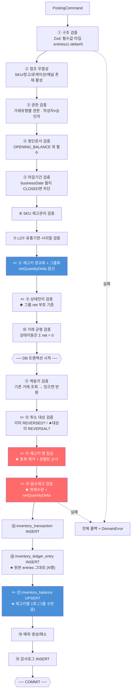
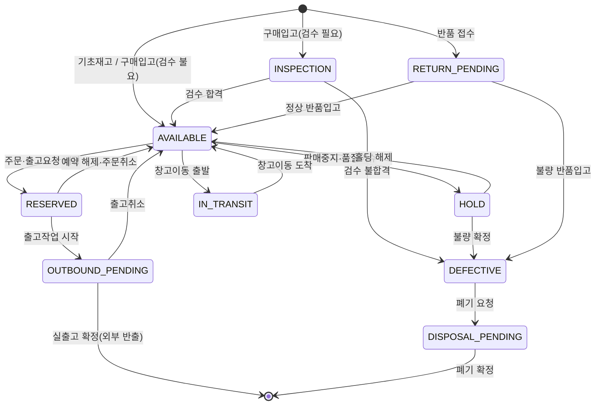
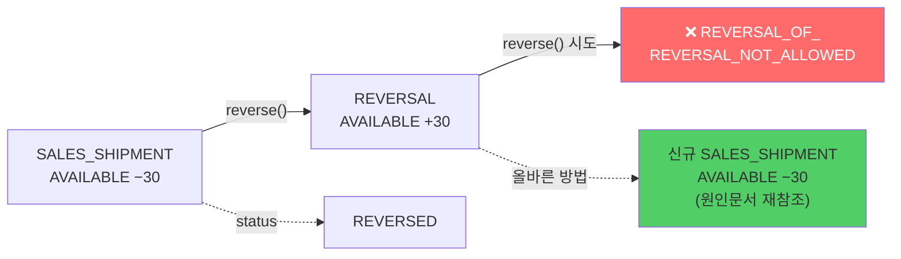
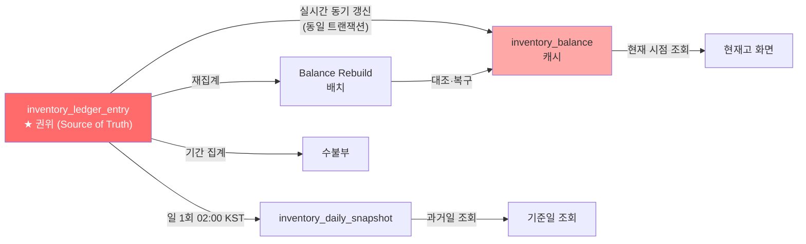
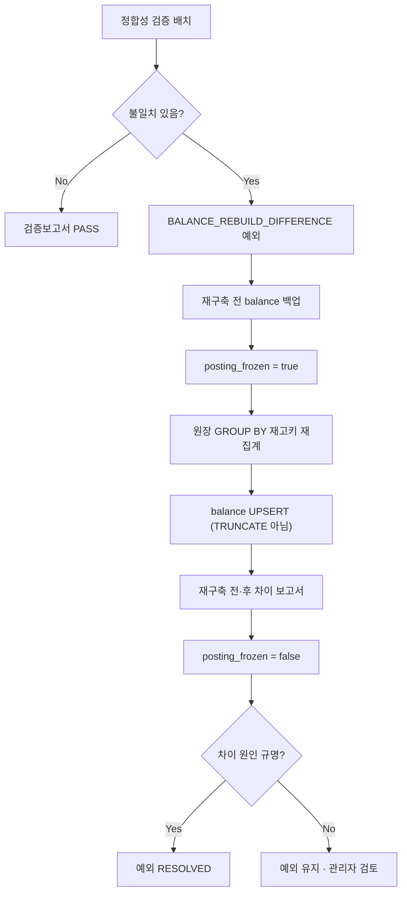

# DEEPPOINT SCM OS — 설계검토 05. 재고 Posting Service · 현재고 계산 및 캐시 전략 **(v0.2)**

> **v0.1 대비 변경**: ✏️ 표기된 절.
> 주요 변경 — ① **동일 재고키 합산 검증**(§8.6, §8.12) ② **REVERSAL 재취소 차단**(§8.9) ③ 상태전이 검증을 **net 기준**으로 전환(§8.4) ④ 테스트 케이스 5종 추가(§8.13)

---

# 8. 재고 Posting Service 설계

## 8.0 위치와 원칙

```
src/modules/inventory-ledger/application/services/InventoryPostingService.ts
```

| 원칙 | 내용 |
|---|---|
| **단일 관문** | 재고를 변경하는 모든 경로(기초재고, 조정, 실사, 예약·홀딩, 취소, 엑셀 반영, 향후 입고·출고·이동·조립)는 반드시 이 서비스를 통과한다 |
| **외부 미노출** | 범용 원장 생성 REST API를 만들지 않는다 (재고 PRD §27.2). 도메인 서비스만 호출 가능 |
| **원자성** | 원장 생성 + balance 갱신 + 예외 생성 + 감사로그가 **하나의 DB 트랜잭션** |
| **짧은 트랜잭션** | 파일 I/O·외부 API 호출을 트랜잭션 안에서 하지 않는다. 검증에 필요한 참조 데이터는 트랜잭션 진입 전에 로드한다 |
| **거래 균형** | 상태이동 거래(`STATUS_CHANGE`, `RESERVATION*`, `WAREHOUSE_TRANSFER_*`)는 `Σ(entries.quantityDelta) = 0` |
| ✏️ **재고키 합산** | **하나의 거래 안에서 동일 재고키가 여러 entry로 나타날 수 있다.** 검증·balance 갱신은 **재고키별 합산값(`netQuantityDelta`)** 기준으로 수행하고, 원장행만 원본 entry 단위로 저장한다 |

### ✏️ 왜 재고키 합산이 필요한가 (v0.1 결함)

v0.1 의사코드는 entry를 순회하며 각각 `잠금 시점 잔량 + entry.quantityDelta`로 검증했다. 이 방식은 **동일 재고키가 여러 entry로 들어오면 각 entry가 같은 최초 잔량을 기준으로 검증**되어, 개별 검증은 통과하지만 최종 balance가 음수가 된다.

```
현재고 10
entry 1: 재고키 K, −6   → 검증: 10 − 6 = 4  ✅ 통과
entry 2: 재고키 K, −6   → 검증: 10 − 6 = 4  ✅ 통과   ← 잘못된 기준
                          balance 갱신: 10 − 6 − 6 = −2  ❌ 음수 발생
```

balance 갱신은 `quantity = quantity + delta`를 entry마다 수행하므로 **최종 수량은 정확히 −2가 되지만, 검증이 이를 잡아내지 못한다.** 즉 음수재고 차단이 우회된다.

**이런 입력은 실제로 발생한다**: 엑셀 업로드에서 같은 SKU·창고·LOT 행이 여러 줄로 들어오는 경우, 세트 해체에서 동일 구성품이 여러 라인에 걸치는 경우, 3PL 출고 실적이 채널별로 분할되어 같은 재고키를 여러 번 차감하는 경우.

## 8.1 입력값 (PostingCommand)

```typescript
interface PostingCommand {
  transactionType: TransactionType;
  occurredAt: Date;                    // 업무 발생 일시 (UTC). businessDate는 서비스가 KST로 파생
  entries: PostingEntry[];             // 최소 1개. ★ 동일 재고키 중복 허용

  sourceDocument?: {                   // OPENING_BALANCE 외 필수
    type: string;
    id: string;
    no?: string;
  };

  external?: { systemId: string; transactionId: string; importedAt?: Date };
  idempotencyKey?: string;

  reasonCode?: string;
  reasonDetail?: string;
  attachmentGroupId?: string;

  reversalOfId?: string;               // REVERSAL 전용

  actor: ActorContext;                 // userId, roles, sessionId, ip, requestId
  approvedBy?: string;

  allowNegativeStock?: { approvedBy: string; reason: string; dueDate?: Date };
  allowClosedPeriod?:  { approvedBy: string; reason: string };
}

interface PostingEntry {
  // ── 재고키 ─────────────────────────────────────────────
  skuId: string;
  warehouseId: string;
  locationId?: string;                 // 미지정 시 창고 DEFAULT 로케이션
  inventoryStatus: InventoryStatus;
  lotNo?: string;                      // 미지정 → '' 정규화
  expiryDate?: Date;                   // 미지정 → expiryKey '9999-12-31'
  manufacturedDate?: Date;
  serialNo?: string;                   // 미지정 → '' 정규화
  ownerCode?: string;                  // 미지정 → 'DEEPPOINT'

  quantityDelta: Decimal;              // ≠ 0. 증가 양수, 감소 음수 (기준단위)
  originalQuantity?: Decimal;
  originalUom?: string;
  conversionFactor?: Decimal;

  channelId?: string;                  // 출고 전용
  outboundPurpose?: OutboundPurpose;
  externalLineId?: string;
  note?: string;
}
```

### ✏️ 내부 중간 표현 — StockKeyGroup

```typescript
/** 정규화된 재고키. 8개 컬럼 전부가 키를 구성한다. */
interface StockKey {
  skuId: string;
  warehouseId: string;
  locationId: string;
  inventoryStatus: InventoryStatus;
  lotNo: string;                       // '' 정규화 완료
  expiryKey: Date;                     // '9999-12-31' 정규화 완료
  serialNo: string;                    // '' 정규화 완료
  ownerCode: string;                   // 'DEEPPOINT' 정규화 완료
}

/** 동일 재고키 entry들을 묶은 그룹. 검증·balance 갱신의 단위. */
interface StockKeyGroup {
  key: StockKey;
  hash: string;                        // 8개 값 직렬화 (정렬·조회용)
  entries: NormalizedEntry[];          // 원본 entry들 (원장행 저장용)
  netQuantityDelta: Decimal;           // ★ Σ entries.quantityDelta. 0일 수 있음
}

interface PostingResult {
  transactionId: string;
  transactionNo: string;
  entryIds: string[];
  balancesAfter: StockKeyBalance[];    // 재고키별 1건 (entry 수가 아님)
  exceptionsCreated: string[];
  idempotent: boolean;
}
```

> **핵심 구분**
> `entries` = 원장에 기록되는 **사실의 단위** (감사·추적용, 원본 보존)
> `groups`  = 검증과 balance 갱신의 **계산 단위** (정합성 보장용)

## 8.2 ✏️ 검증 순서



### 각 검증의 상세

| # | 검증 | 실패 시 오류코드 | 비고 |
|---|---|---|---|
| ① | 구조 (Zod) | `VALIDATION_ERROR` | `entries.length ≥ 1`, **개별** `quantityDelta ≠ 0` |
| ② | 참조 무결성 | `SKU_NOT_FOUND` / `WAREHOUSE_INACTIVE` | |
| ③ | 권한 | `FORBIDDEN` | §8.3 |
| ④ | 원인문서 | `MISSING_SOURCE_DOCUMENT` | `OPENING_BALANCE` 제외 |
| ⑤ | 마감기간 | `CLOSED_PERIOD_TRANSACTION` | `allowClosedPeriod` + 관리자 시 통과 |
| ⑥ | 재고관리 대상 | `SKU_NOT_INVENTORY_MANAGED` | 무형·임가공비 제외 |
| ⑦ | LOT·유통기한·시리얼 | `LOT_REQUIRED_MISSING` 등 | §8.5 |
| ✏️ ⑧ | **재고키 그룹화** | — | 정규화 → 해시 → 그룹 → `netQuantityDelta` 합산 |
| ✏️ ⑨ | 상태전이 | `INVALID_STATUS_TRANSITION` | **그룹 net 부호 기준** — §8.4 |
| ⑩ | 거래 균형 | `UNBALANCED_TRANSACTION` | 상태이동 유형만 |
| ⑪ | 멱등키 | — (오류 아님) | 기존 거래 반환 |
| ✏️ ⑫ | 취소 대상 | `ALREADY_REVERSED` / **`REVERSAL_OF_REVERSAL_NOT_ALLOWED`** | §8.9 |
| ✏️ ⑬ | 행 잠금 | — | **중복 제거 후** 정렬 순서로 |
| ✏️ ⑭ | 음수재고 | `INSUFFICIENT_STOCK` | **`현재수량 + netQuantityDelta`** — §8.6 |

## 8.3 거래유형별 권한 · 원인문서 매트릭스

| 거래유형 | 원인문서 | 필요 권한 | 승인 필요 |
|---|---|---|---|
| `OPENING_BALANCE` | 불필요(배치 자체가 근거) | `inventory.opening.post` | SCM 리더 |
| `MANUAL_ADJUSTMENT` | `STOCK_ADJUSTMENT` | `inventory.adjust.post` | SCM 리더 (마감월·음수 시 관리자 추가) |
| `STOCK_COUNT_ADJUSTMENT` | `STOCK_COUNT` | `inventory.count.post` | SCM 리더 |
| `STATUS_CHANGE` | `STOCK_ADJUSTMENT` / `INVENTORY_HOLD` | `inventory.status.change` | SCM 리더 |
| `RESERVATION` / `RESERVATION_RELEASE` | `SALES_ORDER` / `SHIPMENT_REQUEST` (R3) | `inventory.reserve` | — |
| `REVERSAL` | 원거래 참조 | 원거래 유형과 동일 권한 | SCM 리더 |
| `PURCHASE_RECEIPT` (R2) | `GOODS_RECEIPT` | `inbound.post` | — |
| `SALES_SHIPMENT` 등 (R3) | `SHIPMENT` | `outbound.post` | — |
| `WAREHOUSE_TRANSFER_*` (R3) | `TRANSFER_ORDER` | `transfer.post` | SCM 리더 |
| `ASSEMBLY_*` / `DISASSEMBLY_*` (R3) | `ASSEMBLY_ORDER` | `assembly.post` | — |

## 8.4 ✏️ 재고상태 전환 검증 (net 기준)



### 허용 전이표

| From \ To | AVAIL | RESV | OUT_PEND | HOLD | INSP | DEFECT | RET_PEND | DISP_PEND | IN_TRANSIT | 외부반출 |
|---|:-:|:-:|:-:|:-:|:-:|:-:|:-:|:-:|:-:|:-:|
| **AVAILABLE** | — | ✅ | ❌ | ✅ | ❌ | ❌ | ❌ | ❌ | ✅ | ✅ |
| **RESERVED** | ✅ | — | ✅ | ❌ | ❌ | ❌ | ❌ | ❌ | ❌ | ❌ |
| **OUTBOUND_PENDING** | ✅ | ❌ | — | ❌ | ❌ | ❌ | ❌ | ❌ | ❌ | ✅ |
| **HOLD** | ✅ | ❌ | ❌ | — | ❌ | ✅ | ❌ | ❌ | ❌ | ❌ |
| **INSPECTION** | ✅ | ❌ | ❌ | ❌ | — | ✅ | ❌ | ❌ | ❌ | ❌ |
| **DEFECTIVE** | ❌ | ❌ | ❌ | ❌ | ❌ | — | ❌ | ✅ | ❌ | ✅(반품출고) |
| **RETURN_PENDING** | ✅ | ❌ | ❌ | ❌ | ❌ | ✅ | — | ❌ | ❌ | ❌ |
| **DISPOSAL_PENDING** | ❌ | ❌ | ❌ | ❌ | ❌ | ❌ | ❌ | — | ❌ | ✅(폐기) |
| **IN_TRANSIT** | ✅ | ❌ | ❌ | ❌ | ✅ | ❌ | ❌ | ❌ | — | ❌ |

**명시적으로 금지되는 전이**

| 금지 전이 | 사유 |
|---|---|
| `HOLD` → 외부반출 | 홀딩 해제 없이 출고 불가 (TC-INV-011) |
| `DEFECTIVE` → `AVAILABLE` | 재검수·조정 승인 없이 가용 복귀 불가 |
| `AVAILABLE` → `OUTBOUND_PENDING` | 반드시 `RESERVED` 경유 |
| `AVAILABLE` → `DEFECTIVE` | `HOLD` 또는 `INSPECTION` 경유 |
| `RESERVED` → `HOLD` | 예약 해제 후 홀딩 |
| `IN_TRANSIT` → `DEFECTIVE` | 도착 검수(`INSPECTION`) 경유 |

### ✏️ 검증 단위 변경 — entry 쌍 → 그룹 net

v0.1은 "음수 delta = from, 양수 delta = to"로 **entry를 짝지어** 전이표를 대조했다. 동일 상태 버킷이 여러 entry로 나뉘면 방향 판정이 틀린다.

```
STATUS_CHANGE 입력:
  entry 1: AVAILABLE −100
  entry 2: AVAILABLE  +30    ← 같은 버킷에 반대 부호
  entry 3: HOLD       +70

v0.1(entry 쌍): AVAILABLE이 from이면서 동시에 to → 판정 불가 또는 오판
v0.2(그룹 net): AVAILABLE net = −70 (from) / HOLD net = +70 (to)
                → AVAILABLE → HOLD 전이 1건으로 정확히 판정 ✅
```

**규칙**
1. 그룹화 후 `netQuantityDelta < 0`인 그룹 = **from 버킷**
2. `netQuantityDelta > 0`인 그룹 = **to 버킷**
3. `netQuantityDelta = 0`인 그룹 = **전이에 관여하지 않음** (검증 대상에서 제외)
4. 모든 `(from.inventoryStatus, to.inventoryStatus)` 조합이 허용 전이표에 있어야 한다
5. 거래 균형: `Σ 모든 그룹의 netQuantityDelta = 0` (상태이동 유형)

> 동일 상태 버킷이 from과 to에 동시에 나타나는 것은 **net 계산 후에는 원천적으로 불가능**하다. net이 음수이거나 양수이거나 0, 셋 중 하나뿐이다.

## 8.5 LOT · 사용기한 · 시리얼 검증

| SKU 설정 | 검증 규칙 | 오류코드 |
|---|---|---|
| `lotManaged = true` | 모든 entry에 `lotNo ≠ ''` 필수 | `LOT_REQUIRED_MISSING` |
| `lotManaged = false` | `lotNo`가 들어오면 **거부** | `LOT_NOT_ALLOWED` |
| `expiryManaged = true` | `expiryDate` 필수 | `EXPIRY_REQUIRED_MISSING` |
| `expiryManaged = true` + 입고 | `expiryDate > occurredAt` | `EXPIRED_INBOUND` |
| `expiryManaged = true` + `minimumRemainingDays` | `(expiryDate − occurredAt) ≥ minimumRemainingDays` | `INSUFFICIENT_SHELF_LIFE` |
| `serialManaged = true` | `serialNo ≠ ''`, **개별 entry 수량 절댓값 = 1** | `SERIAL_REQUIRED_MISSING` / `SERIAL_QTY_INVALID` |
| ✏️ `serialManaged = true` | **그룹 `netQuantityDelta` 절댓값 ≤ 1** — 동일 시리얼이 여러 entry로 중복 차감되는 것을 차단 | `SERIAL_NET_QTY_INVALID` |
| `serialManaged = true` + 입고 | 동일 `serialNo`가 이미 양수 잔량이면 거부 | `SERIAL_DUPLICATE` |
| 공통 | LOT·유통기한 **정정은 버킷 이동 쌍** | `DIRECT_LOT_EDIT_FORBIDDEN` |

**정규화 규칙 (Posting 진입 시 즉시)**
```
lotNo    : null | undefined | '' | '-' → ''
serialNo : null | undefined | '' | '-' → ''
ownerCode: null | undefined           → 'DEEPPOINT'
expiryKey: expiryDate ?? DATE '9999-12-31'
locationId: null → warehouse.defaultLocationId
```

> 정규화가 **그룹화보다 반드시 먼저** 실행되어야 한다. 그렇지 않으면 `lotNo=null`과 `lotNo=''`가 다른 그룹으로 잡혀 합산이 깨진다.

## 8.6 ✏️ 음수재고 검증 (재고키 합산 기준)

### 검증식

```
그룹 g에 대하여
  beforeQty(g) = 잠금 후 조회한 inventory_balance.quantity (없으면 0)
  afterQty(g)  = beforeQty(g) + g.netQuantityDelta        ← ★ 개별 entry가 아님
  if (afterQty(g) < 0) → 음수재고 판정
```

| 조건 | 판정 |
|---|---|
| `netQuantityDelta ≥ 0` | 검증 불필요 (순증가 또는 중립) |
| `afterQty ≥ 0` | 통과 |
| ~~`afterQty < 0` **AND** `sku.negativeStockAllowed = true`~~ | ✏️ **폐기 (T1-1, PENDING_v0.3 §1)** — SKU 상시 허용 경로 제거. 음수재고는 아래 행(거래별 승인 예외)으로만 허용 |
| `afterQty < 0` **AND** `allowNegativeStock` 제공 **AND** 승인자가 `ADMIN`/`SCM_LEADER` **AND** 사유 존재 | 통과 + `NEGATIVE_STOCK` 예외 (**OPEN**, 담당자·기한 지정) + 감사로그 |
| 그 외 | ❌ `INSUFFICIENT_STOCK` — **전체 롤백** |

> **예외 5요건** (재고 PRD §3.2): ① 리더/관리자 권한 ② 사유 입력 ③ 승인 기록 ④ 예외 큐 생성 ⑤ 해소 담당자·기한 지정. **5개 모두** 충족해야 통과.

### 검증 사례

| 현재고 | entry 입력 | net | 판정 |
|---:|---|---:|---|
| 10 | K: −6, K: −6 | **−12** | ❌ `INSUFFICIENT_STOCK` (10 − 12 = −2) — **v0.1은 통과시켰음** |
| 10 | K: −6, K: +3 | **−3** | ✅ 통과 → 최종 7 |
| 0 | K: +10, K: −4 | **+6** | ✅ 통과 (검증 불필요) → 최종 6 |
| 10 | K: −10, K: +10 | **0** | ✅ 통과 → 최종 10 (balance 갱신은 no-op이나 `last_transaction_id`는 갱신) |
| 10 | K: −5, L: −5 | K −5 / L −5 | K는 통과(5), **L은 L의 잔량으로 별도 판정** |

### 오류 메시지

부분 실패는 없다. 하나의 그룹이라도 실패하면 전체 롤백한다. 오류 상세에는 **그룹 단위 정보**를 담는다.

```typescript
throw new DomainError('INSUFFICIENT_STOCK', {
  skuId: g.key.skuId,
  warehouseId: g.key.warehouseId,
  inventoryStatus: g.key.inventoryStatus,
  lotNo: g.key.lotNo,
  available: beforeQty,
  requestedNet: g.netQuantityDelta.abs(),   // ★ 합산값
  entryCount: g.entries.length,             // ★ 몇 개 entry가 합쳐졌는지
  entryLineNos: g.entries.map(e => e.lineNo),
});
```

> `entryCount > 1`이면 화면에 *"동일 재고키의 N개 항목이 합산되어 검증되었습니다"* 를 표시한다. 사용자가 "각 줄은 재고 범위 안인데 왜 실패하지?" 라고 혼란스러워하는 것을 막는다.

## 8.7 ✏️ 동시성 제어

### 잠금 전략

```sql
-- ★ 중복 제거된 재고키를 정렬된 순서로 잠근다
SELECT id, quantity, lock_version
FROM inventory_balance
WHERE (sku_id, warehouse_id, location_id, inventory_status, lot_no, expiry_key, serial_no, owner_code)
      IN ( ... DISTINCT 재고키 목록 ... )
ORDER BY sku_id, warehouse_id, location_id, inventory_status, lot_no, expiry_key, serial_no, owner_code
FOR UPDATE;
```

| 항목 | 결정 |
|---|---|
| **방식** | **비관적 행 잠금** (`SELECT … FOR UPDATE`) |
| ✏️ **잠금 대상** | **그룹 단위 = 중복 제거된 재고키.** entry 수가 아니라 그룹 수만큼 잠근다. 동일 키를 두 번 잠그려는 시도 자체가 없어짐 |
| **⚠️ advisory lock 미사용** | Supavisor transaction-mode pooler에서 세션 락은 동작하지 않는다 |
| **데드락 방지** | 잠금 순서를 재고키 정렬 순서로 고정. **중복 제거가 정렬 안정성에도 기여** |
| **잠금 대상 미존재** | `INSERT ... ON CONFLICT DO NOTHING`으로 0 수량 행 선생성 후 잠금 |
| **낙관적 보조** | `lock_version` 병행 |
| **격리수준** | `READ COMMITTED` |
| **재시도** | `40001`/`40P01` 시 3회, 지수 백오프 50/100/200ms + jitter |
| **트랜잭션 시간** | 목표 < 200ms |
| **배치 처리** | 청크 500행 = 청크당 1 트랜잭션 |

### ✏️ balance 갱신 — 그룹당 정확히 1회

```sql
UPDATE inventory_balance
   SET quantity            = quantity + :netQuantityDelta,   -- ★ 합산값 1회
       last_transaction_id = :txnId,
       lock_version        = lock_version + 1,
       updated_at          = now()
 WHERE (sku_id, warehouse_id, location_id, inventory_status,
        lot_no, expiry_key, serial_no, owner_code) = (:stockKey)
RETURNING quantity;
```

> v0.1은 entry마다 UPDATE를 실행했다. 최종 수량은 같았지만 ① 불필요한 쓰기가 발생하고 ② `lock_version`이 entry 수만큼 증가해 낙관적 잠금 의미가 흐려지며 ③ **검증 단위와 갱신 단위가 달라 정합성 추론이 어려웠다.** v0.2는 검증·갱신 모두 그룹 단위로 통일한다.
>
> `netQuantityDelta = 0`인 그룹도 UPDATE를 실행한다. 수량은 변하지 않지만 `last_transaction_id`·`updated_at` 갱신이 감사 추적에 필요하다.

## 8.8 멱등성 처리

```
idempotencyKey = {externalSystemCode}:{externalTransactionId}:{externalLineId}:{transactionType}
REVERSAL       = {원키}:REVERSAL:{seq}
```

| 상황 | 처리 |
|---|---|
| 키 없음 (내부 거래) | 멱등성 미적용. 원인문서 상태로 중복 방지 |
| 키 존재 + DB에 없음 | 정상 생성 |
| 키 존재 + DB에 있음 | **기존 결과 반환** (`idempotent: true`). 오류 아님 |
| 동시 요청 2건 동일 키 | 하나는 `23505` → catch 후 기존 거래 조회·반환 |
| 파일 재업로드 | `import_job.file_hash` UNIQUE + `import_row.status='POSTED'` 스킵 |

## 8.9 ✏️ 취소 및 반대거래

```
원거래:  SALES_SHIPMENT, entries = [AVAILABLE −30]
   ↓ 취소
반대거래: REVERSAL, reversal_of_id = 원거래.id
         entries = [AVAILABLE +30]   ← 부호만 반전, 재고키·LOT·채널 동일
   ↓
원거래.status = 'REVERSED'  (UI 표시용. 원장행은 그대로 남음)
```

### 기존 규칙

| 규칙 | 내용 |
|---|---|
| 원거래 삭제·수정 | **금지** |
| 반대거래 생성 | 원거래 `entries` 부호만 반전해 복제. 재고키·LOT·유통기한·시리얼·채널·출고목적 동일 |
| `occurredAt` | **취소 시점** 사용 (소급 금지) |
| 동일 거래 재취소 차단 | `원거래.status = 'REVERSED'`면 `ALREADY_REVERSED`. DB 조건부 UNIQUE로 이중 방어 |
| 사유 | **필수** |
| 음수 검증 | 반대거래도 정상 검증. **입고 취소는 감소이므로 재고 부족 시 차단됨** |
| 마감기간 | 반대거래의 `businessDate` 기준 |
| 정정 절차 | 잘못된 출고 −10 → ① REVERSAL +10 ② 올바른 출고 −8 (신규 거래) |
| 집계 영향 | `status` 필터 없이 합산하므로 자동 상쇄 |

### ✏️ 신규 — REVERSAL 재취소 차단

**Release 1에서 `transactionType = 'REVERSAL'`인 거래는 취소 대상이 될 수 없다.**

| 항목 | 내용 |
|---|---|
| **오류코드** | `REVERSAL_OF_REVERSAL_NOT_ALLOWED` |
| **판정 위치** | ① 도메인 서비스 `reverse()` 진입부 ② Posting 검증 ⑫ ③ API Route ④ 화면(버튼 미노출) ⑤ DB 트리거(최종 방어) |
| **대안 안내** | 취소를 되돌려야 하면 **원인문서를 근거로 신규 정상거래를 생성**한다. 오류 메시지에 이 안내를 포함한다 |
| **근거** | 취소의 취소를 허용하면 `A → REVERSAL(A) → REVERSAL(REVERSAL(A)) → …` 체인이 생겨 ① 어느 것이 유효한 거래인지 추론이 어려워지고 ② 감사 추적이 무의미해지며 ③ 실무상 "원거래를 되살리는" 의도는 신규 거래로 표현하는 것이 명확하다 |



**5중 방어**

| 층 | 구현 |
|---|---|
| 1. 도메인 | `reverse()` 진입부에서 `original.transactionType === 'REVERSAL'` 검사 |
| 2. Posting | 검증 ⑫에서 `reversalOfId` 대상의 `transactionType` 검사 |
| 3. API | `POST /api/inventory/transactions/{id}/reverse` → 422 + 오류코드 |
| 4. 화면 | 원장 목록·상세에서 `transactionType='REVERSAL'` 행에 **취소 버튼 미노출** + 툴팁 |
| 5. DB | `BEFORE INSERT` 트리거 — `reversal_of_id`가 가리키는 행의 `transaction_type`이 `REVERSAL`이면 예외 |

```sql
-- 최종 방어선
CREATE OR REPLACE FUNCTION reject_reversal_of_reversal() RETURNS trigger AS $$
BEGIN
  IF NEW.reversal_of_id IS NOT NULL THEN
    IF (SELECT transaction_type FROM inventory_transaction WHERE id = NEW.reversal_of_id) = 'REVERSAL' THEN
      RAISE EXCEPTION 'REVERSAL_OF_REVERSAL_NOT_ALLOWED';
    END IF;
  END IF;
  RETURN NEW;
END; $$ LANGUAGE plpgsql;

CREATE TRIGGER trg_no_reversal_of_reversal
  BEFORE INSERT ON inventory_transaction
  FOR EACH ROW EXECUTE FUNCTION reject_reversal_of_reversal();
```

> **Release 2 이후 재검토 사항**: 실무에서 "취소를 잘못했다"가 반복되면 `REVERSAL` 대상 취소를 관리자 권한으로 제한적 허용하는 방안을 검토할 수 있다. R1에서는 **완전 차단**한다.

## 8.10 오류 발생 시 롤백

| 실패 지점 | 결과 |
|---|---|
| 트랜잭션 진입 전 (①~⑩) | DB 변경 없음. `DomainError` 반환 |
| 트랜잭션 내 (⑪~⑲) | **전체 롤백** (TC-INV-005) |
| ✏️ **그룹 1개 음수 판정** | **거래 전체 롤백.** 다른 그룹도 반영되지 않음 |
| COMMIT 실패 | 전체 롤백 → 재시도 |
| 재시도 3회 초과 | `409 CONFLICT` |
| 배치 중 청크 실패 | 해당 청크만 롤백. `ImportRow.status`로 재실행 시 스킵 → `PARTIALLY_COMPLETED` |

## 8.11 감사로그 기록

```typescript
await auditLogger.record({
  entityType: 'InventoryTransaction',
  entityId:   transaction.id,
  action:     'POST',                        // or 'REVERSE'
  beforeValue: null,
  afterValue:  {
    transactionNo, transactionType, businessDate,
    entries: entries.map(summarize),         // 원본 entry (감사 추적)
    groups:  groups.map(g => ({              // ✏️ 그룹 요약 (정합성 추적)
      stockKey: g.hash, netDelta: g.netQuantityDelta, entryCount: g.entries.length,
    })),
    balancesAfter,
  },
  actorId:    command.actor.userId,
  reason:     command.reasonDetail,
  approvedBy: command.approvedBy,
  requestId:  command.actor.requestId,
  sessionId:  command.actor.sessionId,
  ipAddress:  command.actor.ip,
}, tx);                                       // ★ 동일 트랜잭션 핸들
```

> ✏️ `groups` 요약을 추가한다. 사후에 "왜 이 거래가 음수 검증을 통과/실패했는가"를 재구성하려면 합산 결과가 로그에 남아야 한다.

## 8.12 ✏️ 의사코드

```typescript
class InventoryPostingService {

  async post(cmd: PostingCommand): Promise<PostingResult> {

    // ══ Phase 1. 트랜잭션 밖 검증 ══════════════════════════════════
    validateStructure(cmd);                                  // ① entries≥1, 개별 delta≠0

    const refs = await this.loadReferences(cmd);             // ②
    assertAllExistAndUsable(refs);

    assertPermission(cmd.actor, cmd.transactionType);        // ③
    assertApproverSeparation(cmd);

    if (cmd.transactionType !== 'OPENING_BALANCE') {         // ④
      assertSourceDocument(cmd.sourceDocument);
      await assertSourceDocumentState(cmd.sourceDocument);
    }

    const businessDate = toKstDate(cmd.occurredAt);
    await assertPeriodOpen(businessDate, cmd.allowClosedPeriod, cmd.actor);   // ⑤

    // ⑥⑦ 정규화 + SKU 단위 검증 (★ 그룹화보다 반드시 먼저)
    const entries = cmd.entries.map((e, i) => ({
      ...normalizeStockKey(e, refs),   // lotNo/serialNo '', ownerCode, expiryKey, locationId
      lineNo: i + 1,
    }));
    for (const e of entries) {
      assertInventoryManaged(refs.sku(e.skuId));
      assertLotExpirySerial(refs.sku(e.skuId), e);
    }

    // ══ ✏️ ⑧ 재고키 그룹화 ═══════════════════════════════════════
    const groups = groupByStockKey(entries);
    assertSerialNetQty(groups, refs);                        // 시리얼 SKU: |net| ≤ 1

    // ══ ✏️ ⑨⑩ 상태전이·균형 검증 (그룹 net 기준) ══════════════════
    assertStatusTransitionByNet(cmd.transactionType, groups);
    assertBalancedIfStatusMove(cmd.transactionType, groups); // Σ net = 0

    const idemKey = cmd.idempotencyKey ?? buildIdempotencyKey(cmd);

    // ══ Phase 2. DB 트랜잭션 ═══════════════════════════════════════
    return await this.retryOnConflict(3, async () =>
      await this.db.$transaction(async (tx) => {

        // ⑪ 멱등성
        if (idemKey) {
          const existing = await tx.inventoryTransaction.findUnique({
            where: { idempotencyKey: idemKey },
          });
          if (existing) return await this.toResult(tx, existing, { idempotent: true });
        }

        // ✏️ ⑫ 취소 대상 검증
        if (cmd.reversalOfId) {
          const orig = await tx.inventoryTransaction.findUniqueOrThrow({
            where: { id: cmd.reversalOfId },
          });
          if (orig.transactionType === 'REVERSAL') {         // ★ 신규
            throw new DomainError('REVERSAL_OF_REVERSAL_NOT_ALLOWED', {
              targetTransactionNo: orig.transactionNo,
              hint: '취소를 되돌리려면 원인문서를 근거로 신규 정상거래를 생성하세요.',
            });
          }
          if (orig.status === 'REVERSED') throw new DomainError('ALREADY_REVERSED');
        }

        // ✏️ ⑬ 재고키 행 잠금 — 중복 제거된 그룹 키를 정렬 순서로
        const keys = groups.map(g => g.key).sort(compareStockKey);   // ★ 이미 유일

        await tx.$executeRaw`
          INSERT INTO inventory_balance
            (id, sku_id, warehouse_id, location_id, inventory_status,
             lot_no, expiry_key, serial_no, owner_code, quantity)
          SELECT ... FROM unnest(${keys}) ...
          ON CONFLICT (sku_id, warehouse_id, location_id, inventory_status,
                       lot_no, expiry_key, serial_no, owner_code) DO NOTHING`;

        const locked = await tx.$queryRaw`
          SELECT * FROM inventory_balance
          WHERE (sku_id, warehouse_id, location_id, inventory_status,
                 lot_no, expiry_key, serial_no, owner_code) IN (${keys})
          ORDER BY sku_id, warehouse_id, location_id, inventory_status,
                   lot_no, expiry_key, serial_no, owner_code
          FOR UPDATE`;

        // ✏️ ⑭ 음수재고 검증 — ★ 그룹 net 기준
        const negatives: NegativeCase[] = [];
        for (const g of groups) {
          const before = locked.find(byStockKey(g.key))?.quantity ?? ZERO;
          const after  = before.plus(g.netQuantityDelta);     // ★ 합산값

          if (after.lessThan(0)) {
            // ✏️ 폐기 (T1-1, PENDING_v0.3 §1): sku.negativeStockAllowed 경로 제거 —
            //    거래별 승인 예외만 허용한다. (아래 의사코드는 R1a-2 에서 예외요청
            //    모델 기준으로 재작성한다)
            const permitted =
                 (cmd.allowNegativeStock
                  && hasRole(cmd.actor, ['ADMIN','SCM_LEADER'])
                  && !!cmd.allowNegativeStock.reason);

            if (!permitted) {
              throw new DomainError('INSUFFICIENT_STOCK', {
                skuId: g.key.skuId, warehouseId: g.key.warehouseId,
                inventoryStatus: g.key.inventoryStatus, lotNo: g.key.lotNo,
                available: before,
                requestedNet: g.netQuantityDelta.abs(),
                entryCount: g.entries.length,                 // ★ 합산 사실을 노출
                entryLineNos: g.entries.map(e => e.lineNo),
              });
            }
            negatives.push({ group: g, before, after });
          }
        }

        // ⑮ 거래 헤더
        const txn = await tx.inventoryTransaction.create({
          data: {
            transactionNo:   await this.nextTransactionNo(tx, businessDate),
            transactionType: cmd.transactionType,
            status:          'POSTED',
            occurredAt:      cmd.occurredAt,
            businessDate,
            postedAt:        new Date(),
            importedAt:      cmd.external?.importedAt,
            sourceDocumentType: cmd.sourceDocument?.type,
            sourceDocumentId:   cmd.sourceDocument?.id,
            sourceDocumentNo:   cmd.sourceDocument?.no,
            externalSystemId:      cmd.external?.systemId,
            externalTransactionId: cmd.external?.transactionId,
            idempotencyKey:  idemKey,
            reversalOfId:    cmd.reversalOfId,
            reasonCode:      cmd.reasonCode,
            reasonDetail:    cmd.reasonDetail,
            attachmentGroupId: cmd.attachmentGroupId,
            createdBy:       cmd.actor.userId,
            approvedBy:      cmd.approvedBy,
          },
        });

        // ✏️ ⑯ 원장행 — ★ 원본 entries 그대로 (합산하지 않음)
        await tx.inventoryLedgerEntry.createMany({
          data: entries.map(e => ({
            transactionId: txn.id,
            lineNo: e.lineNo,                                 // 원본 순서 보존
            ...pickStockKeyAndAttrs(e),
            quantityDelta: e.quantityDelta,                   // 원본 값
            businessDate, occurredAt: cmd.occurredAt,
            baseUom: refs.sku(e.skuId).baseUom,
          })),
        });

        // ✏️ ⑰ balance 갱신 — ★ 그룹당 정확히 1회
        const after: StockKeyBalance[] = [];
        for (const g of groups) {
          const row = await tx.$queryRaw`
            UPDATE inventory_balance
               SET quantity            = quantity + ${g.netQuantityDelta},
                   last_transaction_id = ${txn.id},
                   lock_version        = lock_version + 1,
                   updated_at          = now()
             WHERE (sku_id, warehouse_id, location_id, inventory_status,
                    lot_no, expiry_key, serial_no, owner_code) = (${g.key})
             RETURNING *`;
          after.push(row);
        }

        // 취소 시 원거래 상태 전환
        if (cmd.reversalOfId) {
          await tx.inventoryTransaction.update({
            where: { id: cmd.reversalOfId },
            data:  { status: 'REVERSED' },
          });
        }

        // ⑱ 예외 생성 / 해소
        const exceptions: string[] = [];
        for (const n of negatives) {
          exceptions.push(await this.exceptions.open(tx, {
            code: 'NEGATIVE_STOCK', severity: 'ERROR',
            skuId: n.group.key.skuId, warehouseId: n.group.key.warehouseId,
            transactionId: txn.id,
            assignedTo: cmd.allowNegativeStock?.approvedBy,
            dueDate:    cmd.allowNegativeStock?.dueDate,
            detail: { before: n.before, after: n.after,
                      netDelta: n.group.netQuantityDelta,
                      entryCount: n.group.entries.length },
          }));
        }
        await this.exceptions.autoResolveIfRecovered(tx, groups);

        // ⑲ SKU 거래사용 플래그
        await tx.sku.updateMany({
          where: { id: { in: uniq(groups.map(g => g.key.skuId)) }, hasTransaction: false },
          data:  { hasTransaction: true },
        });

        // ⑳ 감사로그 (★ 동일 트랜잭션)
        await this.audit.record({ /* §8.11 — entries + groups 요약 */ }, tx);

        return { transactionId: txn.id, transactionNo: txn.transactionNo,
                 entryIds: [...], balancesAfter: after,
                 exceptionsCreated: exceptions, idempotent: false };
      }, { isolationLevel: 'ReadCommitted', timeout: 15_000 })
    );
  }

  // ── ✏️ 재고키 그룹화 ────────────────────────────────────────────
  private groupByStockKey(entries: NormalizedEntry[]): StockKeyGroup[] {
    const map = new Map<string, StockKeyGroup>();

    for (const e of entries) {
      const key  = pickStockKey(e);
      const hash = hashStockKey(key);   // 8개 값을 구분자로 직렬화

      let g = map.get(hash);
      if (!g) {
        g = { key, hash, entries: [], netQuantityDelta: ZERO };
        map.set(hash, g);
      }
      g.entries.push(e);
      g.netQuantityDelta = g.netQuantityDelta.plus(e.quantityDelta);   // Decimal 누적
    }

    return [...map.values()];
    // ★ netQuantityDelta 가 0인 그룹도 제거하지 않는다.
    //   원장행은 저장해야 하고, last_transaction_id 갱신도 필요하다.
  }

  private hashStockKey(k: StockKey): string {
    // 구분자는 재고키 값에 등장할 수 없는 문자를 사용한다 ().
    // 단순 문자열 결합은 'AB'+'C' 와 'A'+'BC' 충돌 위험이 있으므로 금지.
    return [k.skuId, k.warehouseId, k.locationId, k.inventoryStatus,
            k.lotNo, k.expiryKey.toISOString().slice(0,10),
            k.serialNo, k.ownerCode].join('');
  }

  // ── ✏️ 상태전이 검증 (그룹 net 기준) ──────────────────────────────
  private assertStatusTransitionByNet(type: TransactionType, groups: StockKeyGroup[]) {
    if (!isStatusMoveType(type)) return;

    const froms = groups.filter(g => g.netQuantityDelta.lessThan(0));
    const tos   = groups.filter(g => g.netQuantityDelta.greaterThan(0));
    // net = 0 인 그룹은 전이에 관여하지 않으므로 제외한다.

    for (const f of froms) {
      for (const t of tos) {
        if (!isTransitionAllowed(f.key.inventoryStatus, t.key.inventoryStatus)) {
          throw new DomainError('INVALID_STATUS_TRANSITION', {
            from: f.key.inventoryStatus, to: t.key.inventoryStatus,
          });
        }
      }
    }
  }

  private assertBalancedIfStatusMove(type: TransactionType, groups: StockKeyGroup[]) {
    if (!isStatusMoveType(type)) return;
    const sum = groups.reduce((a, g) => a.plus(g.netQuantityDelta), ZERO);
    if (!sum.isZero()) throw new DomainError('UNBALANCED_TRANSACTION', { sum });
  }

  // ── ✏️ 반대거래 ─────────────────────────────────────────────────
  async reverse(originalId: string, reason: ReversalReason, actor: ActorContext) {
    const original = await this.db.inventoryTransaction.findUniqueOrThrow({
      where: { id: originalId }, include: { entries: true },
    });

    // ★ 1차 방어 — REVERSAL 재취소 차단
    if (original.transactionType === 'REVERSAL') {
      throw new DomainError('REVERSAL_OF_REVERSAL_NOT_ALLOWED', {
        targetTransactionNo: original.transactionNo,
        hint: '취소를 되돌리려면 원인문서를 근거로 신규 정상거래를 생성하세요.',
      });
    }
    if (original.status === 'REVERSED') throw new DomainError('ALREADY_REVERSED');

    return this.post({
      transactionType: 'REVERSAL',
      occurredAt: new Date(),                      // ★ 취소 시점 (소급 금지)
      entries: original.entries.map(e => ({
        ...pickStockKey(e),
        quantityDelta: e.quantityDelta.negated(),  // 부호만 반전
        channelId: e.channelId, outboundPurpose: e.outboundPurpose,
      })),
      // 원거래에 동일 재고키가 여러 entry로 있었다면 반대거래도 동일 구조를 유지한다.
      // 그룹화가 검증을 정확히 처리하므로 별도 병합이 필요 없다.
      sourceDocument: {
        type: original.sourceDocumentType, id: original.sourceDocumentId,
        no: original.sourceDocumentNo,
      },
      reversalOfId: originalId,
      idempotencyKey: original.idempotencyKey
        ? `${original.idempotencyKey}:REVERSAL:1` : undefined,
      reasonCode: reason.code, reasonDetail: reason.detail,
      approvedBy: reason.approvedBy, actor,
    });
  }

  private async retryOnConflict<T>(max: number, fn: () => Promise<T>): Promise<T> {
    for (let attempt = 0; ; attempt++) {
      try { return await fn(); }
      catch (err) {
        if (!isRetryable(err) || attempt >= max - 1) throw err;   // 40001 / 40P01
        await sleep(50 * 2 ** attempt + Math.random() * 25);
      }
    }
  }
}
```

## 8.13 ✏️ 필수 테스트 케이스

### 동일 재고키 합산 (신규)

| ID | 시나리오 | 기대 결과 |
|---|---|---|
| **TC-POST-101** | 현재고 10, 동일 키 `−6` / `−6` | ❌ `INSUFFICIENT_STOCK` — **거래 전체 롤백**. 원장행 0건, balance 10 유지 |
| **TC-POST-102** | 현재고 10, 동일 키 `−6` / `+3` | ✅ 통과. 원장행 **2건**, balance **7**, UPDATE **1회** |
| **TC-POST-103** | 현재고 0, 동일 키 `+10` / `−4` | ✅ 통과. 원장행 2건, balance **6** |
| **TC-POST-104** | `STATUS_CHANGE`: `AVAILABLE −100` / `AVAILABLE +30` / `HOLD +70` | ✅ 통과. net = `AVAILABLE −70`, `HOLD +70`. 전이 `AVAILABLE→HOLD` 1건으로 판정. Σnet = 0 |
| **TC-POST-105** | 동일 재고키가 중복된 거래 2건을 **동시 Posting** | 하나만 성공, 다른 하나 `INSUFFICIENT_STOCK`. **음수 미발생**. 데드락 미발생 |

**TC-POST-104 보조 케이스**

| 변형 | 기대 |
|---|---|
| `AVAILABLE −100` / `HOLD +70` (Σ = −30) | ❌ `UNBALANCED_TRANSACTION` |
| `AVAILABLE −50` / `AVAILABLE +50` / `HOLD 0` | ⛔ 개별 `quantityDelta = 0` 은 ① 구조 검증에서 차단 |
| `AVAILABLE −50` / `AVAILABLE +50` (net 0, 다른 그룹 없음) | ✅ 통과 (Σ = 0). balance 불변, `last_transaction_id` 갱신 |
| `DEFECTIVE −10` / `AVAILABLE +10` | ❌ `INVALID_STATUS_TRANSITION` (금지 전이) |

**TC-POST-105 상세**
```
초기: 현재고 10
스레드 A: [K −6, K −2]  → net −8
스레드 B: [K −5, K −1]  → net −6
동시 실행 → 합계 −14 > 10
기대: 정확히 1건 성공(balance 2 또는 4), 1건 INSUFFICIENT_STOCK, 음수 0건
```

### REVERSAL 재취소 차단 (신규)

| ID | 시나리오 | 기대 결과 |
|---|---|---|
| **TC-POST-201** | `SALES_SHIPMENT` 취소 → 생성된 `REVERSAL`을 다시 취소 시도 | ❌ `REVERSAL_OF_REVERSAL_NOT_ALLOWED` (도메인) |
| **TC-POST-202** | API `POST /transactions/{reversalId}/reverse` | 422 + 오류코드 + 대안 안내 |
| **TC-POST-203** | DB에 직접 `reversal_of_id`가 REVERSAL을 가리키는 행 INSERT | ❌ 트리거 예외 |
| **TC-POST-204** | 원장 화면에서 REVERSAL 행 확인 | **취소 버튼 미노출** (E2E) |
| **TC-POST-205** | 동일 원거래를 2회 취소 시도 | ❌ `ALREADY_REVERSED` (기존 TC-INV-013) |

### 기존 유지

`TC-INV-001~033` 전량 유지. 특히 다음은 v0.2 변경의 회귀 검증에 해당한다.

| ID | 검증 대상 |
|---|---|
| TC-INV-003 | 재고 10에서 출고 11 차단 (단일 entry) |
| TC-INV-005 | balance 갱신 실패 시 원장행 롤백 |
| TC-INV-006 | 동시 출고 2건에도 음수 미발생 |
| TC-INV-007 | 원장 재집계 = balance |
| TC-INV-012~014 | 취소 → 반대거래 → 잔량 복원 |

---

# 9. 현재고 계산 및 캐시 전략

> v0.1에서 **변경 없음**. 단 §9.6에 그룹 단위 갱신 사실을 반영했다.

## 9.1 두 개의 진실 — 원장(권위) vs balance(캐시)



| 구분 | 정의 | 계산 |
|---|---|---|
| **원장 계산 재고** | 권위 있는 값 | `Σ quantity_delta WHERE 재고키 매칭 AND business_date ≤ T` — **`transaction.status` 필터 없음** |
| **balance 캐시** | 조회 성능용 | Posting Service가 동일 트랜잭션에서 **재고키별 1회** 원자 갱신 |
| 불변식 | `Σ 원장 = balance.quantity` (전 재고키) | 위반 시 `BALANCE_REBUILD_DIFFERENCE` 예외 |

> ✏️ 재구축 시 원장을 재고키로 GROUP BY 하는 방식은 **Posting의 그룹 합산과 정확히 동일한 연산**이다. 따라서 v0.2의 그룹 갱신은 재구축 결과와 구조적으로 일치한다 (v0.1의 entry별 누적 갱신도 결과는 같았으나, 검증 단위가 달라 추론이 어려웠다).

## 9.2 수량 정의

| 수량 | 정의 | 계산식 |
|---|---|---|
| **가용재고** | 판매·사용 가능 | `SUM(quantity) WHERE inventory_status = 'AVAILABLE'` <br> ★ 예약분을 다시 빼지 않는다 (C-01) |
| **예약재고** | | `WHERE inventory_status = 'RESERVED'` |
| **홀드재고** | | `WHERE inventory_status = 'HOLD'` |
| **출고대기** | | `WHERE inventory_status = 'OUTBOUND_PENDING'` |
| **검사중재고** | | `WHERE inventory_status = 'INSPECTION'` |
| **불량재고** | | `WHERE inventory_status = 'DEFECTIVE'` |
| **이동중재고** | | `WHERE inventory_status = 'IN_TRANSIT'` — 특정 실물창고 재고에 미포함 |
| **정상재고** | | `AVAILABLE + RESERVED + OUTBOUND_PENDING` |
| **실물재고** | | 위 + `HOLD + INSPECTION + DEFECTIVE + RETURN_PENDING + DISPOSAL_PENDING` (`IN_TRANSIT` 제외) |
| **총보유재고** | | `모든 실물창고 재고 + IN_TRANSIT` |
| **예상가용재고** | ⚠️ 원장이 아닌 계획 조회값 | `AVAILABLE + 확정 입고예정 − 미예약 출고예정` |

### 예상재고 2단계

```
확정 예상재고 = 현재 가용재고 + 확정 입고예정 − 예약 출고 − 승인된 출고예정
계획 예상재고 = 확정 예상재고 + 미확정 입고계획 − 미확정 출고계획
```

## 9.3 특정일 기준 재고

| 경로 | 조건 | 계산 | 성능 |
|---|---|---|---|
| **A. balance 직접** | `T = 현재` | `SELECT quantity FROM inventory_balance` | 최고 |
| **B. 스냅샷** | `T`에 스냅샷 존재 | `snapshot(T)` | 우수 |
| **C. 원장 집계** | 스냅샷 없음 | `Σ quantity_delta WHERE business_date ≤ T` | 보통 |

```sql
SELECT sku_id, warehouse_id, inventory_status, lot_no, expiry_key, serial_no, owner_code,
       SUM(quantity_delta) AS quantity
FROM inventory_ledger_entry
WHERE business_date <= :asOfDate
  AND (:warehouseId IS NULL OR warehouse_id = :warehouseId)
  AND (:skuIds IS NULL OR sku_id = ANY(:skuIds))
GROUP BY 1,2,3,4,5,6,7
HAVING SUM(quantity_delta) <> 0;
```

> **절대 금지**: 현재 balance에서 역산(`현재고 − 이후 거래`)하지 않는다.

## 9.4 월 마감재고

```
월 마감재고(M) = Σ quantity_delta WHERE business_date ≤ M의 말일
월 기초재고(M) = 월 마감재고(M−1)
```

## 9.5 수불부 계산

```sql
WITH opening AS (
  SELECT sku_id, warehouse_id, SUM(quantity_delta) AS qty
  FROM inventory_ledger_entry
  WHERE business_date < :periodStart
  GROUP BY 1,2
),
movements AS (
  SELECT e.sku_id, e.warehouse_id, t.transaction_type, e.outbound_purpose, e.channel_id,
         SUM(e.quantity_delta) AS qty
  FROM inventory_ledger_entry e
  JOIN inventory_transaction t ON t.id = e.transaction_id
  WHERE e.business_date BETWEEN :periodStart AND :periodEnd
  GROUP BY 1,2,3,4,5
)
SELECT
  o.qty                                                        AS opening_qty,
  SUM(m.qty) FILTER (WHERE m.qty > 0)                          AS inbound_total,
  SUM(m.qty) FILTER (WHERE m.transaction_type = 'PURCHASE_RECEIPT')       AS purchase_in,
  SUM(m.qty) FILTER (WHERE m.transaction_type = 'RETURN_RECEIPT')         AS return_in,
  SUM(m.qty) FILTER (WHERE m.transaction_type = 'WAREHOUSE_TRANSFER_IN')  AS transfer_in,
  -SUM(m.qty) FILTER (WHERE m.qty < 0)                         AS outbound_total,
  -SUM(m.qty) FILTER (WHERE m.outbound_purpose = 'SALES_B2C')  AS b2c_out,
  -SUM(m.qty) FILTER (WHERE m.outbound_purpose = 'SALES_B2B')  AS b2b_out,
  -SUM(m.qty) FILTER (WHERE m.outbound_purpose = 'MARKETING')  AS marketing_out,
  -SUM(m.qty) FILTER (WHERE m.outbound_purpose = 'CS')         AS cs_out,
  SUM(m.qty) FILTER (WHERE m.transaction_type IN
        ('MANUAL_ADJUSTMENT','STOCK_COUNT_ADJUSTMENT'))        AS net_adjustment,
  o.qty + SUM(m.qty)                                           AS closing_qty
FROM opening o LEFT JOIN movements m USING (sku_id, warehouse_id)
GROUP BY o.sku_id, o.warehouse_id, o.qty;
```

**검증차이** = `기초 + 입고 − 출고 + 순조정 − 기말`. 정상값 0.

## 9.6 ✏️ 캐시 갱신 전략

| 시점 | 방식 |
|---|---|
| Posting 시 | **동기 원자 갱신** (동일 트랜잭션). ✏️ **재고키(그룹)당 정확히 1회 UPDATE** |
| 재구축 | `balance.rebuild` 잡 — 원장 GROUP BY 재고키 → UPSERT |
| 일별 스냅샷 | 02:00 KST Cron |
| 무효화 | 없음 (증분 갱신) |

## 9.7 원장 ↔ balance 불일치 복구

### 탐지

```sql
SELECT COALESCE(l.sku_id, b.sku_id) AS sku_id, ...,
       COALESCE(l.ledger_qty, 0)  AS ledger_qty,
       COALESCE(b.quantity, 0)    AS balance_qty,
       COALESCE(l.ledger_qty,0) - COALESCE(b.quantity,0) AS diff
FROM (
  SELECT sku_id, warehouse_id, location_id, inventory_status,
         lot_no, expiry_key, serial_no, owner_code,
         SUM(quantity_delta) AS ledger_qty
  FROM inventory_ledger_entry GROUP BY 1,2,3,4,5,6,7,8
) l
FULL OUTER JOIN inventory_balance b USING
  (sku_id, warehouse_id, location_id, inventory_status,
   lot_no, expiry_key, serial_no, owner_code)
WHERE COALESCE(l.ledger_qty,0) <> COALESCE(b.quantity,0);
```

| 주기 | 방법 |
|---|---|
| 매일 03:00 KST | 정합성 검증 배치 |
| 수동 | 관리자 요청 |
| 월마감 시 | 필수 사전검증 항목 |

### 복구 절차



| 단계 | 내용 |
|---|---|
| **1. 원장은 절대 건드리지 않는다** | 복구는 항상 **balance를 원장에 맞추는** 방향 |
| **2. 백업** | 현재 balance를 `balance_rebuild_snapshot`에 저장 |
| **3. 잠금** | `system_setting.posting_frozen = true` |
| **4. 재집계** | 원장 GROUP BY → UPSERT. `TRUNCATE` 금지 |
| **5. 검증보고** | 전/후 수량, 영향 재고키 수, 총 차이량 → Storage xlsx |
| **6. 예외 처리** | 원인 미규명 시 예외 유지. **자동 종결 금지** |
| **7. 잠금 해제** | |

> **불일치 발생 가능 원인**
> ① Posting 외 경로에서 balance 수정 → ESLint + 트리거로 예방
> ② 트랜잭션 중단 중 부분 커밋 → 단일 트랜잭션으로 예방
> ③ 수동 SQL 개입 → 감사로그 + 운영 절차
> ④ 마이그레이션 스크립트 오류 → 재구축으로 복구
> ✏️ ⑤ **동일 재고키 합산 누락** → v0.2에서 제거됨
>
> 예방이 최우선이며, 재구축은 최후 수단이다.
