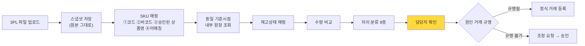
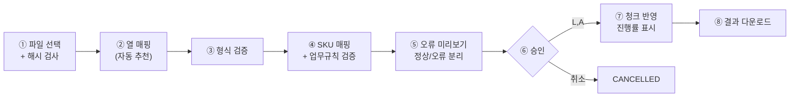

# DEEPPOINT SCM OS — 설계검토 06. API 설계 · 화면 및 사용자 흐름

---

# 10. API 설계

## 10.0 공통 규약

| 항목 | 규약 |
|---|---|
| Base | `/api` |
| 형식 | JSON. 요청·응답 모두 Zod 스키마로 검증 |
| 인증 | Supabase 세션 쿠키 → `ActorContext` |
| 목록 응답 | `{ items: T[], page, pageSize, total, hasNext }` |
| 오류 응답 | `{ errorCode, message, details?, requestId }` |
| **멱등성** | `Idempotency-Key` 헤더 지원 API는 표에 ✅ 표기. 동일 키 재요청 시 **기존 결과를 200으로 반환** |
| 상태 코드 | 200 조회·멱등재요청 / 201 생성 / 202 비동기 접수 / 400 검증 / 403 권한 / 404 없음 / 409 충돌 / 422 업무규칙 위반 |
| 권한 표기 | `S`=SCM 담당자 `L`=SCM 리더 `A`=관리자 `F`=재무 `E`=경영진 |
| **범용 원장 생성 API 없음** | `POST /api/inventory/transactions` 는 **제공하지 않는다** (재고 PRD §27.2). 도메인 서비스만 Posting 호출 |

## 10.1 인증 · 사용자 · 권한

| Method | URL | 목적 | 요청 | 응답 | 권한 | 주요 검증 | 멱등 |
|---|---|---|---|---|---|---|:-:|
| POST | `/api/auth/login` | 로그인 | `{email, password}` | `{user, roles}` + 세션쿠키 | 전체 | 계정 활성 | — |
| POST | `/api/auth/logout` | 로그아웃 | — | `204` | 인증 | | — |
| GET | `/api/me` | 내 정보·권한 | — | `{user, roles, permissions[]}` | 인증 | | — |
| GET | `/api/users` | 사용자 목록 | `q, role, active, page` | `User[]` | A | | — |
| POST | `/api/users` | 사용자 생성 | `{email, name, roleIds[]}` | `User` | A | 이메일 중복 | — |
| PATCH | `/api/users/{id}` | 수정 | `{name?, active?}` | `User` | A | 본인 비활성 차단 | — |
| PUT | `/api/users/{id}/roles` | 역할 배정 | `{roleIds[]}` | `User` | A | 역할 존재 | — |
| GET | `/api/roles` | 역할·권한 조회 | — | `Role[]` | A | | — |

## 10.2 공통코드

| Method | URL | 목적 | 요청 | 응답 | 권한 | 주요 검증 | 멱등 |
|---|---|---|---|---|---|---|:-:|
| GET | `/api/codes/{groupCode}` | 코드 목록 | `active?` | `CommonCode[]` | 전체 | | — |
| POST | `/api/codes/{groupCode}` | 코드 추가 | `{code, name, sortOrder, attributes?}` | `CommonCode` | A | 그룹 내 코드 중복 | — |
| PATCH | `/api/codes/{groupCode}/{code}` | 수정 | `{name?, active?}` | `CommonCode` | A | **사용 중 코드는 비활성만, 삭제 불가** | — |

## 10.3 SKU

| Method | URL | 목적 | 요청 | 응답 | 권한 | 주요 검증 | 멱등 |
|---|---|---|---|---|---|---|:-:|
| GET | `/api/skus` | 목록 | `q, status, itemType, brandId, majorCategoryId, minorCategoryId, hasBom, mappingStatus, hasIssue, page, sort` | `Sku[]` | 전체 | `q`는 코드·상품명·바코드·외부별칭 통합검색 | — |
| GET | `/api/skus/{id}` | 상세 | — | `SkuDetail`(바코드·매핑·공급조건·BOM 포함) | 전체 | ✏️ 실제 응답은 SKU 본체 필드만 — 아래 설계복구 참조 | — |
| POST | `/api/skus` | 생성 | `CreateSkuDto` | `Sku` (DRAFT) | S,L,A | 코드 전역 중복, 필수값, 코드체계(**WARNING**) | ✅ |
| PATCH | `/api/skus/{id}` | 수정 | `UpdateSkuDto` | `Sku` | S,L,A | **`hasTransaction=true`면 `skuCode` 변경 차단** / ACTIVE는 제한 필드만 | — |
| POST | `/api/skus/{id}/submit` | 승인 요청 | `{note?}` | `Sku` (PENDING) | S,L,A | 승인 요청 전 검증 9종 (PRD §15.1) | — |
| POST | `/api/skus/{id}/approve` | 승인 | `{note?}` | `Sku` (ACTIVE) | L,A | 상태=PENDING, **작성자≠승인자** | — |
| POST | `/api/skus/{id}/reject` | 반려 | `{reason}` **필수** | `Sku` (REJECTED) | L,A | 사유 필수 | — |
| POST | `/api/skus/{id}/deactivate` | 사용중지 | `{reason}` | `Sku` (INACTIVE) | L,A | 활성 BOM 사용 중이면 경고 | — |
| POST | `/api/skus/{id}/archive` | 폐기 | `{reason}` | `Sku` (ARCHIVED) | A | **거래·BOM 사용 이력 0건일 때만** | — |
| GET | `/api/skus/{id}/history` | 변경이력 | `page` | `AuditLog[]` | 전체 | | — |
| POST | `/api/skus/{id}/suggest-code` | 코드 추천 | `{brandId, majorId, minorId}` | `{suggestedCode}` | S,L,A | **자동 저장하지 않음** (PRD §11.5) | — |
| POST | `/api/skus/import` | 대량 업로드 | `multipart` | `202 {jobId}` | S,L,A | 파일 해시 중복 경고 | ✅ |
| GET | `/api/skus/import/{jobId}` | 업로드 상태 | — | `ImportJob` + 진행률 | S,L,A | | — |

> ✏️ **2026-08-11 설계복구 (SKU 상세 잔여 탭)**: `GET /api/skus/{id}` 의 응답을 `SkuDetail`(**바코드·매핑·공급조건·BOM 포함**)로 적었으나, T1-3 이 "아직 없는 모델의 관계를 가짜 빈 배열로 채우지 않는다"는 결정으로 **SKU 본체 필드만** 반환하도록 구현했고 그 결정이 유지된다. 따라서 상세 화면의 각 탭은 **자기 모듈의 API 를 직접 호출**한다 — 바코드 탭은 `GET /api/skus/{id}/barcodes`(T04-3)를 쓴다. 자세한 내용은 **`16_설계복구_SKU상세잔여탭.md`**. `GET /api/skus/{id}/history` 는 아직 구현되지 않았으며 **T1-6B3** 의 선행 지원 API 다(범위·권한 미결).
>
> ✏️ **2026-08-11 설계복구 (SKU 변경이력 + 지원 read API, T1-6B3)**: 위 `GET /api/skus/{id}/history` 행의 미결(응답 형태·`pageSize`·정렬·권한 `전체` 의 실제 permission·대상 entity)을 **`16_설계복구_SKU상세잔여탭.md` §27~§40** 으로 확정한다. 원문의 `page` / `AuditLog[]` / `전체` 문구는 역사 기록으로 보존하며 다음이 구현 계약이다 — ① **요청은 `page` 하나뿐**이고 `pageSize` 를 포함한 그 밖의 키는 **400** 이다(서버가 `pageSize=50` 고정, ⛔ 조용한 무시 없음). ② 응답은 배열이 아니라 기존 목록 API 와 **같은 envelope** (`items` / `page` / `pageSize` / `total` / `totalPages` / `requestId`)이며 `page` 를 함께 적은 원문과 일치시킨 것이다. ③ item 은 정확히 `id`·`entityType`·`entityId`·`action`·`beforeValue`·`afterValue`·`actorId`·`occurredAt`·`reason` **9개 필드**이고, ⛔ `approvedBy` 와 `AuditLog` 의 `requestId`·`sessionId`·`ipAddress` 는 넣지 않는다(global 감사 조회의 범위). ④ 대상 entity 는 **`Sku` + 그 SKU 의 `SkuBarcode`** 뿐이며 ⛔ `SkuExternalMapping`·Supplier·BOM 은 포함하지 않는다. ⑤ 권한 칸 **`전체` 는 역할 표기이지 permission 이름이 아니다** — **`sku.read` 를 재사용**하고 ⛔ 신규 permission·seed·route policy 를 만들지 않는다(proxy 의 기존 `/api/skus` GET 정책이 그대로 잡는다). ⑥ 정렬은 `occurredAt DESC, id DESC`(동시각 tie 안정화)이고 ⛔ cursor pagination 이 아니다. 부모 SKU 가 없으면 **404**(빈 목록 위장 금지), 이력이 0건이면 `200` + `items: []` · `total: 0` · **`totalPages: 0`** 이다. ⛔ global `/admin/audit-logs`·`GET /api/audit-logs`·다른 엔티티 history endpoint 는 이번 범위가 아니며, 이 endpoint 는 **read-only** 로 `AuditLog` write path·불변 트리거·스키마를 건드리지 않는다.

## 10.4 바코드

| Method | URL | 목적 | 요청 | 응답 | 권한 | 주요 검증 | 멱등 |
|---|---|---|---|---|---|---|:-:|
| GET | `/api/skus/{id}/barcodes` | 목록 | — | `SkuBarcode[]` | 전체 | | — |
| POST | `/api/skus/{id}/barcodes` | 추가 | `{barcode, barcodeType, isPrimary?, ...}` | `SkuBarcode` | S,L,A | **문자열 저장** / 공백·하이픈 제거 후 검증 / 활성 중복 차단 / `확인필요`·`확인불가`는 거부 후 DataIssue | ✅ |
| PATCH | `/api/skus/{id}/barcodes/{bid}` | 수정 | `{isPrimary?, status?, ...}` | `SkuBarcode` | S,L,A | SKU당 대표 1개 | — |
| DELETE | `/api/skus/{id}/barcodes/{bid}` | 비활성 | — | `SkuBarcode` (INACTIVE) | S,L,A | **물리삭제 아님** (PRD §33.2) | — |
| POST | `/api/skus/{id}/barcodes/{bid}/approve-duplicate` | 중복 예외 승인 | `{reason}` **필수** | `SkuBarcode` | L,A | 실제 중복 존재 확인 / 승인자·사유 기록 | — |

> ✏️ **2026-08-10 설계복구 (바코드 CRUD)**: 위 표의 POST `{barcode, barcodeType, isPrimary?, ...}` 와 PATCH `{isPrimary?, status?, ...}` 는 말줄임표로 끝나 나머지 필드가 확정되지 않았고, `DataIssue` 가 repository 에 존재하지 않아 T04-3 을 PRE-FLIGHT BLOCKED 로 보고했다. 계약은 **`10_설계복구_BarcodeCRUD.md`** 로 확정한다 — POST/PATCH 는 V1 최소 strict DTO, `barcode` 값은 생성 후 immutable, 대표 자동 교체 없음, DELETE 반복 호출은 idempotent 200, GET 은 pagination 없는 raw 배열(`ACTIVE`+`INACTIVE`, `createdAt DESC, id DESC`)이다.
>
> **"`확인필요`·`확인불가`는 거부 후 DataIssue"** 중 **DataIssue 생성 부분은 인터랙티브 CRUD 에 한해 supersede** 되었다(422 `BARCODE_UNVERIFIED` 로 거부만 한다). **import·마이그레이션 경로의 DataIssue 요구는 그대로 유효**하다.
>
> ✏️ **2026-08-10 설계복구 (중복 예외 승인)**: 위 `approve-duplicate` 행은 승인 대상 `{bid}` 후보의 생성 경로·상태를 정의하지 않아 T04-4 를 PRE-FLIGHT BLOCKED 로 보고했다. 계약은 **`11_설계복구_Barcode중복예외승인.md`** 로 확정한다 — 신규 `POST …/barcodes/duplicate-candidates` 가 `PENDING_DUPLICATE` 후보를 만들고, 이 endpoint 가 그것을 승인한다. `{reason}` 필수·권한 L,A 는 원문 그대로다.

## 10.5 외부 상품 매핑

| Method | URL | 목적 | 요청 | 응답 | 권한 | 주요 검증 | 멱등 |
|---|---|---|---|---|---|---|:-:|
| GET | `/api/external-mappings` | 목록 | `externalSystemId, skuId, mappingStatus, q, page` | `Mapping[]` | 전체 | | — |
| POST | `/api/external-mappings` | 생성 | `CreateMappingDto` | `Mapping` | S,L,A | 동일 시스템 내 외부코드 중복 차단 / 코드 없이 상품명만이면 `REVIEW_REQUIRED` 강제 | ✅ |
| PATCH | `/api/external-mappings/{id}` | 수정 | `{mappingStatus?, isPrimary?, effectiveTo?}` | `Mapping` | S,L,A | `MATCHED` 전환은 외부코드 또는 바코드 필수 | — |
| POST | `/api/external-mappings/import` | 대량 업로드 | `multipart` | `202 {jobId}` | S,L,A | | ✅ |
| GET | `/api/external-mappings/unmatched` | 미매칭 목록 | `externalSystemId, page` | `UnmatchedRow[]` | S,L,A | 스냅샷·업로드에서 발생한 미매칭 | — |

> ✏️ **2026-08-10 설계복구 (외부 상품 매핑 CRUD)**: 위 PATCH 요청 DTO `{mappingStatus?, isPrimary?, effectiveTo?}` 에는 **identifier 필드가 없어** 같은 행의 검증("`MATCHED` 전환은 외부코드 또는 바코드 필수")과 화면 상태변화(`REVIEW_REQUIRED → MATCHED`, 외부코드·바코드 확보 시에만)를 만족할 경로가 존재하지 않았고, `CreateMappingDto` 는 이름만 있고 필드 정의가 없었다. 또 `UNMATCHED` 의 생산 주체, `warehouseId` 입력 가부, `isPrimary` 충돌 정책, `effectiveTo`(매핑 해제) 규칙, GET 응답 shape, read 권한의 경영진 취급이 모두 미결이라 T05-2 를 PRE-FLIGHT BLOCKED 로 보고했다. 계약은 **`13_설계복구_외부상품매핑CRUD.md`** 로 확정한다 — `mappingStatus` 는 **server-derived**(입력 시 400)이고 PATCH 가 identifier 3종을 받으며, 식별자가 하나도 없으면 422 다. `UNMATCHED` 는 enum 만 유지하고 interactive API 가 생성·전환하지 않는다(실제 미매칭은 스냅샷·대사 계층). `warehouseId` 는 `Warehouse` FK 가 없는 T08-1 전까지 **입력 불가·항상 null**. 대표는 자동 교체 없이 409 이며, 매핑 해제는 DELETE 가 아니라 PATCH `effectiveTo`(`null→date`, 오늘 이하, 대표는 동시 해제 필수)다. 권한은 신규 **`external_mapping.read`(S,L,A,F) / `.create` / `.update`(S,L,A)** 이며, 위 GET 행의 "전체"보다 §11.20 화면별 권한표(`외부 상품 매핑 … E = —`)를 채택해 **경영진을 제외**했다. `/import`·`/unmatched` 는 각각 T15(업로드 파이프라인)·T17(스냅샷) 선행 모델이 없어 **T05-2 범위 밖**이다(stub 도 만들지 않는다).

## 10.6 거래처 · 공급조건

| Method | URL | 목적 | 요청 | 응답 | 권한 | 주요 검증 | 멱등 |
|---|---|---|---|---|---|---|:-:|
| GET | `/api/suppliers` | 목록 | `q, supplierType, status, page` | `Supplier[]` | 전체 | | — |
| POST | `/api/suppliers` | 생성 | `CreateSupplierDto` | `Supplier` | S,L,A | 코드 중복 | ✅ |
| PATCH | `/api/suppliers/{id}` | 수정 | — | `Supplier` | S,L,A | | — |
| GET | `/api/suppliers/{id}/skus` | 공급 SKU | `page` | `SupplierSku[]` | 전체 | | — |
| POST | `/api/suppliers/{id}/skus` | 공급조건 등록 | `{skuId, supplyType, moq?, leadTimeDays?, ...}` | `SupplierSku` | S,L,A | 적용기간 중첩 차단 / **`leadTimeDays` null 허용, 0 대체 금지** / `isPrimary`는 SKU당 1개 | ✅ |
| PATCH | `/api/supplier-skus/{id}` | 수정 | — | `SupplierSku` | S,L,A | | — |
| GET | `/api/supplier-skus/{id}/prices` | 가격이력 | `asOf?` | `Price[]` | 전체+F | | — |
| POST | `/api/supplier-skus/{id}/prices` | 가격 등록 | `{unitPrice, currency, vatIncluded, effectiveFrom, sourceDocument?, attachmentId?}` | `Price` | S,L,A,F | 적용일 중복 차단 / 이전 가격 `effectiveTo` 자동 마감 | ✅ |
| POST | `/api/supplier-sku-prices/{id}/approve` | 가격 승인 | `{note?}` | `Price` | L,A,F | 작성자≠승인자 | — |

> ✏️ **2026-08-12 설계복구 (거래처·공급조건 스키마, T06-1)**: 위 표의 8개 endpoint 는 **T06-2·T06-3 의 계약이며 T06-1 범위가 아니다** — 이번에 구현된 것은 `Supplier`/`SupplierSku`/`SupplierSkuPrice` 스키마와 DB 제약뿐이고 라우트·permission·seed·화면은 하나도 만들지 않았다. 원문은 그대로 보존하되, 스키마가 이 표를 지원하는 방식을 다음으로 확정한다(전문 **`17_설계복구_거래처공급조건.md`**) — ① 공급조건 등록 행의 **`적용기간 중첩 차단`** 은 DB 가 강제한다: `supplier_sku` 에 `EXCLUDE USING gist` 를 걸어 `(supplier_id, sku_id)` 안에서 부분중첩·완전포함·open-ended 중첩·동일 시작일이 전부 거부된다. 적용기간은 **half-open `[from, to)`** 이라 경계가 맞닿는 기간은 허용된다. ② 같은 행의 **`isPrimary`는 SKU당 1개** 는 partial UNIQUE `ux_supplier_sku_primary_current`(`WHERE is_primary = true AND effective_to IS NULL`)로 강제한다 — **현행(미종료) 대표** 기준이므로 종료된 과거 대표는 새 대표를 막지 않는다. ③ 같은 행의 **`leadTimeDays` null 허용, 0 대체 금지**(§00 G-03)를 위해 컬럼은 nullable 이고 DB default 를 두지 않으며 음수만 막는다 — **`0` 은 명시적 즉시납으로 유효한 값**이다. ④ 가격 등록 행의 **`적용일 중복 차단`** 은 `UNIQUE(supplier_sku_id, effective_from)` 이 맡고, **`이전 가격 effectiveTo 자동 마감`** 은 T06-3 application transaction 이 맡는다 — 그래서 `supplier_sku_price` 에는 **EXCLUDE 를 걸지 않았다**(다른 적용일의 기간 중첩은 DB 가 허용한다). ⑤ 가격 승인 행의 승인 상태는 별도 컬럼 없이 **`approvedBy` 의 NULL 여부**로 표현한다(`NULL`=미승인). `approvalStatus`·`approvedAt` 컬럼은 만들지 않으며 승인 시각은 AuditLog `occurredAt` 으로 추적한다. 그래서 `created_by`·`approved_by` 는 **User FK ON DELETE RESTRICT** 다 — SET NULL 이면 사용자 삭제로 승인된 가격이 미승인으로 뒤집힌다. ⑥ 같은 행의 **`작성자≠승인자`** 는 v0.2 의 후행 결정을 채택해 기존 **`allowSelfApprovalSku`** 설정을 재사용한다(신규 setting 없음). 반려 상태·반려 endpoint 는 authoritative source 가 없어 만들지 않는다. ⑦ `asOf` 기준 유효가격은 **승인된 가격만** 후보로 삼으며(`approved_by IS NOT NULL`), 가격이력 **목록** 자체는 승인·미승인 모두 조회 가능하다. ⑧ 가격 등록 DTO 의 **`attachmentId`** 는 `Attachment` 모델이 backlog 에 배정조차 되어 있지 않아 컬럼만 있고 **FK 가 없는 staged scalar** 다(`supplier.default_warehouse_id`·`supplier_sku.destination_warehouse_id` 도 `Warehouse` T08-1 을 기다리는 동일 상태).
>
> ✏️ **2026-08-12 설계복구 (공급조건 API, T06-2)**: 위 표의 **상단 6개 endpoint**(suppliers GET/POST/PATCH · `{id}/skus` GET/POST · supplier-skus PATCH)의 계약을 **`17_설계복구_거래처공급조건.md` §39~§57** 로 확정한다. 원문은 역사 기록으로 보존하며 구현 계약은 다음과 같다 — ① 목록 쿼리는 원문 4종(`q, supplierType, status, page`) 그대로이되 그 밖의 키는 **400**(`pageSize` 서버 고정 50·`sort` 없음), 응답은 `Supplier[]` 배열이 아니라 기존 목록과 같은 **envelope**(`items/page/pageSize/total/totalPages/requestId`), 정렬은 `supplierCode ASC, id ASC` 고정이다. `q` 는 supplierCode·supplierName 만 검색한다. ② **`CreateSupplierDto`** = required 3(`supplierCode`·`supplierName`·`supplierType`) + nullable 6(사업자번호·연락 3종·`defaultLeadTimeDays`·`note`) — ⛔ `status`(항상 DB default ACTIVE)와 `defaultWarehouseId`(T08 staged, 입력·노출 모두 금지)는 받지 않는다. `supplierCode` 는 **create-only immutable**(PATCH 400), Supplier PATCH 는 나머지 8필드만 편집한다(no-op → 200/write 0/audit 0). ③ 공급조건 등록 DTO 의 `...` 는 `{skuId, supplyType, effectiveFrom(required), supplierSkuCode?, supplierSkuName?, moq?, orderMultiple?, leadTimeDays?, purchaseUom?, currency?, isPrimary?, effectiveTo?}` 로 확정 — `moq`/`orderMultiple` 는 **십진 문자열 전용**(JSON number 400)이고 `effectiveFrom` 에 server today default 를 만들지 않는다. eligibility 는 parent 존재 + SKU 존재(`deletedAt IS NULL`) 뿐이다. ④ 같은 행의 `적용기간 중첩 차단` 은 DB EXCLUDE 가 거부하며 **409 `SUPPLIER_SKU_PERIOD_OVERLAP`**(동일 시작일 409 `SUPPLIER_SKU_EFFECTIVE_FROM_DUPLICATE` 와 구분)로 번역한다. `isPrimary는 SKU당 1개` 는 **자동 교체 없이 409 `SUPPLIER_SKU_PRIMARY_CONFLICT`** 다. ⑤ `leadTimeDays null 허용, 0 대체 금지` 는 응답에서 **stored `leadTimeDays` 와 derived `effectiveLeadTimeDays`**(`supplierSku.leadTimeDays ?? supplier.defaultLeadTimeDays ?? null`, ⛔ `\|\|` 금지)를 분리해 표현한다 — 저장값 `0`(즉시납)은 폴백되지 않는다. ⑥ **`PATCH /api/supplier-skus/{id}` 는 제자리 수정이 아니라 temporal versioning** 이다 — body 가 정확히 `{effectiveTo}` 면 종료(연장·reopen 불가), `effectiveFrom` + 변경 필드면 기존 row 를 그 날짜에 닫고 **후속 version row 를 생성**한다(old-close-before-new-insert, 단일 트랜잭션, row lock). 과거·현재·미래 어느 row 도 business field 를 직접 덮어쓸 수 없다. ⑦ 권한은 신규 **`supplier.read`(S,L,A,F) / `supplier.create` / `supplier.update`(S,L,A)** 3종 — 위 표 `전체` 보다 §11.20 화면별 권한표(`거래처·공급조건 … E = —`)를 채택해 **EXECUTIVE 를 read 에서도 제외**했다(외부매핑과 동일 판단). `supplier_sku.*` 는 만들지 않는다. ⑧ 멱등 ✅ 2개는 기존 공용 framework 재사용이며, 공급조건 POST 의 scope 는 **실제 supplierId 를 포함**한다. ⑨ Supplier·SupplierSku 모두 **AuditLog 대상**(CREATE/UPDATE, mutation 과 동일 트랜잭션, versioning 은 UPDATE+CREATE 2건)이나 ⛔ T1-6B3 SKU History 에는 포함하지 않는다. ⑩ `GET /api/suppliers/{id}` 단건 상세·SKU 역조회(`?skuId=` 등)는 이번 범위가 아니며 각각 T06-4·T1-6B4 PRE-FLIGHT 에서 supporting API 로 결정한다.

> ✏️ **2026-08-12 설계복구 (가격이력 API + asOf 유효가격 + 승인, T06-3)**: 위 표의 **하단 3개 endpoint**(`{id}/prices` GET/POST · supplier-sku-prices approve)의 계약을 **`17_설계복구_거래처공급조건.md` §58~§79** 로 확정한다. 원문은 역사 기록으로 보존하며 구현 계약은 다음과 같다 — ① **가격 등록과 가격 발효를 분리한다**: POST 는 `approvedBy=null·createdBy=actor·effectiveTo=null` 인 **미승인 제안행을 만들 뿐**이고, 원문의 `이전 가격 effectiveTo 자동 마감` 은 POST 가 아니라 **APPROVE 트랜잭션에서만** 수행한다(pending 가격은 승인 전까지 기존 승인 가격·asOf 결과를 바꾸지 않는다). ② `GET …/prices` 의 쿼리는 원문 그대로 **`asOf?` 하나뿐**(그 밖의 키 400·pagination 없음)이고, asOf 없으면 승인+미승인·과거+현재+미래 **전체 이력**(`effectiveFrom DESC, id DESC`), asOf 있으면 **승인된 operational 유효가격만** — 없으면 **200 `[]`**(404·0원 fallback 아님), 승인 유효 후보가 2건 이상이면 chain 손상으로 **409 `SUPPLIER_PRICE_CHAIN_CONFLICT`**(LIMIT 1 로 숨기지 않음)다. ③ 응답 `Price[]`/`Price` 의 view 는 정확히 10필드(`id·supplierSkuId·unitPrice·currency·vatIncluded·effectiveFrom·effectiveTo·sourceDocument·createdBy·approvedBy·createdAt`)로 확정 — ⛔ `approved`/`approvalStatus`/`approvedAt`/`attachmentId`/이름/객체 join 미노출. ④ 원문 등록 DTO 중 **`attachmentId` 는 받지 않는다**(Attachment staged — 입력 400)이고 `effectiveTo` 도 server-owned 라 400 이다 — 확정 DTO 는 `{unitPrice, currency, vatIncluded, effectiveFrom, sourceDocument?}` 5필드다. `unitPrice` 는 Decimal(18,4) **십진 문자열 전용**(JSON number 400 · 음수 422 `SUPPLIER_PRICE_UNIT_PRICE_INVALID` · **`"0"` 은 유효한 0원 가격**), `currency` 는 trim 후 3글자(allow-list·SupplierSku 일치 강제 없음), `effectiveFrom` 은 과거 backfill·미래 예약 모두 허용이다. ⑤ `적용일 중복 차단` 은 `UNIQUE(supplier_sku_id, effective_from)` → **409 `SUPPLIER_PRICE_EFFECTIVE_FROM_DUPLICATE`** 이며, 미승인 행도 시작일을 선점한다(known limitation, §65). ⑥ 승인 chain 은 **승인된 가격만**으로 predecessor(`from<T` 최대)·successor(`from>T` 최소)를 찾아 `predecessor.effectiveTo=T`·`target.effectiveTo=successor?.from ?? null` 로 계산한다 — historical 중간 삽입·future 선승인 모두 지원, parent `supplier_sku` `FOR UPDATE` lock 으로 동시 승인을 직렬화한다. ⑦ `작성자≠승인자` 는 기존 **`allowSelfApprovalSku`** 재사용(`assertApprovalActor` workflow 'SKU', 트랜잭션 내 최신 설정) — 위반 403. 이미 승인된 가격의 repeat approve 는 **200 no-op**(write 0·audit 0)이다. ⑧ 권한 칸 `전체+F`/`S,L,A,F`/`L,A,F` 는 신규 **`supplier_price.read`/`create`(A·L·S·F) / `supplier_price.approve`(A·L·F)** 3종으로 확정 — EXECUTIVE 는 read 도 제외(§11.20 화면별 권한표의 `가격이력 등록 E=—` 채택), `supplier.*` 재사용 없음, proxy 의 인증-only gap 을 3 정책으로 닫았다. ⑨ 멱등 ✅ 는 POST prices 만이며 scope 는 **실제 supplierSkuId 포함**, approve 는 멱등 계약 없음(자연 멱등). ⑩ AuditLog 는 CREATE(등록)/UPDATE(predecessor 실변경 시)/**APPROVE 1건**(target, note→reason)이고 향후 legacy migration 은 `createdBy=approvedBy=migration executor` 로 이관한다(D-34).

> ✏️ **2026-08-13 설계복구 (거래처·공급조건·가격 화면 supporting API, T06-4)**: 위 표에 **`GET /api/suppliers/{id}`(거래처 단건 상세) 행이 없다** — `docs/02:148` 이 요구하는 `suppliers/[id]/` 상세 화면이 새로고침·deep-link·공유 URL 에서 성립하려면 id 로 한 건을 읽을 수단이 필요한데, 목록 `GET /api/suppliers` 의 `q` 는 `supplierCode`·`supplierName` **contains 검색**뿐이라 **id exact lookup 이 불가능**하다. 그래서 **`17_설계복구_거래처공급조건.md` §82** 로 supporting API 1개를 확정해 추가한다(T06-2 가 남긴 "T06-4 PRE-FLIGHT 에서 검토" 유예를 **T06-4 범위에 한해 좁게 supersede** — T05-4A 가 같은 이유로 `GET /api/external-systems` 를 추가한 선례와 동일한 판단이다). 계약은 다음과 같다 — ① 권한은 **`supplier.read`**(A·L·S·F, EXECUTIVE 제외)이고 proxy 1차 + application 2차 이중 가드다(⛔ ADMIN bypass 없음). ② 응답은 **기존 `SupplierView` 를 그대로** 쓰며 wire shape 도 PATCH 와 같은 `{supplier, requestId}` 다 — ⛔ 별도 `SupplierDetailView` 를 만들지 않고 ⛔ 공급조건·가격을 join 하지 않는다(각 탭이 자기 API 를 부른다). ③ **쿼리 파라미터를 하나도 받지 않는다** — 어떤 키든 **400** 이다(조용한 무시 없음). ④ 없는 id 는 **404**(빈 객체 위장 금지), UUID 형식 오류는 400 이다. ⑤ **read-only** 라 AuditLog 를 만들지 않고 멱등 계약도 없다. ⑥ schema·migration 변경 **0**, 신규 permission **0** 이다.

## 10.7 BOM

| Method | URL | 목적 | 요청 | 응답 | 권한 | 주요 검증 | 멱등 |
|---|---|---|---|---|---|---|:-:|
| GET | `/api/boms` | 목록 | `parentSkuId, status, bomType, effectiveOn, hasUnknownQty, page` | `BomHeader[]` | 전체 | | — |
| GET | `/api/boms/{id}` | 상세 | — | `BomDetail`(라인 포함) | 전체 | | — |
| POST | `/api/boms` | 생성 | `CreateBomDto` | `BomHeader` (DRAFT) | S,L,A | 상위 SKU 승인 상태 / `(parentSkuId, version)` 중복 | ✅ |
| PATCH | `/api/boms/{id}` | 수정 | `UpdateBomDto` | `BomHeader` | S,L,A | **`ACTIVE`는 수정 차단** (`BOM_ACTIVE_IMMUTABLE`) | — |
| POST | `/api/boms/{id}/lines` | 라인 추가 | `CreateLineDto` | `BomLine` | S,L,A | 상위≠구성품 / **소요량>0 또는 `quantityStatus=UNKNOWN`** / 중복 라인 / 순환 검사 | ✅ |
| PATCH | `/api/boms/{id}/lines/{lid}` | 라인 수정 | — | `BomLine` | S,L,A | ACTIVE 차단 / **`packQuantity`를 `quantityPer`로 자동 전환하지 않음** | — |
| DELETE | `/api/boms/{id}/lines/{lid}` | 라인 삭제 | — | `204` | S,L,A | DRAFT/REJECTED만 | — |
| POST | `/api/boms/{id}/lines/bulk-confirm-qty` | **소요량 일괄 확정** | `[{lineId, quantityPer}]` | `BomLine[]` | S,L,A | >0 / `quantityStatus → CONFIRMED` (§00 G-02) | ✅ |
| POST | `/api/boms/{id}/submit` | 승인 요청 | `{note?}` | `BomHeader` | S,L,A | **검증규칙 14종** (PRD §22). 소요량 미확정 라인 존재 시 차단 | — |
| POST | `/api/boms/{id}/approve` | 승인 | `{note?}` | `BomHeader` (APPROVED) | L,A | 작성자≠승인자 | — |
| POST | `/api/boms/{id}/reject` | 반려 | `{reason}` | `BomHeader` | L,A | 사유 필수 | — |
| POST | `/api/boms/{id}/activate` | 활성화 | `{effectiveFrom?}` | `BomHeader` (ACTIVE) | L,A | 상태=APPROVED / **동일 상위 SKU 활성 기간 중첩 차단** / 기존 ACTIVE 자동 `INACTIVE` | — |
| POST | `/api/boms/{id}/deactivate` | 사용종료 | `{effectiveTo, reason}` | `BomHeader` | L,A | | — |
| POST | `/api/boms/{id}/clone` | 복사 | `{newVersion, effectiveFrom, changeReason}` **필수** | `BomHeader` (DRAFT) | S,L,A | 변경사유 필수 | ✅ |
| GET | `/api/boms/{id}/explode` | **다단계 전개** | `qty=1, asOf?, maxLevel=10` | `ExplodedNode[]` | 전체 | 순환 감지 시 중단 + 오류 | — |
| GET | `/api/boms/{id}/cost` | 원가 조회 | `asOf` | `CostResult` | 전체+F | **기준일 유효 가격이력 사용.** 미확정 단가 존재 시 `isProvisional=true` | — |
| GET | `/api/skus/{id}/where-used` | 역전개 | — | `BomHeader[]` | 전체 | | — |
| POST | `/api/boms/import` | 대량 업로드 | `multipart` | `202 {jobId}` | S,L,A | **소요량 없으면 1 자동입력 금지** / 전량 DRAFT | ✅ |

> ✏️ **2026-08-13 설계복구 (BOM 전체, T07)**: 위 표는 원문으로 보존하되 다음 조항이 **`18_설계복구_BOM.md`** 로 supersede 되었다 — ① `activate` 의 **`기존 ACTIVE 자동 INACTIVE`** → **§D-7**(predecessor 의 `status` 를 바꾸지 않고 `effectiveTo` 를 마감한다. `ACTIVE` 는 "지금 유효"가 아니라 "적용기간이 발효 승인됨"을 뜻하며, 유효성은 `[from,to)` + asOf 가 결정한다. 그래야 `03 §EXCLUDE` 와 모순되지 않고 미래 activate 도 현재 BOM 을 지우지 않는다). ② `cost` 의 `asOf` **required** → **§D-21**(optional, 기본 = 서버 업무일자 `Asia/Seoul`). ③ `cost` 권한 **`전체+F`** → **§D-15**(`bom.read` 하나. `bom.cost` 를 만들지 않으며 EXECUTIVE 도 read 대상이다). ④ `CostResult` 의 단일 총액 → **§D-26·§D-27**(`(currency, vatIncluded)` 별 `subtotals[]`. 환율 subsystem 이 없으므로 임의 환산 금지, VAT 정규화 금지, 단일 `totalCost` 필드 없음). ⑤ `PATCH` 수정 차단 범위 → **§D-6**(`ACTIVE` 외에 `PENDING_APPROVAL`·`APPROVED` 도 차단). ⑥ `POST /api/boms/import` 의 `202 {jobId}` 는 v0.2 가 **동기**로 supersede 했고, **§D-1** 이 `PENDING #7` 확정 전까지 T07-8 범위에서 유예한다. ⑦ DTO 6종(`CreateBomDto`·`UpdateBomDto`·`CreateLineDto`·`BomDetail`·`ExplodedNode`·`CostResult`)은 이름만 있었으므로 **§D-14** 가 필드까지 확정했다. ⑧ `검증규칙 14종 (PRD §22)` 의 원문 PRD 가 repository 에 없어 **§D-10·§D-12·§D-13** 으로 복구했다(`08_설계복구_승인전검증9종.md` 와 같은 방식). ⑨ `/api/skus/{id}/where-used` 는 현재 proxy 에서 `/api/skus` 일반 정책에 shadow 되므로 **§D-15** 가 specific-before-general 정책을 확정했다.

## 10.8 창고

| Method | URL | 목적 | 요청 | 응답 | 권한 | 주요 검증 | 멱등 |
|---|---|---|---|---|---|---|:-:|
| GET | `/api/warehouses` | 목록 | `warehouseType, active` | `Warehouse[]` | 전체 | | — |
| POST | `/api/warehouses` | 생성 | `CreateWarehouseDto` | `Warehouse` | A | **DEFAULT 로케이션 자동 생성** (§00 G-05) | ✅ |
| PATCH | `/api/warehouses/{id}` | 수정 | — | `Warehouse` | A | 재고 존재 시 비활성 차단 | — |
| GET | `/api/warehouses/{id}/locations` | 로케이션 | — | `Location[]` | 전체 | | — |
| POST | `/api/warehouses/{id}/locations` | 추가 | `{locationCode, locationName, locationType?}` | `Location` | A | `(warehouseId, code)` 중복 | ✅ |

## 10.9 현재고 · 원장 · 수불부

| Method | URL | 목적 | 요청 | 응답 | 권한 | 주요 검증 | 멱등 |
|---|---|---|---|---|---|---|:-:|
| GET | `/api/inventory/balances` | 현재고 목록 | `skuIds, warehouseId, locationId, inventoryStatus, lotNo, expiryBefore, negativeOnly, includeZero, mismatchOnly, page` | `BalanceRow[]` | 전체 | | — |
| GET | `/api/inventory/balances/{skuId}` | SKU 현재고 | `warehouseId?` | `BalanceDetail`(상태별·LOT별) | 전체 | | — |
| GET | `/api/inventory/balances/as-of` | **기준일 재고** | `asOfDate` **필수**, `warehouseId, skuIds` | `BalanceRow[]` | 전체 | **balance 역산 금지 — 원장 집계 또는 스냅샷** | — |
| POST | `/api/inventory/balances/verify` | 정합성 검증 | `{warehouseId?}` | `202 {jobId}` | A | | ✅ |
| POST | `/api/inventory/balances/rebuild` | **캐시 재구축** | `{warehouseId?, reason}` **필수** | `202 {jobId}` | A | 재인증 필요. 재구축 전 백업 | ✅ |
| GET | `/api/inventory/transactions` | 거래 목록 | `businessDateFrom/To, transactionType, skuId, warehouseId, sourceDocumentType/No, externalTransactionId, status, page` | `Transaction[]` | 전체 | | — |
| GET | `/api/inventory/transactions/{id}` | 거래 상세 | — | `TransactionDetail`(원장행·원인문서·첨부·승인·취소이력) | 전체 | | — |
| POST | `/api/inventory/transactions/{id}/reverse` | **거래 취소** | `{reasonCode, reasonDetail}` **필수** | `Transaction` (REVERSAL) | L,A | 이미 REVERSED면 차단 / 마감월이면 관리자 승인 / 반대거래도 음수검증 | ✅ |
| GET | `/api/inventory/ledger` | 원장행 조회 | 위와 동일 + `lotNo, inventoryStatus` | `LedgerRow[]` (거래후잔량 **계산값** 포함) | 전체 | | — |
| GET | `/api/inventory/statements/daily` | 일별 수불부 | `dateFrom, dateTo, warehouseId, skuIds` | `StatementRow[]` | 전체 | | — |
| GET | `/api/inventory/statements/monthly` | 월별 수불부 | `yearMonth, warehouseId, skuIds` | `StatementRow[]` | 전체 | | — |
| GET | `/api/inventory/statements/period` | 기간 합계 | `dateFrom, dateTo, groupBy=sku\|warehouse\|channel\|purpose` | `StatementRow[]` | 전체 | | — |
| GET | `/api/inventory/statements/pivot` | **S&OP형 피벗** | `year, warehouseId` | `PivotRow[]` | 전체 | **조회 전용. 저장 테이블 아님** (재고 PRD §12.7) | — |
| GET | `/api/inventory/statements/export` | 엑셀 다운로드 | 위 파라미터 | `202 {jobId}` 또는 파일 | 전체 | | — |
| GET | `/api/inventory/projection` | 예상재고 | `skuIds, warehouseId, horizonDays` | `ProjectionRow[]` | 전체 | 확정/계획 분리 표시 | — |

## 10.10 기초재고

| Method | URL | 목적 | 요청 | 응답 | 권한 | 주요 검증 | 멱등 |
|---|---|---|---|---|---|---|:-:|
| POST | `/api/inventory/opening-balance/batches` | 배치 생성 | `{openingDate, warehouseId}` | `Batch` (DRAFT) | S,L,A | 동일 오픈일·창고 POSTED 배치 존재 시 차단 | ✅ |
| GET | `/api/inventory/opening-balance/batches` | 목록 | `status, warehouseId` | `Batch[]` | 전체 | | — |
| POST | `/api/.../batches/{id}/import` | 엑셀 업로드 | `multipart` | `202 {jobId}` | S,L,A | 파일 해시 중복 경고 | ✅ |
| POST | `/api/.../batches/{id}/validate` | 검증 | — | `{valid, errors[]}` | S,L,A | SKU 존재·활성 / 창고 / LOT 필수 / 배치 내 재고키 중복 / **음수 라인 별도 표시** | — |
| POST | `/api/.../batches/{id}/approve` | 승인 | `{note?}` | `Batch` (APPROVED) | L,A | 검증 통과 / 작성자≠승인자 | — |
| POST | `/api/.../batches/{id}/post` | **원장 반영** | — | `202 {jobId}` | L,A | 상태=APPROVED / `OPENING_BALANCE` 거래 생성 / **음수 라인은 관리자 예외 승인 필요** | ✅ |
| POST | `/api/.../batches/{id}/cancel` | 취소 | `{reason}` | `Batch` (CANCELLED) | L,A | POSTED는 취소 불가 → 반대거래 | — |

## 10.11 재고조정

| Method | URL | 목적 | 요청 | 응답 | 권한 | 주요 검증 | 멱등 |
|---|---|---|---|---|---|---|:-:|
| POST | `/api/inventory/adjustments` | 조정 생성 | `{adjustmentType, reasonCode, reasonDetail, businessDate, lines[], attachmentGroupId?}` | `Adjustment` (DRAFT) | S,L,A | 사유코드·상세사유 필수 / **LOT·창고 정정은 from·to 쌍 필수** | ✅ |
| GET | `/api/inventory/adjustments` | 목록 | `status, adjustmentType, dateFrom/To` | `Adjustment[]` | 전체 | | — |
| GET | `/api/inventory/adjustments/{id}` | 상세 | — | `AdjustmentDetail` | 전체 | | — |
| POST | `/api/.../adjustments/{id}/submit` | 승인 요청 | — | `Adjustment` (PENDING) | S,L,A | 증빙 필수 / 마감월·음수 시 `requiresAdminApproval=true` 설정 | — |
| POST | `/api/.../adjustments/{id}/approve` | 승인 | `{note?}` | `Adjustment` (APPROVED) | L,A | **요청자≠승인자 (override 불가)** | — |
| POST | `/api/.../adjustments/{id}/admin-approve` | 관리자 추가승인 | `{reason}` | `Adjustment` | A | `requiresAdminApproval=true`일 때만. **재인증** | — |
| POST | `/api/.../adjustments/{id}/reject` | 반려 | `{reason}` | `Adjustment` | L,A | 사유 필수 | — |
| POST | `/api/.../adjustments/{id}/post` | **원장 반영** | — | `Adjustment` (POSTED) | L,A | 상태=APPROVED / Posting Service 호출 | ✅ |

## 10.12 재고실사

| Method | URL | 목적 | 요청 | 응답 | 권한 | 주요 검증 | 멱등 |
|---|---|---|---|---|---|---|:-:|
| POST | `/api/inventory/counts` | 실사계획 생성 | `{warehouseId, scopeType, skuIds?, locationIds?}` | `Count` (DRAFT) | S,L,A | | ✅ |
| GET | `/api/inventory/counts` | 목록 | `status, warehouseId` | `Count[]` | 전체 | | — |
| POST | `/api/inventory/counts/{id}/start` | **실사 시작** | — | `Count` (IN_PROGRESS) | S,L,A | **`baselineAt` 고정 + 장부수량 스냅샷 생성** | — |
| POST | `/api/inventory/counts/{id}/import` | 실사수량 업로드 | `multipart` | `202 {jobId}` | S,L,A | | ✅ |
| PATCH | `/api/inventory/counts/{id}/lines/{lid}` | 수량 입력 | `{countedQty, differenceReason?}` | `CountLine` | S,L,A | ≥ 0 | — |
| POST | `/api/inventory/counts/{id}/complete` | 실사 완료 | — | `Count` (COUNT_COMPLETED) | S,L,A | **롤포워드 계산**: `netTxnSinceBaseline` 갱신 → `adjustmentQty` 산출 | — |
| POST | `/api/inventory/counts/{id}/approve` | 승인 | `{note?}` | `Count` (APPROVED) | L,A | 차이 사유 전부 입력 / 작성자≠승인자 | — |
| POST | `/api/inventory/counts/{id}/post` | **조정 반영** | — | `Count` (POSTED) + `Adjustment` | L,A | 상태=APPROVED / `STOCK_COUNT_ADJUSTMENT` 생성 / **승인 전 거래 생성 금지** | ✅ |

## 10.13 예약 · 홀딩 (R1은 홀딩만 실동작)

| Method | URL | 목적 | 요청 | 응답 | 권한 | 주요 검증 | 멱등 |
|---|---|---|---|---|---|---|:-:|
| POST | `/api/inventory/holds` | 홀딩 요청 | `{skuId, warehouseId, lotNo?, quantity, reasonCode, reasonDetail}` | `Hold` (REQUESTED) | S,L,A | 가용재고 ≥ 수량 / **프로모션 확보는 RESERVED 권장 안내** | ✅ |
| POST | `/api/inventory/holds/{id}/approve` | 홀딩 승인 | — | `Hold` (ACTIVE) + `STATUS_CHANGE` 거래 | L,A | `AVAILABLE −Q` / `HOLD +Q` | ✅ |
| POST | `/api/inventory/holds/{id}/release` | 홀딩 해제 | `{reason}` | `Hold` (RELEASED) + 거래 | L,A | `HOLD −Q` / `AVAILABLE +Q` | ✅ |
| GET | `/api/inventory/holds` | 목록 | `status, skuId, warehouseId` | `Hold[]` | 전체 | | — |
| *(내부)* | `reservationService.reserve()` | 예약 | — | — | — | **R1은 REST 미노출** (§00 C-04) | — |

## 10.14 월마감

| Method | URL | 목적 | 요청 | 응답 | 권한 | 주요 검증 | 멱등 |
|---|---|---|---|---|---|---|:-:|
| GET | `/api/inventory/closes` | 마감 목록 | `year` | `Close[]` | 전체+F | | — |
| GET | `/api/inventory/closes/{month}` | 마감 상세 | — | `CloseDetail`(창고별 검증 포함) | 전체+F | | — |
| POST | `/api/inventory/closes/{month}/validate` | **사전검증** | — | `202 {jobId}` → `ValidationResult` | L,A | **8종 검증**: 음수재고 / 미승인 조정 / 미완료 이동 / 대사차이 / 미매칭 SKU / 수불 검증차이 / 원인문서 없는 거래 / 취소대기 | ✅ |
| POST | `/api/inventory/closes/{month}/close` | **마감** | `{note?}` | `Close` (CLOSED) | L,A | 검증 FAIL 없음 / 이전 월 마감됨 / **마감 스냅샷 생성** | ✅ |
| POST | `/api/inventory/closes/{month}/reopen` | **마감 해제** | `{reason}` **필수** | `Close` (REOPENED) | **A만** | **재인증** / 이후 월이 마감되어 있으면 차단 / 사유·이력 필수 | — |

## 10.15 3PL 스냅샷 · 재고대사

| Method | URL | 목적 | 요청 | 응답 | 권한 | 주요 검증 | 멱등 |
|---|---|---|---|---|---|---|:-:|
| POST | `/api/inventory/external-snapshots/import` | 스냅샷 업로드 | `multipart` + `{externalSystemId, warehouseId, snapshotAt}` | `202 {jobId}` | S,L,A | 파일 해시 중복 / `(system, warehouse, snapshotAt)` 중복 | ✅ |
| GET | `/api/inventory/external-snapshots` | 목록 | `externalSystemId, warehouseId, dateFrom/To` | `Snapshot[]` | 전체 | | — |
| POST | `/api/inventory/reconciliations` | **대사 실행** | `{snapshotId, asOf?}` | `202 {jobId}` | S,L,A | 스냅샷 로드 완료 / 매핑 우선순위 4단계 | ✅ |
| GET | `/api/inventory/reconciliations` | 목록 | `warehouseId, dateFrom/To` | `Recon[]` | 전체+F | | — |
| GET | `/api/inventory/reconciliations/{id}` | 상세 | `differenceType, resolutionStatus, page` | `ReconLine[]` | 전체+F | | — |
| POST | `/api/.../reconciliations/{id}/assign` | 담당자 배정 | `{lineIds[], assignedTo}` | `ReconLine[]` | S,L,A | | — |
| POST | `/api/.../reconciliations/{id}/resolve` | 차이 해결 | `{lineIds[], resolutionNote}` | `ReconLine[]` | S,L,A | 사유 필수 | — |
| POST | `/api/.../reconciliations/{id}/request-adjustment` | **조정 요청** | `{lineIds[], reasonCode, reasonDetail}` | `Adjustment` (DRAFT) | S,L,A | **자동 반영 아님.** 조정 승인 절차를 거침 (재고 PRD §19.5) | ✅ |

## 10.16 데이터 업로드 · 이슈 · 예외 · 감사로그

| Method | URL | 목적 | 요청 | 응답 | 권한 | 주요 검증 | 멱등 |
|---|---|---|---|---|---|---|:-:|
| GET | `/api/imports` | 업로드 이력 | `importType, status, page` | `ImportJob[]` | 전체 | | — |
| GET | `/api/imports/{id}` | 상세·진행률 | — | `ImportJobDetail` | 전체 | | — |
| GET | `/api/imports/{id}/rows` | 행 조회 | `status(ERROR 등), page` | `ImportRow[]` | 전체 | | — |
| GET | `/api/imports/{id}/errors/export` | **오류행 다운로드** | — | xlsx | 전체 | 원본 컬럼 + `errorCode`·`errorMessage` | — |
| POST | `/api/imports/{id}/approve` | 반영 승인 | `{note?}` | `202 {jobId}` | L,A | 상태=REVIEW_REQUIRED | ✅ |
| POST | `/api/imports/{id}/cancel` | 취소 | `{reason}` | `ImportJob` (CANCELLED) | S,L,A | POSTING 중이면 차단 | — |
| GET | `/api/data-issues` | 데이터 오류 | `entityType, severity, status, page` | `DataIssue[]` | 전체 | | — |
| POST | `/api/data-issues/{id}/resolve` | 해결 | `{resolutionNote}` | `DataIssue` | S,L,A | | — |
| POST | `/api/data-issues/{id}/waive` | 면제 | `{reason}` | `DataIssue` | L,A | 사유 필수 | — |
| GET | `/api/inventory/exceptions` | 재고 예외 | `exceptionCode, severity, status, assignedTo, page` | `Exception[]` | 전체 | | — |
| PATCH | `/api/inventory/exceptions/{id}` | 배정·수정 | `{assignedTo?, dueDate?, status?}` | `Exception` | S,L,A | | — |
| POST | `/api/inventory/exceptions/{id}/resolve` | 해결 | `{resolutionNote}` | `Exception` | S,L,A | | — |
| POST | `/api/inventory/exceptions/{id}/waive` | 면제 | `{waiveReason}` | `Exception` | L,A | 사유 필수 + 승인자 기록 | — |
| GET | `/api/audit-logs` | 감사로그 | `entityType, entityId, actorId, action, dateFrom/To, page` | `AuditLog[]` | 전체(경영진 조회) | | — |
| GET | `/api/dashboard/inventory` | 재고 KPI | `asOf, warehouseId` | `DashboardKpi` | 전체 | | — |

---

# 11. 화면 및 사용자 흐름

## 11.0 전체 메뉴 구조

```text
DEEPPOINT SCM OS
├─ 대시보드                                   /dashboard
├─ 기준정보
│  ├─ SKU 관리        목록·상세·승인·외부매핑  /master/skus
│  ├─ BOM 관리        목록·상세·승인·전개·원가 /master/boms
│  ├─ 거래처 관리     공급업체·공급조건·가격   /master/suppliers
│  ├─ 창고 관리       창고·로케이션            /master/warehouses
│  └─ 공통코드                                 /master/codes
├─ 재고관리
│  ├─ 현재고 조회                              /inventory/balances
│  ├─ 재고거래원장                             /inventory/ledger
│  ├─ 수불부          일별·월별·기간·피벗      /inventory/statements
│  ├─ 예상재고                                 /inventory/projection
│  ├─ 기초재고                                 /inventory/opening-balance
│  ├─ 재고조정                                 /inventory/adjustments
│  ├─ 재고실사                                 /inventory/counts
│  ├─ 예약·홀딩                                /inventory/holds
│  ├─ 월마감                                   /inventory/closes
│  └─ 3PL 재고대사                             /inventory/reconciliations
├─ 데이터
│  ├─ 엑셀 업로드                              /data/imports
│  ├─ 데이터 오류                              /data/issues
│  └─ 재고 예외                                /data/exceptions
└─ 관리
   ├─ 사용자·권한                              /admin/users
   └─ 감사로그                                 /admin/audit-logs
```

## 11.1 로그인 `/login`

| 항목 | 내용 |
|---|---|
| 입력 | 이메일, 비밀번호 |
| 버튼 | 로그인, 비밀번호 재설정 |
| 상태변화 | 성공 → `/dashboard` / 실패 → 오류 메시지(5회 실패 시 잠금) |
| 권한 | 미인증 |
| 비고 | 비활성 계정은 로그인 차단. 로그인·실패 모두 감사로그 |

## 11.2 대시보드 `/dashboard` (`INV-DASH-001`)

| 구분 | 내용 |
|---|---|
| **필터** | 기준일, 창고, 브랜드, 품목구분, 재고상태, 담당자 |
| **KPI 카드** | 총보유재고 / 가용재고 / 예약재고 / 이동중재고 / 홀딩·불량재고 / **음수재고 건수** / **3PL 불일치 SKU 수** / 미매칭 외부 SKU 수 / 오늘 입고·출고 수량 / 마감 미완료 창고 수 |
| **예외 목록** (탭) | 음수재고 · 원인문서 없는 거래 · 3PL 수량 불일치 · 외부거래 중복 · 외부 SKU 미매칭 · 마감월 과거거래 요청 · 오래된 이동중 재고 · LOT/유통기한 누락 · 가용 초과 예약 요청 |
| **버튼** | 예외 상세 이동, 담당자 배정, 엑셀 다운로드 |
| **권한** | 전체 조회. 경영진은 KPI만(예외 목록 요약) |
| 비고 | **재고금액은 원가모듈 연결 전까지 표시하지 않는다** (재고 PRD §9.2) |

## 11.3 SKU 목록 `/master/skus` (`SKU-LIST-001`)

| 구분 | 내용 |
|---|---|
| **검색조건** | SKU 코드 / 상품명 / 바코드 / 기존 ERP 품번·상품명 / WMS·3PL 상품명 / 브랜드 / 품목구분 / 대분류 / 소분류 / 상태 / 재고관리 / LOT / 유통기한 / 시리얼 / 외부매핑 상태 / **데이터 오류 여부** / 등록일 / 수정일 <br> ※ 통합검색어는 코드·상품명·바코드·외부별칭을 한 번에 검색 |
| **목록 열** | 선택 / 상태 / SKU 코드 / 상품명 / 품목구분 / 브랜드 / 대분류 / 소분류 / 대표 바코드 / 기존 ERP 코드 / WMS 매핑(완료·일부·미완료) / BOM(활성 존재) / 재고관리 / 생성자 / 최종수정일 / **오류 건수** |
| **버튼** | 신규 SKU / 엑셀 업로드 / 엑셀 다운로드 / 승인 요청(일괄) / 사용중지(일괄) / 외부매핑 / **오류만 보기** |
| **정렬** | 기본 최근 수정일 ↓. SKU 코드·상품명·상태·브랜드·품목구분·등록일·수정일 |
| **상태변화** | 목록에서 승인요청(DRAFT→PENDING), 사용중지(ACTIVE→INACTIVE) |
| **권한** | 조회 전체 / 작성·승인요청 S,L,A / 사용중지 L,A |

## 11.4 SKU 상세·등록 `/master/skus/[id]` (`SKU-DETAIL-001`)

**탭 8개**: ① 기본정보 ② 코드·분류 ③ 바코드 ④ 외부시스템 매핑 ⑤ 재고관리 설정 ⑥ 공급조건 ⑦ BOM ⑧ 변경이력

| 탭 | 주요 항목 | 특이 규칙 |
|---|---|---|
| ① 기본정보 | SKU 코드, 표준 상품명, 영문명, 품목구분, 상태, 판매·구매·생산 가능, 단종예정일, 비고 | **`hasTransaction=true`면 SKU 코드 입력란 읽기전용 + 안내 배너** |
| ② 코드·분류 | 브랜드, 대분류, 소분류, 일련번호, 추가코드, ERP 구분 | 코드 추천 버튼 (자동 저장 안 함) |
| ③ 바코드 | 바코드, 타입, 대표, 국가·채널, 적용기간, 상태, 중복예외 | **중복 감지 시 인라인 경고 + 예외 승인 요청 버튼**(L,A만 승인) |
| ④ 외부매핑 | 외부시스템, 외부코드, 외부상품명, 창고, 매핑상태, 대표 | **외부 상품명이 표준 상품명을 덮어쓰지 않음을 UI로 명시** |
| ⑤ 재고관리 | 재고관리·LOT·유통기한·시리얼·음수허용, 기본/구매/입출고 단위, 환산, 기본 유통기한, 최소 잔여기간, 대사 허용오차 | **음수허용 토글은 A만** + 사유 필수 |
| ⑥ 공급조건 | 공급업체별 SKU 목록, MOQ, 리드타임, 사급/턴키, 우선공급업체, 최근 단가 | **리드타임 미입력은 `—`로 표시(0 아님)** |
| ⑦ BOM | 이 SKU가 상위인 BOM 목록 + 구성품으로 쓰이는 BOM(역전개) | 링크만 |
| ⑧ 변경이력 | 감사로그 타임라인 | 변경 전/후 diff |

**하단 액션 바**: 저장 / 승인 요청 / 승인 / 반려 / 사용중지 / 폐기 (상태·권한에 따라 노출)

> ✏️ **2026-08-11 설계복구 (SKU 상세 잔여 탭)**: 위 8탭은 공급조건(`Supplier` 계열, T06)·BOM(T07) backend 가 없는 단계에서도 한 화면으로 기술되어 있어, 어느 탭이 언제 구현 가능한지가 미결이었다(v0.2 backlog 자체가 이 화면을 **R1a-1**, 공급조건·BOM 을 **R1a-3** 에 두고 있다). 분할·계약은 **`16_설계복구_SKU상세잔여탭.md`** 로 확정한다 — **T1-6B1**(③ 바코드, **T04-4B 흡수**) 구현, **T1-6B2**(④ 외부매핑)·**T1-6B3**(⑧ 변경이력) 연기, **T1-6B4**(⑥ 공급조건)·**T1-6B5**(⑦ BOM)는 각각 T06·T07 이후다. ③ 행의 **국가·채널·적용기간은 T04-3 V1 API 가 입력을 받지 않아 조회 전용**이며, "중복 감지 시 인라인 경고"는 사전조회 API 없이 **일반 등록 409 `BARCODE_DUPLICATE` 이후의 인라인 경고 + 명시적 `중복 예외 요청` CTA** 로 구현한다(자동 후보 생성 없음). 승인 결과의 **승인자·승인시각은 표시하지 않는다**(`approvedBy` 는 UUID 뿐, `approvedAt` 컬럼·사용자 조회 API·감사로그 조회 API 모두 없음). 등록 화면(`/master/skus/new`)에는 **바코드 탭을 두지 않는다** — 부모 `skuId` 가 있어야 존재할 수 있는 child entity 이며 placeholder 도 만들지 않는다. 구현된 탭만 노출하되 **원문 탭 순서는 유지**한다.
>
> ✏️ **2026-08-11 설계복구 (④ 외부시스템 매핑 탭, T1-6B2)**: 같은 문서 §19~§26 로 확정한다 — 이 탭은 **read-only summary + 관리화면 링크**이며 embedded CRUD(신규·수정·매핑 해제·대표 토글·`effectiveTo` mutation)를 두지 않는다. 모든 변경은 기존 **`EXT-MAP-001`**(`/master/external-mappings`)에서 수행하고, 탭의 `외부 매핑 관리` 링크가 **`?skuId={skuId}`** 로 그 SKU 에 필터된 상태로 이동시킨다. 신규 API 는 0개이며 `GET /api/external-mappings?skuId=…&page=…&pageSize=50` 만 쓴다(URL searchParams 미연동, 탭 내부 local 페이지). ④ 행의 **`창고` 는 이번 범위에서 표시하지 않는다** — `Warehouse` 모델·FK 가 **T08-1** 이후이기 때문이며, ⛔ placeholder·`—` 열·fake 값 어느 것도 만들지 않는다. **원문의 `창고` 요구가 폐기된 것이 아니라 T08-1 이후로 유예된 것**이다. `외부 상품명이 표준 상품명을 덮어쓰지 않음` 요구는 탭 안 고지 문구로 충족한다. 탭 노출은 **`external_mapping.read`** 기준이라 §11.20 의 `외부 상품 매핑 = E:—` 대로 **EXECUTIVE 에게는 이 탭이 보이지 않는다**(같은 사용자에게 ③ 바코드 탭은 보인다).
>
> ✏️ **2026-08-11 설계복구 (⑧ 변경이력 탭, T1-6B3)**: 같은 문서 **§27~§40** 로 확정한다. ⑧ 행의 `감사로그 타임라인` / `변경 전/후 diff`(v0.2 의 `감사로그 타임라인 + diff`) 문구는 역사 기록으로 보존하며, 그 "감사로그" 의 범위·표현 수준을 다음으로 확정한다 — ① 타임라인 대상은 **`Sku` + 그 SKU 의 `SkuBarcode`** 감사로그이고 ⛔ ④ 외부매핑 이력은 여기 나오지 않는다(§19~§26 대로 `EXT-MAP-001` 이 그 주인이다). ② diff 는 **summary 한 줄 + native `<details>` 펼침**이며 저장된 JSON 을 **그대로 pretty-print** 한다 — ⛔ field label 매핑 테이블·action 별 문장 생성 렌더러·3rd-party diff viewer 를 만들지 않는다(`CREATE` 의 `beforeValue` 는 저장값이 JSON `null` 이므로 `—` 가 아니라 `null` 로 표시된다). ③ **변경자는 `actorId` UUID 원문**을 표시한다 — §11.4 ③ 의 `approvedBy` 와 같은 convention 이며 ⛔ 사용자 조회 API 를 만들거나 이름을 추정하지 않는다. ④ 사유 라벨은 `사유/메모` 이고 값이 없으면 **줄 자체를 만들지 않는다**(⛔ `—` placeholder 없음). ⑤ API 가 `page` 만 받으므로 ⛔ action·기간·변경자 검색·entity 필터·페이지 크기 선택·엑셀 다운로드 UI 가 없고, ⛔ `requestId`·`sessionId`·`ipAddress` 같은 technical metadata 도 표시하지 않는다. ⑥ 페이지 이동은 **탭 내부 local state** 다(③·④ 탭과 동일하게 URL `searchParams` 미연동). ⑦ 이 탭은 **`sku.read` 만으로 보인다** — ③·④ 와 달리 조건부 노출이 아니어서 SKU 상세를 볼 수 있는 사용자는 전원 이 탭을 본다. ⑧ 등록 화면(`/master/skus/new`)은 **3탭 그대로**다 — 생성 전 SKU 에는 변경이력이 존재할 수 없고 placeholder 도 만들지 않는다. **원문 탭 순서는 유지**되어 상세는 현재 ① ② ③ ④ ⑤ ⑧ **6탭**이며 ⑧ 은 항상 마지막이다(⑥ 공급조건·⑦ BOM 은 T06·T07 이후 제자리에 들어온다).

> ✏️ **2026-08-13 설계복구 (⑥ 공급조건 탭, T1-6B4)**: 같은 문서 **§41~§63** 으로 확정한다. ⑥ 행의 `공급업체별 SKU 목록, MOQ, 리드타임, 사급/턴키, 우선공급업체, 최근 단가` / `리드타임 미입력은 —로 표시(0 아님)` 는 이 탭의 **유일한 authoritative 원문**이며 그대로 보존한다. 확정 계약은 다음과 같다 — ① 이 탭은 **read-only summary** 다. 공급조건·가격의 mutation owner 는 T06-4 `/master/suppliers` standalone 화면이며(`17 §95` D-34·D-35), 여기서는 **`거래처 관리에서 보기`** 링크(`/master/suppliers/{supplierId}?tab=terms`)만 제공한다 — ④ 외부매핑 탭과 같은 원칙이다. ⛔ 공급조건 추가·수정·기간 종료/단축·새 버전 생성·가격 등록·가격 승인·삭제 버튼이 하나도 없다. ② **현재 유효한 공급조건만** 보여준다 — `effectiveFrom <= asOf AND (effectiveTo IS NULL OR asOf < effectiveTo)` half-open 이며 과거 종료·미래 시작 행은 제외한다(전체 이력은 T06-4 관리화면의 책임이고, 원문 열에 적용기간이 없다는 점과도 맞다). ③ 기준일 `asOf` 는 **서버 업무일자(Asia/Seoul)** 를 요청당 한 번 계산해 공급조건 current 판정과 최근 단가 판정에 **같은 값**을 쓴다 — ⛔ 사용자가 기준일을 입력하는 UI 도, `asOf` query 도 없다. ④ **`최근 단가` 는 "가장 최근 등록"이 아니라 asOf 에 유효한 승인 가격**이다(`approvedBy IS NOT NULL` + half-open) — T06-3 계약 그대로이며 미승인 가격은 절대 반영되지 않는다. 가격 없음은 `—`, 실제 0원은 `0 KRW` 로 **구분**한다. ⑤ 이를 위해 supporting API **`GET /api/skus/{id}/supplier-skus`** 를 정확히 1개 추가한다 — 목록 API 가 전부 supplier-centric 이라 SKU 역조회 경로가 없었기 때문이며, 이 API 가 공급조건 요약과 최근 단가를 **한 번에** 반환해 행마다 `/prices` 를 부르는 N+1 을 만들지 않는다(내부적으로 batch price resolver 사용, 가격 chain 손상은 요청 전체 409 `SUPPLIER_PRICE_CHAIN_CONFLICT`). ⑥ 단일 `리드타임` 열은 **적용값(`effectiveLeadTimeDays`)** 이다 — 이 탭이 입력값 관리가 아니라 실제 적용조건 요약이므로 거래처 기본 리드타임 fallback 결과가 보이며, 원문의 **`null → —` / `0 → 0`** 규칙은 그대로다. ⑦ 열은 정확히 8개(공급업체·공급업체 SKU·MOQ·리드타임·공급유형·우선공급업체·최근 단가·관리)이고 ⛔ T06-4 관리화면의 14열 표를 복사하지 않는다. `사급/턴키` 라벨과 우선공급업체 `예/—` 표현은 T06-4 와 같은 값을 쓴다. ⑧ 탭 노출은 **`supplier.read` AND `supplier_price.read`** 두 capability를 모두 요구한다(응답에 가격이 포함되므로) — 현재 role matrix 에서 둘 다 A·L·S·F 인 것은 우연이며 계약상 별개다. **EXECUTIVE 는 `sku.read` 로 SKU 상세는 열지만 이 탭은 보이지 않는다**(§11.20 `거래처·공급조건 = E:—`), 같은 사용자에게 ③ 바코드 탭은 보인다. ⑨ 탭 순서는 원문대로 ⑤ 재고관리 설정과 ⑧ 변경이력 **사이**이며 상세는 이제 **7탭**이다(⑦ BOM 은 T07 이후 그 사이로 들어온다 — ⛔ placeholder 없음). 등록 화면(`/master/skus/new`)은 **3탭 그대로**다. ⑩ schema·migration·신규 permission·seed 변경 **0** 이고, ⛔ 창고(T08)·첨부(Attachment)·BOM(T07) 관련 표시는 없다.

## 11.5 SKU 승인 대기함 `/master/skus/approvals`

| 구분 | 내용 |
|---|---|
| 목록 열 | SKU 코드 / 상품명 / 품목구분 / 요청자 / 요청일 / 검증 결과(통과·경고) / 미해소 이슈 |
| 버튼 | 승인 / 반려(사유 필수) / 수정 요청 / **바코드 중복 예외 승인** / **코드체계 예외 승인** |
| 상태변화 | PENDING → ACTIVE / REJECTED |
| 권한 | **L, A만** |

## 11.6 외부 상품 매핑 `/master/external-mappings`

| 구분 | 내용 |
|---|---|
| 검색조건 | 외부시스템 / 매핑상태(MATCHED·UNMATCHED·REVIEW_REQUIRED) / SKU 코드·상품명 / 외부코드·외부상품명 / 창고 |
| 목록 열 | 외부시스템 / 외부코드 / 외부상품명 / → / SKU 코드 / 표준 상품명 / 매핑상태 / 대표 / 적용기간 / 최종수정 |
| 버튼 | 신규 매핑 / 엑셀 업로드 / **미매칭만 보기** / 일괄 매핑(SKU 선택) / 매핑 해제 |
| 상태변화 | `REVIEW_REQUIRED` → `MATCHED` (외부코드·바코드 확보 시에만) |
| 권한 | 조회 전체 / 작성 S,L,A |
| 비고 | **상품명 기반 매핑은 배지로 표시**하고, 자동 원장 반영 불가임을 명시 |

> ✏️ **2026-08-11 설계복구 (외부 상품 매핑 관리 UI)**: 위 6행 외에 화면 설계가 없고(화면 ID·정렬·행 액션·상세 폼 미정의), 완료조건 "미매칭 해소 동작"이 가리키는 `/unmatched`·`/import`·일괄 매핑이 모두 미정의 + 선행 모델 부재라 T05-4 를 PRE-FLIGHT BLOCKED 로 보고했다. 계약은 **`15_설계복구_ExternalMapping관리UI.md`** 로 확정하며 **T05-4A(기본 관리 UI, 구현 완료) / T05-4B(미매칭·일괄·업로드, T15·T17 선행 필요로 DEFERRED)** 로 분리한다.
>
> T05-4A 확정 사항 — 화면 ID **`EXT-MAP-001`**, 경로 `/master/external-mappings`(신규·수정은 같은 화면의 dialog 이며 `/new`·`/{id}` 라우트를 만들지 않는다). 위 **버튼 행의 `엑셀 업로드`·`미매칭만 보기`·`일괄 매핑(SKU 선택)` 은 T05-4B 로 이월**되고, `신규 매핑`·`매핑 해제`만 구현한다(해제는 DELETE 가 아니라 PATCH `effectiveTo`). **검색조건의 `창고`** 는 `warehouseId` FK 가 없는 T08-1 전까지, **목록 열의 `최종수정`** 은 `SkuExternalMapping` 에 `updatedAt` 컬럼이 없어 각각 제외한다(임의 계산 금지). 정렬 UI 도 두지 않는다 — backend 가 `createdAt DESC, id DESC` 고정이다. **권한 행의 "조회 전체"** 는 §11.20 화면별 권한표(`외부 상품 매핑 … E = —`)를 채택한 `docs/13` §11 결정에 따라 **경영진 제외**(`external_mapping.read` = S,L,A,F)로 읽는다. 신규 매핑의 외부시스템 선택을 위해 lookup 전용 **`GET /api/external-systems`** 하나만 추가했다(CRUD 아님, 권한은 `external_mapping.read` 재사용). 상태변화 행(`REVIEW_REQUIRED → MATCHED`)은 승인 버튼이 아니라 **외부코드·바코드를 edit 로 추가하면 서버가 파생**하는 방식으로만 구현한다.

> ✏️ **2026-08-13 설계복구 (거래처·공급조건·가격 화면, T06-4)**: 위 §11.0 사이트맵의 **`거래처 관리  공급업체·공급조건·가격  /master/suppliers`** 한 줄과 §11.20 권한표 세 행(`거래처·공급조건`·`가격이력 등록`·`가격 승인`)만 있고 **거래처 화면에 대응하는 §11.x 절이 이 문서에 존재하지 않았다**(v0.2 도 §11.10 창고 화면을 신설하면서 거래처 화면은 만들지 않았다). 그 부재를 **`17_설계복구_거래처공급조건.md` §80~§98** 로 확정한다. 원문 두 줄은 역사 기록으로 보존하며 구현 계약은 다음과 같다 — ① route 는 **정확히 2개**(`/master/suppliers` 목록 + `/master/suppliers/{id}` 상세)이고 ⛔ `/master/suppliers/new` 를 만들지 않는다(신규 등록은 목록 화면 dialog — `EXT-MAP-001` 선례). ② 상세는 **탭 3개 고정**(① 기본정보 ② 공급조건 ③ 가격이력)이며 `docs/02:148` 의 `거래처·공급조건·가격이력` 순서 그대로다. placeholder 탭이 없고 탭·선택 상태는 URL(`tab`·`termsPage`·`supplierSkuId`)로 유지된다. ③ **사이트맵의 `가격` 은 T06-4 범위에 포함**한다 — `02:148`·이 사이트맵·v0.2 backlog `T3-4 거래처·공급조건·가격 화면`(의존 `T3-3`=가격 API)이 모두 상세에 가격을 두므로, 현행 `07:96` 이 "거래처·공급조건 화면"으로 가격을 생략한 것은 이 Recovery 가 좁게 supersede 한다. ④ 목록 열은 **정확히 8개**(거래처코드·거래처명·거래처유형·사업자등록번호·담당자·기본 리드타임·상태·관리)이고 ⛔ 전화·이메일·비고·생성일 열은 없다. 기본 리드타임은 **`null`→`—` / `0`→`0`** 이다(§00 G-03 — 0 을 `—` 로 표시하지 않는다). ⑤ 필터는 API 지원 범위와 같은 `q`·`supplierType`·`status`·`page` 4종이고 **URL searchParams 가 단일 진실**이며, ⛔ 페이지 크기 선택·정렬 UI 가 없다(서버 고정 50 / `sort` 미지원). `supplierType`·`status` 는 API 가 **open string** 이라 ⛔ closed select 를 만들지 않고 **입력 + known-value 제안** 으로 구현한다. ⑥ **공급조건 탭에 "수정" 버튼이 없다** — backend 가 제자리 수정을 400 으로 거부하므로 **`기간 종료/단축`**(body 정확히 `{effectiveTo}`)과 **`새 버전 생성`**(`effectiveFrom` + 변경 필드) 두 action 으로 분리하고, 새 시작일만 있고 실질 변경이 없으면 submit 자체를 비활성화한다. 과거·현재·미래 어느 row 도 제자리에서 덮어쓰지 않는다. ⑦ 리드타임은 **입력값(`leadTimeDays`)과 적용값(`effectiveLeadTimeDays`)을 두 열로 분리**하고 각각 `null`→`—`·`0`→`0` 이며, `SupplyType` 라벨은 **SELF_SUPPLIED=사급 / TURNKEY=턴키**(payload 는 enum 원문), Decimal(`moq`·`orderMultiple`·`unitPrice`)은 **문자열 그대로** 다룬다(⛔ `Number()`/`parseFloat()` 금지). ⑧ 가격이력 탭은 공급조건을 먼저 선택하는 구조이며(가격 API 가 SupplierSku 기준), 승인 상태는 **`approvedBy` null 여부로만 파생**한다(⛔ `approvalStatus` enum 없음). 등록 dialog 는 `등록된 가격은 승인 전까지 현재 유효단가에 반영되지 않습니다.` 를 명시하고, 승인 버튼은 **미승인 + `supplier_price.approve`** 일 때만 보인다. ⛔ 첨부 필드·`effectiveTo` 입력·`asOf` 검색 UI 는 없다. ⑨ §11.20 권한표의 비대칭이 화면에 그대로 반영된다 — **FINANCE 는 거래처·공급조건을 수정할 수 없지만 가격은 등록·승인 모두 가능**하고, **SCM_STAFF 는 가격 승인 버튼만 숨겨지며**, **EXECUTIVE 는 화면 진입 자체가 차단**된다(403 을 빈 목록으로 위장하지 않는다). 권한 판정은 `/api/me` permissions 로만 하고 ⛔ 역할 이름을 UI 에 하드코딩하지 않는다. ⑩ ⛔ 창고 필드(T08 staged)·첨부(Attachment 미착수)·BOM 링크(T07)·상태 변경 버튼(status 는 표시·필터 전용)은 만들지 않는다. **SKU 상세 ⑥ 공급조건 탭(T1-6B4)은 read-only summary + `거래처 관리에서 보기` 링크**로 확정되어 이 화면이 유일한 mutation owner 다(④ 외부매핑 탭과 같은 원칙).

## 11.7 BOM 목록 `/master/boms` (`BOM-LIST-001`)

| 구분 | 내용 |
|---|---|
| 검색조건 | 상위 SKU / 상위 상품명 / 브랜드 / BOM 유형 / 버전 / 상태 / 적용 시작일·종료일 / 제조사 / 공용 부자재 포함 / 구성품 SKU / 승인자 / 최근 수정일 / **소요량 미확정 포함** |
| 목록 열 | 상태 / 상위 SKU / 상위 상품명 / BOM 유형 / 버전 / 적용 시작일 / 적용 종료일 / 구성품 수 / 기준원가 / **미확정 항목 수** / 승인자 / 수정일 |
| 버튼 | 신규 BOM / 기존 BOM 복사 / 버전 생성 / 승인 요청 / 활성화 / 사용종료 / 엑셀 업로드 / BOM 전개 / 원가조회 |
| 상태변화 | DRAFT→PENDING→APPROVED→ACTIVE→INACTIVE |
| 권한 | 작성 S,L,A / 승인·활성화 **L,A** |

## 11.8 BOM 상세 `/master/boms/[id]`

| 구분 | 내용 |
|---|---|
| 헤더 | 상위 SKU, BOM 유형, 버전, 상태, 기준수량·단위, 적용기간, 조립·생산처, 기본 입고처, 전체 로스율, 변경사유 |
| 라인 그리드 | 순번 / 구성품 SKU / 상품명 / **소요량** / **소요량 상태(확정·추천·미확정)** / 단위 / 로스율 / 실제 필요량(계산) / 구성품 유형 / 공급유형 / 대체그룹 / 필수 / 투입창고 / **입수량** / 상세사양 / 비고 |
| **소요량 확정 UX** | ① `UNKNOWN` 행은 **빨간 배경** ② 입수량이 있으면 `1/입수량` **추천값 표시(회색)** ③ 추천값 수락 버튼 ④ **일괄 확정 모드**(그리드 편집 + 저장) ⑤ 진행률 바(`확정 N / 전체 M`) |
| **활성 BOM** | 전체 읽기전용 + 상단 배너 *"활성 BOM은 수정할 수 없습니다. 새 버전을 생성하세요."* + `버전 생성` 버튼 |
| 탭 | 구성품 / 전개(트리) / 원가 / 변경이력 |
| 전개 탭 | 레벨 / 상위 SKU / 구성품 SKU / 누적 소요량 / 단위 / 공급유형 / 공급업체 / 현재 유효단가 / 누적원가 |
| 원가 탭 | 기준일 선택 → 구성품별 단가·소요량·라인원가·비중·미확정 여부. **미확정 존재 시 전체 원가에 `잠정` 배지** |
| 버튼 | 저장 / 라인 추가·삭제 / 승인 요청 / 승인 / 반려 / 활성화 / 사용종료 / 복사 / 전개 / 원가조회 |

## 11.9 현재고 `/inventory/balances` (`INV-BAL-001`)

| 구분 | 내용 |
|---|---|
| 검색조건 | 기준일시 / SKU 코드 / 상품명 / 바코드 / 외부 상품코드 / 브랜드 / 품목구분 / 창고 / 로케이션 / 재고상태 / LOT / 유통기한 / **음수재고만** / 0재고 포함 / **3PL 불일치만** |
| 목록 열 | SKU 코드 / 상품명 / 품목구분 / 창고 / 로케이션 / LOT / 유통기한 / **가용** / 예약 / 출고대기 / 홀딩 / 검수대기 / 불량 / 이동중 / **실물재고** / **총보유재고** / 3PL 현재고 / **차이** / 최근 거래일시 / 예외상태 |
| 버튼 | SKU 상세 / **거래원장 보기** / 3PL 대사 보기 / 재고조정 요청 / 홀딩 요청 / 엑셀 다운로드 |
| **금지** | ⛔ **수량 셀 직접 편집 불가.** 인라인 편집 UI를 제공하지 않는다 (재고 PRD §10.4) |
| 기준일 조회 | 과거 기준일 선택 시 **원장 집계 또는 스냅샷** 사용. 화면에 *"기준일 재고(원장 집계)"* 라벨 표시 |
| 권한 | 조회 전체 / 조정·홀딩 요청 S,L,A |

## 11.10 재고거래원장 `/inventory/ledger` (`INV-LEDGER-001`)

| 구분 | 내용 |
|---|---|
| 검색조건 | 업무 발생일 / 원장 반영일 / 거래번호 / 거래유형 / SKU / 창고 / 로케이션 / 재고상태 / LOT / 원인문서 유형·번호 / 외부시스템 / 외부거래 ID / 사용자 / **취소거래 여부** / **예외거래 여부** |
| 목록 열 | 거래번호 / 원장행번호 / 업무발생일시 / 반영일시 / SKU / 상품명 / 창고 / 로케이션 / 상태 / LOT / 유통기한 / 거래유형 / **증감수량** / **거래 후 잔량(계산값)** / 원본수량 / 원본단위 / 원인문서 / 외부거래 ID / 등록자 / 승인자 / 취소 원거래 / 비고 |
| 상세 패널 | 거래 헤더 / 원장행 전체 / 원인문서 링크 / 외부 원본 데이터(JSON) / 첨부파일 / 승인내역 / 변경·취소 이력 / 관련 예외 |
| 버튼 | **거래 취소**(사유 필수) / 원인문서 열기 / 엑셀 다운로드 |
| 상태변화 | 취소 실행 → `REVERSAL` 거래 생성 + 원거래 `REVERSED` |
| 권한 | 조회 전체 / **취소 L,A** |
| 비고 | 취소된 거래는 **취소선 + 배지**로 표시하되 행은 그대로 남긴다. `거래 후 잔량`은 윈도우 함수 계산값이며 저장값이 아님을 툴팁으로 안내 |

## 11.11 수불부 `/inventory/statements` (`INV-STATEMENT-001`)

| 구분 | 내용 |
|---|---|
| 조회 단위 탭 | 일별 / 월별 / 기간합계 / **S&OP형 피벗** |
| 그룹 기준 | SKU별 / 창고별 / 거래유형별 / 채널별 / 출고목적별 |
| 검색조건 | 기간 / 창고 / SKU / 브랜드 / 품목구분 / 채널 / 출고목적 |
| 목록 열 | SKU 코드 / 상품명 / 창고 / **기초재고** / 입고합계 / 구매입고 / 반품입고 / 이동입고 / 기타입고 / **출고합계** / B2C / B2B / 마케팅 / CS / 샘플 / 이동출고 / 기타출고 / 순조정 / **기말재고** / **검증차이** |
| 검증 | `검증차이 = 기초 + 입고 − 출고 + 순조정 − 기말`. **0이 아니면 빨간 배지 + 예외 링크** |
| 버튼 | 엑셀 다운로드 / 원장 드릴다운(셀 클릭) |
| 피벗 탭 | `SKU 행 × 월 열 × (출고목적·입고·조정·마감재고)` — 기존 S&OP 사용자 적응용. **조회 전용임을 배너로 명시** |
| 권한 | 조회 전체 |

## 11.12 기초재고 `/inventory/opening-balance` (`INV-OPEN-001`)


| 구분 | 내용 |
|---|---|
| 목록 열 | 배치번호 / 기준일 / 창고 / 상태 / 라인수 / 오류수 / **음수 라인수** / 총수량 / 작성자 / 승인자 / 반영일시 |
| 라인 항목 | 기준일시 / 창고 / SKU / 재고상태 / 수량 / 단위 / LOT / 제조일 / 유통기한 / 시리얼 / **원본파일** / **원본행번호** / 비고 |
| 버튼 | 배치 생성 / 엑셀 업로드 / 양식 다운로드 / 검증 / 미리보기 / 승인 / **반영** / 취소 / 오류행 다운로드 |
| 상태변화 | DRAFT → VALIDATING → REVIEW → APPROVED → **POSTED**(수정 불가) |
| 제약 | 동일 오픈일·창고 중복 배치 차단 / POSTED 후 직접 수정 불가(반대거래) / 오픈일 이전 일반거래 입력 차단 |
| **음수 라인** | 별도 탭으로 분리 표시 + **관리자 예외 승인 없이는 반영 불가** (§00 D-05) |
| 권한 | 작성 S,L,A / 승인·반영 **L,A** |

## 11.13 재고조정 `/inventory/adjustments` (`INV-ADJ-001`)

| 구분 | 내용 |
|---|---|
| 조정 유형 | 수량증가 / 수량감소 / 상태변경 / LOT 변경 / 유통기한 변경 / 창고·로케이션 정정 |
| 필수항목 | 조정사유코드 / 상세사유 / SKU / 창고 / **현재 재고키** / **변경 재고키** / 조정수량 / **증빙파일** / 요청자 / 승인자 |
| 라인 UI | LOT·유통기한·창고 정정은 **좌(변경 전) → 우(변경 후) 2열 대조 폼**. 단순 필드 수정 UI를 제공하지 않아 버킷 이동임을 시각적으로 강제 |
| 목록 열 | 조정번호 / 유형 / 사유 / 상태 / 업무일자 / 라인수 / 총 조정수량 / 요청자 / 승인자 / **관리자승인 필요** / 반영일시 |
| 버튼 | 신규 조정 / 승인 요청 / 승인 / **관리자 추가승인** / 반려 / **반영** / 증빙 첨부 |
| 상태변화 | DRAFT → PENDING → APPROVED (→ 관리자승인) → **POSTED** |
| 승인기준 | 단순 상태변경·수량조정 = **L** / 마감월 조정·음수 유발·대량 업로드 = **A 추가승인** |
| 권한 | 요청 S,L,A / 승인 **L,A** (요청자≠승인자, override 불가) / 관리자승인 **A**(재인증) |

## 11.14 재고실사 `/inventory/counts` (`INV-COUNT-001`)


| 구분 | 내용 |
|---|---|
| 목록 열 | 실사번호 / 창고 / 범위 / **기준시점** / 상태 / 대상 SKU수 / 차이 건수 / 총 차이수량 / 작성자 / 승인자 |
| 라인 열 | SKU / 상품명 / 로케이션 / 상태 / LOT / 유통기한 / **기준시점 장부수량** / **실사수량** / **기준시점 이후 순거래** / **조정필요수량** / 차이사유 |
| 계산 | `조정필요수량 = 실사수량 − 기준시점 장부수량 − 기준시점 이후 순거래수량` |
| 버튼 | 실사계획 생성 / **실사 시작** / 실사표 다운로드 / 실사수량 업로드 / 완료 / 재검수 / 승인 / **반영** |
| 상태변화 | DRAFT → IN_PROGRESS → COUNT_COMPLETED → REVIEW_REQUIRED → APPROVED → **POSTED** |
| 제약 | **승인 전 조정거래 생성 금지** / 차이 사유 전부 입력해야 승인 가능 / 모바일 웹에서 바코드 스캔 입력 지원 |
| 권한 | 작성 S,L,A / 승인·반영 **L,A** |

## 11.15 월마감 `/inventory/closes` (`INV-CLOSE-001`)

| 구분 | 내용 |
|---|---|
| 화면 | 월별 카드 그리드 (12개월). 각 카드 = 상태 / 마감일시 / 마감자 / 검증 결과 요약 |
| 사전검증 8종 | ① 음수재고 ② 미승인 재고조정 ③ 미완료 창고이동 ④ 미처리 입출고 대사차이 ⑤ 미매칭 외부 SKU ⑥ **수불 검증차이** ⑦ 원인문서 없는 거래 ⑧ 취소대기 거래 |
| 창고별 진행 | 창고별 검증 상태(PASS·WARN·FAIL) 테이블 |
| 버튼 | **사전검증 실행** / **마감** / **마감 해제** / 검증결과 다운로드 / 마감 스냅샷 조회 |
| 상태변화 | OPEN → VALIDATING → **CLOSED** → (REOPENED) |
| 마감 효과 | 해당 월 `businessDate` 거래 입력·취소·조정 **차단** / 마감 스냅샷 생성 / 검증보고 저장 |
| 마감 해제 | **관리자만** + **재인증** + 사유 필수 + 이후 월이 마감돼 있으면 차단 + 변경거래 목록 표시 |
| 권한 | 조회 전체+F / 마감 **L,A** / **해제 A만** |

## 11.16 3PL 재고대사 `/inventory/reconciliations` (`INV-RECON-001`)



| 구분 | 내용 |
|---|---|
| 검색조건 | 창고 / 외부시스템 / 기준시점 / 차이유형 / 처리상태 / 담당자 / SKU |
| 목록 열 | SKU / 상품명 / 외부 상품코드·상품명 / 창고 / 재고상태 / LOT / **내부수량** / **외부수량** / **차이** / **차이유형** / 처리상태 / 담당자 / 조정요청 |
| 차이유형 | MATCHED / TIMING_DIFFERENCE / SKU_UNMATCHED / STATUS_MAPPING_DIFFERENCE / INTERNAL_TRANSACTION_MISSING / EXTERNAL_TRANSACTION_MISSING / QUANTITY_DIFFERENCE / LOT_DIFFERENCE / REVIEW_REQUIRED |
| 버튼 | 스냅샷 업로드 / **대사 실행** / 담당자 배정 / 차이 해결(사유 필수) / **조정 요청** / 엑셀 다운로드 |
| **금지** | ⛔ **"차이 자동 반영" 버튼을 만들지 않는다.** 조정은 반드시 조정 승인 절차를 거친다 (재고 PRD §19.5) |
| 권한 | 처리 S,L,A / 조회 +F |

> ✏️ **2026-08-10 설계복구 (SKU 해석 서비스, T05-3)**: 위 흐름도 `SKU 매핑 ①코드 ②바코드 ③**승인된 상품명** ④미매칭` 의 3단계는 **별도의 External Mapping 승인 workflow 를 의미하지 않는다** — repository 에 매핑 승인 컬럼·API·감사 action 이 전무하므로 발명하지 않는다. T05-3 V1 에서 그것은 **현재 유효한 name-only 매핑의 단일 SKU 후보**를 뜻하며, 결과는 `resolutionStatus = REVIEW_REQUIRED` · `autoApplicable = false` · `requiresReview = true` 다(코드·바코드 매칭만 `autoApplicable = true`). 즉 `matchedSkuId` 를 후보로 돌려주는 것은 허용하되 **상품명만으로 자동 원장 반영하지 않는다**(TC-INV-026, 위 "차이 자동 반영 금지"와 같은 방향). 상세 계약은 **`14_설계복구_ExternalMappingResolver.md`** 를 따른다.

## 11.17 엑셀 업로드 `/data/imports`



| 구분 | 내용 |
|---|---|
| 지원 유형 | SKU / BOM / 외부매핑 / 공급조건·가격 / 기초재고 / 3PL 현재고 / 3PL 입출고 실적(R3) / 재고실사 |
| 목록 열 | 잡번호 / 유형 / 파일명 / 상태 / 총행/정상/오류/반영 / 진행률 / 업로더 / 승인자 / 업로드일시 |
| 상세 | 열 매핑 UI / 오류행 그리드(원본 데이터 + 오류코드·메시지) / 진행률 바 |
| 버튼 | 파일 업로드 / 양식 다운로드 / 검증 / **반영 승인** / 취소 / **오류행 다운로드** |
| 상태변화 | UPLOADED → PARSING → VALIDATING → REVIEW_REQUIRED → READY_TO_POST → POSTING → COMPLETED / PARTIALLY_COMPLETED / FAILED / CANCELLED |
| 중복 방지 | 동일 해시 파일 재업로드 시 **경고 모달** + 강행 시 사유 필수 |
| 권한 | 업로드 S,L,A / **반영 승인 L,A** |

## 11.18 데이터 오류 `/data/issues` · 재고 예외 `/data/exceptions`

| 구분 | 데이터 오류 (`DataIssue`) | 재고 예외 (`InventoryException`) |
|---|---|---|
| 대상 | SKU / BOM / 매핑 / 거래처 | 재고 원장·대사·업로드 |
| 검색조건 | 엔티티 유형 / 이슈코드 / 심각도 / 상태 | 예외코드 / 심각도 / 상태 / 담당자 / SKU / 창고 / 처리기한 |
| 목록 열 | 이슈코드 / 심각도 / 대상 / 설명 / 상태 / 발생일 / 처리자 / 처리일 | 예외코드 / 심각도 / SKU / 창고 / 관련 거래 / 발견일시 / 담당자 / **처리기한** / 상태 |
| 버튼 | 해결 / **면제(사유 필수)** / 대상 이동 | 담당자 배정 / 해결 / **면제(사유+승인자)** / 관련 거래 열기 |
| 상태변화 | OPEN → RESOLVED / WAIVED | OPEN → ASSIGNED → IN_PROGRESS → RESOLVED / WAIVED → REOPENED |
| 권한 | 해결 S,L,A / 면제 **L,A** | 동일 |

## 11.19 감사로그 `/admin/audit-logs`

| 구분 | 내용 |
|---|---|
| 검색조건 | 엔티티 유형 / 엔티티 ID / 액션 / 변경자 / 기간 / 승인자 / 요청 ID |
| 목록 열 | 일시 / 엔티티 유형 / 대상(링크) / 액션 / 변경자 / 승인자 / 사유 / 세션·IP |
| 상세 | 변경 전/후 **JSON diff 뷰** |
| 버튼 | 엑셀 다운로드 / 대상 엔티티 열기 |
| **금지** | ⛔ 삭제·수정 UI 없음 |
| 권한 | 조회 전체 (경영진 포함). 다운로드는 L,A |

## 11.20 화면별 권한 요약

| 화면 | S | L | A | F | E |
|---|:-:|:-:|:-:|:-:|:-:|
| 대시보드 | R | R | R | R | R |
| SKU 목록·상세 | RW | RW | RW | R | R |
| SKU 승인 | — | ✅ | ✅ | — | — |
| 외부 상품 매핑 | RW | RW | RW | R | — |
| BOM 목록·상세 | RW | RW | RW | R | R |
| BOM 승인·활성화 | — | ✅ | ✅ | — | — |
| 거래처·공급조건 | RW | RW | RW | R | — |
| 가격이력 등록 | RW | RW | RW | RW | — |
| 가격 승인 | — | ✅ | ✅ | ✅ | — |
| 현재고 | R | R | R | R | R |
| 재고거래원장 | R | R | R | R | R |
| **거래 취소** | — | ✅ | ✅ | — | — |
| 수불부 | R | R | R | R | R |
| 기초재고 작성 | RW | RW | RW | — | — |
| 기초재고 승인·반영 | — | ✅ | ✅ | — | — |
| 재고조정 요청 | RW | RW | RW | — | — |
| 재고조정 승인 | — | ✅ | ✅ | — | — |
| **마감월 조정 승인** | — | — | ✅ | — | — |
| 재고실사 작성 | RW | RW | RW | — | — |
| 재고실사 승인 | — | ✅ | ✅ | — | — |
| 월마감 | — | ✅ | ✅ | R | — |
| **마감 해제** | — | — | ✅ | R | — |
| 3PL 대사 처리 | RW | RW | RW | R | — |
| 엑셀 업로드 | RW | RW | RW | — | — |
| **업로드 반영 승인** | — | ✅ | ✅ | — | — |
| 데이터 오류·예외 | RW | RW | RW | R | — |
| 감사로그 | R | R | R | R | R |
| 사용자·권한 | — | — | RW | — | — |
| **마이그레이션 실행** | — | — | ✅ | — | — |

`R`=조회 `RW`=조회+작성 `✅`=승인/실행 권한 `—`=접근 불가
