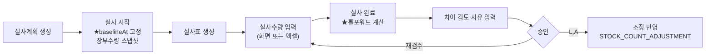
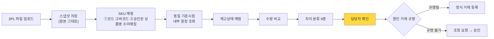
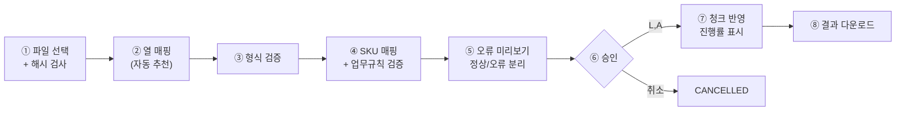

# DEEPPOINT SCM OS — 설계검토 06. API 설계 · 화면 및 사용자 흐름

---

# 10. API 설계

## 10.0 공통 규약

| 항목 | 규약 |
|---|---|
| Base | `/api` |
| 형식 | JSON. 요청·응답 모두 Zod 스키마로 검증 |
| 인증 | Supabase 세션 쿠키 → `ActorContext` |
| 목록 응답 | `{ items: T[], page, pageSize, total, hasNext }` |
| 오류 응답 | `{ errorCode, message, details?, requestId }` |
| **멱등성** | `Idempotency-Key` 헤더 지원 API는 표에 ✅ 표기. 동일 키 재요청 시 **기존 결과를 200으로 반환** |
| 상태 코드 | 200 조회·멱등재요청 / 201 생성 / 202 비동기 접수 / 400 검증 / 403 권한 / 404 없음 / 409 충돌 / 422 업무규칙 위반 |
| 권한 표기 | `S`=SCM 담당자 `L`=SCM 리더 `A`=관리자 `F`=재무 `E`=경영진 |
| **범용 원장 생성 API 없음** | `POST /api/inventory/transactions` 는 **제공하지 않는다** (재고 PRD §27.2). 도메인 서비스만 Posting 호출 |

## 10.1 인증 · 사용자 · 권한

| Method | URL | 목적 | 요청 | 응답 | 권한 | 주요 검증 | 멱등 |
|---|---|---|---|---|---|---|:-:|
| POST | `/api/auth/login` | 로그인 | `{email, password}` | `{user, roles}` + 세션쿠키 | 전체 | 계정 활성 | — |
| POST | `/api/auth/logout` | 로그아웃 | — | `204` | 인증 | | — |
| GET | `/api/me` | 내 정보·권한 | — | `{user, roles, permissions[]}` | 인증 | | — |
| GET | `/api/users` | 사용자 목록 | `q, role, active, page` | `User[]` | A | | — |
| POST | `/api/users` | 사용자 생성 | `{email, name, roleIds[]}` | `User` | A | 이메일 중복 | — |
| PATCH | `/api/users/{id}` | 수정 | `{name?, active?}` | `User` | A | 본인 비활성 차단 | — |
| PUT | `/api/users/{id}/roles` | 역할 배정 | `{roleIds[]}` | `User` | A | 역할 존재 | — |
| GET | `/api/roles` | 역할·권한 조회 | — | `Role[]` | A | | — |

## 10.2 공통코드

| Method | URL | 목적 | 요청 | 응답 | 권한 | 주요 검증 | 멱등 |
|---|---|---|---|---|---|---|:-:|
| GET | `/api/codes/{groupCode}` | 코드 목록 | `active?` | `CommonCode[]` | 전체 | | — |
| POST | `/api/codes/{groupCode}` | 코드 추가 | `{code, name, sortOrder, attributes?}` | `CommonCode` | A | 그룹 내 코드 중복 | — |
| PATCH | `/api/codes/{groupCode}/{code}` | 수정 | `{name?, active?}` | `CommonCode` | A | **사용 중 코드는 비활성만, 삭제 불가** | — |

## 10.3 SKU

| Method | URL | 목적 | 요청 | 응답 | 권한 | 주요 검증 | 멱등 |
|---|---|---|---|---|---|---|:-:|
| GET | `/api/skus` | 목록 | `q, status, itemType, brandId, majorCategoryId, minorCategoryId, hasBom, mappingStatus, hasIssue, page, sort` | `Sku[]` | 전체 | `q`는 코드·상품명·바코드·외부별칭 통합검색 | — |
| GET | `/api/skus/{id}` | 상세 | — | `SkuDetail`(바코드·매핑·공급조건·BOM 포함) | 전체 | | — |
| POST | `/api/skus` | 생성 | `CreateSkuDto` | `Sku` (DRAFT) | S,L,A | 코드 전역 중복, 필수값, 코드체계(**WARNING**) | ✅ |
| PATCH | `/api/skus/{id}` | 수정 | `UpdateSkuDto` | `Sku` | S,L,A | **`hasTransaction=true`면 `skuCode` 변경 차단** / ACTIVE는 제한 필드만 | — |
| POST | `/api/skus/{id}/submit` | 승인 요청 | `{note?}` | `Sku` (PENDING) | S,L,A | 승인 요청 전 검증 9종 (PRD §15.1) | — |
| POST | `/api/skus/{id}/approve` | 승인 | `{note?}` | `Sku` (ACTIVE) | L,A | 상태=PENDING, **작성자≠승인자** | — |
| POST | `/api/skus/{id}/reject` | 반려 | `{reason}` **필수** | `Sku` (REJECTED) | L,A | 사유 필수 | — |
| POST | `/api/skus/{id}/deactivate` | 사용중지 | `{reason}` | `Sku` (INACTIVE) | L,A | 활성 BOM 사용 중이면 경고 | — |
| POST | `/api/skus/{id}/archive` | 폐기 | `{reason}` | `Sku` (ARCHIVED) | A | **거래·BOM 사용 이력 0건일 때만** | — |
| GET | `/api/skus/{id}/history` | 변경이력 | `page` | `AuditLog[]` | 전체 | | — |
| POST | `/api/skus/{id}/suggest-code` | 코드 추천 | `{brandId, majorId, minorId}` | `{suggestedCode}` | S,L,A | **자동 저장하지 않음** (PRD §11.5) | — |
| POST | `/api/skus/import` | 대량 업로드 | `multipart` | `202 {jobId}` | S,L,A | 파일 해시 중복 경고 | ✅ |
| GET | `/api/skus/import/{jobId}` | 업로드 상태 | — | `ImportJob` + 진행률 | S,L,A | | — |

## 10.4 바코드

| Method | URL | 목적 | 요청 | 응답 | 권한 | 주요 검증 | 멱등 |
|---|---|---|---|---|---|---|:-:|
| GET | `/api/skus/{id}/barcodes` | 목록 | — | `SkuBarcode[]` | 전체 | | — |
| POST | `/api/skus/{id}/barcodes` | 추가 | `{barcode, barcodeType, isPrimary?, ...}` | `SkuBarcode` | S,L,A | **문자열 저장** / 공백·하이픈 제거 후 검증 / 활성 중복 차단 / `확인필요`·`확인불가`는 거부 후 DataIssue | ✅ |
| PATCH | `/api/skus/{id}/barcodes/{bid}` | 수정 | `{isPrimary?, status?, ...}` | `SkuBarcode` | S,L,A | SKU당 대표 1개 | — |
| DELETE | `/api/skus/{id}/barcodes/{bid}` | 비활성 | — | `SkuBarcode` (INACTIVE) | S,L,A | **물리삭제 아님** (PRD §33.2) | — |
| POST | `/api/skus/{id}/barcodes/{bid}/approve-duplicate` | 중복 예외 승인 | `{reason}` **필수** | `SkuBarcode` | L,A | 실제 중복 존재 확인 / 승인자·사유 기록 | — |

> ✏️ **2026-08-10 설계복구 (바코드 CRUD)**: 위 표의 POST `{barcode, barcodeType, isPrimary?, ...}` 와 PATCH `{isPrimary?, status?, ...}` 는 말줄임표로 끝나 나머지 필드가 확정되지 않았고, `DataIssue` 가 repository 에 존재하지 않아 T04-3 을 PRE-FLIGHT BLOCKED 로 보고했다. 계약은 **`10_설계복구_BarcodeCRUD.md`** 로 확정한다 — POST/PATCH 는 V1 최소 strict DTO, `barcode` 값은 생성 후 immutable, 대표 자동 교체 없음, DELETE 반복 호출은 idempotent 200, GET 은 pagination 없는 raw 배열(`ACTIVE`+`INACTIVE`, `createdAt DESC, id DESC`)이다.
>
> **"`확인필요`·`확인불가`는 거부 후 DataIssue"** 중 **DataIssue 생성 부분은 인터랙티브 CRUD 에 한해 supersede** 되었다(422 `BARCODE_UNVERIFIED` 로 거부만 한다). **import·마이그레이션 경로의 DataIssue 요구는 그대로 유효**하다.
>
> ✏️ **2026-08-10 설계복구 (중복 예외 승인)**: 위 `approve-duplicate` 행은 승인 대상 `{bid}` 후보의 생성 경로·상태를 정의하지 않아 T04-4 를 PRE-FLIGHT BLOCKED 로 보고했다. 계약은 **`11_설계복구_Barcode중복예외승인.md`** 로 확정한다 — 신규 `POST …/barcodes/duplicate-candidates` 가 `PENDING_DUPLICATE` 후보를 만들고, 이 endpoint 가 그것을 승인한다. `{reason}` 필수·권한 L,A 는 원문 그대로다.

## 10.5 외부 상품 매핑

| Method | URL | 목적 | 요청 | 응답 | 권한 | 주요 검증 | 멱등 |
|---|---|---|---|---|---|---|:-:|
| GET | `/api/external-mappings` | 목록 | `externalSystemId, skuId, mappingStatus, q, page` | `Mapping[]` | 전체 | | — |
| POST | `/api/external-mappings` | 생성 | `CreateMappingDto` | `Mapping` | S,L,A | 동일 시스템 내 외부코드 중복 차단 / 코드 없이 상품명만이면 `REVIEW_REQUIRED` 강제 | ✅ |
| PATCH | `/api/external-mappings/{id}` | 수정 | `{mappingStatus?, isPrimary?, effectiveTo?}` | `Mapping` | S,L,A | `MATCHED` 전환은 외부코드 또는 바코드 필수 | — |
| POST | `/api/external-mappings/import` | 대량 업로드 | `multipart` | `202 {jobId}` | S,L,A | | ✅ |
| GET | `/api/external-mappings/unmatched` | 미매칭 목록 | `externalSystemId, page` | `UnmatchedRow[]` | S,L,A | 스냅샷·업로드에서 발생한 미매칭 | — |

## 10.6 거래처 · 공급조건

| Method | URL | 목적 | 요청 | 응답 | 권한 | 주요 검증 | 멱등 |
|---|---|---|---|---|---|---|:-:|
| GET | `/api/suppliers` | 목록 | `q, supplierType, status, page` | `Supplier[]` | 전체 | | — |
| POST | `/api/suppliers` | 생성 | `CreateSupplierDto` | `Supplier` | S,L,A | 코드 중복 | ✅ |
| PATCH | `/api/suppliers/{id}` | 수정 | — | `Supplier` | S,L,A | | — |
| GET | `/api/suppliers/{id}/skus` | 공급 SKU | `page` | `SupplierSku[]` | 전체 | | — |
| POST | `/api/suppliers/{id}/skus` | 공급조건 등록 | `{skuId, supplyType, moq?, leadTimeDays?, ...}` | `SupplierSku` | S,L,A | 적용기간 중첩 차단 / **`leadTimeDays` null 허용, 0 대체 금지** / `isPrimary`는 SKU당 1개 | ✅ |
| PATCH | `/api/supplier-skus/{id}` | 수정 | — | `SupplierSku` | S,L,A | | — |
| GET | `/api/supplier-skus/{id}/prices` | 가격이력 | `asOf?` | `Price[]` | 전체+F | | — |
| POST | `/api/supplier-skus/{id}/prices` | 가격 등록 | `{unitPrice, currency, vatIncluded, effectiveFrom, sourceDocument?, attachmentId?}` | `Price` | S,L,A,F | 적용일 중복 차단 / 이전 가격 `effectiveTo` 자동 마감 | ✅ |
| POST | `/api/supplier-sku-prices/{id}/approve` | 가격 승인 | `{note?}` | `Price` | L,A,F | 작성자≠승인자 | — |

## 10.7 BOM

| Method | URL | 목적 | 요청 | 응답 | 권한 | 주요 검증 | 멱등 |
|---|---|---|---|---|---|---|:-:|
| GET | `/api/boms` | 목록 | `parentSkuId, status, bomType, effectiveOn, hasUnknownQty, page` | `BomHeader[]` | 전체 | | — |
| GET | `/api/boms/{id}` | 상세 | — | `BomDetail`(라인 포함) | 전체 | | — |
| POST | `/api/boms` | 생성 | `CreateBomDto` | `BomHeader` (DRAFT) | S,L,A | 상위 SKU 승인 상태 / `(parentSkuId, version)` 중복 | ✅ |
| PATCH | `/api/boms/{id}` | 수정 | `UpdateBomDto` | `BomHeader` | S,L,A | **`ACTIVE`는 수정 차단** (`BOM_ACTIVE_IMMUTABLE`) | — |
| POST | `/api/boms/{id}/lines` | 라인 추가 | `CreateLineDto` | `BomLine` | S,L,A | 상위≠구성품 / **소요량>0 또는 `quantityStatus=UNKNOWN`** / 중복 라인 / 순환 검사 | ✅ |
| PATCH | `/api/boms/{id}/lines/{lid}` | 라인 수정 | — | `BomLine` | S,L,A | ACTIVE 차단 / **`packQuantity`를 `quantityPer`로 자동 전환하지 않음** | — |
| DELETE | `/api/boms/{id}/lines/{lid}` | 라인 삭제 | — | `204` | S,L,A | DRAFT/REJECTED만 | — |
| POST | `/api/boms/{id}/lines/bulk-confirm-qty` | **소요량 일괄 확정** | `[{lineId, quantityPer}]` | `BomLine[]` | S,L,A | >0 / `quantityStatus → CONFIRMED` (§00 G-02) | ✅ |
| POST | `/api/boms/{id}/submit` | 승인 요청 | `{note?}` | `BomHeader` | S,L,A | **검증규칙 14종** (PRD §22). 소요량 미확정 라인 존재 시 차단 | — |
| POST | `/api/boms/{id}/approve` | 승인 | `{note?}` | `BomHeader` (APPROVED) | L,A | 작성자≠승인자 | — |
| POST | `/api/boms/{id}/reject` | 반려 | `{reason}` | `BomHeader` | L,A | 사유 필수 | — |
| POST | `/api/boms/{id}/activate` | 활성화 | `{effectiveFrom?}` | `BomHeader` (ACTIVE) | L,A | 상태=APPROVED / **동일 상위 SKU 활성 기간 중첩 차단** / 기존 ACTIVE 자동 `INACTIVE` | — |
| POST | `/api/boms/{id}/deactivate` | 사용종료 | `{effectiveTo, reason}` | `BomHeader` | L,A | | — |
| POST | `/api/boms/{id}/clone` | 복사 | `{newVersion, effectiveFrom, changeReason}` **필수** | `BomHeader` (DRAFT) | S,L,A | 변경사유 필수 | ✅ |
| GET | `/api/boms/{id}/explode` | **다단계 전개** | `qty=1, asOf?, maxLevel=10` | `ExplodedNode[]` | 전체 | 순환 감지 시 중단 + 오류 | — |
| GET | `/api/boms/{id}/cost` | 원가 조회 | `asOf` | `CostResult` | 전체+F | **기준일 유효 가격이력 사용.** 미확정 단가 존재 시 `isProvisional=true` | — |
| GET | `/api/skus/{id}/where-used` | 역전개 | — | `BomHeader[]` | 전체 | | — |
| POST | `/api/boms/import` | 대량 업로드 | `multipart` | `202 {jobId}` | S,L,A | **소요량 없으면 1 자동입력 금지** / 전량 DRAFT | ✅ |

## 10.8 창고

| Method | URL | 목적 | 요청 | 응답 | 권한 | 주요 검증 | 멱등 |
|---|---|---|---|---|---|---|:-:|
| GET | `/api/warehouses` | 목록 | `warehouseType, active` | `Warehouse[]` | 전체 | | — |
| POST | `/api/warehouses` | 생성 | `CreateWarehouseDto` | `Warehouse` | A | **DEFAULT 로케이션 자동 생성** (§00 G-05) | ✅ |
| PATCH | `/api/warehouses/{id}` | 수정 | — | `Warehouse` | A | 재고 존재 시 비활성 차단 | — |
| GET | `/api/warehouses/{id}/locations` | 로케이션 | — | `Location[]` | 전체 | | — |
| POST | `/api/warehouses/{id}/locations` | 추가 | `{locationCode, locationName, locationType?}` | `Location` | A | `(warehouseId, code)` 중복 | ✅ |

## 10.9 현재고 · 원장 · 수불부

| Method | URL | 목적 | 요청 | 응답 | 권한 | 주요 검증 | 멱등 |
|---|---|---|---|---|---|---|:-:|
| GET | `/api/inventory/balances` | 현재고 목록 | `skuIds, warehouseId, locationId, inventoryStatus, lotNo, expiryBefore, negativeOnly, includeZero, mismatchOnly, page` | `BalanceRow[]` | 전체 | | — |
| GET | `/api/inventory/balances/{skuId}` | SKU 현재고 | `warehouseId?` | `BalanceDetail`(상태별·LOT별) | 전체 | | — |
| GET | `/api/inventory/balances/as-of` | **기준일 재고** | `asOfDate` **필수**, `warehouseId, skuIds` | `BalanceRow[]` | 전체 | **balance 역산 금지 — 원장 집계 또는 스냅샷** | — |
| POST | `/api/inventory/balances/verify` | 정합성 검증 | `{warehouseId?}` | `202 {jobId}` | A | | ✅ |
| POST | `/api/inventory/balances/rebuild` | **캐시 재구축** | `{warehouseId?, reason}` **필수** | `202 {jobId}` | A | 재인증 필요. 재구축 전 백업 | ✅ |
| GET | `/api/inventory/transactions` | 거래 목록 | `businessDateFrom/To, transactionType, skuId, warehouseId, sourceDocumentType/No, externalTransactionId, status, page` | `Transaction[]` | 전체 | | — |
| GET | `/api/inventory/transactions/{id}` | 거래 상세 | — | `TransactionDetail`(원장행·원인문서·첨부·승인·취소이력) | 전체 | | — |
| POST | `/api/inventory/transactions/{id}/reverse` | **거래 취소** | `{reasonCode, reasonDetail}` **필수** | `Transaction` (REVERSAL) | L,A | 이미 REVERSED면 차단 / 마감월이면 관리자 승인 / 반대거래도 음수검증 | ✅ |
| GET | `/api/inventory/ledger` | 원장행 조회 | 위와 동일 + `lotNo, inventoryStatus` | `LedgerRow[]` (거래후잔량 **계산값** 포함) | 전체 | | — |
| GET | `/api/inventory/statements/daily` | 일별 수불부 | `dateFrom, dateTo, warehouseId, skuIds` | `StatementRow[]` | 전체 | | — |
| GET | `/api/inventory/statements/monthly` | 월별 수불부 | `yearMonth, warehouseId, skuIds` | `StatementRow[]` | 전체 | | — |
| GET | `/api/inventory/statements/period` | 기간 합계 | `dateFrom, dateTo, groupBy=sku\|warehouse\|channel\|purpose` | `StatementRow[]` | 전체 | | — |
| GET | `/api/inventory/statements/pivot` | **S&OP형 피벗** | `year, warehouseId` | `PivotRow[]` | 전체 | **조회 전용. 저장 테이블 아님** (재고 PRD §12.7) | — |
| GET | `/api/inventory/statements/export` | 엑셀 다운로드 | 위 파라미터 | `202 {jobId}` 또는 파일 | 전체 | | — |
| GET | `/api/inventory/projection` | 예상재고 | `skuIds, warehouseId, horizonDays` | `ProjectionRow[]` | 전체 | 확정/계획 분리 표시 | — |

## 10.10 기초재고

| Method | URL | 목적 | 요청 | 응답 | 권한 | 주요 검증 | 멱등 |
|---|---|---|---|---|---|---|:-:|
| POST | `/api/inventory/opening-balance/batches` | 배치 생성 | `{openingDate, warehouseId}` | `Batch` (DRAFT) | S,L,A | 동일 오픈일·창고 POSTED 배치 존재 시 차단 | ✅ |
| GET | `/api/inventory/opening-balance/batches` | 목록 | `status, warehouseId` | `Batch[]` | 전체 | | — |
| POST | `/api/.../batches/{id}/import` | 엑셀 업로드 | `multipart` | `202 {jobId}` | S,L,A | 파일 해시 중복 경고 | ✅ |
| POST | `/api/.../batches/{id}/validate` | 검증 | — | `{valid, errors[]}` | S,L,A | SKU 존재·활성 / 창고 / LOT 필수 / 배치 내 재고키 중복 / **음수 라인 별도 표시** | — |
| POST | `/api/.../batches/{id}/approve` | 승인 | `{note?}` | `Batch` (APPROVED) | L,A | 검증 통과 / 작성자≠승인자 | — |
| POST | `/api/.../batches/{id}/post` | **원장 반영** | — | `202 {jobId}` | L,A | 상태=APPROVED / `OPENING_BALANCE` 거래 생성 / **음수 라인은 관리자 예외 승인 필요** | ✅ |
| POST | `/api/.../batches/{id}/cancel` | 취소 | `{reason}` | `Batch` (CANCELLED) | L,A | POSTED는 취소 불가 → 반대거래 | — |

## 10.11 재고조정

| Method | URL | 목적 | 요청 | 응답 | 권한 | 주요 검증 | 멱등 |
|---|---|---|---|---|---|---|:-:|
| POST | `/api/inventory/adjustments` | 조정 생성 | `{adjustmentType, reasonCode, reasonDetail, businessDate, lines[], attachmentGroupId?}` | `Adjustment` (DRAFT) | S,L,A | 사유코드·상세사유 필수 / **LOT·창고 정정은 from·to 쌍 필수** | ✅ |
| GET | `/api/inventory/adjustments` | 목록 | `status, adjustmentType, dateFrom/To` | `Adjustment[]` | 전체 | | — |
| GET | `/api/inventory/adjustments/{id}` | 상세 | — | `AdjustmentDetail` | 전체 | | — |
| POST | `/api/.../adjustments/{id}/submit` | 승인 요청 | — | `Adjustment` (PENDING) | S,L,A | 증빙 필수 / 마감월·음수 시 `requiresAdminApproval=true` 설정 | — |
| POST | `/api/.../adjustments/{id}/approve` | 승인 | `{note?}` | `Adjustment` (APPROVED) | L,A | **요청자≠승인자 (override 불가)** | — |
| POST | `/api/.../adjustments/{id}/admin-approve` | 관리자 추가승인 | `{reason}` | `Adjustment` | A | `requiresAdminApproval=true`일 때만. **재인증** | — |
| POST | `/api/.../adjustments/{id}/reject` | 반려 | `{reason}` | `Adjustment` | L,A | 사유 필수 | — |
| POST | `/api/.../adjustments/{id}/post` | **원장 반영** | — | `Adjustment` (POSTED) | L,A | 상태=APPROVED / Posting Service 호출 | ✅ |

## 10.12 재고실사

| Method | URL | 목적 | 요청 | 응답 | 권한 | 주요 검증 | 멱등 |
|---|---|---|---|---|---|---|:-:|
| POST | `/api/inventory/counts` | 실사계획 생성 | `{warehouseId, scopeType, skuIds?, locationIds?}` | `Count` (DRAFT) | S,L,A | | ✅ |
| GET | `/api/inventory/counts` | 목록 | `status, warehouseId` | `Count[]` | 전체 | | — |
| POST | `/api/inventory/counts/{id}/start` | **실사 시작** | — | `Count` (IN_PROGRESS) | S,L,A | **`baselineAt` 고정 + 장부수량 스냅샷 생성** | — |
| POST | `/api/inventory/counts/{id}/import` | 실사수량 업로드 | `multipart` | `202 {jobId}` | S,L,A | | ✅ |
| PATCH | `/api/inventory/counts/{id}/lines/{lid}` | 수량 입력 | `{countedQty, differenceReason?}` | `CountLine` | S,L,A | ≥ 0 | — |
| POST | `/api/inventory/counts/{id}/complete` | 실사 완료 | — | `Count` (COUNT_COMPLETED) | S,L,A | **롤포워드 계산**: `netTxnSinceBaseline` 갱신 → `adjustmentQty` 산출 | — |
| POST | `/api/inventory/counts/{id}/approve` | 승인 | `{note?}` | `Count` (APPROVED) | L,A | 차이 사유 전부 입력 / 작성자≠승인자 | — |
| POST | `/api/inventory/counts/{id}/post` | **조정 반영** | — | `Count` (POSTED) + `Adjustment` | L,A | 상태=APPROVED / `STOCK_COUNT_ADJUSTMENT` 생성 / **승인 전 거래 생성 금지** | ✅ |

## 10.13 예약 · 홀딩 (R1은 홀딩만 실동작)

| Method | URL | 목적 | 요청 | 응답 | 권한 | 주요 검증 | 멱등 |
|---|---|---|---|---|---|---|:-:|
| POST | `/api/inventory/holds` | 홀딩 요청 | `{skuId, warehouseId, lotNo?, quantity, reasonCode, reasonDetail}` | `Hold` (REQUESTED) | S,L,A | 가용재고 ≥ 수량 / **프로모션 확보는 RESERVED 권장 안내** | ✅ |
| POST | `/api/inventory/holds/{id}/approve` | 홀딩 승인 | — | `Hold` (ACTIVE) + `STATUS_CHANGE` 거래 | L,A | `AVAILABLE −Q` / `HOLD +Q` | ✅ |
| POST | `/api/inventory/holds/{id}/release` | 홀딩 해제 | `{reason}` | `Hold` (RELEASED) + 거래 | L,A | `HOLD −Q` / `AVAILABLE +Q` | ✅ |
| GET | `/api/inventory/holds` | 목록 | `status, skuId, warehouseId` | `Hold[]` | 전체 | | — |
| *(내부)* | `reservationService.reserve()` | 예약 | — | — | — | **R1은 REST 미노출** (§00 C-04) | — |

## 10.14 월마감

| Method | URL | 목적 | 요청 | 응답 | 권한 | 주요 검증 | 멱등 |
|---|---|---|---|---|---|---|:-:|
| GET | `/api/inventory/closes` | 마감 목록 | `year` | `Close[]` | 전체+F | | — |
| GET | `/api/inventory/closes/{month}` | 마감 상세 | — | `CloseDetail`(창고별 검증 포함) | 전체+F | | — |
| POST | `/api/inventory/closes/{month}/validate` | **사전검증** | — | `202 {jobId}` → `ValidationResult` | L,A | **8종 검증**: 음수재고 / 미승인 조정 / 미완료 이동 / 대사차이 / 미매칭 SKU / 수불 검증차이 / 원인문서 없는 거래 / 취소대기 | ✅ |
| POST | `/api/inventory/closes/{month}/close` | **마감** | `{note?}` | `Close` (CLOSED) | L,A | 검증 FAIL 없음 / 이전 월 마감됨 / **마감 스냅샷 생성** | ✅ |
| POST | `/api/inventory/closes/{month}/reopen` | **마감 해제** | `{reason}` **필수** | `Close` (REOPENED) | **A만** | **재인증** / 이후 월이 마감되어 있으면 차단 / 사유·이력 필수 | — |

## 10.15 3PL 스냅샷 · 재고대사

| Method | URL | 목적 | 요청 | 응답 | 권한 | 주요 검증 | 멱등 |
|---|---|---|---|---|---|---|:-:|
| POST | `/api/inventory/external-snapshots/import` | 스냅샷 업로드 | `multipart` + `{externalSystemId, warehouseId, snapshotAt}` | `202 {jobId}` | S,L,A | 파일 해시 중복 / `(system, warehouse, snapshotAt)` 중복 | ✅ |
| GET | `/api/inventory/external-snapshots` | 목록 | `externalSystemId, warehouseId, dateFrom/To` | `Snapshot[]` | 전체 | | — |
| POST | `/api/inventory/reconciliations` | **대사 실행** | `{snapshotId, asOf?}` | `202 {jobId}` | S,L,A | 스냅샷 로드 완료 / 매핑 우선순위 4단계 | ✅ |
| GET | `/api/inventory/reconciliations` | 목록 | `warehouseId, dateFrom/To` | `Recon[]` | 전체+F | | — |
| GET | `/api/inventory/reconciliations/{id}` | 상세 | `differenceType, resolutionStatus, page` | `ReconLine[]` | 전체+F | | — |
| POST | `/api/.../reconciliations/{id}/assign` | 담당자 배정 | `{lineIds[], assignedTo}` | `ReconLine[]` | S,L,A | | — |
| POST | `/api/.../reconciliations/{id}/resolve` | 차이 해결 | `{lineIds[], resolutionNote}` | `ReconLine[]` | S,L,A | 사유 필수 | — |
| POST | `/api/.../reconciliations/{id}/request-adjustment` | **조정 요청** | `{lineIds[], reasonCode, reasonDetail}` | `Adjustment` (DRAFT) | S,L,A | **자동 반영 아님.** 조정 승인 절차를 거침 (재고 PRD §19.5) | ✅ |

## 10.16 데이터 업로드 · 이슈 · 예외 · 감사로그

| Method | URL | 목적 | 요청 | 응답 | 권한 | 주요 검증 | 멱등 |
|---|---|---|---|---|---|---|:-:|
| GET | `/api/imports` | 업로드 이력 | `importType, status, page` | `ImportJob[]` | 전체 | | — |
| GET | `/api/imports/{id}` | 상세·진행률 | — | `ImportJobDetail` | 전체 | | — |
| GET | `/api/imports/{id}/rows` | 행 조회 | `status(ERROR 등), page` | `ImportRow[]` | 전체 | | — |
| GET | `/api/imports/{id}/errors/export` | **오류행 다운로드** | — | xlsx | 전체 | 원본 컬럼 + `errorCode`·`errorMessage` | — |
| POST | `/api/imports/{id}/approve` | 반영 승인 | `{note?}` | `202 {jobId}` | L,A | 상태=REVIEW_REQUIRED | ✅ |
| POST | `/api/imports/{id}/cancel` | 취소 | `{reason}` | `ImportJob` (CANCELLED) | S,L,A | POSTING 중이면 차단 | — |
| GET | `/api/data-issues` | 데이터 오류 | `entityType, severity, status, page` | `DataIssue[]` | 전체 | | — |
| POST | `/api/data-issues/{id}/resolve` | 해결 | `{resolutionNote}` | `DataIssue` | S,L,A | | — |
| POST | `/api/data-issues/{id}/waive` | 면제 | `{reason}` | `DataIssue` | L,A | 사유 필수 | — |
| GET | `/api/inventory/exceptions` | 재고 예외 | `exceptionCode, severity, status, assignedTo, page` | `Exception[]` | 전체 | | — |
| PATCH | `/api/inventory/exceptions/{id}` | 배정·수정 | `{assignedTo?, dueDate?, status?}` | `Exception` | S,L,A | | — |
| POST | `/api/inventory/exceptions/{id}/resolve` | 해결 | `{resolutionNote}` | `Exception` | S,L,A | | — |
| POST | `/api/inventory/exceptions/{id}/waive` | 면제 | `{waiveReason}` | `Exception` | L,A | 사유 필수 + 승인자 기록 | — |
| GET | `/api/audit-logs` | 감사로그 | `entityType, entityId, actorId, action, dateFrom/To, page` | `AuditLog[]` | 전체(경영진 조회) | | — |
| GET | `/api/dashboard/inventory` | 재고 KPI | `asOf, warehouseId` | `DashboardKpi` | 전체 | | — |

---

# 11. 화면 및 사용자 흐름

## 11.0 전체 메뉴 구조

```text
DEEPPOINT SCM OS
├─ 대시보드                                   /dashboard
├─ 기준정보
│  ├─ SKU 관리        목록·상세·승인·외부매핑  /master/skus
│  ├─ BOM 관리        목록·상세·승인·전개·원가 /master/boms
│  ├─ 거래처 관리     공급업체·공급조건·가격   /master/suppliers
│  ├─ 창고 관리       창고·로케이션            /master/warehouses
│  └─ 공통코드                                 /master/codes
├─ 재고관리
│  ├─ 현재고 조회                              /inventory/balances
│  ├─ 재고거래원장                             /inventory/ledger
│  ├─ 수불부          일별·월별·기간·피벗      /inventory/statements
│  ├─ 예상재고                                 /inventory/projection
│  ├─ 기초재고                                 /inventory/opening-balance
│  ├─ 재고조정                                 /inventory/adjustments
│  ├─ 재고실사                                 /inventory/counts
│  ├─ 예약·홀딩                                /inventory/holds
│  ├─ 월마감                                   /inventory/closes
│  └─ 3PL 재고대사                             /inventory/reconciliations
├─ 데이터
│  ├─ 엑셀 업로드                              /data/imports
│  ├─ 데이터 오류                              /data/issues
│  └─ 재고 예외                                /data/exceptions
└─ 관리
   ├─ 사용자·권한                              /admin/users
   └─ 감사로그                                 /admin/audit-logs
```

## 11.1 로그인 `/login`

| 항목 | 내용 |
|---|---|
| 입력 | 이메일, 비밀번호 |
| 버튼 | 로그인, 비밀번호 재설정 |
| 상태변화 | 성공 → `/dashboard` / 실패 → 오류 메시지(5회 실패 시 잠금) |
| 권한 | 미인증 |
| 비고 | 비활성 계정은 로그인 차단. 로그인·실패 모두 감사로그 |

## 11.2 대시보드 `/dashboard` (`INV-DASH-001`)

| 구분 | 내용 |
|---|---|
| **필터** | 기준일, 창고, 브랜드, 품목구분, 재고상태, 담당자 |
| **KPI 카드** | 총보유재고 / 가용재고 / 예약재고 / 이동중재고 / 홀딩·불량재고 / **음수재고 건수** / **3PL 불일치 SKU 수** / 미매칭 외부 SKU 수 / 오늘 입고·출고 수량 / 마감 미완료 창고 수 |
| **예외 목록** (탭) | 음수재고 · 원인문서 없는 거래 · 3PL 수량 불일치 · 외부거래 중복 · 외부 SKU 미매칭 · 마감월 과거거래 요청 · 오래된 이동중 재고 · LOT/유통기한 누락 · 가용 초과 예약 요청 |
| **버튼** | 예외 상세 이동, 담당자 배정, 엑셀 다운로드 |
| **권한** | 전체 조회. 경영진은 KPI만(예외 목록 요약) |
| 비고 | **재고금액은 원가모듈 연결 전까지 표시하지 않는다** (재고 PRD §9.2) |

## 11.3 SKU 목록 `/master/skus` (`SKU-LIST-001`)

| 구분 | 내용 |
|---|---|
| **검색조건** | SKU 코드 / 상품명 / 바코드 / 기존 ERP 품번·상품명 / WMS·3PL 상품명 / 브랜드 / 품목구분 / 대분류 / 소분류 / 상태 / 재고관리 / LOT / 유통기한 / 시리얼 / 외부매핑 상태 / **데이터 오류 여부** / 등록일 / 수정일 <br> ※ 통합검색어는 코드·상품명·바코드·외부별칭을 한 번에 검색 |
| **목록 열** | 선택 / 상태 / SKU 코드 / 상품명 / 품목구분 / 브랜드 / 대분류 / 소분류 / 대표 바코드 / 기존 ERP 코드 / WMS 매핑(완료·일부·미완료) / BOM(활성 존재) / 재고관리 / 생성자 / 최종수정일 / **오류 건수** |
| **버튼** | 신규 SKU / 엑셀 업로드 / 엑셀 다운로드 / 승인 요청(일괄) / 사용중지(일괄) / 외부매핑 / **오류만 보기** |
| **정렬** | 기본 최근 수정일 ↓. SKU 코드·상품명·상태·브랜드·품목구분·등록일·수정일 |
| **상태변화** | 목록에서 승인요청(DRAFT→PENDING), 사용중지(ACTIVE→INACTIVE) |
| **권한** | 조회 전체 / 작성·승인요청 S,L,A / 사용중지 L,A |

## 11.4 SKU 상세·등록 `/master/skus/[id]` (`SKU-DETAIL-001`)

**탭 8개**: ① 기본정보 ② 코드·분류 ③ 바코드 ④ 외부시스템 매핑 ⑤ 재고관리 설정 ⑥ 공급조건 ⑦ BOM ⑧ 변경이력

| 탭 | 주요 항목 | 특이 규칙 |
|---|---|---|
| ① 기본정보 | SKU 코드, 표준 상품명, 영문명, 품목구분, 상태, 판매·구매·생산 가능, 단종예정일, 비고 | **`hasTransaction=true`면 SKU 코드 입력란 읽기전용 + 안내 배너** |
| ② 코드·분류 | 브랜드, 대분류, 소분류, 일련번호, 추가코드, ERP 구분 | 코드 추천 버튼 (자동 저장 안 함) |
| ③ 바코드 | 바코드, 타입, 대표, 국가·채널, 적용기간, 상태, 중복예외 | **중복 감지 시 인라인 경고 + 예외 승인 요청 버튼**(L,A만 승인) |
| ④ 외부매핑 | 외부시스템, 외부코드, 외부상품명, 창고, 매핑상태, 대표 | **외부 상품명이 표준 상품명을 덮어쓰지 않음을 UI로 명시** |
| ⑤ 재고관리 | 재고관리·LOT·유통기한·시리얼·음수허용, 기본/구매/입출고 단위, 환산, 기본 유통기한, 최소 잔여기간, 대사 허용오차 | **음수허용 토글은 A만** + 사유 필수 |
| ⑥ 공급조건 | 공급업체별 SKU 목록, MOQ, 리드타임, 사급/턴키, 우선공급업체, 최근 단가 | **리드타임 미입력은 `—`로 표시(0 아님)** |
| ⑦ BOM | 이 SKU가 상위인 BOM 목록 + 구성품으로 쓰이는 BOM(역전개) | 링크만 |
| ⑧ 변경이력 | 감사로그 타임라인 | 변경 전/후 diff |

**하단 액션 바**: 저장 / 승인 요청 / 승인 / 반려 / 사용중지 / 폐기 (상태·권한에 따라 노출)

## 11.5 SKU 승인 대기함 `/master/skus/approvals`

| 구분 | 내용 |
|---|---|
| 목록 열 | SKU 코드 / 상품명 / 품목구분 / 요청자 / 요청일 / 검증 결과(통과·경고) / 미해소 이슈 |
| 버튼 | 승인 / 반려(사유 필수) / 수정 요청 / **바코드 중복 예외 승인** / **코드체계 예외 승인** |
| 상태변화 | PENDING → ACTIVE / REJECTED |
| 권한 | **L, A만** |

## 11.6 외부 상품 매핑 `/master/external-mappings`

| 구분 | 내용 |
|---|---|
| 검색조건 | 외부시스템 / 매핑상태(MATCHED·UNMATCHED·REVIEW_REQUIRED) / SKU 코드·상품명 / 외부코드·외부상품명 / 창고 |
| 목록 열 | 외부시스템 / 외부코드 / 외부상품명 / → / SKU 코드 / 표준 상품명 / 매핑상태 / 대표 / 적용기간 / 최종수정 |
| 버튼 | 신규 매핑 / 엑셀 업로드 / **미매칭만 보기** / 일괄 매핑(SKU 선택) / 매핑 해제 |
| 상태변화 | `REVIEW_REQUIRED` → `MATCHED` (외부코드·바코드 확보 시에만) |
| 권한 | 조회 전체 / 작성 S,L,A |
| 비고 | **상품명 기반 매핑은 배지로 표시**하고, 자동 원장 반영 불가임을 명시 |

## 11.7 BOM 목록 `/master/boms` (`BOM-LIST-001`)

| 구분 | 내용 |
|---|---|
| 검색조건 | 상위 SKU / 상위 상품명 / 브랜드 / BOM 유형 / 버전 / 상태 / 적용 시작일·종료일 / 제조사 / 공용 부자재 포함 / 구성품 SKU / 승인자 / 최근 수정일 / **소요량 미확정 포함** |
| 목록 열 | 상태 / 상위 SKU / 상위 상품명 / BOM 유형 / 버전 / 적용 시작일 / 적용 종료일 / 구성품 수 / 기준원가 / **미확정 항목 수** / 승인자 / 수정일 |
| 버튼 | 신규 BOM / 기존 BOM 복사 / 버전 생성 / 승인 요청 / 활성화 / 사용종료 / 엑셀 업로드 / BOM 전개 / 원가조회 |
| 상태변화 | DRAFT→PENDING→APPROVED→ACTIVE→INACTIVE |
| 권한 | 작성 S,L,A / 승인·활성화 **L,A** |

## 11.8 BOM 상세 `/master/boms/[id]`

| 구분 | 내용 |
|---|---|
| 헤더 | 상위 SKU, BOM 유형, 버전, 상태, 기준수량·단위, 적용기간, 조립·생산처, 기본 입고처, 전체 로스율, 변경사유 |
| 라인 그리드 | 순번 / 구성품 SKU / 상품명 / **소요량** / **소요량 상태(확정·추천·미확정)** / 단위 / 로스율 / 실제 필요량(계산) / 구성품 유형 / 공급유형 / 대체그룹 / 필수 / 투입창고 / **입수량** / 상세사양 / 비고 |
| **소요량 확정 UX** | ① `UNKNOWN` 행은 **빨간 배경** ② 입수량이 있으면 `1/입수량` **추천값 표시(회색)** ③ 추천값 수락 버튼 ④ **일괄 확정 모드**(그리드 편집 + 저장) ⑤ 진행률 바(`확정 N / 전체 M`) |
| **활성 BOM** | 전체 읽기전용 + 상단 배너 *"활성 BOM은 수정할 수 없습니다. 새 버전을 생성하세요."* + `버전 생성` 버튼 |
| 탭 | 구성품 / 전개(트리) / 원가 / 변경이력 |
| 전개 탭 | 레벨 / 상위 SKU / 구성품 SKU / 누적 소요량 / 단위 / 공급유형 / 공급업체 / 현재 유효단가 / 누적원가 |
| 원가 탭 | 기준일 선택 → 구성품별 단가·소요량·라인원가·비중·미확정 여부. **미확정 존재 시 전체 원가에 `잠정` 배지** |
| 버튼 | 저장 / 라인 추가·삭제 / 승인 요청 / 승인 / 반려 / 활성화 / 사용종료 / 복사 / 전개 / 원가조회 |

## 11.9 현재고 `/inventory/balances` (`INV-BAL-001`)

| 구분 | 내용 |
|---|---|
| 검색조건 | 기준일시 / SKU 코드 / 상품명 / 바코드 / 외부 상품코드 / 브랜드 / 품목구분 / 창고 / 로케이션 / 재고상태 / LOT / 유통기한 / **음수재고만** / 0재고 포함 / **3PL 불일치만** |
| 목록 열 | SKU 코드 / 상품명 / 품목구분 / 창고 / 로케이션 / LOT / 유통기한 / **가용** / 예약 / 출고대기 / 홀딩 / 검수대기 / 불량 / 이동중 / **실물재고** / **총보유재고** / 3PL 현재고 / **차이** / 최근 거래일시 / 예외상태 |
| 버튼 | SKU 상세 / **거래원장 보기** / 3PL 대사 보기 / 재고조정 요청 / 홀딩 요청 / 엑셀 다운로드 |
| **금지** | ⛔ **수량 셀 직접 편집 불가.** 인라인 편집 UI를 제공하지 않는다 (재고 PRD §10.4) |
| 기준일 조회 | 과거 기준일 선택 시 **원장 집계 또는 스냅샷** 사용. 화면에 *"기준일 재고(원장 집계)"* 라벨 표시 |
| 권한 | 조회 전체 / 조정·홀딩 요청 S,L,A |

## 11.10 재고거래원장 `/inventory/ledger` (`INV-LEDGER-001`)

| 구분 | 내용 |
|---|---|
| 검색조건 | 업무 발생일 / 원장 반영일 / 거래번호 / 거래유형 / SKU / 창고 / 로케이션 / 재고상태 / LOT / 원인문서 유형·번호 / 외부시스템 / 외부거래 ID / 사용자 / **취소거래 여부** / **예외거래 여부** |
| 목록 열 | 거래번호 / 원장행번호 / 업무발생일시 / 반영일시 / SKU / 상품명 / 창고 / 로케이션 / 상태 / LOT / 유통기한 / 거래유형 / **증감수량** / **거래 후 잔량(계산값)** / 원본수량 / 원본단위 / 원인문서 / 외부거래 ID / 등록자 / 승인자 / 취소 원거래 / 비고 |
| 상세 패널 | 거래 헤더 / 원장행 전체 / 원인문서 링크 / 외부 원본 데이터(JSON) / 첨부파일 / 승인내역 / 변경·취소 이력 / 관련 예외 |
| 버튼 | **거래 취소**(사유 필수) / 원인문서 열기 / 엑셀 다운로드 |
| 상태변화 | 취소 실행 → `REVERSAL` 거래 생성 + 원거래 `REVERSED` |
| 권한 | 조회 전체 / **취소 L,A** |
| 비고 | 취소된 거래는 **취소선 + 배지**로 표시하되 행은 그대로 남긴다. `거래 후 잔량`은 윈도우 함수 계산값이며 저장값이 아님을 툴팁으로 안내 |

## 11.11 수불부 `/inventory/statements` (`INV-STATEMENT-001`)

| 구분 | 내용 |
|---|---|
| 조회 단위 탭 | 일별 / 월별 / 기간합계 / **S&OP형 피벗** |
| 그룹 기준 | SKU별 / 창고별 / 거래유형별 / 채널별 / 출고목적별 |
| 검색조건 | 기간 / 창고 / SKU / 브랜드 / 품목구분 / 채널 / 출고목적 |
| 목록 열 | SKU 코드 / 상품명 / 창고 / **기초재고** / 입고합계 / 구매입고 / 반품입고 / 이동입고 / 기타입고 / **출고합계** / B2C / B2B / 마케팅 / CS / 샘플 / 이동출고 / 기타출고 / 순조정 / **기말재고** / **검증차이** |
| 검증 | `검증차이 = 기초 + 입고 − 출고 + 순조정 − 기말`. **0이 아니면 빨간 배지 + 예외 링크** |
| 버튼 | 엑셀 다운로드 / 원장 드릴다운(셀 클릭) |
| 피벗 탭 | `SKU 행 × 월 열 × (출고목적·입고·조정·마감재고)` — 기존 S&OP 사용자 적응용. **조회 전용임을 배너로 명시** |
| 권한 | 조회 전체 |

## 11.12 기초재고 `/inventory/opening-balance` (`INV-OPEN-001`)


| 구분 | 내용 |
|---|---|
| 목록 열 | 배치번호 / 기준일 / 창고 / 상태 / 라인수 / 오류수 / **음수 라인수** / 총수량 / 작성자 / 승인자 / 반영일시 |
| 라인 항목 | 기준일시 / 창고 / SKU / 재고상태 / 수량 / 단위 / LOT / 제조일 / 유통기한 / 시리얼 / **원본파일** / **원본행번호** / 비고 |
| 버튼 | 배치 생성 / 엑셀 업로드 / 양식 다운로드 / 검증 / 미리보기 / 승인 / **반영** / 취소 / 오류행 다운로드 |
| 상태변화 | DRAFT → VALIDATING → REVIEW → APPROVED → **POSTED**(수정 불가) |
| 제약 | 동일 오픈일·창고 중복 배치 차단 / POSTED 후 직접 수정 불가(반대거래) / 오픈일 이전 일반거래 입력 차단 |
| **음수 라인** | 별도 탭으로 분리 표시 + **관리자 예외 승인 없이는 반영 불가** (§00 D-05) |
| 권한 | 작성 S,L,A / 승인·반영 **L,A** |

## 11.13 재고조정 `/inventory/adjustments` (`INV-ADJ-001`)

| 구분 | 내용 |
|---|---|
| 조정 유형 | 수량증가 / 수량감소 / 상태변경 / LOT 변경 / 유통기한 변경 / 창고·로케이션 정정 |
| 필수항목 | 조정사유코드 / 상세사유 / SKU / 창고 / **현재 재고키** / **변경 재고키** / 조정수량 / **증빙파일** / 요청자 / 승인자 |
| 라인 UI | LOT·유통기한·창고 정정은 **좌(변경 전) → 우(변경 후) 2열 대조 폼**. 단순 필드 수정 UI를 제공하지 않아 버킷 이동임을 시각적으로 강제 |
| 목록 열 | 조정번호 / 유형 / 사유 / 상태 / 업무일자 / 라인수 / 총 조정수량 / 요청자 / 승인자 / **관리자승인 필요** / 반영일시 |
| 버튼 | 신규 조정 / 승인 요청 / 승인 / **관리자 추가승인** / 반려 / **반영** / 증빙 첨부 |
| 상태변화 | DRAFT → PENDING → APPROVED (→ 관리자승인) → **POSTED** |
| 승인기준 | 단순 상태변경·수량조정 = **L** / 마감월 조정·음수 유발·대량 업로드 = **A 추가승인** |
| 권한 | 요청 S,L,A / 승인 **L,A** (요청자≠승인자, override 불가) / 관리자승인 **A**(재인증) |

## 11.14 재고실사 `/inventory/counts` (`INV-COUNT-001`)



| 구분 | 내용 |
|---|---|
| 목록 열 | 실사번호 / 창고 / 범위 / **기준시점** / 상태 / 대상 SKU수 / 차이 건수 / 총 차이수량 / 작성자 / 승인자 |
| 라인 열 | SKU / 상품명 / 로케이션 / 상태 / LOT / 유통기한 / **기준시점 장부수량** / **실사수량** / **기준시점 이후 순거래** / **조정필요수량** / 차이사유 |
| 계산 | `조정필요수량 = 실사수량 − 기준시점 장부수량 − 기준시점 이후 순거래수량` |
| 버튼 | 실사계획 생성 / **실사 시작** / 실사표 다운로드 / 실사수량 업로드 / 완료 / 재검수 / 승인 / **반영** |
| 상태변화 | DRAFT → IN_PROGRESS → COUNT_COMPLETED → REVIEW_REQUIRED → APPROVED → **POSTED** |
| 제약 | **승인 전 조정거래 생성 금지** / 차이 사유 전부 입력해야 승인 가능 / 모바일 웹에서 바코드 스캔 입력 지원 |
| 권한 | 작성 S,L,A / 승인·반영 **L,A** |

## 11.15 월마감 `/inventory/closes` (`INV-CLOSE-001`)

| 구분 | 내용 |
|---|---|
| 화면 | 월별 카드 그리드 (12개월). 각 카드 = 상태 / 마감일시 / 마감자 / 검증 결과 요약 |
| 사전검증 8종 | ① 음수재고 ② 미승인 재고조정 ③ 미완료 창고이동 ④ 미처리 입출고 대사차이 ⑤ 미매칭 외부 SKU ⑥ **수불 검증차이** ⑦ 원인문서 없는 거래 ⑧ 취소대기 거래 |
| 창고별 진행 | 창고별 검증 상태(PASS·WARN·FAIL) 테이블 |
| 버튼 | **사전검증 실행** / **마감** / **마감 해제** / 검증결과 다운로드 / 마감 스냅샷 조회 |
| 상태변화 | OPEN → VALIDATING → **CLOSED** → (REOPENED) |
| 마감 효과 | 해당 월 `businessDate` 거래 입력·취소·조정 **차단** / 마감 스냅샷 생성 / 검증보고 저장 |
| 마감 해제 | **관리자만** + **재인증** + 사유 필수 + 이후 월이 마감돼 있으면 차단 + 변경거래 목록 표시 |
| 권한 | 조회 전체+F / 마감 **L,A** / **해제 A만** |

## 11.16 3PL 재고대사 `/inventory/reconciliations` (`INV-RECON-001`)



| 구분 | 내용 |
|---|---|
| 검색조건 | 창고 / 외부시스템 / 기준시점 / 차이유형 / 처리상태 / 담당자 / SKU |
| 목록 열 | SKU / 상품명 / 외부 상품코드·상품명 / 창고 / 재고상태 / LOT / **내부수량** / **외부수량** / **차이** / **차이유형** / 처리상태 / 담당자 / 조정요청 |
| 차이유형 | MATCHED / TIMING_DIFFERENCE / SKU_UNMATCHED / STATUS_MAPPING_DIFFERENCE / INTERNAL_TRANSACTION_MISSING / EXTERNAL_TRANSACTION_MISSING / QUANTITY_DIFFERENCE / LOT_DIFFERENCE / REVIEW_REQUIRED |
| 버튼 | 스냅샷 업로드 / **대사 실행** / 담당자 배정 / 차이 해결(사유 필수) / **조정 요청** / 엑셀 다운로드 |
| **금지** | ⛔ **"차이 자동 반영" 버튼을 만들지 않는다.** 조정은 반드시 조정 승인 절차를 거친다 (재고 PRD §19.5) |
| 권한 | 처리 S,L,A / 조회 +F |

## 11.17 엑셀 업로드 `/data/imports`



| 구분 | 내용 |
|---|---|
| 지원 유형 | SKU / BOM / 외부매핑 / 공급조건·가격 / 기초재고 / 3PL 현재고 / 3PL 입출고 실적(R3) / 재고실사 |
| 목록 열 | 잡번호 / 유형 / 파일명 / 상태 / 총행/정상/오류/반영 / 진행률 / 업로더 / 승인자 / 업로드일시 |
| 상세 | 열 매핑 UI / 오류행 그리드(원본 데이터 + 오류코드·메시지) / 진행률 바 |
| 버튼 | 파일 업로드 / 양식 다운로드 / 검증 / **반영 승인** / 취소 / **오류행 다운로드** |
| 상태변화 | UPLOADED → PARSING → VALIDATING → REVIEW_REQUIRED → READY_TO_POST → POSTING → COMPLETED / PARTIALLY_COMPLETED / FAILED / CANCELLED |
| 중복 방지 | 동일 해시 파일 재업로드 시 **경고 모달** + 강행 시 사유 필수 |
| 권한 | 업로드 S,L,A / **반영 승인 L,A** |

## 11.18 데이터 오류 `/data/issues` · 재고 예외 `/data/exceptions`

| 구분 | 데이터 오류 (`DataIssue`) | 재고 예외 (`InventoryException`) |
|---|---|---|
| 대상 | SKU / BOM / 매핑 / 거래처 | 재고 원장·대사·업로드 |
| 검색조건 | 엔티티 유형 / 이슈코드 / 심각도 / 상태 | 예외코드 / 심각도 / 상태 / 담당자 / SKU / 창고 / 처리기한 |
| 목록 열 | 이슈코드 / 심각도 / 대상 / 설명 / 상태 / 발생일 / 처리자 / 처리일 | 예외코드 / 심각도 / SKU / 창고 / 관련 거래 / 발견일시 / 담당자 / **처리기한** / 상태 |
| 버튼 | 해결 / **면제(사유 필수)** / 대상 이동 | 담당자 배정 / 해결 / **면제(사유+승인자)** / 관련 거래 열기 |
| 상태변화 | OPEN → RESOLVED / WAIVED | OPEN → ASSIGNED → IN_PROGRESS → RESOLVED / WAIVED → REOPENED |
| 권한 | 해결 S,L,A / 면제 **L,A** | 동일 |

## 11.19 감사로그 `/admin/audit-logs`

| 구분 | 내용 |
|---|---|
| 검색조건 | 엔티티 유형 / 엔티티 ID / 액션 / 변경자 / 기간 / 승인자 / 요청 ID |
| 목록 열 | 일시 / 엔티티 유형 / 대상(링크) / 액션 / 변경자 / 승인자 / 사유 / 세션·IP |
| 상세 | 변경 전/후 **JSON diff 뷰** |
| 버튼 | 엑셀 다운로드 / 대상 엔티티 열기 |
| **금지** | ⛔ 삭제·수정 UI 없음 |
| 권한 | 조회 전체 (경영진 포함). 다운로드는 L,A |

## 11.20 화면별 권한 요약

| 화면 | S | L | A | F | E |
|---|:-:|:-:|:-:|:-:|:-:|
| 대시보드 | R | R | R | R | R |
| SKU 목록·상세 | RW | RW | RW | R | R |
| SKU 승인 | — | ✅ | ✅ | — | — |
| 외부 상품 매핑 | RW | RW | RW | R | — |
| BOM 목록·상세 | RW | RW | RW | R | R |
| BOM 승인·활성화 | — | ✅ | ✅ | — | — |
| 거래처·공급조건 | RW | RW | RW | R | — |
| 가격이력 등록 | RW | RW | RW | RW | — |
| 가격 승인 | — | ✅ | ✅ | ✅ | — |
| 현재고 | R | R | R | R | R |
| 재고거래원장 | R | R | R | R | R |
| **거래 취소** | — | ✅ | ✅ | — | — |
| 수불부 | R | R | R | R | R |
| 기초재고 작성 | RW | RW | RW | — | — |
| 기초재고 승인·반영 | — | ✅ | ✅ | — | — |
| 재고조정 요청 | RW | RW | RW | — | — |
| 재고조정 승인 | — | ✅ | ✅ | — | — |
| **마감월 조정 승인** | — | — | ✅ | — | — |
| 재고실사 작성 | RW | RW | RW | — | — |
| 재고실사 승인 | — | ✅ | ✅ | — | — |
| 월마감 | — | ✅ | ✅ | R | — |
| **마감 해제** | — | — | ✅ | R | — |
| 3PL 대사 처리 | RW | RW | RW | R | — |
| 엑셀 업로드 | RW | RW | RW | — | — |
| **업로드 반영 승인** | — | ✅ | ✅ | — | — |
| 데이터 오류·예외 | RW | RW | RW | R | — |
| 감사로그 | R | R | R | R | R |
| 사용자·권한 | — | — | RW | — | — |
| **마이그레이션 실행** | — | — | ✅ | — | — |

`R`=조회 `RW`=조회+작성 `✅`=승인/실행 권한 `—`=접근 불가
