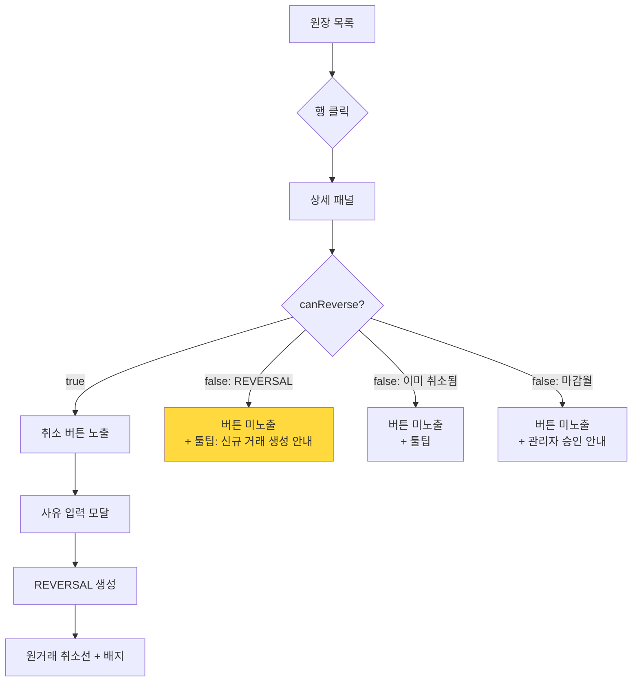
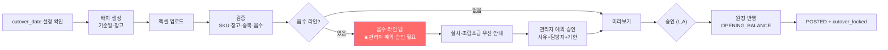

# DEEPPOINT SCM OS — 설계검토 06. API 설계 · 화면 및 사용자 흐름 **(v0.2)**

> **v0.1 대비 변경** — ✏️ 표기
> ① **`REVERSAL_OF_REVERSAL_NOT_ALLOWED`** — 취소 API·화면 (C-14)
> ② **`system_setting` API 신설** — `cutover_date`, **`allow_self_approval_sku` / `allow_self_approval_bom`** (D-01, D-07)
> ③ **`INSUFFICIENT_STOCK` 응답에 재고키 합산 정보** 포함 (C-13)
> ④ **기초재고 음수 라인 전용 탭 + 관리자 예외 승인** (D-05)
> ⑤ SKU·BOM 업로드는 **동기 처리** (R1a-1/R1a-3), 3PL·기초재고는 비동기 (R1a-4)
> ⑥ 창고 API에 15종 시드 반영 (D-02)

---

# 10. API 설계

## 10.0 공통 규약

| 항목 | 규약 |
|---|---|
| Base | `/api` |
| 형식 | JSON. 요청·응답 모두 Zod 검증 |
| 인증 | Supabase 세션 쿠키 → `ActorContext` |
| 목록 응답 | `{ items, page, pageSize, total, hasNext }` |
| 오류 응답 | `{ errorCode, message, details?, hint?, requestId }` |
| **멱등성** | `Idempotency-Key` 헤더 지원 API는 ✅ 표기 |
| 상태 코드 | 200 조회·멱등재요청 / 201 생성 / **202 비동기 접수** / 400 검증 / 403 권한 / 404 없음 / 409 충돌 / 422 업무규칙 위반 |
| 권한 | `S`=SCM 담당자 `L`=SCM 리더 `A`=관리자 `F`=재무 `E`=경영진 |
| **범용 원장 생성 API 없음** | `POST /api/inventory/transactions` **미제공** |
| ✏️ **동기 vs 비동기** | SKU·BOM·매핑 업로드(수백 행) = **동기 200/201** / 3PL 스냅샷·기초재고·마이그레이션(수천~수만 행) = **비동기 202 + jobId** |

## 10.1 ✏️ 시스템 설정 (신설)

| Method | URL | 목적 | 요청 | 응답 | 권한 | 주요 검증 | 멱등 |
|---|---|---|---|---|---|---|:-:|
| GET | `/api/settings` | 전체 설정 조회 | — | `SystemSetting[]` | A (일부는 전체) | | — |
| GET | `/api/settings/{key}` | 단건 조회 | — | `SystemSetting` | 전체 | | — |
| PATCH | `/api/settings/{key}` | 설정 변경 | `{value, reason}` | `SystemSetting` | **A** | `locked=true`면 차단 / **재인증** / 감사로그 | — |
| POST | `/api/settings/cutover-date` | **전환 기준일 설정** | `{date, reason}` | `SystemSetting` | **A** | **월초(1일)만 허용** / `cutover_locked=true`면 차단 / 재인증 | — |
| POST | `/api/settings/cutover-date/lock` | 전환일 잠금 | — | `SystemSetting` | **A** | 기초재고 반영 완료 시 자동 호출 | — |
| POST | `/api/settings/cutover-date/unlock` | 잠금 해제 | `{reason}` **필수** | `SystemSetting` | **A** | 재인증 + 사유 + 감사로그 | — |

**주요 설정 키**

| 키 | 타입 | 기본 | 설명 |
|---|---|---|---|
| `cutover_date` | DATE | **NULL** | 전환 기준일. UAT 완료 후 설정. **코드 하드코딩 금지 (D-01)** |
| `cutover_locked` | BOOLEAN | `false` | 기초재고 반영 후 `true` |
| `allow_self_approval_sku` | BOOLEAN | `false` | **SKU** 자가승인 (D-07) |
| `allow_self_approval_bom` | BOOLEAN | `false` | **BOM** 자가승인 (D-07) |
| `self_approval_scope` | JSON | `{}` | 엔티티별 override 맵 |
| `posting_frozen` | BOOLEAN | `false` | balance 재구축 중 Posting 차단 |

> ⛔ **두 설정이 `true`여도 다음 3종은 항상 분리된다** (코드 하드코딩, ADMIN 예외 없음): 재고조정 승인 / 음수재고 예외 승인 / 월마감 해제.

## 10.2 인증 · 사용자 · 권한

| Method | URL | 목적 | 요청 | 응답 | 권한 | 주요 검증 | 멱등 |
|---|---|---|---|---|---|---|:-:|
| POST | `/api/auth/login` | 로그인 | `{email, password}` | `{user, roles}` + 쿠키 | 전체 | 계정 활성 | — |
| POST | `/api/auth/logout` | 로그아웃 | — | `204` | 인증 | | — |
| POST | `/api/auth/reauth` | **재인증** | `{password}` | `{reauthToken}` (5분) | 인증 | 마감해제·설정변경·마이그레이션에 필요 | — |
| GET | `/api/me` | 내 정보·권한 | — | `{user, roles, permissions[]}` | 인증 | | — |
| GET | `/api/users` | 사용자 목록 | `q, role, active, page` | `User[]` | A | | — |
| POST | `/api/users` | 생성 | `{email, name, roleIds[]}` | `User` | A | 이메일 중복 | — |
| PATCH | `/api/users/{id}` | 수정 | `{name?, active?}` | `User` | A | 본인 비활성 차단 | — |
| PUT | `/api/users/{id}/roles` | 역할 배정 | `{roleIds[]}` | `User` | A | 역할 존재 | — |
| GET | `/api/roles` | 역할·권한 | — | `Role[]` | A | | — |

## 10.3 공통코드

| Method | URL | 목적 | 권한 | 주요 검증 |
|---|---|---|---|---|
| GET | `/api/codes/{groupCode}` | 코드 목록 | 전체 | |
| POST | `/api/codes/{groupCode}` | 코드 추가 | A | 그룹 내 중복 |
| PATCH | `/api/codes/{groupCode}/{code}` | 수정 | A | **사용 중 코드는 비활성만, 삭제 불가** |

## 10.4 SKU

| Method | URL | 목적 | 요청 | 응답 | 권한 | 주요 검증 | 멱등 |
|---|---|---|---|---|---|---|:-:|
| GET | `/api/skus` | 목록 | `q, status, itemType, brandId, majorCategoryId, minorCategoryId, hasBom, mappingStatus, hasIssue, page, sort` | `Sku[]` | 전체 | `q`는 코드·상품명·바코드·외부별칭 통합검색 | — |
| GET | `/api/skus/{id}` | 상세 | — | `SkuDetail` | 전체 | | — |
| POST | `/api/skus` | 생성 | `CreateSkuDto` | `Sku`(DRAFT) | S,L,A | 코드 전역 중복 / 필수값 / ✏️ **코드체계 위반은 WARNING (D-06)** | ✅ |
| PATCH | `/api/skus/{id}` | 수정 | `UpdateSkuDto` | `Sku` | S,L,A | **`hasTransaction=true`면 `skuCode` 변경 차단** | — |
| POST | `/api/skus/{id}/submit` | 승인 요청 | `{note?}` | `Sku`(PENDING) | S,L,A | 승인 전 검증 9종 | — |
| POST | `/api/skus/{id}/approve` | 승인 | `{note?}` | `Sku`(ACTIVE) | L,A | 상태=PENDING / ✏️ **`allow_self_approval_sku` 설정 적용 (D-07)** | — |
| POST | `/api/skus/{id}/reject` | 반려 | `{reason}` **필수** | `Sku` | L,A | 사유 필수 | — |
| POST | `/api/skus/{id}/deactivate` | 사용중지 | `{reason}` | `Sku` | L,A | 활성 BOM 사용 시 경고 | — |
| POST | `/api/skus/{id}/archive` | 폐기 | `{reason}` | `Sku` | A | **거래·BOM 이력 0건일 때만** | — |
| GET | `/api/skus/{id}/history` | 변경이력 | `page` | `AuditLog[]` | 전체 | | — |
| POST | `/api/skus/{id}/suggest-code` | 코드 추천 | `{brandId, majorId, minorId}` | `{suggestedCode}` | S,L,A | **자동 저장 안 함** | — |
| ✏️ POST | `/api/skus/import` | **동기 업로드** | `multipart` | **`200 {created, errors[], warnings[]}`** | S,L,A | 파일 해시 중복 경고 / **490행 30초 이내** | ✅ |
| POST | `/api/skus/import/validate` | 검증만 (미리보기) | `multipart` | `{valid[], errors[]}` | S,L,A | 반영하지 않음 | — |

> ✏️ **`/api/skus/import` 가 202가 아닌 200인 이유**: R1a-1 시점에는 pg-boss 워커가 없다. 490행은 단일 요청에서 5~15초에 완결되므로 동기 처리가 적절하다. **`ImportJob`/`ImportRow` 레코드는 동일하게 생성**해 이력·오류행 다운로드를 지원하고, R1a-4에서 비동기로 전환할 때 검증 로직을 재사용한다.
>
> ✏️ **2026-08-09 설계복구**: 위 표의 "승인 전 검증 9종"의 원문(SKU·BOM 상세 PRD v0.1 §15.1)이 repository 에 존재하지 않아, 목록을 **`08_설계복구_승인전검증9종.md`** 의 **V1~V9** 로 복구 확정했다. submit 과 approve 직전 모두 재검증한다. archive 는 BOM usage provider 부재로 **T1-4B 연기**.
>
> ✏️ **2026-08-09 설계복구 (코드 추천)**: 위 표의 `POST /api/skus/{id}/suggest-code` 는 원문(PRD §11.1·§11.5) 유실 + 신규 등록 시 `{id}` 부재라는 구조적 모순으로 **supersede** 되었다. 최종 경로는 **`POST /api/skus/suggest-code`**, 응답은 `{suggestedCode, serialNumber}`, 권한은 신규 **`sku.suggest_code`** 다. 자동 추천 범위는 `브랜드-대분류-소분류-일련번호`(**STANDARD_PRODUCT_V1**) 하나이며 부자재·공용부자재·보관처 분기 등 레거시 체계는 대상이 아니다(사용자 직접 입력 계속 허용). 규칙 전문은 **`09_설계복구_SKU코드추천.md`**.

## 10.5 바코드

| Method | URL | 목적 | 권한 | 주요 검증 | 멱등 |
|---|---|---|---|---|:-:|
| GET | `/api/skus/{id}/barcodes` | 목록 | 전체 | | — |
| POST | `/api/skus/{id}/barcodes` | 추가 | S,L,A | **문자열 저장** / 공백·하이픈 제거 / 활성 중복 차단 / ✏️ **`-`·공란은 400 없이 미저장, `확인필요`·`확인불가`는 거부 + DataIssue (G-04)** | ✅ |
| PATCH | `/api/skus/{id}/barcodes/{bid}` | 수정 | S,L,A | SKU당 대표 1개 | — |
| DELETE | `/api/skus/{id}/barcodes/{bid}` | **비활성** | S,L,A | **물리삭제 아님** | — |
| POST | `/api/skus/{id}/barcodes/{bid}/approve-duplicate` | 중복 예외 승인 | L,A | 실제 중복 확인 / 승인자·사유 기록 | — |

> ✏️ **2026-08-10 설계복구 (바코드 CRUD)**: 위 표의 POST/PATCH 요청 DTO 가 원문에서 말줄임표로 끝나 확정되지 않았고, `DataIssue` 모델·migration·서비스가 repository 에 **존재하지 않음**을 확인해 T04-3 을 PRE-FLIGHT BLOCKED 로 보고했다. 계약은 **`10_설계복구_BarcodeCRUD.md`** 로 확정한다.
>
> ✏️ **2026-08-10 설계복구 (바코드 중복 예외 승인)**: 위 표의 `approve-duplicate` 는 승인할 `{bid}` 후보가 **어떻게 생기는지**를 정의하지 않아 T04-4 를 PRE-FLIGHT BLOCKED 로 보고했다(candidate 생성·상태, 승인 후 상태, 중복 범위, 재승인, 자가승인, 동시성 7항목 미결). 계약은 **`11_설계복구_Barcode중복예외승인.md`** 로 확정한다 — 일반 POST 의 409 계약은 유지하고, 신규 **`POST /api/skus/{id}/barcodes/duplicate-candidates`** 가 `status='PENDING_DUPLICATE'` 후보를 만든 뒤 원문 endpoint 로 승인한다. 중복은 **cross-SKU ACTIVE 공유만** 인정하며(같은 SKU 중복은 422), 승인은 `status→ACTIVE`·`duplicateException=true`·`exceptionReason`·`approvedBy` 4개 필드만 바꾼다. 권한은 신규 **`barcode.request_duplicate`**(S,L,A) / **`barcode.approve_duplicate`**(L,A) 다. UI(T04-4B)는 T1-6B 바코드 탭과 함께 진행하므로 T04-4 전체는 아직 **PARTIAL** 이다.
>
> 특히 POST 행의 **"`확인필요`·`확인불가`는 거부 + DataIssue"** 중 **DataIssue 생성 부분은 인터랙티브 CRUD 에 한해 supersede** 되었다 — T04-3 은 **422 `BARCODE_UNVERIFIED`** 로 거부만 하고 DataIssue 를 만들지 않는다. **Excel import·마이그레이션·외부 데이터 수집 경로의 DataIssue 요구는 그대로 유효**하다(`06_데이터_마이그레이션설계.md` §12.5 는 supersede 대상이 아니다). `-`·공란은 **204 No Content**(저장 없음), 지수표기는 422 `BARCODE_SCIENTIFIC_NOTATION`, 숫자 전용 위반은 422 `BARCODE_INVALID_FORMAT` 이며, 활성 중복은 409 `BARCODE_DUPLICATE`, SKU당 활성 대표 중복은 409 `BARCODE_PRIMARY_CONFLICT` 다(자동 교체 없음). 권한은 `sku.*` 재사용이 아니라 신규 **`barcode.read`/`create`/`update`/`deactivate`** 다. `approve-duplicate` 는 T04-4 로 계속 미착수다.

## 10.6 외부 상품 매핑

| Method | URL | 목적 | 권한 | 주요 검증 | 멱등 |
|---|---|---|---|---|:-:|
| GET | `/api/external-mappings` | 목록 | 전체 | | — |
| POST | `/api/external-mappings` | 생성 | S,L,A | 동일 시스템 외부코드 중복 차단 / 코드 없이 상품명만 → `REVIEW_REQUIRED` 강제 | ✅ |
| PATCH | `/api/external-mappings/{id}` | 수정 | S,L,A | `MATCHED` 전환은 외부코드·바코드 필수 | — |
| POST | `/api/external-mappings/import` | 동기 업로드 | S,L,A | | ✅ |
| GET | `/api/external-mappings/unmatched` | 미매칭 목록 | S,L,A | | — |
| POST | `/api/external-mappings/resolve` | SKU 해석 (내부) | — | ①코드 ②바코드 ③승인된 상품명 ④미매칭 | — |

> ✏️ **2026-08-10 설계복구 (외부 상품 매핑 CRUD)**: PATCH DTO 에 identifier 필드가 없어 `REVIEW_REQUIRED → MATCHED` 경로가 성립하지 않는 등 8개 항목이 미결이라 T05-2 를 PRE-FLIGHT BLOCKED 로 보고했다. 계약은 **`13_설계복구_외부상품매핑CRUD.md`** 로 확정한다 — GET·POST·PATCH 3개만 구현하고, `mappingStatus` 는 server-derived, `UNMATCHED` 는 interactive 생성 금지, `warehouseId` 는 T08-1 까지 입력 불가, 매핑 해제는 PATCH `effectiveTo`, 권한은 신규 `external_mapping.*`(read 는 경영진 제외)다. `resolve`(T05-3)·`import`·`unmatched` 는 T05-2 범위 밖이다.
>
> ✏️ **2026-08-10 설계복구 (SKU 해석 서비스, T05-3)** — 위 `POST /api/external-mappings/resolve` 행은 **T05-3 V1 에서 supersede** 된다. resolver 는 **internal application service** 로만 구현하며 라우트·권한·HTTP 계약을 만들지 않는다(원문의 목적 "SKU 해석 **(내부)**", 권한 `—` 와도 일치). T17-2 등 application layer 가 서비스를 직접 호출한다. 또한 우선순위 3단계의 **"승인된 상품명"** 은 별도 approval workflow 를 뜻하지 않는다 — repository 에 승인 컬럼·API·감사 action 이 전무하므로 발명하지 않고, **상품명 일치 매핑을 후보로만** 쓰되 `autoApplicable=false`·`requiresReview=true`·`resolutionStatus=REVIEW_REQUIRED` 로 반환한다(TC-INV-026). 규칙 전문은 **`14_설계복구_ExternalMappingResolver.md`**. explicit REST exposure 가 필요하면 미래 Task 에서 별도 설계한다.

## 10.7 거래처 · 공급조건

| Method | URL | 목적 | 권한 | 주요 검증 | 멱등 |
|---|---|---|---|---|:-:|
| GET/POST | `/api/suppliers` | 목록·생성 | 전체 / S,L,A | 코드 중복 | ✅ |
| PATCH | `/api/suppliers/{id}` | 수정 | S,L,A | | — |
| GET/POST | `/api/suppliers/{id}/skus` | 공급조건 | 전체 / S,L,A | 적용기간 중첩 차단 / ✏️ **`leadTimeDays` null 허용, 0 대체 금지** / `isPrimary` SKU당 1개 | ✅ |
| PATCH | `/api/supplier-skus/{id}` | 수정 | S,L,A | | — |
| GET | `/api/supplier-skus/{id}/prices` | 가격이력 | 전체+F | `asOf` 기준 유효가격 | — |
| POST | `/api/supplier-skus/{id}/prices` | 가격 등록 | S,L,A,F | 적용일 중복 차단 / 이전 가격 자동 마감 | ✅ |
| POST | `/api/supplier-sku-prices/{id}/approve` | 가격 승인 | L,A,F | ✏️ `allow_self_approval_sku` 적용 | — |

## 10.8 BOM

| Method | URL | 목적 | 권한 | 주요 검증 | 멱등 |
|---|---|---|---|---|:-:|
| GET | `/api/boms` | 목록 (`hasUnknownQty` 필터 포함) | 전체 | | — |
| GET | `/api/boms/{id}` | 상세 | 전체 | | — |
| POST | `/api/boms` | 생성 | S,L,A | 상위 SKU 승인 상태 / `(parentSkuId, version)` 중복 | ✅ |
| PATCH | `/api/boms/{id}` | 수정 | S,L,A | **`ACTIVE`는 차단** (`BOM_ACTIVE_IMMUTABLE`) | — |
| POST | `/api/boms/{id}/lines` | 라인 추가 | S,L,A | 상위≠구성품 / 소요량>0 또는 `UNKNOWN` / 중복 라인 / 순환 검사 | ✅ |
| PATCH | `/api/boms/{id}/lines/{lid}` | 라인 수정 | S,L,A | ACTIVE 차단 / **`packQuantity`→`quantityPer` 자동 전환 안 함** | — |
| DELETE | `/api/boms/{id}/lines/{lid}` | 삭제 | S,L,A | DRAFT/REJECTED만 | — |
| POST | `/api/boms/{id}/lines/bulk-confirm-qty` | **소요량 일괄 확정** | S,L,A | >0 / `quantityStatus → CONFIRMED` | ✅ |
| POST | `/api/boms/{id}/submit` | 승인 요청 | S,L,A | **검증규칙 14종** / **소요량 미확정 라인 존재 시 차단** | — |
| POST | `/api/boms/{id}/approve` | 승인 | L,A | ✏️ `allow_self_approval_bom` 적용 | — |
| POST | `/api/boms/{id}/reject` | 반려 | L,A | 사유 필수 | — |
| POST | `/api/boms/{id}/activate` | 활성화 | L,A | 상태=APPROVED / **활성 기간 중첩 차단** / 기존 ACTIVE 자동 INACTIVE | — |
| POST | `/api/boms/{id}/deactivate` | 사용종료 | L,A | | — |
| POST | `/api/boms/{id}/clone` | 복사 | S,L,A | **변경사유 필수** | ✅ |
| GET | `/api/boms/{id}/explode` | 다단계 전개 | 전체 | 순환 감지 시 중단 | — |
| GET | `/api/boms/{id}/cost` | 원가 조회 | 전체+F | **기준일 유효 가격이력** / 미확정 시 `isProvisional` | — |
| GET | `/api/boms/{id}/max-assembly-qty` | 최대 조립가능수량 | 전체 | 구성품별 가능수량의 최솟값 | — |
| GET | `/api/skus/{id}/where-used` | 역전개 | 전체 | | — |
| ✏️ POST | `/api/boms/import` | **동기 업로드** | S,L,A | **소요량 없으면 1 자동입력 금지** / 전량 DRAFT | ✅ |

> ✏️ **2026-08-13 설계복구 (BOM 전체, T07)**: 위 표는 원문으로 보존하되 다음이 **`18_설계복구_BOM.md`** 로 supersede 되었다 — `activate` 의 **`기존 ACTIVE 자동 INACTIVE`** → **§D-7**(status 를 바꾸지 않고 predecessor `effectiveTo` 마감) · `cost` 권한 `전체+F` → **§D-15**(`bom.read`) · `CostResult` 단일 총액 → **§D-26·§D-27**(`(currency, vatIncluded)` 별 subtotal) · `PATCH` 차단 범위 → **§D-6**(`PENDING_APPROVAL`·`APPROVED` 추가) · `max-assembly-qty` → **§D-1**(현재고 의존이므로 R1a-2 이후) · `/api/boms/import` → **§D-1**(PENDING #7 확정 전 유예) · DTO 6종 → **§D-14** · `검증규칙 14종` → **§D-10·§D-12·§D-13**. 신규 endpoint **`POST /api/boms/{id}/archive`** 가 **§D-6** 으로 추가되었다(`ARCHIVED` 진입 경로가 원문에 없었다).

## 10.9 창고

| Method | URL | 목적 | 권한 | 주요 검증 | 멱등 |
|---|---|---|---|---|:-:|
| GET | `/api/warehouses` | 목록 | 전체 | ✏️ `warehouseType` 필터 (`THREE_PL`/`SUPPLIER_SITE`/`IN_TRANSIT`) | — |
| POST | `/api/warehouses` | 생성 | A | ✏️ **DEFAULT 로케이션 자동 생성 (동일 트랜잭션)** / `SUPPLIER_SITE`는 `supplierId` 필수 | ✅ |
| PATCH | `/api/warehouses/{id}` | 수정 | A | 재고 존재 시 비활성 차단 | — |
| GET/POST | `/api/warehouses/{id}/locations` | 로케이션 | 전체 / A | `(warehouseId, code)` 중복 | ✅ |

## 10.10 현재고 · 원장 · 수불부

| Method | URL | 목적 | 요청 | 응답 | 권한 | 주요 검증 | 멱등 |
|---|---|---|---|---|---|---|:-:|
| GET | `/api/inventory/balances` | 현재고 목록 | `skuIds, warehouseId, locationId, inventoryStatus, lotNo, expiryBefore, negativeOnly, includeZero, mismatchOnly, page` | `BalanceRow[]` | 전체 | | — |
| GET | `/api/inventory/balances/{skuId}` | SKU 현재고 | `warehouseId?` | `BalanceDetail` | 전체 | | — |
| GET | `/api/inventory/balances/as-of` | **기준일 재고** | `asOfDate` **필수** | `BalanceRow[]` | 전체 | **역산 금지 — 원장 집계·스냅샷** | — |
| POST | `/api/inventory/balances/verify` | 정합성 검증 | `{warehouseId?}` | `{diffs[]}` 또는 `202` | A | | ✅ |
| POST | `/api/inventory/balances/rebuild` | 캐시 재구축 | `{warehouseId?, reason}` **필수** | `202 {jobId}` | A | **재인증** / 재구축 전 백업 / `posting_frozen` 전환 | ✅ |
| GET | `/api/inventory/transactions` | 거래 목록 | `businessDateFrom/To, transactionType, skuId, warehouseId, sourceDocument*, externalTransactionId, status, page` | `Transaction[]` | 전체 | | — |
| GET | `/api/inventory/transactions/{id}` | 거래 상세 | — | `TransactionDetail` | 전체 | ✏️ **응답에 `canReverse: boolean`** 포함 | — |
| ✏️ POST | `/api/inventory/transactions/{id}/reverse` | **거래 취소** | `{reasonCode, reasonDetail}` **필수** | `Transaction`(REVERSAL) | L,A | ✏️ **`transactionType='REVERSAL'`이면 422 `REVERSAL_OF_REVERSAL_NOT_ALLOWED`** / 이미 REVERSED면 `ALREADY_REVERSED` / 마감월이면 관리자 승인 / 반대거래도 음수검증 | ✅ |
| GET | `/api/inventory/ledger` | 원장행 조회 | 위 + `lotNo, inventoryStatus` | `LedgerRow[]` (거래후잔량 **계산값**) | 전체 | | — |
| GET | `/api/inventory/statements/daily` | 일별 수불부 | `dateFrom, dateTo, warehouseId, skuIds` | `StatementRow[]` | 전체 | | — |
| GET | `/api/inventory/statements/monthly` | 월별 수불부 | `yearMonth, warehouseId, skuIds` | `StatementRow[]` | 전체 | | — |
| GET | `/api/inventory/statements/period` | 기간 합계 | `dateFrom, dateTo, groupBy` | `StatementRow[]` | 전체 | | — |
| GET | `/api/inventory/statements/pivot` | **S&OP형 피벗** | `year, warehouseId` | `PivotRow[]` | 전체 | **조회 전용. 저장 테이블 아님** | — |
| GET | `/api/inventory/statements/export` | 엑셀 다운로드 | 위 파라미터 | `202 {jobId}` | 전체 | | — |
| GET | `/api/inventory/projection` | 예상재고 | `skuIds, warehouseId, horizonDays` | `ProjectionRow[]` | 전체 | 확정/계획 분리 | — |

### ✏️ 취소 API 응답 상세

**성공 (201)**
```json
{
  "transactionId": "…", "transactionNo": "TX-20260901-000456",
  "transactionType": "REVERSAL", "reversalOfId": "…",
  "balancesAfter": [ { "stockKey": "…", "quantity": "100.000000" } ]
}
```

**실패 — REVERSAL 대상 (422)**
```json
{
  "errorCode": "REVERSAL_OF_REVERSAL_NOT_ALLOWED",
  "message": "취소 거래는 다시 취소할 수 없습니다.",
  "hint": "취소를 되돌리려면 원인문서를 근거로 신규 정상거래를 생성하세요.",
  "details": { "targetTransactionNo": "TX-20260901-000456", "targetType": "REVERSAL" },
  "requestId": "…"
}
```

**실패 — 재고 부족 (422)** ✏️ **재고키 합산 정보 포함 (C-13)**
```json
{
  "errorCode": "INSUFFICIENT_STOCK",
  "message": "재고가 부족합니다.",
  "details": {
    "skuId": "…", "skuCode": "FB-OY-CW-001",
    "warehouseId": "…", "warehouseCode": "OLPUN",
    "inventoryStatus": "AVAILABLE", "lotNo": "",
    "available": "10.000000",
    "requestedNet": "12.000000",
    "entryCount": 2,
    "entryLineNos": [1, 3]
  },
  "hint": "동일 재고키의 2개 항목(1, 3번 줄)이 합산되어 검증되었습니다.",
  "requestId": "…"
}
```

> ✏️ `entryCount > 1`일 때 `hint`를 반드시 채운다. 사용자가 *"각 줄은 재고 범위 안인데 왜 실패하지?"* 라고 혼란스러워하는 것을 막는다.

## 10.11 기초재고

| Method | URL | 목적 | 요청 | 응답 | 권한 | 주요 검증 | 멱등 |
|---|---|---|---|---|---|---|:-:|
| POST | `/api/inventory/opening-balance/batches` | 배치 생성 | `{openingDate?, warehouseId}` | `Batch`(DRAFT) | S,L,A | ✏️ **`openingDate` 미지정 시 `system_setting.cutover_date` 사용 (D-01)** / 동일 오픈일·창고 POSTED 존재 시 차단 | ✅ |
| GET | `/api/inventory/opening-balance/batches` | 목록 | `status, warehouseId` | `Batch[]` | 전체 | | — |
| POST | `/api/.../batches/{id}/import` | 엑셀 업로드 | `multipart` | `202 {jobId}` | S,L,A | 파일 해시 중복 | ✅ |
| POST | `/api/.../batches/{id}/validate` | 검증 | — | `{valid, errors[], negativeLines[]}` | S,L,A | SKU 존재·활성 / 창고 / 배치 내 재고키 중복 / ✏️ **음수 라인 별도 배열로 반환 (D-05)** | — |
| POST | `/api/.../batches/{id}/approve` | 승인 | `{note?}` | `Batch`(APPROVED) | L,A | 검증 통과 / 작성자≠승인자 | — |
| ✏️ POST | `/api/.../batches/{id}/approve-negative` | **음수 라인 예외 승인** | `{lineIds[], reason, dueDate, assignedTo}` **전부 필수** | `Batch` | **A** | ✏️ **예외 5요건 전부 검증 (D-05)** / 재인증 / 감사로그 | — |
| POST | `/api/.../batches/{id}/post` | **원장 반영** | — | `202 {jobId}` | L,A | 상태=APPROVED / ✏️ **음수 라인이 있으면 `approve-negative` 완료 필수** / 반영 후 `cutover_locked=true` | ✅ |
| POST | `/api/.../batches/{id}/cancel` | 취소 | `{reason}` | `Batch`(CANCELLED) | L,A | POSTED는 취소 불가 → 반대거래 | — |

> ⛔ **0 치환 API·옵션이 존재하지 않는다.** 음수를 0으로 바꾸는 경로는 코드에 구현하지 않는다 (D-05).

## 10.12 재고조정

| Method | URL | 목적 | 권한 | 주요 검증 | 멱등 |
|---|---|---|---|---|:-:|
| POST | `/api/inventory/adjustments` | 생성 | S,L,A | 사유코드·상세사유 필수 / **LOT·창고 정정은 from·to 쌍 필수** | ✅ |
| GET | `/api/inventory/adjustments` | 목록 | 전체 | | — |
| GET | `/api/inventory/adjustments/{id}` | 상세 | 전체 | | — |
| POST | `/api/.../adjustments/{id}/submit` | 승인 요청 | S,L,A | 증빙 필수 / 마감월·음수 시 `requiresAdminApproval=true` | — |
| POST | `/api/.../adjustments/{id}/approve` | 승인 | L,A | ✏️ **요청자≠승인자 — 자가승인 설정 무시, 항상 분리 (D-07)** | — |
| POST | `/api/.../adjustments/{id}/admin-approve` | 관리자 추가승인 | A | `requiresAdminApproval=true`일 때만 / **재인증** | — |
| POST | `/api/.../adjustments/{id}/reject` | 반려 | L,A | 사유 필수 | — |
| POST | `/api/.../adjustments/{id}/post` | 원장 반영 | L,A | 상태=APPROVED / Posting Service 호출 | ✅ |

## 10.13 재고실사

| Method | URL | 목적 | 권한 | 주요 검증 | 멱등 |
|---|---|---|---|---|:-:|
| POST | `/api/inventory/counts` | 실사계획 생성 | S,L,A | | ✅ |
| GET | `/api/inventory/counts` | 목록 | 전체 | | — |
| POST | `/api/inventory/counts/{id}/start` | **실사 시작** | S,L,A | **`baselineAt` 고정 + 장부 스냅샷** | — |
| POST | `/api/inventory/counts/{id}/import` | 실사수량 업로드 | S,L,A | | ✅ |
| PATCH | `/api/inventory/counts/{id}/lines/{lid}` | 수량 입력 | S,L,A | ≥ 0 | — |
| POST | `/api/inventory/counts/{id}/complete` | 완료 | S,L,A | **롤포워드 계산** | — |
| POST | `/api/inventory/counts/{id}/approve` | 승인 | L,A | 차이 사유 전부 입력 / 작성자≠승인자 | — |
| POST | `/api/inventory/counts/{id}/post` | 조정 반영 | L,A | **승인 전 거래 생성 금지** | ✅ |

## 10.14 예약 · 홀딩

| Method | URL | 목적 | 권한 | 주요 검증 | 멱등 |
|---|---|---|---|---|:-:|
| POST | `/api/inventory/holds` | 홀딩 요청 | S,L,A | 가용재고 ≥ 수량 / 프로모션 확보는 RESERVED 권장 안내 | ✅ |
| POST | `/api/inventory/holds/{id}/approve` | 승인 | L,A | `AVAILABLE −Q` / `HOLD +Q` | ✅ |
| POST | `/api/inventory/holds/{id}/release` | 해제 | L,A | `HOLD −Q` / `AVAILABLE +Q` | ✅ |
| GET | `/api/inventory/holds` | 목록 | 전체 | | — |
| *(내부)* | `reservationService.reserve()` | 예약 | — | **R1 REST 미노출** | — |

## 10.15 월마감

| Method | URL | 목적 | 권한 | 주요 검증 | 멱등 |
|---|---|---|---|---|:-:|
| GET | `/api/inventory/closes` | 목록 | 전체+F | | — |
| GET | `/api/inventory/closes/{month}` | 상세 | 전체+F | 창고별 검증 포함 | — |
| POST | `/api/inventory/closes/{month}/validate` | 사전검증 | L,A | **8종 검증** | ✅ |
| POST | `/api/inventory/closes/{month}/close` | 마감 | L,A | 검증 FAIL 없음 / 이전 월 마감됨 / 마감 스냅샷 | ✅ |
| POST | `/api/inventory/closes/{month}/reopen` | **마감 해제** | **A만** | ✏️ **재인증 필수 / 자가승인 설정 무시, 항상 분리 (D-07)** / 이후 월 마감 시 차단 / 사유 필수 | — |

## 10.16 3PL 스냅샷 · 재고대사

| Method | URL | 목적 | 권한 | 주요 검증 | 멱등 |
|---|---|---|---|---|:-:|
| POST | `/api/inventory/external-snapshots/import` | 스냅샷 업로드 | S,L,A | 파일 해시 / `(system, warehouse, snapshotAt)` 중복 | ✅ |
| GET | `/api/inventory/external-snapshots` | 목록 | 전체 | | — |
| POST | `/api/inventory/reconciliations` | 대사 실행 | S,L,A | 매핑 우선순위 4단계 | ✅ |
| GET | `/api/inventory/reconciliations` | 목록 | 전체+F | | — |
| GET | `/api/inventory/reconciliations/{id}` | 상세 | 전체+F | | — |
| POST | `/api/.../reconciliations/{id}/assign` | 담당자 배정 | S,L,A | | — |
| POST | `/api/.../reconciliations/{id}/resolve` | 차이 해결 | S,L,A | 사유 필수 | — |
| POST | `/api/.../reconciliations/{id}/request-adjustment` | 조정 요청 | S,L,A | **자동 반영 아님. 조정 승인 절차 경유** | ✅ |

> ⛔ **"차이 자동 반영" API가 존재하지 않는다.**

## 10.17 데이터 업로드 · 이슈 · 예외 · 감사로그

| Method | URL | 목적 | 권한 | 주요 검증 | 멱등 |
|---|---|---|---|---|:-:|
| GET | `/api/imports` | 업로드 이력 | 전체 | | — |
| GET | `/api/imports/{id}` | 상세·진행률 | 전체 | | — |
| GET | `/api/imports/{id}/rows` | 행 조회 | 전체 | `status=ERROR` 필터 | — |
| GET | `/api/imports/{id}/errors/export` | **오류행 다운로드** | 전체 | 원본 + `errorCode`·`errorMessage` | — |
| POST | `/api/imports/{id}/approve` | 반영 승인 | L,A | 상태=REVIEW_REQUIRED | ✅ |
| POST | `/api/imports/{id}/cancel` | 취소 | S,L,A | POSTING 중 차단 | — |
| GET | `/api/data-issues` | 데이터 오류 | 전체 | | — |
| POST | `/api/data-issues/{id}/resolve` | 해결 | S,L,A | | — |
| POST | `/api/data-issues/{id}/waive` | 면제 | L,A | 사유 필수 | — |
| GET | `/api/inventory/exceptions` | 재고 예외 | 전체 | | — |
| PATCH | `/api/inventory/exceptions/{id}` | 배정·수정 | S,L,A | | — |
| POST | `/api/inventory/exceptions/{id}/resolve` | 해결 | S,L,A | | — |
| POST | `/api/inventory/exceptions/{id}/waive` | 면제 | L,A | 사유 + 승인자 | — |
| GET | `/api/audit-logs` | 감사로그 | 전체 | | — |
| GET | `/api/dashboard/inventory` | 재고 KPI | 전체 | | — |

## 10.18 ✏️ 오류코드 카탈로그 (재고 도메인)

| 코드 | HTTP | 발생 위치 | 비고 |
|---|---|---|---|
| `INSUFFICIENT_STOCK` | 422 | Posting ⑭ | ✏️ **그룹 net 기준**. `entryCount`·`entryLineNos` 포함 |
| ✏️ `REVERSAL_OF_REVERSAL_NOT_ALLOWED` | 422 | `reverse()`, Posting ⑫, API, DB 트리거 | **C-14** |
| `ALREADY_REVERSED` | 422 | Posting ⑫ | 동일 거래 재취소 |
| `INVALID_STATUS_TRANSITION` | 422 | Posting ⑨ | ✏️ **그룹 net 부호 기준 판정** |
| `UNBALANCED_TRANSACTION` | 422 | Posting ⑩ | 상태이동 Σnet ≠ 0 |
| `MISSING_SOURCE_DOCUMENT` | 422 | Posting ④ | |
| `CLOSED_PERIOD_TRANSACTION` | 422 | Posting ⑤ | 관리자 예외 시 통과 |
| `SKU_NOT_INVENTORY_MANAGED` | 422 | Posting ⑥ | 무형·임가공 |
| `LOT_REQUIRED_MISSING` / `LOT_NOT_ALLOWED` | 422 | Posting ⑦ | |
| `EXPIRY_REQUIRED_MISSING` / `EXPIRED_INBOUND` | 422 | Posting ⑦ | |
| `SERIAL_REQUIRED_MISSING` / `SERIAL_QTY_INVALID` | 422 | Posting ⑦ | |
| ✏️ `SERIAL_NET_QTY_INVALID` | 422 | Posting ⑦ | 그룹 net 절댓값 > 1 |
| `DIRECT_LOT_EDIT_FORBIDDEN` | 422 | 조정 | 버킷 이동 강제 |
| `BOM_ACTIVE_IMMUTABLE` | 422 | BOM PATCH | |
| `BOM_CYCLE_DETECTED` | 422 | BOM 검증 | |
| `BOM_QTY_UNCONFIRMED` | 422 | BOM submit | 소요량 미확정 라인 존재 |
| `SKU_CODE_IMMUTABLE` | 422 | SKU PATCH | `hasTransaction=true` |
| ✏️ `SETTING_LOCKED` | 422 | 설정 변경 | `cutover_locked` 등 |
| ✏️ `CUTOVER_DATE_NOT_SET` | 422 | 기초재고 배치 생성 | `cutover_date`가 NULL |
| ✏️ `CUTOVER_DATE_NOT_MONTH_START` | 400 | 설정 변경 | 월초(1일)만 허용 |
| ✏️ `NEGATIVE_OPENING_NOT_APPROVED` | 422 | 기초재고 post | 음수 라인 예외 승인 미완료 |
| `SELF_APPROVAL_FORBIDDEN` | 403 | 승인 API | 재고 3종은 설정 무시 |
| `REAUTH_REQUIRED` | 401 | 재인증 필요 작업 | |
| `SERIALIZATION_FAILURE` | 409 | Posting | 3회 재시도 후 |

---

# 11. 화면 및 사용자 흐름

## 11.0 메뉴 구조

```text
DEEPPOINT SCM OS
├─ 대시보드                                   /dashboard
├─ 기준정보
│  ├─ SKU 관리                                /master/skus
│  ├─ BOM 관리                                /master/boms
│  ├─ 거래처 관리                             /master/suppliers
│  ├─ 창고 관리                               /master/warehouses
│  └─ 공통코드                                /master/codes
├─ 재고관리
│  ├─ 현재고 조회                             /inventory/balances
│  ├─ 재고거래원장                            /inventory/ledger
│  ├─ 수불부                                  /inventory/statements
│  ├─ 예상재고                                /inventory/projection
│  ├─ 기초재고                                /inventory/opening-balance
│  ├─ 재고조정                                /inventory/adjustments
│  ├─ 재고실사                                /inventory/counts
│  ├─ 예약·홀딩                               /inventory/holds
│  ├─ 월마감                                  /inventory/closes
│  └─ 3PL 재고대사                            /inventory/reconciliations
├─ 데이터
│  ├─ 엑셀 업로드                             /data/imports
│  ├─ 데이터 오류                             /data/issues
│  └─ 재고 예외                               /data/exceptions
└─ 관리
   ├─ 사용자·권한                             /admin/users
   ├─ ✏️ 시스템 설정                          /admin/settings
   └─ 감사로그                                /admin/audit-logs
```

## 11.1 로그인 `/login`

| 항목 | 내용 |
|---|---|
| 입력 | 이메일, 비밀번호 |
| 버튼 | 로그인, 비밀번호 재설정 |
| 상태변화 | 성공 → `/dashboard` / 실패 → 오류(5회 실패 시 잠금) |
| 권한 | 미인증 |
| 비고 | 비활성 계정 차단. 로그인·실패 모두 감사로그 |

## 11.2 ✏️ 시스템 설정 `/admin/settings` (신설)

| 구분 | 내용 |
|---|---|
| **섹션** | ① 전환 관리 ② 승인 정책 ③ 운영 플래그 |
| **① 전환 관리** | `cutover_date` — **날짜 입력(월초만 선택 가능한 datepicker)**. 미설정 시 *"전환 기준일이 설정되지 않았습니다. 기초재고 배치를 생성할 수 없습니다."* 경고 배너<br>`cutover_locked` — 잠금 상태 배지. 잠금 시 날짜 입력 비활성 + 해제 버튼 |
| **② 승인 정책** | `allow_self_approval_sku` · `allow_self_approval_bom` 토글 2개 + **아래 3종은 회색 처리된 고정 항목으로 표시**: *"재고조정 승인 / 음수재고 예외 승인 / 월마감 해제 — 항상 작성자와 승인자를 분리합니다 (변경 불가)"* |
| **③ 운영 플래그** | `posting_frozen` — 재구축 중 자동 전환. 수동 조작 시 경고 |
| **버튼** | 저장(사유 필수) / 잠금 / 잠금 해제(재인증) |
| **상태변화** | 변경 시 감사로그. `cutover_date` 설정 → 기초재고 메뉴 활성화 |
| **권한** | **A만** (조회도 A) |

## 11.3 대시보드 `/dashboard`

| 구분 | 내용 |
|---|---|
| **필터** | 기준일, 창고, 브랜드, 품목구분, 재고상태, 담당자 |
| **KPI** | 총보유 / 가용 / 예약 / 이동중 / 홀딩·불량 / **음수재고 건수** / **3PL 불일치 SKU** / 미매칭 외부 SKU / 오늘 입고·출고 / 마감 미완료 창고 |
| **예외 목록** | 음수재고 · 원인문서 없는 거래 · 3PL 불일치 · 외부거래 중복 · 외부 SKU 미매칭 · 마감월 과거거래 요청 · 오래된 이동중 재고 · LOT/유통기한 누락 · 가용 초과 예약 |
| **버튼** | 예외 상세 이동 / 담당자 배정 / 엑셀 다운로드 |
| **권한** | 전체 조회. 경영진은 KPI만 |
| 비고 | **재고금액은 원가모듈 연결 전까지 미표시** |

## 11.4 SKU 목록 `/master/skus`

| 구분 | 내용 |
|---|---|
| **검색조건** | SKU 코드 / 상품명 / 바코드 / 기존 ERP 품번·상품명 / WMS·3PL 상품명 / 브랜드 / 품목구분 / 대분류 / 소분류 / 상태 / 재고관리 / LOT / 유통기한 / 시리얼 / 외부매핑 상태 / **데이터 오류** / 등록일 / 수정일 |
| **목록 열** | 선택 / 상태 / SKU 코드 / 상품명 / 품목구분 / 브랜드 / 대분류 / 소분류 / 대표 바코드 / 기존 ERP 코드 / WMS 매핑 / BOM / 재고관리 / 생성자 / 최종수정일 / **오류 건수** |
| **버튼** | 신규 SKU / 엑셀 업로드 / 엑셀 다운로드 / 승인 요청(일괄) / 사용중지(일괄) / 외부매핑 / **오류만 보기** |
| **정렬** | 기본 최근 수정일 ↓ |
| **권한** | 조회 전체 / 작성 S,L,A / 사용중지 L,A |

## 11.5 SKU 상세 `/master/skus/[id]`

**탭 8개**: ① 기본정보 ② 코드·분류 ③ 바코드 ④ 외부시스템 매핑 ⑤ 재고관리 설정 ⑥ 공급조건 ⑦ BOM ⑧ 변경이력

| 탭 | 특이 규칙 |
|---|---|
| ① 기본정보 | **`hasTransaction=true`면 SKU 코드 읽기전용 + 안내 배너** |
| ② 코드·분류 | 코드 추천 버튼(자동 저장 안 함). ✏️ **코드체계 위반은 경고 배지만** (D-06) |
| ③ 바코드 | 중복 감지 시 인라인 경고 + 예외 승인 요청(L,A만 승인) |
| ④ 외부매핑 | **외부 상품명이 표준 상품명을 덮어쓰지 않음을 UI로 명시** |
| ⑤ 재고관리 | ✏️ **LOT·유통기한·시리얼 토글은 오픈 시 전부 OFF (D-03).** 켜면 *"기존 재고를 LOT 버킷으로 이동하는 조정거래가 필요합니다"* 안내. 음수허용 토글은 A만 + 사유 필수 |
| ⑥ 공급조건 | **리드타임 미입력은 `—`로 표시(0 아님)** |
| ⑦ BOM | 상위/구성품 BOM 링크 |
| ⑧ 변경이력 | 감사로그 타임라인 + diff |

## 11.6 SKU 승인 대기함 `/master/skus/approvals`

| 구분 | 내용 |
|---|---|
| 목록 열 | SKU 코드 / 상품명 / 품목구분 / 요청자 / 요청일 / 검증 결과 / 미해소 이슈 |
| 버튼 | 승인 / 반려(사유 필수) / 수정 요청 / 바코드 중복 예외 승인 / 코드체계 예외 승인 |
| ✏️ 자가승인 | 해당 워크플로의 설정이 `false`일 때 본인 요청 건은 **승인 버튼 비활성 + 툴팁** |
| 권한 | **L, A만** |

## 11.7 외부 상품 매핑 `/master/external-mappings`

| 구분 | 내용 |
|---|---|
| 검색조건 | 외부시스템 / 매핑상태 / SKU 코드·상품명 / 외부코드·외부상품명 / 창고 |
| 목록 열 | 외부시스템 / 외부코드 / 외부상품명 / → / SKU 코드 / 표준 상품명 / 매핑상태 / 대표 / 적용기간 |
| 버튼 | 신규 / 엑셀 업로드 / **미매칭만 보기** / 일괄 매핑 / 매핑 해제 |
| 비고 | **상품명 기반 매핑은 배지 표시** + 자동 원장 반영 불가 명시 |

## 11.8 BOM 목록 `/master/boms`

| 구분 | 내용 |
|---|---|
| 검색조건 | 상위 SKU / 상품명 / 브랜드 / BOM 유형 / 버전 / 상태 / 적용기간 / 제조사 / 공용 부자재 포함 / 구성품 SKU / 승인자 / **소요량 미확정 포함** |
| 목록 열 | 상태 / 상위 SKU / 상품명 / 유형 / 버전 / 적용 시작·종료일 / 구성품 수 / 기준원가 / **미확정 항목 수** / 승인자 / 수정일 |
| 버튼 | 신규 / 복사 / 버전 생성 / 승인 요청 / 활성화 / 사용종료 / 엑셀 업로드 / 전개 / 원가조회 |
| 권한 | 작성 S,L,A / 승인·활성화 **L,A** |

## 11.9 BOM 상세 `/master/boms/[id]`

| 구분 | 내용 |
|---|---|
| 헤더 | 상위 SKU, 유형, 버전, 상태, 기준수량·단위, 적용기간, 조립처, 입고처, 전체 로스율, 변경사유 |
| 라인 그리드 | 순번 / 구성품 SKU / 상품명 / **소요량** / **소요량 상태** / 단위 / 로스율 / 실제 필요량 / 구성품 유형 / 공급유형 / 대체그룹 / 필수 / 투입창고 / **입수량** / 상세사양 |
| **소요량 확정 UX** | ① `UNKNOWN` 행 빨간 배경 ② 입수량 있으면 `1/입수량` **추천값(회색)** ③ 추천값 수락 버튼 ④ **일괄 확정 모드** ⑤ 진행률 바 `확정 N / 전체 M` |
| **활성 BOM** | 전체 읽기전용 + 배너 *"활성 BOM은 수정할 수 없습니다. 새 버전을 생성하세요."* + `버전 생성` 버튼 |
| 탭 | 구성품 / 전개(트리) / 원가 / 변경이력 |
| 원가 탭 | 기준일 선택 → 구성품별 단가·소요량·라인원가·비중·미확정. **미확정 시 `잠정` 배지** |

## 11.10 창고 관리 `/master/warehouses`

| 구분 | 내용 |
|---|---|
| ✏️ 목록 열 | 창고코드 / 창고명 / **유형(3PL·제조사보관·이동중)** / 연결 거래처 / 외부시스템 / 로케이션 수 / 재고 SKU 수 / 활성 |
| ✏️ 필터 | `warehouseType` 탭 — **전체 / 3PL(3) / 제조사 보관(11) / 가상(1)** |
| 버튼 | 신규 창고 / 로케이션 관리 / 비활성 |
| ✏️ 신규 창고 폼 | 유형 선택 → `SUPPLIER_SITE` 선택 시 **거래처 필수 입력**. 저장 시 **DEFAULT 로케이션 자동 생성 안내** |
| 권한 | 조회 전체 / 작성·수정 **A** |

## 11.11 현재고 `/inventory/balances`

| 구분 | 내용 |
|---|---|
| 검색조건 | 기준일시 / SKU 코드 / 상품명 / 바코드 / 외부 상품코드 / 브랜드 / 품목구분 / 창고 / 로케이션 / 재고상태 / LOT / 유통기한 / **음수재고만** / 0재고 포함 / **3PL 불일치만** |
| 목록 열 | SKU 코드 / 상품명 / 품목구분 / 창고 / 로케이션 / LOT / 유통기한 / **가용** / 예약 / 출고대기 / 홀딩 / 검수대기 / 불량 / 이동중 / **실물재고** / **총보유재고** / 3PL 현재고 / **차이** / 최근 거래일시 / 예외상태 |
| 버튼 | SKU 상세 / **거래원장 보기** / 3PL 대사 보기 / 재고조정 요청 / 홀딩 요청 / 엑셀 다운로드 |
| **금지** | ⛔ **수량 셀 직접 편집 불가.** 인라인 편집 UI 미제공 |
| 기준일 조회 | 과거 기준일 선택 시 *"기준일 재고(원장 집계)"* 라벨 표시 |

## 11.12 ✏️ 재고거래원장 `/inventory/ledger`

| 구분 | 내용 |
|---|---|
| 검색조건 | 업무 발생일 / 원장 반영일 / 거래번호 / 거래유형 / SKU / 창고 / 로케이션 / 재고상태 / LOT / 원인문서 유형·번호 / 외부시스템 / 외부거래 ID / 사용자 / **취소거래 여부** / **예외거래 여부** |
| 목록 열 | 거래번호 / 원장행번호 / 업무발생일시 / 반영일시 / SKU / 상품명 / 창고 / 로케이션 / 상태 / LOT / 유통기한 / 거래유형 / **증감수량** / **거래 후 잔량(계산값)** / 원본수량 / 원본단위 / 원인문서 / 외부거래 ID / 등록자 / 승인자 / 취소 원거래 / 비고 |
| 상세 패널 | 거래 헤더 / 원장행 전체 / 원인문서 링크 / 외부 원본 데이터 / 첨부 / 승인내역 / 변경·취소 이력 / 관련 예외 <br> ✏️ **동일 재고키가 여러 행인 경우 "재고키 합산: net −12 (2행)" 요약 표시** |
| 버튼 | **거래 취소**(사유 필수) / 원인문서 열기 / 엑셀 다운로드 |
| ✏️ **취소 버튼 노출 규칙** | `canReverse === true`일 때만 노출. 다음은 **버튼 자체를 렌더링하지 않고 툴팁 표시**: <br> ① `transactionType === 'REVERSAL'` → *"취소 거래는 다시 취소할 수 없습니다. 원인문서를 근거로 신규 거래를 생성하세요."* <br> ② `status === 'REVERSED'` → *"이미 취소된 거래입니다."* <br> ③ 마감월 거래 → *"마감된 월의 거래입니다. 관리자 승인이 필요합니다."* |
| ✏️ **행 표시** | `REVERSAL` 행에 **`취소` 배지** / 취소된 원거래는 **취소선 + `취소됨` 배지** (행은 그대로 남김) |
| 권한 | 조회 전체 / **취소 L,A** |



## 11.13 수불부 `/inventory/statements`

| 구분 | 내용 |
|---|---|
| 조회 단위 탭 | 일별 / 월별 / 기간합계 / **S&OP형 피벗** |
| 그룹 기준 | SKU별 / 창고별 / 거래유형별 / 채널별 / 출고목적별 |
| 목록 열 | SKU 코드 / 상품명 / 창고 / **기초재고** / 입고합계 / 구매입고 / 반품입고 / 이동입고 / 기타입고 / **출고합계** / B2C / B2B / 마케팅 / CS / 샘플 / 이동출고 / 기타출고 / 순조정 / **기말재고** / **검증차이** |
| 검증 | **검증차이 ≠ 0이면 빨간 배지 + 예외 링크** |
| 피벗 탭 | `SKU 행 × 월 열` — **조회 전용임을 배너로 명시** |

## 11.14 ✏️ 기초재고 `/inventory/opening-balance`



| 구분 | 내용 |
|---|---|
| ✏️ **선행 확인** | `cutover_date` 미설정 시 **배치 생성 버튼 비활성 + 설정 화면 링크** |
| 목록 열 | 배치번호 / 기준일 / 창고 / 상태 / 라인수 / 오류수 / **음수 라인수** / 총수량 / 작성자 / 승인자 / 반영일시 |
| 라인 항목 | 기준일시 / 창고 / SKU / 재고상태 / 수량 / 단위 / LOT / 제조일 / 유통기한 / 시리얼 / **원본파일** / **원본행번호** / 비고 |
| ✏️ **탭 구성** | ① 정상 라인 ② 오류 라인 ③ **음수 라인 (D-05)** |
| ✏️ **음수 라인 탭** | 상단 안내: *"음수 재고는 조립거래 누락 등 원인이 있습니다. ① 실물 실사 ② 과거 조립실적 소급 확인을 먼저 진행하세요. 그래도 해소되지 않으면 관리자 예외 승인이 필요합니다."*<br>⛔ **"0으로 설정" 버튼이 존재하지 않는다**<br>승인 폼: 사유(필수) / 담당자(필수) / 해소기한(필수) → 관리자 재인증 |
| 버튼 | 배치 생성 / 엑셀 업로드 / 양식 다운로드 / 검증 / 미리보기 / **음수 예외 승인(A)** / 승인 / **반영** / 취소 / 오류행 다운로드 |
| 상태변화 | DRAFT → VALIDATING → REVIEW → APPROVED → **POSTED**(수정 불가) |
| 제약 | 동일 오픈일·창고 중복 차단 / POSTED 후 수정 불가(반대거래) / 오픈일 이전 일반거래 차단 |
| 권한 | 작성 S,L,A / 승인·반영 **L,A** / **음수 예외 승인 A + 재인증** |

## 11.15 재고조정 `/inventory/adjustments`

| 구분 | 내용 |
|---|---|
| 조정 유형 | 수량증가 / 수량감소 / 상태변경 / LOT 변경 / 유통기한 변경 / 창고·로케이션 정정 |
| 필수항목 | 조정사유코드 / 상세사유 / SKU / 창고 / **현재 재고키** / **변경 재고키** / 조정수량 / **증빙파일** / 요청자 / 승인자 |
| 라인 UI | LOT·유통기한·창고 정정은 **좌(변경 전) → 우(변경 후) 2열 대조 폼**. 단순 필드 수정 UI 미제공 |
| 버튼 | 신규 / 승인 요청 / 승인 / **관리자 추가승인** / 반려 / **반영** / 증빙 첨부 |
| 승인기준 | 단순 상태변경·수량조정 = **L** / 마감월·음수 유발·대량 업로드 = **A 추가승인 + 재인증** |
| ✏️ 권한 | 요청 S,L,A / 승인 **L,A — 요청자≠승인자, 자가승인 설정 무시(항상 분리)** |

## 11.16 재고실사 `/inventory/counts`

| 구분 | 내용 |
|---|---|
| 목록 열 | 실사번호 / 창고 / 범위 / **기준시점** / 상태 / 대상 SKU수 / 차이 건수 / 총 차이수량 |
| 라인 열 | SKU / 상품명 / 로케이션 / 상태 / LOT / 유통기한 / **기준시점 장부수량** / **실사수량** / **기준시점 이후 순거래** / **조정필요수량** / 차이사유 |
| 계산 | `조정필요 = 실사수량 − 기준시점 장부 − 기준시점 이후 순거래` |
| 버튼 | 실사계획 생성 / **실사 시작** / 실사표 다운로드 / 실사수량 업로드 / 완료 / 재검수 / 승인 / **반영** |
| 제약 | **승인 전 조정거래 생성 금지** / 차이 사유 전부 입력 후 승인 / 모바일 바코드 스캔 |

## 11.17 월마감 `/inventory/closes`

| 구분 | 내용 |
|---|---|
| 화면 | 월별 카드 그리드 (12개월) |
| 사전검증 8종 | ① 음수재고 ② 미승인 조정 ③ 미완료 이동 ④ 미처리 대사차이 ⑤ 미매칭 외부 SKU ⑥ **수불 검증차이** ⑦ 원인문서 없는 거래 ⑧ 취소대기 |
| 창고별 진행 | 창고별 검증 상태(PASS·WARN·FAIL) 테이블 |
| 버튼 | 사전검증 실행 / 마감 / **마감 해제** / 검증결과 다운로드 / 마감 스냅샷 |
| ✏️ 마감 해제 | **관리자만 + 재인증 + 사유 필수 + 자가승인 설정 무시(항상 분리)** / 이후 월 마감 시 차단 / 변경거래 목록 표시 |

## 11.18 3PL 재고대사 `/inventory/reconciliations`

| 구분 | 내용 |
|---|---|
| 검색조건 | 창고 / 외부시스템 / 기준시점 / 차이유형 / 처리상태 / 담당자 / SKU |
| 목록 열 | SKU / 상품명 / 외부 상품코드·상품명 / 창고 / 재고상태 / LOT / **내부수량** / **외부수량** / **차이** / **차이유형** / 처리상태 / 담당자 / 조정요청 |
| 버튼 | 스냅샷 업로드 / **대사 실행** / 담당자 배정 / 차이 해결(사유 필수) / **조정 요청** / 엑셀 다운로드 |
| **금지** | ⛔ **"차이 자동 반영" 버튼 미제공** |

## 11.19 엑셀 업로드 `/data/imports`

| 구분 | 내용 |
|---|---|
| 지원 유형 | ✏️ **동기**: SKU / BOM / 외부매핑 / 공급조건·가격 <br> ✏️ **비동기**: 기초재고 / 3PL 현재고 / 3PL 입출고(R3) / 재고실사 |
| 목록 열 | 잡번호 / 유형 / 파일명 / 상태 / 총행/정상/오류/반영 / 진행률 / 업로더 / 승인자 / 업로드일시 |
| 상세 | 열 매핑 UI / 오류행 그리드 / ✏️ **진행률 바(비동기 유형만)** |
| 버튼 | 파일 업로드 / 양식 다운로드 / 검증 / **반영 승인** / 취소 / **오류행 다운로드** |
| 중복 방지 | 동일 해시 재업로드 시 **경고 모달** + 강행 시 사유 필수 |
| 권한 | 업로드 S,L,A / **반영 승인 L,A** |

## 11.20 데이터 오류 · 재고 예외

| 구분 | 데이터 오류 (`DataIssue`) | 재고 예외 (`InventoryException`) |
|---|---|---|
| 대상 | SKU / BOM / 매핑 / 거래처 | 재고 원장·대사·업로드 |
| 목록 열 | 이슈코드 / 심각도 / 대상 / 설명 / 상태 / 발생일 / 처리자 | 예외코드 / 심각도 / SKU / 창고 / 관련 거래 / 발견일시 / 담당자 / **처리기한** / 상태 |
| 버튼 | 해결 / **면제(사유 필수)** / 대상 이동 | 담당자 배정 / 해결 / **면제(사유+승인자)** / 관련 거래 열기 |
| 상태변화 | OPEN → RESOLVED/WAIVED | OPEN → ASSIGNED → IN_PROGRESS → RESOLVED/WAIVED → REOPENED |

## 11.21 감사로그 `/admin/audit-logs`

| 구분 | 내용 |
|---|---|
| 검색조건 | 엔티티 유형 / ID / 액션 / 변경자 / 기간 / 승인자 / 요청 ID |
| 목록 열 | 일시 / 엔티티 / 대상(링크) / 액션 / 변경자 / 승인자 / 사유 / 세션·IP |
| 상세 | 변경 전/후 **JSON diff 뷰**. ✏️ 원장 거래는 `entries` + `groups` 합산 요약 함께 표시 |
| **금지** | ⛔ 삭제·수정 UI 없음 |

## 11.22 화면별 권한 요약

| 화면 | S | L | A | F | E |
|---|:-:|:-:|:-:|:-:|:-:|
| 대시보드 | R | R | R | R | R |
| SKU 목록·상세 | RW | RW | RW | R | R |
| SKU 승인 | — | ✅ | ✅ | — | — |
| 외부 상품 매핑 | RW | RW | RW | R | — |
| BOM 목록·상세 | RW | RW | RW | R | R |
| BOM 승인·활성화 | — | ✅ | ✅ | — | — |
| 거래처·공급조건 | RW | RW | RW | R | — |
| 가격이력 등록 | RW | RW | RW | RW | — |
| 가격 승인 | — | ✅ | ✅ | ✅ | — |
| ✏️ 창고 관리 | R | R | RW | — | — |
| 현재고 | R | R | R | R | R |
| 재고거래원장 | R | R | R | R | R |
| **거래 취소** | — | ✅ | ✅ | — | — |
| 수불부 | R | R | R | R | R |
| 기초재고 작성 | RW | RW | RW | — | — |
| 기초재고 승인·반영 | — | ✅ | ✅ | — | — |
| ✏️ **음수 라인 예외 승인** | — | — | **✅(재인증)** | — | — |
| 재고조정 요청 | RW | RW | RW | — | — |
| 재고조정 승인 | — | **✅(항상 분리)** | ✅ | — | — |
| **마감월 조정 승인** | — | — | **✅(재인증)** | — | — |
| 재고실사 작성 | RW | RW | RW | — | — |
| 재고실사 승인 | — | ✅ | ✅ | — | — |
| 월마감 | — | ✅ | ✅ | R | — |
| **마감 해제** | — | — | **✅(재인증, 항상 분리)** | R | — |
| 3PL 대사 처리 | RW | RW | RW | R | — |
| 엑셀 업로드 | RW | RW | RW | — | — |
| **업로드 반영 승인** | — | ✅ | ✅ | — | — |
| 데이터 오류·예외 | RW | RW | RW | R | — |
| 감사로그 | R | R | R | R | R |
| 사용자·권한 | — | — | RW | — | — |
| ✏️ **시스템 설정** | — | — | **RW(재인증)** | — | — |
| **마이그레이션 실행** | — | — | **✅(재인증)** | — | — |

`R`=조회 `RW`=조회+작성 `✅`=승인/실행 `—`=접근 불가
