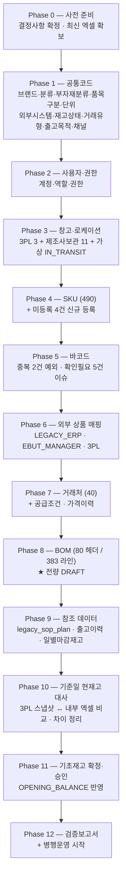
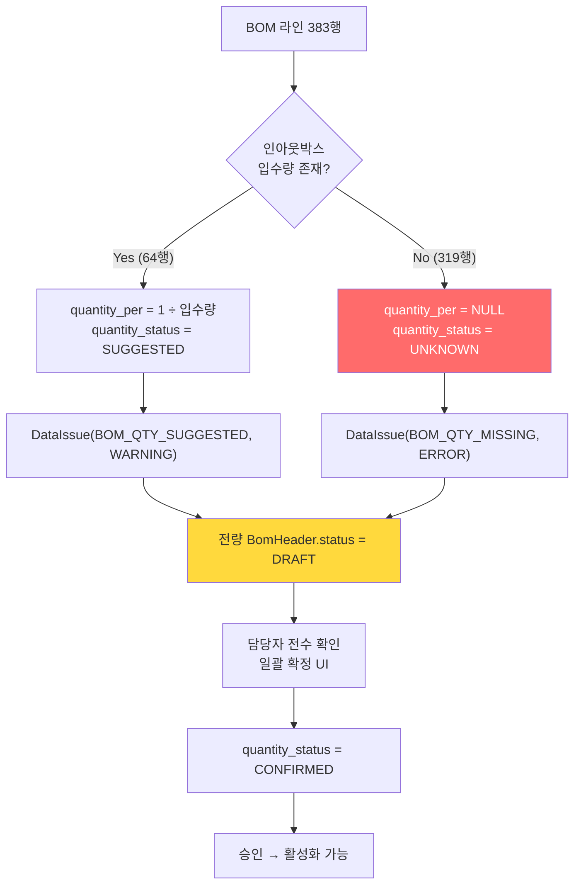
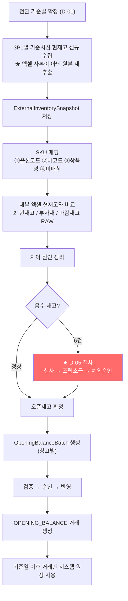
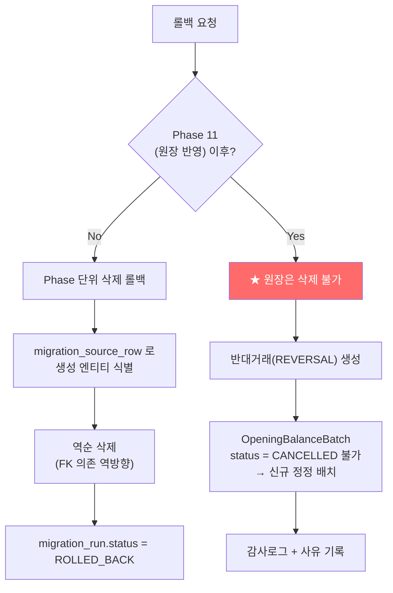

# DEEPPOINT SCM OS — 설계검토 07. 데이터 마이그레이션 설계

> **전환 방식: `기준일 현재고 방식`** (재고 PRD §26.1)
> 과거 수불을 원장으로 재현하지 않고, **전환 기준일의 현재고를 `OPENING_BALANCE`로 확정**한 뒤 그 이후 거래만 시스템 원장을 사용한다.
> 근거: ① `입고현황 및 일정` 시트가 *"입고 후 삭제"* 로 운영되어 과거 입고 이력이 이미 소실됨 ② `출고 RAW`에 출고번호가 없어 멱등성 보장 불가 ③ 월별 합계에 원인문서가 없음.
> → **과거 월별 합계로 가상 원장거래를 만들지 않는다** (CLAUDE_01 §9).

---

# 12. 데이터 마이그레이션 설계

## 12.1 이전 순서



### Phase별 상세

| Phase | 원천 | 대상 | 건수(실측) | 선행조건 | 차단 결정 |
|---|---|---|---:|---|---|
| **0** | — | 결정사항 확정 | — | — | D-01~D-07 |
| **1** | `SKU MASTER_본품`, `_부자재 등` 좌측 코드사전 + `구분`·`매출구분`·`퀵 확인` 시트 | 공통코드 | 브랜드 2 / 대분류 13 / 소분류 19 / 부자재분류 39 / 보관처 11 / 채널 16 / 판매처매핑 41 / 입고지매핑 65 | — | ✏️ *v0.1 집계 오기 — 실측 대분류 12·부자재분류 38·코드 98 (01_AS-IS §1.6 정오)* |
| **2** | 수기 | User, Role, UserRole | ~10명 | Phase 1 | D-07 |
| **3** | `입고지정보`, `거래처 정보`, S&OP 시트명, 보관처 축약코드 | Warehouse, WarehouseLocation | 창고 15±(D-02) + `IN_TRANSIT` 1 | Phase 1 | **D-02** |
| **4** | `최종 SKU MASTER` r5~ | Sku | **490** + 신규 4 | Phase 1,3 | **D-06** |
| **5** | 동 시트 C열 | SkuBarcode | 유효 **75**±, 중복예외 2, 이슈 5 | Phase 4 | — |
| **6** | 동 시트 K/L/M열 + `BOM 상세` Y/Z/AA열 + `마감재고 RAW` | SkuExternalMapping | LEGACY_ERP **290** / EBUT **191** / 3PL 별도 | Phase 4 | — |
| **7** | `거래처 정보`, `지급조건`, `BOM 상세` P~W열 | Supplier, SupplierSku, SupplierSkuPrice | 거래처 **40** / 공급조건 ~383 / 가격 ~383 | Phase 4 | — |
| **8** | `BOM 상세_2026.06 기준` r3~ | BomHeader, BomLine | **80 / 383** | Phase 4,7 | — |
| **9** | `3. 출고 RAW`, `1. 일별마감재고`, S&OP 창고 시트 | LegacySopPlan, ShipmentHistory(분석용) | 출고 **15,667** / S&OP 수천 | Phase 4 | — |
| **10** | `2. 현재고`, `부자재`, `마감재고 RAW` + **전환일 3PL 신규 스냅샷** | ExternalInventorySnapshot, Reconciliation | 현재고 **235** + 부자재 ~138 | Phase 3,4,6 | **D-01, D-03** |
| **11** | Phase 10 확정 결과 | OpeningBalanceBatch/Line → `OPENING_BALANCE` | 창고별 배치 | Phase 10 | **D-05** |
| **12** | — | 검증보고서 | — | Phase 11 | — |

## 12.2 스테이징 테이블

**원칙: 원본 엑셀 → 스테이징 → 검증 → 운영 테이블.** 어떤 단계도 엑셀에서 운영 테이블로 직접 쓰지 않는다.

| 스테이징 | 용도 | 비고 |
|---|---|---|
| `import_job` | 파일 단위. `file_hash` UNIQUE로 중복 업로드 방지 | 마이그레이션도 동일 파이프라인 사용 |
| `import_row` | **행 단위 원본 보존.** `raw_data JSONB`(가공 전) + `parsed_data JSONB`(정규화 후) + `source_row_no` | 행 단위 멱등성의 근거 |
| `migration_run` | 마이그레이션 실행 단위 (Phase 묶음) | 재실행·롤백 단위 |
| `migration_source_row` | **원본 행 ↔ 생성 엔티티 추적** | 검증·롤백의 핵심 |
| `staging_sku` / `staging_bom_line` / `staging_opening_balance` … | Phase별 타입 안전 스테이징 (선택) | `import_row.parsed_data`로 대체 가능 |

### `migration_source_row` 구조

```
migration_run_id  마이그레이션 실행 ID
source_file       "DEEPPOINT_SKU_MASTER_260729.xlsx"
source_sheet      "최종 SKU MASTER"
source_row_no     5            ← 엑셀 실제 행번호
entity_type       "Sku"
entity_id         <생성된 UUID>
status            CREATED / SKIPPED / ERROR / DUPLICATE
message           오류·스킵 사유
```

> **모든 생성 엔티티는 원본 행으로 역추적 가능하다.** 이것이 검증보고서와 롤백의 기반이다.

## 12.3 원본 행 추적 방식

| 추적 대상 | 방법 |
|---|---|
| 엑셀 행 → 엔티티 | `migration_source_row` |
| 엔티티 → 엑셀 행 | 동 테이블 역조회 |
| 원장거래 → 원본 | `inventory_transaction.source_document_id` → `opening_balance_line.source_row_no` |
| 오류 행 | `import_row.status='ERROR'` + `error_code`/`error_message` → **오류행 xlsx 다운로드** |
| BOM 라인 → 원본 코드 | `bom_line.legacy_bom_code`, `legacy_common_bom_code` |
| 발주 조인키 | `legacy_join_key` (R2) |

## 12.4 SKU 매핑

### 변환 규칙

| 엑셀 열 | 대상 | 변환 |
|---|---|---|
| B `구분` | `sku.item_type` | 정규화(공백·괄호 제거·trim) 후 15종 매핑표 적용. **미매칭은 오류** |
| C `바코드` | `sku_barcode` | §12.5 |
| D `브랜드` | `brand_id` | 코드 조회. 미존재 시 오류 |
| E `대분류` / F `소분류` | `major/minor_category_id` | 코드 조회 |
| G `품번` | `serial_number` | **문자열 유지** (앞자리 0 보존) |
| H `추가` | `additional_code` | `-`·공란 → NULL |
| **I `최종 품번`** | **`sku.sku_code`** | **원본 그대로.** 재생성·수정 금지 (PRD §11.1) |
| J `최종 상품명` | `sku.sku_name` | trim만. 외부 상품명으로 덮어쓰지 않음 |
| K/L | `sku_external_mapping` (LEGACY_ERP) | §12.6 |
| M | `sku_external_mapping` (EBUT_MANAGER) | §12.6 |
| O `ERP 구분` | `sku.erp_item_type` | **원문 문자열 보존.** `4.0` → `"4"` (소수점 제거) |

### 재고관리 설정 초기값 (PRD §14 권장)

| 품목구분 | inventory_managed | lot_managed | expiry_managed | serial_managed |
|---|:-:|:-:|:-:|:-:|
| `FINISHED_GOOD` / `KIT_FINISHED_GOOD` / `NONSALE_FINISHED_GOOD` | Y | **D-03 결정** | **D-03 결정** | N |
| `SEMI_FINISHED_GOOD` | Y | D-03 | D-03 | N |
| `PACKAGING_MATERIAL` / `COMMON_PACKAGING_MATERIAL` / `KIT_PACKAGING_MATERIAL` / `MATERIAL` | Y | N | N | N |
| `CONSUMABLE` / `SALON_SUPPLY` / `SAMPLE` | Y | N | N | N |
| `SERVICE` / `MOLD` | **N** | N | N | N |
| `ETC` | Y (검토) | N | N | N |

> 디바이스(대분류 `DV`) 시리얼 관리는 D-03과 함께 결정. 기본은 **N**으로 이관하고 이후 전환한다.

### 상태

**전 SKU를 `ACTIVE`로 이관한다.** 근거: 490건을 승인 워크플로에 태우는 것은 비현실적이며, 이관 데이터는 이미 운영 중인 실데이터다. 단 **마이그레이션 실행 자체가 관리자 승인 행위**이므로 `approved_by = 마이그레이션 실행자`, `approved_at = 실행일시`로 기록하고 감사로그를 남긴다.
예외: `구분` 헤더 오염 행 1건은 **이관하지 않는다**.

### 검증 기준 (PRD §32.1)

| 항목 | 기준 |
|---|---|
| 원본 SKU 수 = 이전 수 | **490 = 490** (헤더 오염 1건 제외 후) |
| SKU 코드 누락 | **0건** |
| SKU 코드 중복 | **0건** (실측 확인됨) |
| 상품명 누락 | **0건** |
| 바코드 오류 목록 | 별도 생성 (§12.5) |
| 외부코드 중복 목록 | 별도 생성 |
| 원본 행번호 추적 | **100%** |

## 12.5 바코드 매핑

```
파싱 → 정규화 → 분류 → 저장/이슈
```

| 원본 값 | 실측 | 처리 |
|---|---:|---|
| 정상 숫자 문자열 (예 `8809619961373`) | ~75 | `sku_barcode` 생성. `barcode_type='UNIT'`, `is_primary=true` |
| **`-`** | **376** | ⚠️ **NULL. `DataIssue` 생성하지 않음** (§00 G-04) |
| 공란 | 38 | NULL. 이슈 없음 |
| `확인필요` | 3 | ✅ `DataIssue(BARCODE_UNVERIFIED, ERROR)` |
| `확인불가` | 2 | ✅ `DataIssue(BARCODE_UNVERIFIED, ERROR)` |
| `바코드` (헤더 오염) | 1 | ✅ 행 전체 제외 + `DataIssue` |
| **지수표기 (`1.23E+12`)** | 0 (원본 xlsx는 정수 보존) | ❌ **행 오류 처리. 복원 시도 금지** — 유효자릿수 손실은 복구 불가 |

### 정규화 규칙

```typescript
function normalizeBarcode(raw: unknown): BarcodeResult {
  if (raw == null) return { kind: 'EMPTY' };

  // ① 셀을 문자열로 강제 읽었는지 검증
  if (typeof raw === 'number')
    return { kind: 'ERROR', code: 'BARCODE_READ_AS_NUMBER' };   // 파서 버그

  const s = String(raw).trim();
  if (s === '' || s === '-' || s === '—') return { kind: 'EMPTY' };
  if (/E\+\d+/i.test(s))  return { kind: 'ERROR', code: 'BARCODE_SCIENTIFIC_NOTATION' };
  if (['확인필요','확인불가','확인 필요','바코드'].includes(s))
    return { kind: 'ISSUE', code: 'BARCODE_UNVERIFIED', raw: s };

  const cleaned = s.replace(/[\s-]/g, '');                       // 공백·하이픈 제거 (PRD §12.3)
  if (!/^\d+$/.test(cleaned))
    return { kind: 'ISSUE', code: 'BARCODE_INVALID_FORMAT', raw: s };

  return { kind: 'OK', barcode: cleaned };                       // ★ 앞자리 0 보존
}
```

### 중복 바코드 2건 처리

| 바코드 | SKU | 처리 |
|---|---|---|
| `8809619960499` | `FB-DV-IR-003`, `FB-DV-IR-005` | ① 첫 SKU에 `duplicate_exception=false`(정상) ② 둘째 SKU에 `duplicate_exception=true` + `exception_reason='마이그레이션 이관 — 원본 중복'` + `approved_by=마이그레이션 실행자` ③ `DataIssue(BARCODE_DUPLICATE, WARNING)` 생성 → 담당자가 실제 어느 SKU의 바코드인지 확정 |
| `8809619960987` | `FB-HC-MN-001`, `FB-HC-MN-002` | 동일 |

> 조건부 UNIQUE 인덱스(`WHERE status='ACTIVE' AND duplicate_exception=false`)가 있으므로 이 방식으로 이관이 통과한다.

## 12.6 외부 상품 매핑

| 원천 | 외부시스템 | 실측 유효 건수 | `mapping_status` |
|---|---|---:|---|
| `최종 SKU MASTER` K/L열 | `LEGACY_ERP` (이카운트) | **290** | 외부코드 존재 → `MATCHED` |
| `최종 SKU MASTER` M열 | `EBUT_MANAGER` (이벗매니저) | **191** | **상품명만 존재 → `REVIEW_REQUIRED`** |
| `마감재고 RAW` 옵션코드 | `EBUT_MANAGER` | ~200 | **외부코드 존재 → `MATCHED`** ★ 이것이 실제 3PL 연동 키 |
| `BOM 상세` Y열 | `EBUT_MANAGER` | 부분 | `REVIEW_REQUIRED` |
| `BOM 상세` Z/AA열 | `LEGACY_ERP` | 부분 | `MATCHED` |
| S&OP 시트 창고별 상품명 | `PUMGO` / `RODIT` / `SHIPNERGY` | 시트별 | `REVIEW_REQUIRED` |

> **중요**: `마감재고 RAW`의 `옵션코드`(예 `1512055`)가 이벗매니저의 실제 상품코드다. 상품명 기반(`REVIEW_REQUIRED`)이 아니라 **코드 기반(`MATCHED`) 매핑을 확보할 수 있으므로**, 이 시트를 3PL 매핑의 1차 원천으로 삼는다. 이것이 확보되면 `출고 RAW`의 `#N/A` 152건도 대부분 해소된다.

**중복 검사**: 동일 외부시스템 내 `external_product_code`가 2개 이상 SKU에 연결되면 → 목록 생성 + `DataIssue(EXTERNAL_CODE_DUPLICATE)`. 자동 해소하지 않는다.

## 12.7 BOM 매핑

### 변환 규칙

| 엑셀 열 | 대상 | 변환 |
|---|---|---|
| E `신규 품번` | `bom_header.parent_sku_id` | SKU 코드 조회. **미존재 0건 확인됨** |
| F `신규 품번`(중복) | 검증용 | E열과 비교. 불일치 시 `DataIssue` |
| **J `공용 BOM 품번`** | `bom_line.component_sku_id` | **공용 코드가 있으면 우선 사용** (PRD §30) |
| I `BOM 품번` | `bom_line.component_sku_id` (J 없을 때) / `legacy_bom_code` | |
| L `구분` | `bom_line.component_role` | 완제품·반제품 → `PRODUCT` / 부자재 → `PACKAGING` / 임가공·조립 → `SERVICE` |
| M `상세 항목` | `bom_line.note` | |
| **N `인아웃박스 입수량`** | **`bom_line.pack_quantity`** | ⛔ **`quantity_per`로 전환 금지** |
| O `상세 사양` | `specification` | |
| P `제조사` | `supplier` 매핑 | 미매칭 목록 생성 |
| Q `사급/턴키` | `supply_type` | `사급`→`SELF_SUPPLIED`, `턴키`→`TURNKEY` |
| R `입고처` | `supplier_sku.destination_warehouse_id` | 창고 매핑 |
| S `MOQ` | `supplier_sku.moq` | 숫자 변환. 실측 325/383 존재 |
| T `리드타임` | `supplier_sku.lead_time_days` | **일수 표준화.** 실측 2/383만 존재 → 나머지 NULL |
| V/W `최근 매입가` | `supplier_sku_price.unit_price` | `vat_included=false`, `effective_from=전환기준일` |
| U `Price` | 가격이력 후보 | 참고 저장 |
| — `계산 최근 매입가` | ❌ | **직접 이전하지 않고 재계산** (PRD §30) |

### 소요량 처리 (핵심)



| 규칙 | 내용 |
|---|---|
| 전량 `DRAFT` | **활성화된 BOM 0건으로 최초 이전** (PRD §32.2) |
| **자동 1 입력 금지** | 단순 구성품이라도 `quantity_per`를 1로 채우지 않는다 (PRD §38) |
| 입수량 추천 | `1 ÷ pack_quantity`. **`quantity_status='SUGGESTED'`이며 확정이 아니다** |
| 미확정 라인 | `DataIssue` 생성 |
| 활성화 차단 | `quantity_status ≠ CONFIRMED` 라인이 하나라도 있으면 승인 요청 불가 |
| 헤더 | `version='1.0'`, `bom_type` = 상위 SKU 품목구분으로 판정(`KIT_FINISHED_GOOD`→`KIT`, 그 외 `MANUFACTURING`), `effective_from`=전환기준일, `output_qty=1` |

### 검증 기준 (PRD §32.2)

| 항목 | 기준 | 실측 예상 |
|---|---|---|
| 상위 SKU 수 일치 | 80 = 80 | ✅ |
| BOM 행 수 일치 | 383 = 383 | ✅ |
| 존재하지 않는 상위 SKU | **0건** | ✅ 확인됨 |
| 존재하지 않는 구성품 SKU | 목록 생성 | **0건** 확인됨 |
| 공용 부자재 미매핑 | 목록 생성 | 66행 대상 |
| **수량 미확정 목록** | 생성 | **383행 (전량)** 🔴 |
| 제조사 미매핑 | 목록 생성 | 검증 필요 |
| 단가 미확정 | 목록 생성 | |
| **활성 BOM 수** | **0건** | ✅ |

## 12.8 창고 매핑

| 원천 | 창고 | 유형 | 비고 |
|---|---|---|---|
| S&OP `올펀(포뷰트)`/`올펀(바디오라)`, `입고지정보` | **올펀** | `THREE_PL` | 메인 3PL. 이벗매니저 연동 |
| S&OP `품고` | **품고** | `THREE_PL` | 네이버 스마트스토어 |
| S&OP `로딧` | **로딧** | `THREE_PL` | 아마존JP/US/큐텐/쇼피 |
| S&OP `미르글로벌` | (미등록 또는 `active=false`) | `THREE_PL` | **종료** (D-08b) |
| `부자재 현황` 보관처 11종 (BOC IJC CSM CLB MKM EZC CTK RBM JPS NNN BON) | **제조사 보관처 11** | `SUPPLIER_SITE` | **D-02 ⓑ 선택 시** |
| `입고지정보` 해람, 솔레오코스메킥 등 | 필요 시 추가 | `SUPPLIER_SITE` | |
| 시스템 예약 | **IN_TRANSIT** | `IN_TRANSIT` | 창고이동 중간 버킷 |
| (R4) | 아마존 US/JP FBA | `OVERSEAS` | D-02 ⓒ |

**모든 창고에 `DEFAULT` 로케이션을 자동 생성**한다 (§00 G-05).

> ✏️ **2026-08-25 설계복구 (Warehouse, T08)**: 위 매핑은 v0.2 §12.8 이 **창고 15종 exact 표**로 확정했고, 그 15종을 T08-2 seed 가 그대로 만든다(`19_설계복구_Warehouse.md §W-D37`). `DEFAULT` 로케이션 자동 생성은 유지되며 실행 순서만 **§W-D7** 로 clarify 된다(pre-generated UUID · deferred composite FK · 사후 UPDATE 없음). **`제조사 보관처 11` 의 `SUPPLIER_SITE` ↔ 거래처 연결은 이 Phase 3 에서 완성되지 않는다** — `supplier_id` 는 Phase 7(거래처 이관, `07` v0.2 `T4-19`) 에서 채워지며 그때까지 `NULL` 인 **staged 상태**로 살아 있다(**§W-D13·§W-D38**). ⛔ 축약어(`BOC`·`IJC`·…)를 `Supplier.supplierCode` 로 승격하지 않고 ⛔ 이름 유사성만으로 FK 를 연결하지 않는다.

## 12.9 기준일 현재고 이전



| 단계 | 내용 |
|---|---|
| 1 | 전환 기준일 확정 (**D-01** — 월초 권장) |
| 2 | **3PL에서 기준시점 현재고를 새로 받는다.** 2026-07-29 엑셀 사본을 그대로 쓰지 않는다 |
| 3 | 스냅샷 저장 → SKU 매핑 |
| 4 | 내부 엑셀 현재고(`2. 현재고` 235행, `부자재` ~138행)와 대사 |
| 5 | 차이 원인 정리 (담당자 확인) |
| 6 | **음수 6건 처리** (D-05) |
| 7 | 미등록 SKU 4건 선등록 (D-06) |
| 8 | 창고별 `OpeningBalanceBatch` 생성 → 검증 → 승인 → 반영 |
| 9 | 반영 후 **기준일 이전 일반거래 입력 차단** |

**기초재고 라인 매핑**

| 원천 | 대상 |
|---|---|
| `2. 현재고` C열 품번 | `sku_id` |
| `2. 현재고` G열 가용재고 | `quantity`, `inventory_status='AVAILABLE'` |
| `마감재고 RAW` 불량재고수량 | 별도 라인, `inventory_status='DEFECTIVE'` |
| `부자재` 시트 가용재고 | 부자재 라인 (올펀 보관분) |
| `부자재 현황` 시트 `부자재 현재 실재고` | **제조사 보관처별 라인** (D-02 ⓑ 선택 시) |
| LOT·유통기한 | **D-03 결정에 따름.** ⓐ 선택 시 `lot_no=''` |
| 원본 행번호 | `opening_balance_line.source_row_no` |

## 12.10 과거 수불 이전 여부

| 데이터 | 원장 전환 | 처리 |
|---|:-:|---|
| **`3. 출고 RAW` (15,667행)** | ❌ | **분석·수요예측용 이력 테이블**로 이전 (`legacy_shipment_history`). 원장 아님. 근거: 출고번호 부재로 멱등성 불가 (§00 G-01) |
| **`입고 RAW` (670행)** | ❌ | 발주·입고 이력 **참고 데이터**로 이전. R2 발주 모듈 설계 시 활용 |
| **`1. 일별마감재고` (212×245)** | ❌ | **검증용 스냅샷**으로 이전 가능(long format 변환). 원장 아님 |
| **`월별출고량` (103×33)** | ❌ | 이전하지 않음. 원장에서 재계산 |
| **S&OP 월별 계획·실적** | ❌ | `legacy_sop_plan`(long format) 참조 보관. **원인문서가 없으므로 가상 원장거래 생성 절대 금지** |
| **`그 외/입고/출고 조정` 열** | ❌ | 참조만. **자동 원장 전환 금지** (재고 PRD §25.1) |
| **`출고예정수량(홀딩전)`** | ❌ | 계획 데이터. 현재 비어있음 |
| **발주현황 477행** | ❌ | R2 발주 모듈에서 이전. R1은 공급조건·가격이력만 추출 |

> **일별마감재고 long format 변환 예시**
> `(품번, 2026-01-01, 값)` → `legacy_daily_closing(sku_code, snapshot_date, quantity, source_row_no, source_col_no)`
> 245열 가로형을 그대로 테이블로 만들지 않는다 (재고 PRD §34.1).

## 12.11 오류행 처리

| 오류 유형 | 처리 |
|---|---|
| **정상 행만 반영** | 오류가 있어도 정상 행은 반영한다 (PRD §16.2). 단 **BOM은 헤더 단위로 판정** — 라인 1개라도 치명 오류면 헤더 전체 보류 |
| 오류행 저장 | `import_row.status='ERROR'` + `error_code` + `error_message` |
| **오류행 다운로드** | 원본 컬럼 + `errorCode`·`errorMessage` 열 추가한 xlsx |
| 재처리 | 수정한 파일을 재업로드 → 이미 `POSTED`인 행은 스킵 |
| 이슈 등록 | 업무 판단이 필요한 것만 `DataIssue`. 단순 미입력(`-`, 공란)은 이슈 생성 안 함 |

### 주요 오류코드

| 코드 | 심각도 | 대상 |
|---|---|---|
| `SKU_CODE_DUPLICATE` | ERROR | SKU |
| `SKU_CODE_DUPLICATE_IN_FILE` | ERROR | SKU |
| `ITEM_TYPE_UNMAPPED` | ERROR | SKU |
| `BRAND_CODE_NOT_FOUND` / `CATEGORY_CODE_NOT_FOUND` | ERROR | SKU |
| `REQUIRED_FIELD_MISSING` | ERROR | 전체 |
| `SKU_CODE_PATTERN_VIOLATION` | **WARNING** | SKU (`FB-SB` — §00 D-06) |
| `BARCODE_SCIENTIFIC_NOTATION` | ERROR | 바코드 |
| `BARCODE_DUPLICATE` | WARNING | 바코드 (예외승인 대상) |
| `BARCODE_UNVERIFIED` | ERROR | 바코드 (`확인필요`·`확인불가`) |
| `EXTERNAL_CODE_DUPLICATE` | WARNING | 매핑 |
| `BOM_PARENT_NOT_FOUND` / `BOM_COMPONENT_NOT_FOUND` | ERROR | BOM |
| **`BOM_QTY_MISSING`** | **ERROR** | BOM (**319행 예상**) |
| **`BOM_QTY_SUGGESTED`** | **WARNING** | BOM (**64행 예상**) |
| `BOM_CYCLE_DETECTED` | ERROR | BOM |
| `SUPPLIER_NOT_FOUND` / `WAREHOUSE_NOT_FOUND` | ERROR | 공급조건 |
| `OPENING_NEGATIVE_QTY` | **ERROR** | 기초재고 (**6건** — 관리자 예외 승인 필요) |
| `OPENING_SKU_NOT_FOUND` | ERROR | 기초재고 (**4건**) |
| `OPENING_DUPLICATE_STOCK_KEY` | ERROR | 기초재고 |

## 12.12 중복 처리

| 층 | 방어 수단 |
|---|---|
| **파일** | `import_job.file_hash` SHA-256 UNIQUE → 경고. 강행 시 사유 필수 + 감사로그 |
| **행** | `import_row (import_job_id, source_row_no)` UNIQUE + `status='POSTED'` 스킵 |
| **엔티티** | `sku_code` 전역 UNIQUE / `(parent_sku_id, version)` / 조건부 UNIQUE 인덱스들 |
| **원장** | `idempotency_key` 조건부 UNIQUE |
| **기초재고** | `(opening_date, warehouse_id) WHERE status='POSTED'` UNIQUE — 동일 오픈일 중복 반영 차단 |
| **파일 내 중복** | 파싱 단계에서 파일 내 키 중복 사전 탐지 (`SKU_CODE_DUPLICATE_IN_FILE`) |

## 12.13 재실행 가능성

| 항목 | 보장 방식 |
|---|---|
| **DB 마이그레이션** | `prisma migrate deploy` 멱등. 롤백 스크립트 병행 작성 |
| **Phase 재실행** | 각 Phase는 `migration_run_id` 단위. 이미 생성된 엔티티는 `migration_source_row`로 판정해 스킵 |
| **부분 실패 복구** | `import_row.status`가 행 단위 재개 지점. 성공 청크는 커밋 유지 |
| **시드 데이터** | `prisma/seed.ts` — 공통코드·역할·권한·테스트 사용자·샘플 SKU/BOM |
| **스테이징 리허설** | 운영 이관 전 **스테이징에서 전체 Phase를 최소 2회 완주**하고 검증보고서를 비교. 두 번의 보고서가 동일해야 재실행 가능성이 입증된다 |
| **드라이런 모드** | `--dry-run` 옵션으로 검증만 수행하고 커밋하지 않음 |

## 12.14 검증 보고서

각 Phase 종료 시 자동 생성해 Supabase Storage에 xlsx로 저장한다.

### 보고서 구성

| 시트 | 내용 |
|---|---|
| **요약** | Phase / 실행일시 / 실행자 / 원본 행수 / 생성 / 스킵 / 오류 / 소요시간 / **PASS·FAIL** |
| **건수 대조** | 항목별 `원본 = 이관` 대조표 |
| **오류 목록** | 원본 행번호 / 원본 데이터 / 오류코드 / 메시지 |
| **경고 목록** | 동상 (WARNING) |
| **미매핑 목록** | 제조사·창고·외부코드 미매칭 |
| **소요량 미확정** | BOM 383행 상세 (Phase 8) |
| **재고 대조** | 창고별·SKU별·상태별 수량 대조 (Phase 11) |
| **추적표** | `migration_source_row` 전량 |

### Phase 11 (기초재고) 필수 검증 항목 (재고 PRD §26.4)

| 검증 | 기준 |
|---|---|
| 창고별 총수량 일치 | 3PL 스냅샷 합계 = 기초재고 합계 |
| SKU별 총수량 일치 | SKU 단위 대조 |
| 재고상태별 수량 일치 | AVAILABLE / DEFECTIVE 등 |
| **음수재고 목록 승인** | 6건 전부 관리자 승인 기록 존재 |
| 미매칭 SKU | **0건** 또는 승인된 보류 목록 |
| 오픈재고 총합 검증 | 원장 집계 = balance = 스냅샷 |
| 원본행 추적 | 100% |

## 12.15 롤백 방식



| 시점 | 롤백 방식 |
|---|---|
| **Phase 1~10** (원장 반영 전) | `migration_source_row`로 생성 엔티티를 식별해 **FK 역순 삭제**. 마스터 데이터는 아직 거래에 쓰이지 않았으므로 물리삭제 가능 |
| **Phase 11 이후** (원장 반영 후) | ⛔ **원장 삭제 불가.** 각 `OPENING_BALANCE` 거래에 대해 **`REVERSAL` 반대거래**를 생성한다. 그 후 정정된 신규 기초재고 배치를 만든다 |
| **전체 초기화** (스테이징 한정) | DB 스냅샷 복원(Supabase PITR) 또는 `prisma migrate reset`. **운영에서는 절대 금지** |
| **운영 롤백 결정 기준** | 오픈 후 24시간 이내이고 실거래가 발생하지 않았다면 반대거래 후 재이관. 실거래가 있으면 재이관하지 않고 **조정거래로 보정** |

> **롤백보다 예방**: 운영 이관 전 스테이징 리허설 2회 완주가 유일하게 신뢰할 만한 방어다. 롤백은 최후 수단이다.

## 12.16 병행 운영 계획

| 기간 | 내용 |
|---|---|
| **D-14 ~ D-1** | 스테이징 리허설 2회. 검증보고서 대조 |
| **D-Day** | 기준일 현재고 확정 → 기초재고 반영 → 시스템 오픈 |
| **D+1 ~ D+30** | **엑셀 병행 운영.** 매일 종료 시 시스템 현재고 ↔ 엑셀 현재고 대조. 차이 발생 시 즉시 원인 규명 |
| **D+30** | 첫 월마감. 수불 검증차이 0 확인 |
| **D+31~** | 엑셀 병행 중단. 엑셀은 읽기전용 아카이브 |

> 병행 운영 기간 동안 **엑셀이 시스템을 덮어쓰지 않는다.** 차이가 나면 시스템의 원인 거래를 찾아 보정하는 방향으로만 움직인다.
