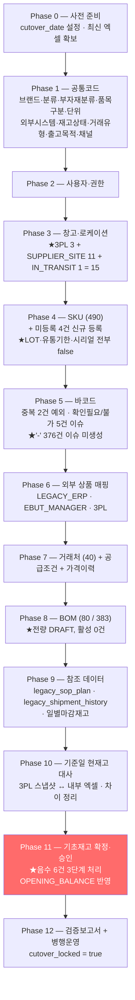
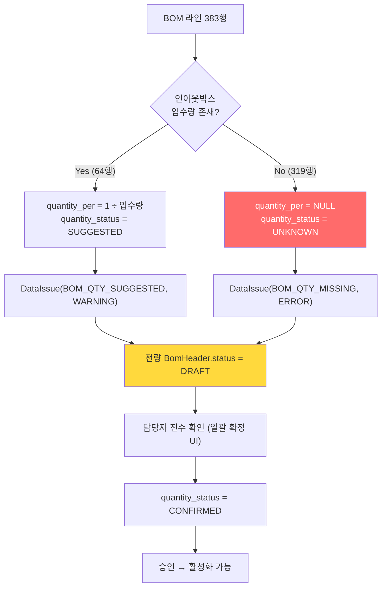
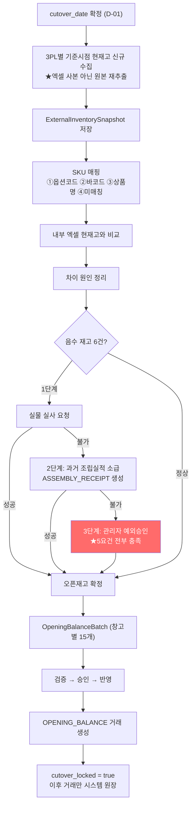
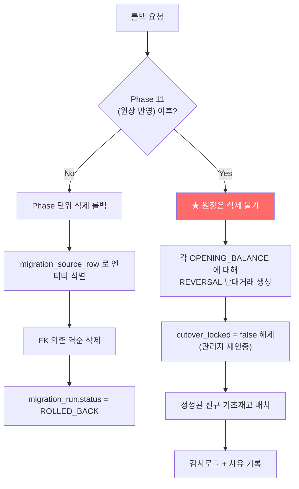

# DEEPPOINT SCM OS — 설계검토 07. 데이터 마이그레이션 설계 **(v0.2)**

> **전환 방식: `기준일 현재고 방식`** (재고 PRD §26.1)
> **v0.1 대비 변경** — ✏️ 표기
> ① **전환 기준일을 `system_setting.cutover_date`로 관리** — 하드코딩 금지 (D-01)
> ② **창고 15종 확정** (D-02)
> ③ **LOT·유통기한 미관리로 오픈** (D-03)
> ④ **출고 RAW → `legacy_shipment_history` 전용, 원장 미반영** (D-04)
> ⑤ **음수 6건: 실사 → 조립소급 → 예외승인 3단계 확정. 0 치환 코드 부재** (D-05)
> ⑥ **미등록 SKU 4건 정식 등록, 코드체계 위반은 WARNING** (D-06)
> ⑦ 마이그레이션 실행 단계를 **R1a-4**로 명시

---

# 12. 데이터 마이그레이션 설계

## 12.0 ✏️ 전환 기준일 관리 (D-01)

```
system_setting.cutover_date   DATE    NULL     ← UAT 완료 후 관리자가 설정
system_setting.cutover_locked BOOLEAN false    ← 기초재고 반영 후 true
```

| 규칙 | 내용 |
|---|---|
| **하드코딩 금지** | 코드·시드·마이그레이션 스크립트에 **날짜 리터럴을 쓰지 않는다.** ESLint 규칙 + 코드리뷰로 강제 |
| **월초 제약** | 값 설정 시 **월초(1일)만 허용**. 도메인 검증 (`CUTOVER_DATE_NOT_MONTH_START`) |
| **미설정 시** | 기초재고 배치 생성 차단 (`CUTOVER_DATE_NOT_SET`). 화면에서 버튼 비활성 + 설정 링크 |
| **잠금** | 기초재고 반영 완료 시 `cutover_locked = true` 자동 전환. 이후 변경은 관리자 재인증 + 사유 |
| **참조하는 곳** | 기초재고 `openingDate` 기본값 / 오픈일 이전 일반거래 차단 / BOM·공급조건 `effective_from` 기본값 / 3PL 스냅샷 요청 기준시점 / Phase 10~11 |

> **왜 설정값인가**: 전환일은 UAT 결과·3PL 협조 일정·업무 사정에 따라 바뀐다. 코드에 박으면 날짜 하나 바꾸는 데 배포가 필요하고, 리허설과 실제 이관에서 서로 다른 값을 써야 하는데 이를 코드로 관리하면 실수 위험이 크다.

## 12.1 이전 순서



### Phase별 상세

| Phase | 원천 | 대상 | 건수(실측) | 선행조건 | 확정 |
|---|---|---|---:|---|---|
| **0** | — | `cutover_date` 설정 | — | UAT 완료 | **D-01** |
| **1** | `SKU MASTER_*` 좌측 코드사전 + `구분`·`매출구분`·`퀵 확인` | 공통코드 | ✏️ 브랜드 2 / 대분류 **12** / 소분류 19 / 부자재분류 **38**(원본 39행, `ET` 중복 1건) / 보관처 11 / 채널 16 → **코드 98** / 판매처 41 / 입고지 65 | — | ✏️ 종전 13·39 는 집계 오기 (01_AS-IS §1.6 정오) |
| **2** | 수기 | User, Role, UserRole | ~10명 | Phase 1 | D-07 |
| **3** | `입고지정보`, `거래처 정보`, S&OP 시트명, 보관처 축약코드 | Warehouse, WarehouseLocation | ✏️ **창고 15 + DEFAULT 로케이션 15** | Phase 1 | **D-02** |
| **4** | `최종 SKU MASTER` r5~ | Sku | **490 + 신규 4** | Phase 1,3 | **D-03, D-06** |
| **5** | 동 시트 C열 | SkuBarcode | 유효 **75**±, 예외 2, 이슈 6 | Phase 4 | G-04 |
| **6** | K/L/M열 + `BOM 상세` Y/Z/AA + `마감재고 RAW` | SkuExternalMapping | LEGACY_ERP **290** / EBUT **191** + 옵션코드 ~200 | Phase 4 | |
| **7** | `거래처 정보`, `지급조건`, `BOM 상세` P~W | Supplier, SupplierSku, SupplierSkuPrice | 거래처 **40** / 공급조건 ~383 / 가격 ~383 | Phase 4 | G-03 |
| **8** | `BOM 상세_2026.06 기준` r3~ | BomHeader, BomLine | **80 / 383** | Phase 4,7 | G-02 |
| **9** | `3. 출고 RAW`, `1. 일별마감재고`, S&OP 창고 시트 | ✏️ **LegacyShipmentHistory**, LegacySopPlan, LegacyDailyClosing | 출고 **15,667** / S&OP 수천 | Phase 4 | **D-04** |
| **10** | `2. 현재고`, `부자재`, `부자재 현황`, `마감재고 RAW` + **전환일 3PL 신규 스냅샷** | ExternalInventorySnapshot, Reconciliation | 현재고 **235** + 부자재 ~138 + 제조사보관 ~243 | Phase 0,3,4,6 | D-01, D-02 |
| **11** | Phase 10 확정 결과 | OpeningBalanceBatch/Line → `OPENING_BALANCE` | 창고별 배치 15개 | Phase 10 | **D-05** |
| **12** | — | 검증보고서 + `cutover_locked=true` | — | Phase 11 | |

> ✏️ **실행 시점**: Phase 1~8은 R1a-4의 `T4-19`, Phase 9~10은 `T4-20`, Phase 11~12는 `T4-21`이다. R1a-1(SKU)·R1a-3(BOM) 개발 완료가 선행되어야 한다.

## 12.2 스테이징 테이블

**원칙: 원본 엑셀 → 스테이징 → 검증 → 운영 테이블.** 어떤 단계도 엑셀에서 운영 테이블로 직접 쓰지 않는다.

| 스테이징 | 용도 |
|---|---|
| `import_job` | 파일 단위. `file_hash` UNIQUE |
| `import_row` | **행 단위 원본 보존.** `raw_data`(가공 전) + `parsed_data`(정규화 후) + `source_row_no` |
| `migration_run` | 마이그레이션 실행 단위 (Phase 묶음) |
| `migration_source_row` | **원본 행 ↔ 생성 엔티티 추적** |

```
migration_source_row
  migration_run_id   실행 ID
  source_file        "DEEPPOINT_SKU_MASTER_260729.xlsx"
  source_sheet       "최종 SKU MASTER"
  source_row_no      5              ← 엑셀 실제 행번호
  entity_type        "Sku"
  entity_id          <생성 UUID>
  status             CREATED / SKIPPED / ERROR / DUPLICATE
  message            사유
```

## 12.3 원본 행 추적 방식

| 추적 대상 | 방법 |
|---|---|
| 엑셀 행 → 엔티티 | `migration_source_row` |
| 엔티티 → 엑셀 행 | 동 테이블 역조회 |
| 원장거래 → 원본 | `inventory_transaction.source_document_id` → `opening_balance_line.source_row_no` |
| 오류 행 | `import_row.status='ERROR'` + 코드·메시지 → **오류행 xlsx** |
| BOM 라인 → 원본 코드 | `bom_line.legacy_bom_code`, `legacy_common_bom_code` |
| ✏️ 출고 이력 → 원본 | `legacy_shipment_history.source_sheet` + `source_row_no` |
| 발주 조인키 | `legacy_join_key` (R2) |

## 12.4 SKU 매핑

### 변환 규칙

| 엑셀 열 | 대상 | 변환 |
|---|---|---|
| B `구분` | `sku.item_type` | 정규화(공백·괄호 제거·trim) 후 15종 매핑. **미매칭은 오류** |
| C `바코드` | `sku_barcode` | §12.5 |
| D `브랜드` / E `대분류` / F `소분류` | `brand_id` / `major_category_id` / `minor_category_id` | 코드 조회. 미존재 시 오류 |
| G `품번` | `serial_number` | **문자열 유지** (앞자리 0 보존) |
| H `추가` | `additional_code` | `-`·공란 → NULL |
| **I `최종 품번`** | **`sku.sku_code`** | **원본 그대로.** 재생성·수정 금지 |
| J `최종 상품명` | `sku.sku_name` | trim만. 외부 상품명으로 덮어쓰지 않음 |
| K/L | `sku_external_mapping` (LEGACY_ERP) | §12.6 |
| M | `sku_external_mapping` (EBUT_MANAGER) | §12.6 |
| O `ERP 구분` | `sku.erp_item_type` | **원문 보존.** `4.0` → `"4"` |

### ✏️ 재고관리 설정 초기값 (D-03 확정)

| 품목구분 | `inventory_managed` | `lot_managed` | `expiry_managed` | `serial_managed` |
|---|:-:|:-:|:-:|:-:|
| `FINISHED_GOOD` / `KIT_FINISHED_GOOD` / `NONSALE_FINISHED_GOOD` | Y | **N** | **N** | **N** |
| `SEMI_FINISHED_GOOD` | Y | **N** | **N** | **N** |
| `PACKAGING_MATERIAL` / `COMMON_PACKAGING_MATERIAL` / `KIT_PACKAGING_MATERIAL` / `MATERIAL` | Y | N | N | N |
| `CONSUMABLE` / `SALON_SUPPLY` / `SAMPLE` | Y | N | N | N |
| `SERVICE` / `MOLD` | **N** | N | N | N |
| `ETC` | Y (검토) | N | N | N |

> ✏️ **전 SKU가 LOT·유통기한·시리얼 미관리로 시작한다** (D-03). 오픈 후 화장품 완제품(`FINISHED_GOOD` 57종)부터 순차 전환한다.
>
> **전환 절차** (오픈 후, R1b 이상):
> ① 대상 SKU `lotManaged = true` (관리자, 감사로그)
> ② `lot_no=''` 버킷 재고를 실제 LOT 버킷으로 옮기는 **조정거래**(`LOT_CORRECTION`, from `''` → to 실제 LOT)
> ③ 이후 입고부터 LOT 필수

### ✏️ 미등록 SKU 4건 (D-06)

| SKU | 상태 | 처리 |
|---|---|---|
| `FB-DP-016` | 현재고에만 존재 | **정식 SKU 등록.** 담당자가 품목구분·분류·상품명 확정 |
| `FB-PM-001` | 동일 | 동일 |
| `FB-PM-013` | 동일 | 동일 |
| **`FB-SB`** | 동일 + **코드체계 위반**(3세그먼트) | 정식 등록 + `DataIssue(SKU_CODE_PATTERN_VIOLATION, **WARNING**)`. **코드 수정 안 함** |

> ✏️ 코드체계 검증 심각도를 **ERROR → WARNING** 으로 하향한다. 이관을 차단하지 않는다.

### 상태

**전 SKU를 `ACTIVE`로 이관한다.** 490건을 승인 워크플로에 태우는 것은 비현실적이며, 이관 데이터는 이미 운영 중인 실데이터다. 마이그레이션 실행 자체가 관리자 승인 행위이므로 `approved_by = 실행자`, `approved_at = 실행일시`로 기록하고 감사로그를 남긴다.
예외: `구분` 헤더 오염 행 1건은 **이관하지 않는다**.

### 검증 기준

| 항목 | 기준 |
|---|---|
| 원본 SKU 수 = 이전 수 | **490 = 490** (헤더 오염 1건 제외 후) |
| SKU 코드 누락 / 중복 | **각 0건** |
| 상품명 누락 | **0건** |
| ✏️ LOT·유통기한·시리얼 플래그 | **전 SKU `false`** |
| ✏️ 미등록 4건 | **전부 등록 완료** |
| ✏️ `FB-SB` | `DataIssue(WARNING)` 생성, 이관 성공 |
| 바코드 오류 목록 | 별도 생성 |
| 외부코드 중복 목록 | 별도 생성 |
| 원본 행번호 추적 | **100%** |

## 12.5 바코드 매핑

| 원본 값 | 실측 | 처리 |
|---|---:|---|
| 정상 숫자 문자열 | ~75 | `sku_barcode` 생성. `UNIT`, `is_primary=true` |
| **`-`** | **376** | ⚠️ **NULL. `DataIssue` 생성하지 않음** (G-04) |
| 공란 | 38 | NULL. 이슈 없음 |
| `확인필요` | 3 | ✅ `DataIssue(BARCODE_UNVERIFIED, ERROR)` |
| `확인불가` | 2 | ✅ `DataIssue(BARCODE_UNVERIFIED, ERROR)` |
| `바코드`(헤더 오염) | 1 | ✅ 행 전체 제외 + `DataIssue` |
| **지수표기 (`1.23E+12`)** | 0 | ❌ **행 오류. 복원 시도 금지** |

```typescript
function normalizeBarcode(raw: unknown): BarcodeResult {
  if (raw == null) return { kind: 'EMPTY' };
  if (typeof raw === 'number')
    return { kind: 'ERROR', code: 'BARCODE_READ_AS_NUMBER' };     // 파서 버그

  const s = String(raw).trim();
  if (s === '' || s === '-' || s === '—') return { kind: 'EMPTY' };  // ★ 이슈 미생성
  if (/E\+\d+/i.test(s))  return { kind: 'ERROR', code: 'BARCODE_SCIENTIFIC_NOTATION' };
  if (['확인필요','확인불가','확인 필요','바코드'].includes(s))
    return { kind: 'ISSUE', code: 'BARCODE_UNVERIFIED', raw: s };

  const cleaned = s.replace(/[\s-]/g, '');
  if (!/^\d+$/.test(cleaned))
    return { kind: 'ISSUE', code: 'BARCODE_INVALID_FORMAT', raw: s };

  return { kind: 'OK', barcode: cleaned };                           // ★ 앞자리 0 보존
}
```

### 중복 바코드 2건

| 바코드 | SKU | 처리 |
|---|---|---|
| `8809619960499` | `FB-DV-IR-003`, `FB-DV-IR-005` | ① 첫 SKU `duplicate_exception=false` ② 둘째 SKU `duplicate_exception=true` + 사유 + `approved_by=실행자` ③ `DataIssue(BARCODE_DUPLICATE, WARNING)` |
| `8809619960987` | `FB-HC-MN-001`, `FB-HC-MN-002` | 동일 |

## 12.6 외부 상품 매핑

| 원천 | 외부시스템 | 실측 | `mapping_status` |
|---|---|---:|---|
| `최종 SKU MASTER` K/L | `LEGACY_ERP` | **290** | 외부코드 존재 → `MATCHED` |
| `최종 SKU MASTER` M | `EBUT_MANAGER` | **191** | 상품명만 → `REVIEW_REQUIRED` |
| **`마감재고 RAW` 옵션코드** | `EBUT_MANAGER` | ~200 | **외부코드 존재 → `MATCHED`** ★ 실제 3PL 연동 키 |
| `BOM 상세` Y열 | `EBUT_MANAGER` | 부분 | `REVIEW_REQUIRED` |
| `BOM 상세` Z/AA열 | `LEGACY_ERP` | 부분 | `MATCHED` |
| S&OP 창고별 상품명 | `PUMGO` / `RODIT` / `SHIPNERGY` | 시트별 | `REVIEW_REQUIRED` |

> **중요**: `마감재고 RAW`의 `옵션코드`(예 `1512055`)가 이벗매니저의 실제 상품코드다. 상품명 기반(`REVIEW_REQUIRED`)이 아니라 **코드 기반(`MATCHED`)** 매핑을 확보할 수 있으므로 이 시트를 3PL 매핑의 1차 원천으로 삼는다. 확보되면 `출고 RAW`의 `#N/A` 152건도 대부분 해소된다.

**중복 검사**: 동일 외부시스템 내 `external_product_code`가 2개 이상 SKU에 연결되면 목록 생성 + `DataIssue(EXTERNAL_CODE_DUPLICATE)`. 자동 해소하지 않는다.

## 12.7 BOM 매핑

| 엑셀 열 | 대상 | 변환 |
|---|---|---|
| E `신규 품번` | `bom_header.parent_sku_id` | SKU 코드 조회. **미존재 0건 확인** |
| F (중복 열) | 검증용 | E와 비교. 불일치 시 `DataIssue` |
| **J `공용 BOM 품번`** | `bom_line.component_sku_id` | **공용 코드가 있으면 우선 사용** |
| I `BOM 품번` | `component_sku_id`(J 없을 때) / `legacy_bom_code` | |
| L `구분` | `component_role` | 완제품·반제품 → `PRODUCT` / 부자재 → `PACKAGING` / 임가공·조립 → `SERVICE` |
| M `상세 항목` | `note` | |
| **N `인아웃박스 입수량`** | **`pack_quantity`** | ⛔ **`quantity_per`로 전환 금지** |
| O `상세 사양` | `specification` | |
| P `제조사` | `supplier` 매핑 | 미매칭 목록 |
| Q `사급/턴키` | `supply_type` | `사급`→`SELF_SUPPLIED` / `턴키`→`TURNKEY` |
| R `입고처` | `supplier_sku.destination_warehouse_id` | 창고 매핑 |
| S `MOQ` | `supplier_sku.moq` | 실측 325/383 |
| T `리드타임` | `supplier_sku.lead_time_days` | 실측 2/383 → 나머지 **NULL (0 대체 금지)** |
| V/W `최근 매입가` | `supplier_sku_price.unit_price` | `vat_included=false`, ✏️ **`effective_from = cutover_date`** |
| — `계산 최근 매입가` | ❌ | **직접 이전 안 함. 재계산** |

### 소요량 처리



| 규칙 | 내용 |
|---|---|
| 전량 `DRAFT` | **활성화된 BOM 0건으로 최초 이전** |
| **자동 1 입력 금지** | 단순 구성품이라도 1로 채우지 않는다 |
| 입수량 추천 | `1 ÷ pack_quantity`. **`SUGGESTED`이며 확정 아님** |
| 미확정 라인 | `DataIssue` 생성 |
| 활성화 차단 | `quantity_status ≠ CONFIRMED` 라인이 있으면 승인 요청 불가 |
| 헤더 | `version='1.0'`, `bom_type` = 상위 SKU 품목구분으로 판정, ✏️ **`effective_from = cutover_date`**, `output_qty=1` |

### 검증 기준

| 항목 | 기준 | 실측 예상 |
|---|---|---|
| 상위 SKU 수 일치 | 80 = 80 | ✅ |
| BOM 행 수 일치 | 383 = 383 | ✅ |
| 존재하지 않는 상위 SKU | **0건** | ✅ |
| 존재하지 않는 구성품 SKU | 목록 생성 | **0건** |
| 공용 부자재 미매핑 | 목록 생성 | 66행 대상 |
| **수량 미확정 목록** | 생성 | **383행 (전량)** 🔴 |
| 제조사 미매핑 / 단가 미확정 | 목록 생성 | |
| **활성 BOM 수** | **0건** | ✅ |

## 12.8 ✏️ 창고 매핑 (D-02)

| # | 코드 | 명칭 | 유형 | 원천 |
|---|---|---|---|---|
| 1 | `OLPUN` | 올펀 | `THREE_PL` | S&OP `올펀(포뷰트)`/`(바디오라)`, `입고지정보` |
| 2 | `PUMGO` | 품고 | `THREE_PL` | S&OP `품고` |
| 3 | `RODIT` | 로딧 | `THREE_PL` | S&OP `로딧` |
| 4 | `SUP_BOC` | 본코스메틱 (BOC) | `SUPPLIER_SITE` | `부자재 현황` 보관처 |
| 5 | `SUP_IJC` | 일진코스메틱 | `SUPPLIER_SITE` | 동 |
| 6 | `SUP_CSM` | 코스메카코리아 | `SUPPLIER_SITE` | 동 |
| 7 | `SUP_CLB` | 갈렙이앤씨 | `SUPPLIER_SITE` | 동 |
| 8 | `SUP_MKM` | 마케모 | `SUPPLIER_SITE` | 동 |
| 9 | `SUP_EZC` | 이지코어 | `SUPPLIER_SITE` | 동 |
| 10 | `SUP_CTK` | 씨티케이 | `SUPPLIER_SITE` | 동 |
| 11 | `SUP_RBM` | 리봄화장품 | `SUPPLIER_SITE` | 동 |
| 12 | `SUP_JPS` | 제이피에스코스메틱 | `SUPPLIER_SITE` | 동 |
| 13 | `SUP_NNN` | 뉴앤뉴 | `SUPPLIER_SITE` | 동 |
| 14 | `SUP_BON` | 본코스메틱 (BON) | `SUPPLIER_SITE` | 동 |
| 15 | `IN_TRANSIT` | 이동중 | `IN_TRANSIT` | 시스템 예약 |

- **전 창고에 `DEFAULT` 로케이션 자동 생성** (총 15개)
- `SUPPLIER_SITE`는 `supplier_id` FK 연결 (Phase 7 거래처 이관 후 연결, 또는 Phase 3에서 거래처 선등록)
- 미르글로벌(종료), 아마존 FBA(R4) 제외

> ⚠️ **BOC / BON 상호 중복 (Q-02)**: 원본 `SKU MASTER_부자재 등` r47(BOC)·r57(BON)이 모두 "본코스메틱"이다. **두 창고를 별도 생성**하고 `DataIssue(WAREHOUSE_NAME_DUPLICATE, WARNING)`를 등록해 담당자 확인을 요청한다. 확인 결과 동일 업체이면 재고 이동 조정거래로 병합한다. **미리 합치지 않는다** — 잘못 합치면 되돌리기 어렵다.

## 12.9 ✏️ 기준일 현재고 이전 (D-01, D-03, D-05, D-06)



| 단계 | 내용 |
|---|---|
| 1 | ✏️ `system_setting.cutover_date` 설정 (관리자, 월초, 재인증) |
| 2 | **3PL에서 기준시점 현재고를 새로 받는다.** 2026-07-29 엑셀 사본을 그대로 쓰지 않는다 |
| 3 | 스냅샷 저장 → SKU 매핑 |
| 4 | 내부 엑셀 현재고(`2. 현재고` 235행, `부자재` ~138행, `부자재 현황` ~243행)와 대사 |
| 5 | 차이 원인 정리 (담당자 확인) |
| 6 | ✏️ **음수 6건 3단계 처리 (D-05)** |
| 7 | ✏️ 미등록 SKU 4건 선등록 (D-06) — Phase 4에서 이미 완료 |
| 8 | 창고별 `OpeningBalanceBatch` 15개 → 검증 → 승인 → 반영 |
| 9 | ✏️ `cutover_locked = true` → 기준일 이전 일반거래 차단 |

### 기초재고 라인 매핑

| 원천 | 대상 |
|---|---|
| `2. 현재고` C열 품번 | `sku_id` |
| `2. 현재고` G열 가용재고 | `quantity`, `inventory_status='AVAILABLE'` |
| `마감재고 RAW` 불량재고수량 | 별도 라인, `inventory_status='DEFECTIVE'` |
| `부자재` 시트 가용재고 | 부자재 라인 (올펀 보관분) |
| ✏️ `부자재 현황` `부자재 현재 실재고` | **제조사 보관처별 라인** (`SUP_*` 창고, D-02) |
| ✏️ LOT·유통기한 | **전 라인 `lot_no=''`, `expiry_key='9999-12-31'`** (D-03) |
| 원본 행번호 | `opening_balance_line.source_row_no` |

### ✏️ 음수 기획세트 6건 처리 (D-05)

| SKU | 수량 | 상품 |
|---|---:|---|
| `FB-OY-SP-003` | **−5,350** | 올리브영 스프레이 기획세트 |
| `FB-OY-ES-001` | −2,720 | 폴리쉬 오일 기획세트 |
| `FB-OY-CW-001` | −2,130 | 부스트 컬크림 기획세트 |
| `FB-OY-TT-001` | −640 | 두피 타투(블랙) 기획세트 |
| `FB-OY-SP-001` | −540 | 프리즈 헤어 스프레이 기획세트 |
| `FB-OY-TT-002` | −120 | 두피 타투(브라운) 기획세트 |

**처리 순서 (반드시 이 순서)**

| 단계 | 절차 | 성공 시 |
|---|---|---|
| **① 실물 실사** | 오픈 전 올펀에 6개 세트 실물 실사 요청. 6종뿐이므로 실현 가능 | 실사 수량을 오픈재고로 사용. 음수 해소 |
| **② 조립실적 소급** | ①이 불가하면 과거 조립 실적을 확인해 `cutover_date` **이전** `ASSEMBLY_RECEIPT`(세트 +) / `ASSEMBLY_CONSUMPTION`(구성품 −) 거래 생성 | 음수 해소 |
| **③ 관리자 예외승인** | ①②가 모두 불가하면 **음수 그대로 `OPENING_BALANCE` 반영** + 예외 5요건 전부 충족 | 예외큐에 `NEGATIVE_STOCK`(OPEN) 등록, 해소 추적 |

**예외 5요건** (③ 선택 시 전부 필수)
1. 관리자 권한 + **재인증**
2. 사유 입력
3. 승인 기록 (`approved_by`, `approved_at`)
4. `InventoryException(NEGATIVE_STOCK, ERROR, OPEN)` 생성
5. 해소 담당자(`assignedTo`) + 해소기한(`dueDate`) 지정

> ⛔ **0 치환 금지.** 마이그레이션 코드에 음수를 0으로 바꾸는 분기를 **작성하지 않는다.** API에도 해당 옵션이 없다 (§05 v0.2 §10.11).
>
> **근본 원인**: 3PL이 구성품으로 세트를 조립·출고했으나 조립거래가 기록되지 않아 세트 재고만 계속 차감됐다. R3 세트조립 모듈 설계에 반영해 재발을 막는다.

## 12.10 ✏️ 과거 수불 이전 여부 (D-04)

| 데이터 | 원장 전환 | 처리 |
|---|:-:|---|
| **`3. 출고 RAW` (15,667행)** | ❌ | ✏️ **`legacy_shipment_history` 테이블로 이전 (D-04).** 분석·수요예측 전용. **원장 미생성** |
| **`입고 RAW` (670행)** | ❌ | 발주·입고 이력 **참고 데이터**. R2 발주 모듈 설계 시 활용 |
| **`1. 일별마감재고` (212×245)** | ❌ | **검증용 스냅샷**으로 long format 변환 이전. 원장 아님 |
| **`월별출고량` (103×33)** | ❌ | 이전하지 않음. 원장에서 재계산 |
| **S&OP 월별 계획·실적** | ❌ | `legacy_sop_plan`(long format) 참조 보관. **가상 원장거래 생성 절대 금지** |
| **`그 외/입고/출고 조정` 열** | ❌ | 참조만. **자동 원장 전환 금지** |
| **`출고예정수량(홀딩전)`** | ❌ | 계획 데이터. 현재 비어있음 |
| **발주현황 477행** | ❌ | R2에서 이전. R1은 공급조건·가격이력만 추출 |

### ✏️ `legacy_shipment_history` 이관 규칙 (D-04)

| 항목 | 내용 |
|---|---|
| **원장 미반영 사유** | 출고 원본에 **출고번호·주문번호가 없어** `idempotency_key`를 생성할 수 없다. 재업로드 시 이중 차감을 구조적으로 막을 수 없다 |
| 이관 대상 | `3. 출고 RAW` r2~ 유효 15,667행 |
| 필드 매핑 | 매칭사용자코드→`skuCode` / 쇼핑몰→`shopName` / 매칭관리명→`managedName` / 매칭수량→`quantity` / 출고일→`shippedOn` / 구분→`divisionCode` / 종류→`itemKind` |
| SKU 매핑 | 코드 기반. **미등록 0건 확인됨** → `skuId` 연결 |
| 채널 매핑 | `매출구분` 시트(판매처명 우선) → `퀵 확인`(입고지 보조) → 미매칭 |
| 미매칭 152건 | `matchStatus='UNMATCHED'`로 표기. 코드 매핑 확보 후 재처리 가능 |
| 용도 | R5 수요예측 학습 데이터, 일평균 출고량 산출, 채널별 판매 분석 |
| **검증** | ✏️ **`inventory_ledger_entry`에 출고 RAW 기반 거래가 0건임을 명시적으로 검증** |

### 올펀 요청 항목 (병행 진행)

| # | 요청 항목 |
|---|---|
| 1 | 출고번호 (또는 주문번호) |
| 2 | 라인ID |
| 3 | 출고 확정 일시 |
| 4 | 채널 코드 |
| 5 | 취소·정정 시 원 출고번호 참조 |

> **즉시 착수.** R3 출고 연동의 선결조건이며 계약·협의 리드타임이 필요하다.

## 12.11 오류행 처리

| 오류 유형 | 처리 |
|---|---|
| **정상 행만 반영** | 오류가 있어도 정상 행은 반영. 단 **BOM은 헤더 단위 판정** — 라인 1개라도 치명 오류면 헤더 전체 보류 |
| 오류행 저장 | `import_row.status='ERROR'` + `error_code` + `error_message` |
| **오류행 다운로드** | 원본 컬럼 + `errorCode`·`errorMessage` 열 추가 xlsx |
| 재처리 | 수정 파일 재업로드 → 이미 `POSTED` 행 스킵 |
| 이슈 등록 | 업무 판단이 필요한 것만. **단순 미입력(`-`, 공란)은 이슈 미생성** |

### 주요 오류코드

| 코드 | 심각도 | 대상 |
|---|---|---|
| `SKU_CODE_DUPLICATE` / `_IN_FILE` | ERROR | SKU |
| `ITEM_TYPE_UNMAPPED` | ERROR | SKU |
| `BRAND_CODE_NOT_FOUND` / `CATEGORY_CODE_NOT_FOUND` | ERROR | SKU |
| `REQUIRED_FIELD_MISSING` | ERROR | 전체 |
| ✏️ `SKU_CODE_PATTERN_VIOLATION` | **WARNING** | SKU — **`FB-SB` (D-06)** |
| `BARCODE_SCIENTIFIC_NOTATION` | ERROR | 바코드 |
| `BARCODE_DUPLICATE` | WARNING | 바코드 (예외승인 대상, 2건) |
| `BARCODE_UNVERIFIED` | ERROR | 바코드 (5건) |
| `EXTERNAL_CODE_DUPLICATE` | WARNING | 매핑 |
| `BOM_PARENT_NOT_FOUND` / `BOM_COMPONENT_NOT_FOUND` | ERROR | BOM |
| **`BOM_QTY_MISSING`** | **ERROR** | BOM (**319행 예상**) |
| **`BOM_QTY_SUGGESTED`** | **WARNING** | BOM (**64행 예상**) |
| `BOM_CYCLE_DETECTED` | ERROR | BOM |
| `SUPPLIER_NOT_FOUND` / `WAREHOUSE_NOT_FOUND` | ERROR | 공급조건 |
| ✏️ `WAREHOUSE_NAME_DUPLICATE` | **WARNING** | 창고 — **BOC/BON (Q-02)** |
| **`OPENING_NEGATIVE_QTY`** | **ERROR** | 기초재고 (**6건** — 관리자 예외 승인 필요) |
| `OPENING_SKU_NOT_FOUND` | ERROR | 기초재고 (D-06으로 0건 예상) |
| `OPENING_DUPLICATE_STOCK_KEY` | ERROR | 기초재고 |
| ✏️ `CUTOVER_DATE_NOT_SET` | ERROR | Phase 0 미완료 |

## 12.12 중복 처리

| 층 | 방어 수단 |
|---|---|
| **파일** | `import_job.file_hash` SHA-256 UNIQUE → 경고. 강행 시 사유 + 감사로그 |
| **행** | `import_row (import_job_id, source_row_no)` UNIQUE + `status='POSTED'` 스킵 |
| **엔티티** | `sku_code` 전역 UNIQUE / `(parent_sku_id, version)` / 조건부 UNIQUE들 |
| **원장** | `idempotency_key` 조건부 UNIQUE |
| **기초재고** | `(opening_date, warehouse_id) WHERE status='POSTED'` UNIQUE |
| **파일 내 중복** | 파싱 단계 사전 탐지 (`SKU_CODE_DUPLICATE_IN_FILE`) |

## 12.13 재실행 가능성

| 항목 | 보장 방식 |
|---|---|
| **DB 마이그레이션** | `prisma migrate deploy` 멱등. 롤백 스크립트 병행 |
| **Phase 재실행** | `migration_run_id` 단위. 생성된 엔티티는 `migration_source_row`로 판정해 스킵 |
| **부분 실패 복구** | `import_row.status`가 행 단위 재개 지점 |
| **시드 데이터** | `prisma/seed.ts` — 공통코드·역할·권한·**창고 15종**·`system_setting` 키·테스트 사용자 |
| ✏️ **날짜 독립성** | **`cutover_date`가 설정값이므로 리허설과 실제 이관이 서로 다른 날짜여도 코드 변경 불필요** |
| **스테이징 리허설** | 운영 이관 전 **스테이징에서 전체 Phase를 최소 2회 완주**하고 검증보고서 비교 |
| **드라이런** | `--dry-run` 으로 검증만 수행 |

## 12.14 검증 보고서

각 Phase 종료 시 자동 생성해 Supabase Storage에 xlsx로 저장한다.

| 시트 | 내용 |
|---|---|
| **요약** | Phase / 실행일시 / 실행자 / ✏️ **cutover_date** / 원본 행수 / 생성 / 스킵 / 오류 / 소요시간 / **PASS·FAIL** |
| **건수 대조** | 항목별 `원본 = 이관` |
| **오류 목록** | 원본 행번호 / 원본 데이터 / 오류코드 / 메시지 |
| **경고 목록** | 동상 (WARNING) |
| **미매핑 목록** | 제조사·창고·외부코드 미매칭 |
| **소요량 미확정** | BOM 383행 상세 (Phase 8) |
| ✏️ **음수 라인** | 6건 + 처리 단계(①실사/②조립소급/③예외승인) + 승인자·사유·기한 (Phase 11) |
| **재고 대조** | 창고별·SKU별·상태별 수량 대조 (Phase 11) |
| **추적표** | `migration_source_row` 전량 |

### Phase 11 필수 검증 항목

| 검증 | 기준 |
|---|---|
| 창고별 총수량 일치 | 3PL 스냅샷 합계 = 기초재고 합계 (창고 15개 각각) |
| SKU별 총수량 일치 | SKU 단위 대조 |
| 재고상태별 수량 일치 | AVAILABLE / DEFECTIVE |
| ✏️ **음수재고 목록 승인** | **6건 전부 처리 단계 기록 + ③ 선택 시 5요건 충족 확인** |
| ✏️ **0 치환 0건** | 원본 음수 → 이관 0 인 라인이 **없음**을 명시 검증 |
| 미매칭 SKU | **0건** 또는 승인된 보류 목록 |
| 오픈재고 총합 검증 | 원장 집계 = balance = 스냅샷 |
| ✏️ **LOT 플래그** | 전 SKU `lotManaged=false`, 전 라인 `lot_no=''` |
| ✏️ **출고 원장 0건** | `inventory_ledger_entry`에 출고 RAW 기반 거래 없음 |
| 원본행 추적 | 100% |

## 12.15 롤백 방식



| 시점 | 롤백 방식 |
|---|---|
| **Phase 1~10** (원장 반영 전) | `migration_source_row`로 엔티티 식별해 **FK 역순 삭제**. 마스터는 아직 거래에 쓰이지 않았으므로 물리삭제 가능 |
| **Phase 11 이후** (원장 반영 후) | ⛔ **원장 삭제 불가.** 각 `OPENING_BALANCE` 거래에 **`REVERSAL` 반대거래** 생성 → ✏️ `cutover_locked` 해제 → 정정된 신규 배치 |
| ✏️ **REVERSAL 재취소 주의** | 롤백으로 생성한 `REVERSAL`은 **다시 취소할 수 없다** (C-14). 재롤백이 필요하면 정상 조정거래를 사용한다 |
| **전체 초기화** (스테이징 한정) | Supabase PITR 또는 `prisma migrate reset`. **운영 금지** |
| **운영 롤백 기준** | 오픈 후 24시간 이내 + 실거래 미발생이면 반대거래 후 재이관. 실거래가 있으면 재이관하지 않고 **조정거래로 보정** |

> **롤백보다 예방**: 운영 이관 전 스테이징 리허설 2회 완주가 유일하게 신뢰할 만한 방어다.

## 12.16 병행 운영 계획

| 기간 | 내용 |
|---|---|
| **D-14 ~ D-1** | 스테이징 리허설 2회. 검증보고서 대조 |
| **D-Day** | ✏️ `cutover_date` 설정 → 기준일 현재고 확정 → 기초재고 반영 → `cutover_locked=true` → 오픈 |
| **D+1 ~ D+30** | **엑셀 병행 운영.** 매일 종료 시 시스템 현재고 ↔ 엑셀 현재고 대조. 차이 시 즉시 원인 규명 |
| **D+30** | 첫 월마감. 수불 검증차이 0 확인 |
| **D+31~** | 엑셀 병행 중단. 읽기전용 아카이브 |
| ✏️ **D+30 이후** | LOT 관리 전환 착수 검토 (D-03 2단계, Q-08) |

> 병행 운영 기간 동안 **엑셀이 시스템을 덮어쓰지 않는다.** 차이가 나면 시스템의 원인 거래를 찾아 보정하는 방향으로만 움직인다.
