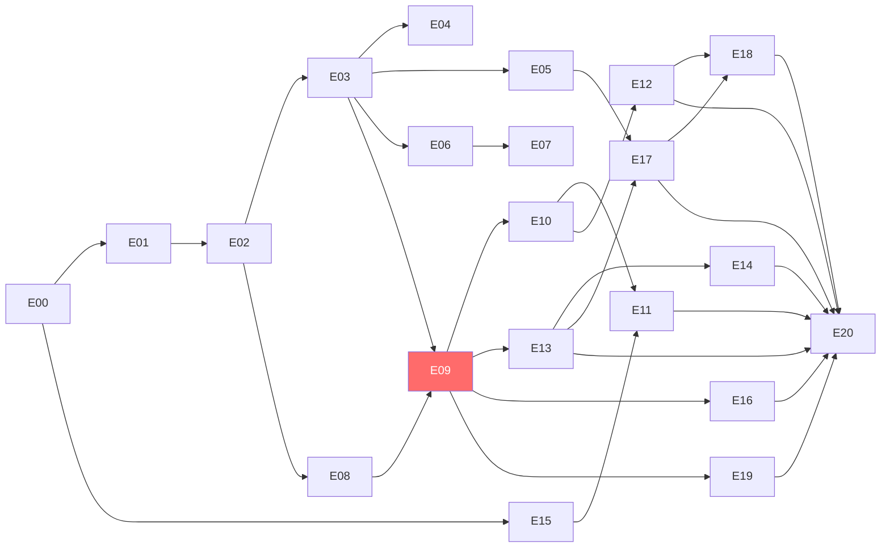
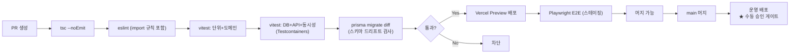

# DEEPPOINT SCM OS — 설계검토 08. 개발 백로그 · 테스트 전략

---

# 13. 개발 백로그

## 13.0 원칙

| 항목 | 내용 |
|---|---|
| **작업 크기** | 한 작업(Task)은 **한 번의 작업 세션에서 구현·테스트·보고**가 가능한 크기 (CLAUDE_01 §10) |
| **완료 보고** | 각 작업 종료 시 ① 구현한 요구사항 ID ② 변경 파일 목록 ③ DB 변경사항 ④ 구현한 업무규칙 ⑤ 테스트 목록·결과 ⑥ 실행한 검증 명령어 ⑦ 미구현·제한사항 ⑧ 수동 확인 필요사항 ⑨ 다음 작업 제안 |
| **순서** | 지시하신 19단계를 따르되, Release 1a / 1b로 분할 (§00 §1.3) |
| **차단 결정** | 백로그 표의 `선행조건`에 결정 항목(D-xx)을 명시했다 |

## 13.1 Release 1a — 원장 코어

### EPIC-00. 프로젝트 기반구조

| Epic | 작업 | 선행조건 | 완료조건 | 주요 테스트 |
|---|---|---|---|---|
| E00 | **T00-1** Next.js + TS + Tailwind + shadcn/ui 프로젝트 초기화, 모듈 폴더 구조(`modules/*/{domain,application,infrastructure,presentation}`) | — | `pnpm dev` 기동, `tsc --noEmit` 0건, 폴더 구조 생성 | 빌드 통과 |
| E00 | **T00-2** Prisma 설정, `DATABASE_URL`(pooler)/`DIRECT_URL` 분리, 로컬 Postgres(Docker) 기동 | T00-1 | `prisma migrate dev` 성공, 커넥션 확인 | 연결 스모크 |
| E00 | **T00-3** 공통 계층: `shared/db`(withTransaction), `shared/errors`(오류코드 체계), `shared/decimal`(number 변환 금지 ESLint 규칙) | T00-2 | 오류 클래스 5종, ESLint 규칙 동작 | 단위 |
| E00 | **T00-4** ESLint `no-restricted-imports` — 타 모듈이 `inventory_ledger_entry`/`inventory_balance` Prisma 모델 직접 import 차단 | T00-1 | 위반 코드가 lint 실패 | lint 규칙 테스트 |
| E00 | **T00-5** CI 파이프라인 (`tsc` → `eslint` → `vitest` → `migrate diff`), 환경 3분리(dev/stg/prod) | T00-2 | PR에서 CI 통과 | — |
| E00 | **T00-6** Testcontainers(Postgres) 설정 + Vitest 통합 테스트 하네스 | T00-2 | 실제 PG로 통합 테스트 1건 통과 | 하네스 자체 |
| E00 | **T00-7** pg-boss 잡 큐 + 워커 프로세스 스캐폴딩, 진행률 갱신 패턴 | T00-2 | 더미 잡 발행·소비·진행률 확인 | 잡 라이프사이클 |
| E00 | **T00-8** Supabase Storage 연동 (버킷 3종, signed URL) | T00-1 | 업로드·다운로드 성공 | 통합 |

### EPIC-01. 인증 · 사용자 · 권한

| Epic | 작업 | 선행조건 | 완료조건 | 주요 테스트 |
|---|---|---|---|---|
| E01 | **T01-1** `User`/`Role`/`Permission`/`RolePermission`/`UserRole` 스키마 + 마이그레이션 + 시드(역할 5종·권한 키) | T00-2 | 마이그레이션 재실행 가능, 시드 생성 | DB 테스트 |
| E01 | **T01-2** Supabase Auth 연동, 로그인·로그아웃, 세션 → `ActorContext` | T01-1 | 로그인 후 `/api/me`가 권한 반환 | API 통합 |
| E01 | **T01-3** Middleware 라우트 가드 + Application Service 권한 가드(2겹) | T01-2 | 권한 없는 접근 403 | **권한 테스트** |
| E01 | **T01-4** `system_setting` + `allow_self_approval` (재고 3종은 override 불가 하드코딩) | T01-1 | 설정 변경 반영, 재고조정은 항상 분리 | 단위 |
| E01 | **T01-5** `AuditLog` 스키마 + `AuditLogger`(트랜잭션 핸들 주입) + 불변성 트리거 | T01-1 | UPDATE/DELETE 시도 시 DB 예외 | DB 테스트 |
| E01 | **T01-6** 로그인 화면 + 사용자 관리 화면 | T01-3 | 사용자 CRUD·역할 배정 동작 | E2E |

### EPIC-02. 공통코드

| Epic | 작업 | 선행조건 | 완료조건 | 주요 테스트 |
|---|---|---|---|---|
| E02 | **T02-1** `common_code_group`/`common_code` 스키마 + API | T01-1 | 그룹별 코드 CRUD | API 통합 |
| E02 | **T02-2** 엑셀 코드사전 시드 (브랜드 2·대분류 13·소분류 19·부자재분류 39·보관처 11) ✏️ *(v0.1 집계 오기 — 실측 대분류 12·부자재분류 38, 01_AS-IS §1.6 정오)* | T02-1 | 시드 실행 시 전량 생성 | 마이그레이션 테스트 |
| E02 | **T02-3** 채널 마스터 16종 + `external_channel_mapping` (판매처 41 / 입고지 65) + **우선순위 규칙**(§00 G-06) | T02-1 | 판매처명 → 채널 해석 동작 | 단위 (매핑 우선순위) |
| E02 | **T02-4** 공통코드 화면 | T02-1 | 사용 중 코드 삭제 차단 | E2E |

### EPIC-03. SKU

| Epic | 작업 | 선행조건 | 완료조건 | 주요 테스트 |
|---|---|---|---|---|
| E03 | **T03-1** `Sku` 스키마 + 마이그레이션. `sku_code` **전역 UNIQUE** | T02-1 | 중복 코드 INSERT 시 DB 오류 | **TC-SKU-001** |
| E03 | **T03-2** SKU 도메인: 상태 전이 규칙, 코드 변경 차단(`hasTransaction`), `ARCHIVED` 조건 | T03-1 | 불변식 단위 테스트 통과 | **TC-SKU-007, TC-SKU-008** |
| E03 | **T03-3** SKU CRUD API + Zod DTO | T03-2 | 생성·조회·수정 동작 | API 통합 |
| E03 | **T03-4** 승인 워크플로 (submit/approve/reject/deactivate/archive) + 승인 전 검증 9종 | T03-3, T01-4 | 작성자=승인자 차단 | **TC-SKU-006**, 권한 테스트 |
| E03 | **T03-5** SKU 목록 화면 (검색 16종·열 16개·정렬·통합검색) | T03-3 | 검색·정렬 동작 | E2E |
| E03 | **T03-6** SKU 상세 화면 8탭 | T03-4 | 탭 전환·저장·상태 액션 | E2E |
| E03 | **T03-7** 코드 추천 API (자동 저장 안 함) | T03-3, T02-2 | 다음 일련번호 추천 + 중복 검증 | 단위 |

### EPIC-04. 바코드

| Epic | 작업 | 선행조건 | 완료조건 | 주요 테스트 |
|---|---|---|---|---|
| E04 | **T04-1** `SkuBarcode` 스키마 + **조건부 UNIQUE 2종**(raw SQL) | T03-1 | 활성 중복 차단, 대표 1개 강제 | **TC-SKU-004**, DB 테스트 |
| E04 | **T04-2** 바코드 정규화 함수 (문자열 강제·지수표기 탐지·센티넬 분류) | T00-3 | 정규화 케이스 12종 통과 | **TC-SKU-002, TC-SKU-003** |
| E04 | **T04-3** 바코드 CRUD API + 비활성화(물리삭제 금지) | T04-1 | DELETE가 status 변경만 수행 | API 통합 |
| E04 | **T04-4** 중복 예외 승인 API + 화면 | T04-3, T01-3 | 승인자·사유 기록 | **TC-SKU-005** |

### EPIC-05. 외부 상품 매핑

| Epic | 작업 | 선행조건 | 완료조건 | 주요 테스트 |
|---|---|---|---|---|
| E05 | **T05-1** `ExternalSystem`/`SkuExternalMapping` 스키마 + 조건부 UNIQUE | T03-1 | 동일 시스템 코드 중복 차단 | **TC-SKU-009** |
| E05 | **T05-2** 매핑 CRUD API. 코드 없이 상품명만 → `REVIEW_REQUIRED` 강제 | T05-1 | 상태 자동 판정 | 단위 |
| E05 | **T05-3** SKU 해석 서비스 (우선순위 ①코드 ②바코드 ③승인된 상품명 ④미매칭) | T05-2 | 우선순위 동작. **상품명 매핑은 자동 반영 불가 플래그** | **TC-INV-026** |
| E05 | **T05-4** 매핑 화면 + 미매칭 목록 + 일괄 매핑 | T05-2 | 미매칭 해소 동작 | E2E |

### EPIC-06. 거래처 · 공급조건

| Epic | 작업 | 선행조건 | 완료조건 | 주요 테스트 |
|---|---|---|---|---|
| E06 | **T06-1** `Supplier`/`SupplierSku`/`SupplierSkuPrice` 스키마 | T03-1 | 적용기간 중첩 차단 | DB 테스트 |
| E06 | **T06-2** 공급조건 API. `leadTimeDays` nullable, **0 대체 금지** | T06-1 | null 유지 확인 | 단위 |
| E06 | **T06-3** 가격이력 API + 기준일 유효가격 조회 + 승인 | T06-1 | `asOf` 기준 정확한 단가 반환 | 단위 |
| E06 | **T06-4** 거래처·공급조건 화면 | T06-2 | CRUD 동작 | E2E |

### EPIC-07. BOM

| Epic | 작업 | 선행조건 | 완료조건 | 주요 테스트 |
|---|---|---|---|---|
| E07 | **T07-1** `BomHeader`/`BomLine` 스키마 + `(parentSkuId, version)` UNIQUE + **활성기간 EXCLUDE 제약**(raw SQL) | T03-1 | 활성 기간 중첩 INSERT 차단 | **TC-BOM-004**, DB 테스트 |
| E07 | **T07-2** BOM 도메인: 순환 탐지(DFS), 검증규칙 14종 | T07-1 | 순환 3단계 탐지 | **TC-BOM-001, TC-BOM-007** |
| E07 | **T07-3** BOM CRUD API. **활성 BOM 수정 차단** | T07-2 | ACTIVE PATCH 시 422 | **TC-BOM-005** |
| E07 | **T07-4** 소요량 관리: `quantityPer` nullable + `quantityStatus` 3단계, **자동 1 금지**, `packQuantity` 분리 | T07-3 | `pack=30`, `qty=1/30` 별도 저장. 소요량 0·음수 차단 | **TC-BOM-002, TC-BOM-003, TC-BOM-010** |
| E07 | **T07-5** 승인·활성화·복사(버전 생성) 워크플로 | T07-3, T01-4 | 활성 BOM 변경 시 신규 버전 강제 | **TC-BOM-006** |
| E07 | **T07-6** BOM 다단계 전개 (재귀, 순환 방어, maxLevel) | T07-2 | 3단계 전개 정확 | **TC-BOM-008** |
| E07 | **T07-7** BOM 원가 계산 (기준일 유효 가격이력, 미확정 시 `잠정`) | T07-6, T06-3 | 박스 단가 = 가격÷입수량 | **TC-BOM-009** |
| E07 | **T07-8** BOM 목록·상세 화면 + **소요량 일괄 확정 UI** | T07-4 | 383행 확정 워크플로 동작 | E2E |

### EPIC-08. 창고

| Epic | 작업 | 선행조건 | 완료조건 | 주요 테스트 |
|---|---|---|---|---|
| E08 | **T08-1** `Warehouse`/`WarehouseLocation` 스키마 + `(warehouseId, code)` UNIQUE | T02-1 | | DB 테스트 |
| E08 | **T08-2** 창고 생성 시 **DEFAULT 로케이션 자동 생성** (동일 트랜잭션) | T08-1 | 생성 직후 `defaultLocationId` NOT NULL | 통합 |
| E08 | **T08-3** 창고 화면 | T08-2 | 재고 존재 시 비활성 차단 | E2E |

### EPIC-09. 재고거래원장 ★

| Epic | 작업 | 선행조건 | 완료조건 | 주요 테스트 |
|---|---|---|---|---|
| E09 | **T09-1** `InventoryTransaction`/`InventoryLedgerEntry`/`InventoryBalance` 스키마 + **NULL 정규화 센티넬** + 재고키 UNIQUE + 조건부 UNIQUE 3종 + `CHECK` 2종 + **불변성 트리거** | T03-1, T08-1 | 원장행 UPDATE 시 DB 예외 / 동일 재고키 중복 balance INSERT 차단 | DB 테스트 (§00 C-09) |
| E09 | **T09-2** `business_date` 파생 로직 (KST) + 유틸 | T00-3 | UTC 2026-09-01T00:00Z → `2026-09-01` KST 09:00 = 동일일 검증 | 단위 (경계값) |
| E09 | **T09-3** **`InventoryPostingService` 골격** — 입력 DTO, 검증 순서 ①~⑨(트랜잭션 밖) | T09-1, T09-2 | 검증 실패 시 DB 무변경 | 단위 |
| E09 | **T09-4** 재고상태 전이 검증 (허용 전이표 + 금지 전이 6종) | T09-3 | 허용/금지 전이 전수 테스트 | **TC-INV-010** |
| E09 | **T09-5** LOT·유통기한·시리얼 검증 | T09-3 | LOT 필수 SKU가 LOT 없이 입고 시 차단 | **TC-INV-018** |
| E09 | **T09-6** **행 잠금 + 음수재고 검증 + balance 원자 갱신** (잠금 순서 고정) | T09-3 | 재고 10에서 11 출고 차단 | **TC-INV-002, TC-INV-003, TC-INV-004** |
| E09 | **T09-7** 원장·balance·감사로그 **단일 트랜잭션** + 롤백 | T09-6, T01-5 | balance 갱신 실패 시 원장행도 롤백 | **TC-INV-005** |
| E09 | **T09-8** 멱등성 (`idempotencyKey` 생성·조회·중복 시 기존 결과 반환) | T09-7 | 동일 키 2회 호출 시 거래 1건 | **TC-INV-025** |
| E09 | **T09-9** **동시성**: 재시도(40001/40P01, 3회 백오프), 데드락 방지 | T09-6 | 동시 출고 2건에도 음수 미발생 | **TC-INV-006** (동시성) |
| E09 | **T09-10** **반대거래(`reverse`)** + 재취소 차단 + 원거래 `REVERSED` 전환 | T09-7 | 원거래 유지 + 반대거래 생성 | **TC-INV-012, TC-INV-013, TC-INV-014** |
| E09 | **T09-11** 음수재고 예외 5요건 검증 + `InventoryException` 생성 | T09-6 | 5요건 미충족 시 차단 | 단위 |
| E09 | **T09-12** 마감기간 검증 훅 (E13에서 실동작) | T09-3 | 마감월 거래 차단 | **TC-INV-028** |

### EPIC-10. 현재고 · 원장 조회

| Epic | 작업 | 선행조건 | 완료조건 | 주요 테스트 |
|---|---|---|---|---|
| E10 | **T10-1** 현재고 조회 API (재고상태별·LOT별 집계, 파생 수량 9종) | T09-1 | 가용/실물/총보유 정확 | 단위 |
| E10 | **T10-2** **기준일 재고 조회** (원장 집계 / 스냅샷, **역산 금지**) | T09-1 | 과거 기준일 = 당시 원장 합계 | **TC-INV-023** |
| E10 | **T10-3** 원장 조회 API + `거래 후 잔량` 윈도우 함수 계산 | T09-1 | 정렬 결정성 확인 | 단위 |
| E10 | **T10-4** **원장 재구축 잡** + 대조 + 검증보고서 + `BALANCE_REBUILD_DIFFERENCE` 예외 | T09-1, T00-7 | 재집계 = balance | **TC-INV-007** |
| E10 | **T10-5** `inventory_daily_snapshot` 배치 (02:00 KST Cron) | T09-1, T00-7 | 전일 스냅샷 생성 | 통합 |
| E10 | **T10-6** 현재고 화면 (**수량 직접 편집 UI 미제공**) | T10-1 | 편집 컨트롤 부재 확인 | E2E |
| E10 | **T10-7** 재고거래원장 화면 + 상세 패널 + 취소 | T10-3, T09-10 | 취소 후 잔량 복원 | E2E |
| E10 | **T10-8** 엑셀 다운로드 (대량은 비동기 잡) | T10-1, T00-7 | 10,000행 다운로드 | 성능 |

### EPIC-11. 기초재고

| Epic | 작업 | 선행조건 | 완료조건 | 주요 테스트 |
|---|---|---|---|---|
| E11 | **T11-1** `OpeningBalanceBatch/Line` 스키마 + `(openingDate, warehouseId) WHERE POSTED` UNIQUE | T09-1 | 중복 배치 차단 | DB 테스트 |
| E11 | **T11-2** 배치 생성·업로드·검증 API | T11-1, E15 | 검증 오류 목록 반환 | API 통합 |
| E11 | **T11-3** 승인 → **`OPENING_BALANCE` 반영** (Posting Service 호출) | T11-2, T09-7 | 원장 +100 / 현재고 100 동시 생성 | **TC-INV-001** |
| E11 | **T11-4** 음수 라인 관리자 예외 승인 경로 | T11-3, T09-11 | 예외 승인 없이 반영 차단 | 통합 |
| E11 | **T11-5** 오픈일 이전 일반거래 차단 | T11-3 | 차단 확인 | 단위 |
| E11 | **T11-6** 기초재고 화면 (5단계 위저드) | T11-3 | 전체 흐름 동작 | E2E |

### EPIC-12. 수불부

| Epic | 작업 | 선행조건 | 완료조건 | 주요 테스트 |
|---|---|---|---|---|
| E12 | **T12-1** 수불부 집계 쿼리 (기초·입고·출고·조정·기말 + 거래유형·출고목적·채널 분해) | T09-1 | 기초100+입고50-출고30-조정5=115 | **TC-INV-021** |
| E12 | **T12-2** 검증차이 계산 + `STATEMENT_VALIDATION_DIFFERENCE` 예외 | T12-1 | 검증차이 항상 0 | **TC-INV-022** |
| E12 | **T12-3** 일별·월별·기간별 API | T12-1 | 5초 이내 | 성능 |
| E12 | **T12-4** **S&OP형 피벗 조회** (저장 아님) | T12-1 | SKU×월 피벗 반환 | API 통합 |
| E12 | **T12-5** 수불부 화면 + 드릴다운 + 엑셀 | T12-3 | 셀 클릭 → 원장 이동 | E2E |
| E12 | **T12-6** 예상재고 화면 (확정/계획 색상 구분) | T10-1 | 계획값이 원장과 시각 구분 | E2E |

### EPIC-15. 엑셀 업로드 · 마이그레이션 (E11 선행이므로 앞당김)

| Epic | 작업 | 선행조건 | 완료조건 | 주요 테스트 |
|---|---|---|---|---|
| E15 | **T15-1** `ImportJob`/`ImportRow` 스키마 + `fileHash` UNIQUE | T00-2 | 동일 해시 중복 경고 | **TC-INV-024** |
| E15 | **T15-2** exceljs 스트리밍 파서 + **셀 문자열 강제** + 열 매핑 | T00-3 | 지수표기 미발생 | 단위 |
| E15 | **T15-3** 업로드 잡 파이프라인 (parse→validate→post, 청크 500행) | T15-2, T00-7 | 10,000행 처리·진행률 | 성능 |
| E15 | **T15-4** 오류행 저장 + **오류행 xlsx 다운로드** | T15-3 | 원본+오류코드 열 포함 | API 통합 |
| E15 | **T15-5** 업로드 화면 5단계 위저드 | T15-3 | 전체 흐름 | E2E |
| E15 | **T15-6** `DataIssue` 큐 + 화면 | T15-3 | OPEN→RESOLVED/WAIVED | E2E |
| E15 | **T15-7** **마이그레이션 도구 Phase 1~3** (공통코드·사용자·창고) | T15-3, E02, E08 | 검증보고서 PASS | 마이그레이션 테스트 |
| E15 | **T15-8** **Phase 4~6** (SKU 490 / 바코드 / 외부매핑) | T15-7, E03~E05 | 490=490, 중복 0 | **마이그레이션 테스트** |
| E15 | **T15-9** **Phase 7~8** (거래처·공급조건·BOM 80/383) | T15-8, E06, E07 | **활성 BOM 0건**, 소요량 미확정 383 목록 | 마이그레이션 테스트 |
| E15 | **T15-10** **Phase 9** (참조 데이터: `legacy_sop_plan`, 출고이력, 일별마감재고 long 변환) | T15-8 | 가상 원장거래 0건 확인 | 마이그레이션 테스트 |
| E15 | **T15-11** **Phase 10~12** (3PL 대사 → 기초재고 확정 → 검증보고서) | T15-9, E11, E17 | 창고별·SKU별·상태별 수량 일치 | **마이그레이션 테스트** |
| E15 | **T15-12** `migration_source_row` 추적 + **Phase 롤백 도구** | T15-7 | 원본 행 100% 추적, 롤백 동작 | 통합 |

---

## 13.2 Release 1b — 재고 운영

### EPIC-13. 재고조정

| Epic | 작업 | 선행조건 | 완료조건 | 주요 테스트 |
|---|---|---|---|---|
| E13 | **T13-1** `StockAdjustment`/`Line` 스키마 (from·to 재고키) | T09-1 | | DB 테스트 |
| E13 | **T13-2** 조정 도메인: 6유형, **LOT·창고 정정은 버킷 이동 쌍 강제** | T13-1 | 직접 필드수정 경로 부재 | **TC-INV-020** |
| E13 | **T13-3** 요청·승인·관리자 추가승인·반영 API | T13-2, T09-7 | 요청자≠승인자 강제(override 불가) | 권한 테스트 |
| E13 | **T13-4** 조정 화면 (좌·우 2열 대조 폼) | T13-3 | 전체 흐름 | E2E |

### EPIC-14. 재고실사

| Epic | 작업 | 선행조건 | 완료조건 | 주요 테스트 |
|---|---|---|---|---|
| E14 | **T14-1** `StockCount`/`Line` 스키마 | T09-1 | | DB 테스트 |
| E14 | **T14-2** 실사 시작 시 **`baselineAt` 고정 + 장부 스냅샷** | T14-1 | 스냅샷 정확 | 통합 |
| E14 | **T14-3** **롤포워드 차이 계산** (`실사 − 기준시점장부 − 이후순거래`) | T14-2 | 실사 중 거래 발생해도 정확 | **TC-INV-031** |
| E14 | **T14-4** 승인 → `STOCK_COUNT_ADJUSTMENT` 반영. **승인 전 거래 생성 금지** | T14-3, T13-3 | 승인 전 거래 0건 | **TC-INV-032, TC-INV-033** |
| E14 | **T14-5** 실사 화면 + 모바일 바코드 스캔 입력 | T14-4 | 모바일 웹 동작 | E2E |

### EPIC-16. 예약 · 홀딩

| Epic | 작업 | 선행조건 | 완료조건 | 주요 테스트 |
|---|---|---|---|---|
| E16 | **T16-1** `InventoryReservation`/`InventoryHold` 스키마 | T09-1 | | DB 테스트 |
| E16 | **T16-2** 예약 서비스 (내부 전용, REST 미노출). `AVAILABLE −Q` / `RESERVED +Q` | T16-1, T09-4 | 가용 100 중 30 예약 → 70/30 | **TC-INV-008, TC-INV-009** |
| E16 | **T16-3** 홀딩 요청·승인·해제 API + 원인문서(`MANUAL_HOLD_REQUEST`) | T16-2 | HOLD 재고 판매출고 차단 | **TC-INV-011** |
| E16 | **T16-4** 예약·홀딩 화면 | T16-3 | | E2E |

### EPIC-17. 3PL 스냅샷 · 재고대사

| Epic | 작업 | 선행조건 | 완료조건 | 주요 테스트 |
|---|---|---|---|---|
| E17 | **T17-1** `ExternalInventorySnapshot`/`Line` 스키마 (원본 그대로) | T05-1, T08-1 | | DB 테스트 |
| E17 | **T17-2** 스냅샷 업로드 + SKU 매핑 (우선순위 4단계) | T17-1, T15-3, T05-3 | 미매칭 예외 생성 | 통합 |
| E17 | **T17-3** 대사 실행 잡 + **차이 분류 9종** + 허용오차 | T17-2, T10-2 | 동일 기준시점 비교 정확 | 단위 |
| E17 | **T17-4** 담당자 배정·해결·조정 요청. **자동 조정 경로 부재** | T17-3, T13-3 | 차이가 있어도 자동 조정 0건 | **TC-INV-027** |
| E17 | **T17-5** 대사 화면 | T17-4 | | E2E |

### EPIC-18. 월마감

| Epic | 작업 | 선행조건 | 완료조건 | 주요 테스트 |
|---|---|---|---|---|
| E18 | **T18-1** `InventoryClose`/`InventoryCloseWarehouse` 스키마 | T09-1 | | DB 테스트 |
| E18 | **T18-2** **사전검증 8종** 잡 | T18-1, T12-2, T17-3 | 8종 결과 반환 | **TC-INV-030** |
| E18 | **T18-3** 마감 실행 + 마감 스냅샷 + **거래 차단 활성화** | T18-2, T09-12 | 마감월 거래 422 | **TC-INV-028** |
| E18 | **T18-4** 마감 해제 (관리자 + 재인증 + 사유 + 이력) | T18-3 | 사유·이력 저장 | **TC-INV-029** |
| E18 | **T18-5** 월마감 화면 | T18-4 | | E2E |

### EPIC-19. 예외관리 · 대시보드

| Epic | 작업 | 선행조건 | 완료조건 | 주요 테스트 |
|---|---|---|---|---|
| E19 | **T19-1** `InventoryException` 스키마 + 상태머신 6종 | T09-1 | | DB 테스트 |
| E19 | **T19-2** 예외 자동 생성·자동 해소 훅 (Posting·대사·업로드) | T19-1, T09-11 | 음수 해소 시 자동 종결 | 통합 |
| E19 | **T19-3** 예외 큐 화면 (배정·해결·면제) | T19-2 | | E2E |
| E19 | **T19-4** 재고 대시보드 KPI 11종 + 예외 목록 9종 | T19-2, T10-1 | 3초 이내 | 성능 |

### EPIC-20. 통합 테스트 · 배포

| Epic | 작업 | 선행조건 | 완료조건 | 주요 테스트 |
|---|---|---|---|---|
| E20 | **T20-1** 전체 인수조건 33종 E2E 시나리오 | 전 Epic | 33종 통과 | E2E |
| E20 | **T20-2** 동시성·성능 테스트 스위트 | T09-9, T12-3 | 성능 목표 6종 충족 | 성능 |
| E20 | **T20-3** **스테이징 마이그레이션 리허설 2회** + 보고서 대조 | T15-11 | 두 보고서 동일 | 마이그레이션 |
| E20 | **T20-4** 시드 데이터 + README (로컬 실행·배포 절차) | 전 Epic | 신규 개발자가 30분 내 기동 | 문서 |
| E20 | **T20-5** 운영 배포 + 병행 운영 대시보드 | T20-3 | 배포 성공, 롤백 절차 확인 | — |

## 13.3 의존 순서 요약

---

# 14. 테스트 전략

## 14.1 테스트 층위

| 층 | 도구 | 대상 | 실행 | 비중 |
|---|---|---|---|---|
| **단위** | Vitest | 도메인 순수 함수 — 상태전이, 순환탐지, 바코드 정규화, 수량 계산, `business_date` 파생, 소요량 검증 | 매 PR | 40% |
| **도메인** | Vitest | 애그리거트 불변식 — SKU 상태머신, BOM 검증 14종, 조정 유형별 규칙 | 매 PR | 15% |
| **API 통합** | Vitest + Testcontainers | Route Handler ↔ Service ↔ 실제 PG | 매 PR | 20% |
| **DB** | Vitest + Testcontainers | 제약조건 — 조건부 UNIQUE, EXCLUDE, CHECK, 불변성 트리거, FK | 매 PR | 10% |
| **동시성** | Vitest + Testcontainers | 병렬 Posting, 데드락, 재시도 | 매 PR | 5% |
| **중복수집** | Vitest + Testcontainers | 파일 해시, 멱등키, 행 단위 스킵 | 매 PR | 3% |
| **마이그레이션** | Vitest + Testcontainers + **실제 엑셀 사본** | Phase 1~12 전체 | 야간 + 릴리즈 전 | 4% |
| **E2E** | Playwright | 핵심 사용자 시나리오 | 야간 + 릴리즈 전 | 2% |
| **권한** | Vitest (API 통합) | 역할 5종 × 주요 엔드포인트 | 매 PR | 1% |
| **성능** | k6 또는 Vitest bench | 성능 목표 6종 | 릴리즈 전 | — |

> **Testcontainers가 필수인 이유**: 조건부 UNIQUE 인덱스, `EXCLUDE USING gist`, `SELECT FOR UPDATE`, 트리거, 윈도우 함수는 SQLite나 mock으로 검증할 수 없다. 이 시스템의 정합성 보장은 전부 이 기능들에 의존한다.

## 14.2 층위별 상세

### 단위 테스트 (핵심 케이스)

| 대상 | 케이스 |
|---|---|
| 바코드 정규화 | 정상 / `-` / 공란 / `확인필요` / `확인불가` / 지수표기 / 앞자리0 / 공백·하이픈 / 숫자타입 입력(파서 버그 탐지) |
| `business_date` 파생 | UTC 15:00 → KST 익일 00:00 = 익일 / UTC 14:59 → 당일 / 월말·연말 경계 / DST 없음 확인 |
| 상태전이 | 허용 17종 전수 + 금지 6종 전수 |
| BOM 순환 탐지 | 자기참조 / 2단계 / 3단계 / 다이아몬드(순환 아님) / maxLevel 초과 |
| 소요량 | 0 차단 / 음수 차단 / `1/30` 정밀도 / `pack_quantity` 미전환 |
| 수량 파생 | 가용 / 정상 / 실물(IN_TRANSIT 제외) / 총보유(포함) |
| 채널 매핑 우선순위 | 판매처 우선 → 입고지 보조 → 미매칭 |
| 지급조건 파서 (R2) | 8패턴 |

### DB 테스트 (제약조건)

| 제약 | 검증 |
|---|---|
| `sku_code` 전역 UNIQUE | 중복 INSERT 실패 |
| 바코드 조건부 UNIQUE | 활성+비예외 중복 실패 / **예외 승인 시 성공** / 비활성 중복 성공 |
| 대표 바코드 조건부 UNIQUE | SKU당 2개 대표 실패 |
| **`inventory_balance` 재고키 UNIQUE** | 동일 재고키 2행 INSERT 실패. **`lot_no=''` 센티넬로 NULL 문제 회피 확인** |
| 원장 불변성 트리거 | UPDATE·DELETE 시 예외 |
| `audit_log` 불변성 | 동일 |
| `quantity_delta <> 0` CHECK | 0 INSERT 실패 |
| 원인문서 CHECK | `OPENING_BALANCE` 외 `source_document_type` NULL이면 실패 |
| `idempotency_key` 조건부 UNIQUE | 중복 실패 / NULL 다중 성공 |
| `reversal_of_id` 조건부 UNIQUE | 동일 거래 2회 취소 실패 |
| BOM 활성기간 EXCLUDE | 중첩 활성 BOM 실패 |
| 기초재고 배치 조건부 UNIQUE | 동일 오픈일·창고 POSTED 2건 실패 |

### 동시성 테스트

| 시나리오 | 기대 |
|---|---|
| 재고 100, 출고 60 × 2건 동시 | **1건 성공, 1건 `INSUFFICIENT_STOCK`.** 음수 미발생 (TC-INV-006) |
| 재고 100, 출고 30 × 10건 동시 | 총 300 > 100 → 3건만 성공, balance = 10 |
| 신규 재고키에 동시 입고 2건 | balance 행 1개, 수량 합산 정확 |
| 동일 멱등키 동시 요청 2건 | 거래 1건, 둘 다 동일 결과 반환 |
| 다중 재고키 거래 교차 (A→B / B→A) | **데드락 미발생** (잠금 순서 고정 검증) |
| 재구축 중 Posting 시도 | `posting_frozen`으로 대기 또는 거부 |

### 중복수집 테스트

| 시나리오 | 기대 |
|---|---|
| 동일 파일 2회 업로드 | 해시 중복 경고 (TC-INV-024) |
| 강행 후 반영 | 행 단위 `POSTED` 스킵 → 원장 중복 0 |
| 동일 외부거래 ID 2회 | 원장 1건 (TC-INV-025) |
| 실패 후 재처리 | 성공 행 스킵, 실패 행만 처리 |
| 청크 중간 실패 | 이전 청크 유지, `PARTIALLY_COMPLETED` |

### 마이그레이션 테스트

| 대상 | 검증 |
|---|---|
| **실제 엑셀 5종 사본** 투입 | Phase 1~12 완주 |
| SKU | 490 = 490, 중복 0, 상품명 누락 0 |
| 바코드 | 중복 2건 예외 처리, `확인필요`·`확인불가` 5건 이슈, **`-` 376건은 이슈 미생성** |
| BOM | 80 헤더 / 383 라인, **활성 BOM 0건**, 소요량 미확정 383 목록 |
| 기초재고 | 창고별·SKU별·상태별 수량 일치, **음수 6건 예외 승인 기록 존재** |
| 추적 | `migration_source_row` 100% |
| **재실행** | 2회 실행 시 동일 결과 (멱등성) |
| **롤백** | Phase 8 롤백 후 재실행 → 동일 결과 |
| 가상 거래 | **월별 합계 기반 원장거래 0건** |

### E2E 테스트 (Playwright)

| # | 시나리오 |
|---|---|
| E2E-01 | 로그인 → 대시보드 → 권한별 메뉴 노출 확인 |
| E2E-02 | SKU 신규 등록 → 바코드 추가 → 승인 요청 → (리더) 승인 → ACTIVE |
| E2E-03 | 중복 바코드 등록 시도 → 차단 → 예외 승인 → 저장 |
| E2E-04 | SKU 엑셀 업로드 → 오류 미리보기 → 정상 행만 반영 → 오류행 다운로드 |
| E2E-05 | BOM 생성 → 라인 추가 → 소요량 일괄 확정 → 승인 → 활성화 |
| E2E-06 | 활성 BOM 수정 시도 → 차단 → 버전 생성 → 승인 → 활성화 (구 버전 자동 INACTIVE) |
| E2E-07 | 기초재고 배치 → 엑셀 업로드 → 검증 → 승인 → 반영 → 현재고 확인 |
| E2E-08 | 재고조정 요청 → 승인 → 반영 → 원장·현재고 확인 |
| E2E-09 | 원장에서 거래 취소 → 반대거래 생성 확인 → 현재고 복원 |
| E2E-10 | 재고실사 시작 → 실사 중 출고 발생 → 완료 → **롤포워드 차이 정확** → 승인 → 반영 |
| E2E-11 | 3PL 스냅샷 업로드 → 대사 → 차이 확인 → 조정 요청 → 승인 |
| E2E-12 | 월마감 사전검증 → 마감 → 마감월 거래 시도 차단 → 관리자 마감 해제 |
| E2E-13 | 홀딩 요청 → 승인 → HOLD 재고 출고 시도 차단 → 해제 |
| E2E-14 | 수불부 조회 → 검증차이 0 확인 → 셀 드릴다운 → 원장 이동 |
| E2E-15 | 담당자가 승인 시도 → 403 (권한 분리 확인) |

### 권한 테스트

역할 5종 × 주요 엔드포인트 40종 = 매트릭스 전수 검증. 특히:
- SCM 담당자가 승인 API 호출 → 403
- 작성자가 자기 SKU 승인 → 403 (`allow_self_approval=false`)
- **SCM 리더가 마감 해제 → 403** (관리자 전용)
- 재무가 SKU 작성 → 403
- 경영진이 조정 요청 → 403

### 성능 테스트

| 목표 | 기준 | 데이터 규모 |
|---|---|---|
| SKU 현재고 단건 조회 | **2초** | 490 SKU × 5 창고 |
| 현재고 목록 조회 | **3초** | 2,500 행 |
| 월 수불부 조회 | **5초** | 490 SKU × 1개월 |
| 특정일 500 SKU 재고 | **5초** | 원장 100만 행 |
| 10,000행 파일 검증 | **2분** | |
| 10,000행 원장 반영 | 비동기 + 진행률 | |
| 일반 목록 조회 | 3초 | |
| 단일 거래 저장 | 2초 | |

## 14.3 PRD 인수조건 ↔ 테스트 매핑

### SKU·BOM PRD §37 인수조건

| 인수조건 | 검증 테스트 |
|---|---|
| 기존 최종 SKU를 누락 없이 이전 | 마이그레이션 (490=490) |
| SKU 코드 중복 차단 | **TC-SKU-001** (DB), T03-1 |
| 바코드를 문자열로 보존 | **TC-SKU-002** (단위), T04-2 |
| 바코드 중복·확인필요 식별 | **TC-SKU-003, TC-SKU-004** |
| ERP·WMS·3PL 별칭 별도 관리 | **TC-SKU-009**, E2E-02 |
| 승인 전후 상태 정상 작동 | **TC-SKU-006**, E2E-02 |
| 거래 이력 SKU 코드 변경 차단 | **TC-SKU-007** (도메인) |
| 변경이력 조회 | E2E-02 (변경이력 탭) |
| 상위·구성품을 내부 ID로 연결 | T07-1 (DB FK) |
| 구성품 소요량 필수 관리 | **TC-BOM-002, TC-BOM-010** |
| 포장입수량과 소요량 분리 | **TC-BOM-003** |
| 공용 부자재를 단일 SKU로 연결 | **TC-BOM-008** |
| BOM 버전·적용기간 관리 | **TC-BOM-004** (EXCLUDE 제약) |
| 활성 BOM 직접 수정 불가 | **TC-BOM-005**, E2E-06 |
| 순환 BOM 차단 | **TC-BOM-007** (단위) |
| 공급업체·MOQ·리드타임·가격 별도 관리 | T06-1~3 |
| 기준일별 BOM 원가 조회 | **TC-BOM-009**, T07-7 |
| 엑셀 BOM을 DRAFT로 이전 | 마이그레이션 (활성 0건) |
| TypeScript 오류 0건 | CI (`tsc --noEmit`) |
| DB 마이그레이션 재실행 가능 | CI + 마이그레이션 테스트 |
| 시드 데이터 제공 | T20-4 |
| README 작성 | T20-4 |

### 재고 PRD §32 인수조건

| 인수조건 | 검증 테스트 |
|---|---|
| 불변 재고원장 구현 | DB 테스트 (트리거) |
| 현재고가 원장에 의해 계산 | **TC-INV-007** (재집계 일치) |
| 현재고 직접수정 기능 없음 | E2E-07 (편집 컨트롤 부재) + 코드 리뷰 |
| 기초재고 승인 후 반영 | **TC-INV-001**, E2E-07 |
| 재고상태별 수량 조회 | T10-1 (단위) |
| 일별·월별 수불부 생성 | **TC-INV-021, TC-INV-022** |
| 특정일 기준 재고 조회 | **TC-INV-023** |
| 반대거래로 취소 | **TC-INV-012, TC-INV-013, TC-INV-014** |
| 수동조정 승인 프로세스 | E2E-08, 권한 테스트 |
| 재고실사·차이조정 | **TC-INV-031, TC-INV-032, TC-INV-033**, E2E-10 |
| 월마감·마감해제 | **TC-INV-028, TC-INV-029, TC-INV-030**, E2E-12 |
| 3PL 스냅샷 업로드·대사 | **TC-INV-027**, E2E-11 |
| 외부파일 중복반영 차단 | **TC-INV-024, TC-INV-025** |
| 예외 큐 조회·처리 | E2E-11, T19-3 |
| **원장 재집계 = balance 100%** | **TC-INV-007** + 정합성 배치 |
| **승인 없는 음수재고 0건** | **TC-INV-003, TC-INV-004, TC-INV-006** |
| **확정거래 물리삭제 0건** | DB 트리거 테스트 |
| **동일 외부거래 중복 0건** | **TC-INV-025** |
| **수불 검증차이 0** | **TC-INV-022** |
| **원인문서 없는 일반거래 0건** | DB CHECK 제약 테스트 |
| 핵심 도메인 단위테스트 | Vitest 커버리지 |
| Posting Service 통합테스트 | T09-3~12 |
| 동시성 테스트 | **TC-INV-006** |
| Playwright E2E | E2E-01~15 |
| LOT 필수 검증 | **TC-INV-018** |
| LOT별 별도 balance | **TC-INV-019** (DB 재고키 UNIQUE) |
| LOT 정정은 버킷 이동 | **TC-INV-020** |
| 상태전이 차단 | **TC-INV-010, TC-INV-011** |
| 예약 상태이동 | **TC-INV-008, TC-INV-009** |
| 창고이동 (R3) | TC-INV-015~017 (R3 이월) |
| 상품명만으로 자동 반영 금지 | **TC-INV-026** |
| 트랜잭션 롤백 | **TC-INV-005** |

## 14.4 커버리지 목표

| 영역 | 목표 |
|---|---|
| `modules/*/domain/` (순수 도메인) | **95%** |
| `InventoryPostingService` | **100%** (분기 포함) |
| `modules/*/application/` | 85% |
| API Route Handler | 80% |
| 화면 컴포넌트 | E2E로 대체 (단위 커버리지 목표 없음) |
| 전체 | 80% |

## 14.5 CI/CD 게이트

| 게이트 | 차단 조건 |
|---|---|
| `tsc` | 오류 1건 이상 |
| `eslint` | 오류 1건 이상. **`no-restricted-imports` 위반은 무조건 차단** |
| 단위·도메인 | 실패 1건 이상 |
| DB·API·동시성 | 실패 1건 이상 |
| `migrate diff` | 스키마와 마이그레이션 불일치 |
| E2E | 실패 1건 이상 (야간 또는 릴리즈 전) |
| 마이그레이션 | 야간 실행. 실패 시 알림 (PR 차단 아님) |
| 운영 배포 | **수동 승인 필수** |
