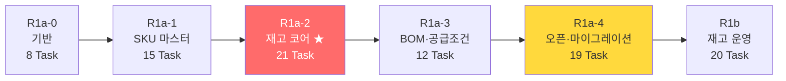
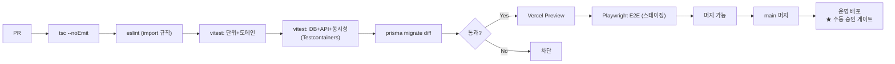

# DEEPPOINT SCM OS — 설계검토 08. 개발 백로그 · 테스트 전략 **(v0.2)**

> **v0.1 대비 변경** — ✏️ 표기
> ① **Release 1a → R1a-0 ~ R1a-4 재분할** (§13.1)
> ② **pg-boss·Supabase Storage를 R1a-0 → R1a-4로 이동**
> ③ SKU 엑셀 업로드를 **동기 처리**로 전환 (R1a-1, 워커 불필요)
> ④ **테스트 케이스 10종 추가** — `TC-POST-101~105`(재고키 합산), `TC-POST-201~205`(REVERSAL 재취소)
> ⑤ 단계별 **완료조건(Exit Criteria)** 명시

---

# 13. 개발 백로그

## 13.0 원칙

| 항목 | 내용 |
|---|---|
| **작업 크기** | 한 작업(Task)은 **한 번의 작업 세션에서 구현·테스트·보고** 가능한 크기 |
| **완료 보고** | ① 요구사항 ID ② 변경 파일 ③ DB 변경 ④ 구현한 업무규칙 ⑤ 테스트 목록·결과 ⑥ 실행한 검증 명령어 ⑦ 미구현·제한사항 ⑧ 수동 확인 필요사항 ⑨ 다음 작업 제안 |
| ✏️ **단계 게이트** | **R1a-N의 완료조건을 전부 충족하기 전에는 R1a-(N+1)에 착수하지 않는다** |
| ✏️ **인프라 지연 도입** | pg-boss·Storage는 실제로 필요해지는 R1a-4에서 구현한다. 조기 도입은 운영·디버깅 대상만 늘린다 |

## 13.1 ✏️ 단계 구조

---

## R1a-0 — 기반

### 완료조건 (Exit Criteria)

| # | 조건 | 검증 방법 |
|---|---|---|
| 1 | `pnpm dev` 기동, `tsc --noEmit` 오류 0건 | CI |
| 2 | 모듈 폴더 구조(`domain`/`application`/`infrastructure`/`presentation`) 생성 | 코드 리뷰 |
| 3 | Prisma 마이그레이션 재실행 가능(`migrate reset` → `deploy` 성공) | CI |
| 4 | 로그인 → `/api/me`가 역할·권한 반환 | API 통합 테스트 |
| 5 | 권한 없는 라우트·API 접근 시 403 | 권한 테스트 매트릭스 |
| 6 | `audit_log` UPDATE/DELETE 시도 시 DB 예외 | DB 테스트 |
| 7 | **Testcontainers 실제 PostgreSQL로 통합 테스트 통과** | CI |
| 8 | 공통코드 CRUD 동작, 코드사전 시드 전량 생성 | 통합 테스트 |
| 9 | `system_setting` 조회·변경 API 동작, `cutover_date` NULL 상태 확인 | 통합 테스트 |
| 10 | ESLint `no-restricted-imports`가 위반 코드를 차단 | lint 규칙 테스트 |

### 작업

| Epic | 작업 | 선행조건 | 완료조건 | 주요 테스트 |
|---|---|---|---|---|
| R0 | **T0-1** Next.js + TS + Tailwind + shadcn/ui 초기화, 모듈 폴더 구조 | — | `pnpm dev` 기동, `tsc` 0건 | 빌드 |
| R0 | **T0-2** Prisma 설정, `DATABASE_URL`(pooler) / `DIRECT_URL` 분리, 로컬 PostgreSQL(Docker) | T0-1 | `migrate dev` 성공 | 연결 스모크 |
| R0 | **T0-3** 공통 오류체계 (`DomainError`/`AuthorizationError`/`ConflictError`/`ValidationError`/`SystemError`) + 오류코드 카탈로그 | T0-1 | 오류 → HTTP 상태 매핑 | 단위 |
| R0 | **T0-4** `shared/db`(withTransaction), `shared/decimal`(Number 변환 금지 ESLint), `shared/errors` | T0-2, T0-3 | Decimal 변환 시 lint 실패 | 단위 |
| R0 | **T0-5** ESLint `no-restricted-imports` — 타 모듈의 `inventory_ledger_entry`/`inventory_balance` 직접 import 차단 | T0-1 | 위반 코드 lint 실패 | lint 규칙 |
| R0 | **T0-6** `User`/`Role`/`Permission`/`RolePermission`/`UserRole` + Supabase Auth 연동 + `ActorContext` + 2겹 권한 가드 | T0-2 | 로그인 후 `/api/me` 권한 반환, 403 동작 | **권한 테스트** |
| R0 | **T0-7** `AuditLog` + `AuditLogger`(트랜잭션 핸들 주입) + 불변성 트리거. **`system_setting`** 모델·API (**`allow_self_approval_sku`**, **`allow_self_approval_bom`**, `cutover_date`, `posting_frozen`) — 타입 명시 단일 설정 행 | T0-6 | UPDATE/DELETE 예외, 설정 변경 반영 | DB 테스트 |
| R0 | **T0-8** `common_code_group`/`common_code` + 코드사전 시드(✏️ 브랜드 2·대분류 **12**·소분류 19·부자재분류 **38**·보관처 11·채널 16 = **98코드** — 원본 99행 중 `ET` 중복 1건 제외, 종전 13·39 는 집계 오기) + 화면 | T0-6 | 사용 중 코드 삭제 차단 | 통합, E2E |
| R0 | **T0-9** CI 파이프라인(`tsc`→`eslint`→`vitest`→`migrate diff`) + **Testcontainers 하네스** + 환경 3분리 ✏️ *직렬화 재검토 완료: 전역 `fileParallelism:false` 를 제거하고 unit 프로젝트는 파일 병렬 복원. db 프로젝트만 직렬 유지 — 공유 일회용 DB 의 audit 트리거 토글·seed 행 경합을 병렬 실행으로 실측 재현(upsert 유니크 충돌 3건)했고, db 파일 직렬 합계가 수 초라 파일별 DB 격리의 복잡도 대비 이득이 없다 (vitest.config.ts 근거 주석)* | T0-2 | PR에서 CI 통과, 실제 PG 통합테스트 1건 | 하네스 |

> ✏️ **T0-9에 pg-boss·Storage 없음.** v0.1의 `T00-7`(pg-boss), `T00-8`(Storage)는 **R1a-4로 이동**했다.

---

## R1a-1 — SKU 마스터

### 완료조건

| # | 조건 | 검증 방법 |
|---|---|---|
| 1 | SKU 코드 전역 중복 차단 (DB 레벨) | TC-SKU-001 |
| 2 | 바코드가 문자열로 보존, 지수표기 미발생 | TC-SKU-002 |
| 3 | `확인필요`/`확인불가` → 빈 바코드 + DataIssue. **`-`는 이슈 미생성** | TC-SKU-003 |
| 4 | 동일 활성 바코드 중복 차단, 예외 승인 시 통과 | TC-SKU-004, TC-SKU-005 |
| 5 | 거래 이력 SKU 코드 변경 차단 | TC-SKU-007 |
| 6 | 승인 워크플로 동작, 작성자=승인자 차단(설정 `false`일 때) | TC-SKU-006, 권한 테스트 |
| 7 | 외부시스템 상품코드 중복 탐지 | TC-SKU-009 |
| 8 | 상품명 기반 매핑은 `REVIEW_REQUIRED` 강제 | TC-INV-026 |
| 9 | **SKU 엑셀 490행 동기 업로드가 30초 이내 완료** | 성능 |
| 10 | 동일 파일 재업로드 시 경고 | TC-SKU-010 |
| 11 | 전 변경이 감사로그에 기록 | 통합 |

### 작업

| Epic | 작업 | 선행조건 | 완료조건 | 주요 테스트 |
|---|---|---|---|---|
| R1 | **T1-1** `Sku` 스키마 + **전역 UNIQUE**. `lotManaged`/`expiryManaged`/`serialManaged` 기본 `false` (**D-03**) | T0-8 | 중복 INSERT 시 DB 오류 | **TC-SKU-001** |
| R1 | **T1-2** SKU 도메인: 상태 전이, 코드 변경 차단(`hasTransaction`), `ARCHIVED` 조건 | T1-1 | 불변식 단위 테스트 | **TC-SKU-007, 008** |
| R1 | **T1-3** SKU CRUD API + Zod DTO | T1-2 | 생성·조회·수정 | API 통합 |
| R1 | **T1-4** 승인 워크플로 + 승인 전 검증 9종. ✏️ **`allow_self_approval_sku` 설정 적용 (D-07)** | T1-3, T0-7 | 설정에 따라 자가승인 허용/차단 | **TC-SKU-006**, 권한 |
| R1 | **T1-5** `SkuBarcode` 스키마 + **조건부 UNIQUE 2종**(raw SQL) | T1-1 | 활성 중복 차단, 대표 1개 | **TC-SKU-004** |
| R1 | **T1-6** 바코드 정규화 함수(문자열 강제·지수표기 탐지·센티넬 분류). ✏️ **`-` → NULL, 이슈 미생성 (G-04)** | T0-4 | 케이스 12종 통과 | **TC-SKU-002, 003** |
| R1 | **T1-7** 바코드 CRUD API + 비활성화(물리삭제 금지) + 중복 예외 승인 | T1-5 | DELETE가 status 변경만 | **TC-SKU-005** |
| R1 | **T1-8** `ExternalSystem`/`SkuExternalMapping` 스키마 + 조건부 UNIQUE | T1-1 | 외부코드 중복 차단 | **TC-SKU-009** |
| R1 | **T1-9** 매핑 CRUD API. 코드 없이 상품명만 → `REVIEW_REQUIRED` 강제 | T1-8 | 상태 자동 판정 | 단위 |
| R1 | **T1-10** SKU 해석 서비스 (①코드 ②바코드 ③승인된 상품명 ④미매칭) | T1-9 | 우선순위 동작, 상품명 매핑 자동반영 불가 플래그 | **TC-INV-026** |
| R1 | ✏️ **T1-11** **SKU 엑셀 동기 업로드** — exceljs 파싱(셀 문자열 강제), 검증, 미리보기, 반영. **파일 해시 중복 경고**. 워커·Storage 미사용(메모리 처리 + 임시 테이블) | T1-3, T1-6 | 490행 30초 이내, 오류행 응답 반환 | **TC-SKU-010**, 성능 |
| R1 | **T1-12** `DataIssue` 스키마 + 큐 API + 화면 | T1-11 | OPEN→RESOLVED/WAIVED | E2E |
| R1 | **T1-13** SKU 목록 화면 (검색 16종·열 16개·정렬·통합검색) | T1-3 | 검색·정렬 동작 | E2E |
| R1 | **T1-14** SKU 상세 화면 8탭 + 코드 추천(자동 저장 안 함) | T1-4, T1-7, T1-9 | 탭 전환·저장·상태 액션 | E2E |

> ✏️ **2026-08-09 설계복구**: "코드 추천"(구 T03-7)의 원 PRD(§11.1·§11.5)가 유실되어 **`09_설계복구_SKU코드추천.md`** 로 규칙을 복구 확정했다. 자동 추천은 `브랜드-대분류-소분류-일련번호`(STANDARD_PRODUCT_V1)만, endpoint 는 `POST /api/skus/suggest-code`, 권한은 `sku.suggest_code`, MAX+1·gap 재사용 금지·예약 없음. API 는 T03-7 에서 구현하고 화면 버튼 연결은 별도 Task 다.
| R1 | **T1-15** 외부 상품 매핑 화면 + 미매칭 목록 + 일괄 매핑 | T1-10 | 미매칭 해소 | E2E |

> ✏️ **T1-11 설계 근거**: SKU 490행·BOM 383행은 단일 요청에서 충분히 처리 가능하다(예상 5~15초). 비동기 워커는 15,667행 출고이력·3PL 스냅샷을 다루는 R1a-4에서 필요해진다. 다만 **`ImportJob`/`ImportRow` 스키마와 동일한 검증 파이프라인 인터페이스를 사용**해, R1a-4에서 비동기로 전환할 때 검증 로직을 재작성하지 않는다.

---

## R1a-2 — 재고 코어 ★

### 완료조건

| # | 조건 | 검증 방법 |
|---|---|---|
| 1 | 원장행 UPDATE/DELETE 시 DB 예외 | DB 테스트 |
| 2 | `inventory_balance` 재고키 UNIQUE 동작 (**센티넬 정규화 확인**) | DB 테스트 |
| 3 | 기초재고 +100 → 원장 +100, 현재고 100 동시 생성 | TC-INV-001 |
| 4 | 재고 10에서 출고 11 차단 | TC-INV-003 |
| 5 | ✏️ **동일 재고키 `−6`/`−6` (현재고 10) → 전체 롤백** | **TC-POST-101** |
| 6 | ✏️ **동일 재고키 `−6`/`+3` → 최종 7, balance UPDATE 1회** | **TC-POST-102** |
| 7 | ✏️ **동일 재고키 `+10`/`−4` (현재고 0) → 최종 6** | **TC-POST-103** |
| 8 | ✏️ **상태이동에서 같은 버킷 중복 입력 시 net 기준 전이 판정** | **TC-POST-104** |
| 9 | ✏️ **동일 재고키 중복 거래 동시 Posting 시 음수 미발생** | **TC-POST-105** |
| 10 | balance 갱신 실패 시 원장행 롤백 | TC-INV-005 |
| 11 | 동시 출고 2건에도 음수 미발생, 데드락 미발생 | TC-INV-006 |
| 12 | 원장 재집계 = balance | TC-INV-007 |
| 13 | 취소 → 반대거래 생성, 원거래 유지, 잔량 복원 | TC-INV-012~014 |
| 14 | ✏️ **REVERSAL 거래 취소 시도 차단 (도메인·API·DB·화면 4층)** | **TC-POST-201~204** |
| 15 | 허용되지 않은 상태전이 차단 | TC-INV-010 |
| 16 | 동일 멱등키 2회 호출 시 거래 1건 | TC-INV-025 |
| 17 | 과거 기준일 조회 = 당시 원장 합계 | TC-INV-023 |
| 18 | 현재고 화면에 **수량 편집 컨트롤 부재** | E2E + 코드 리뷰 |
| 19 | 창고 생성 시 DEFAULT 로케이션 자동 생성 | 통합 |

### 작업

| Epic | 작업 | 선행조건 | 완료조건 | 주요 테스트 |
|---|---|---|---|---|
| R2 | **T2-1** `Warehouse`/`WarehouseLocation` 스키마 + **DEFAULT 로케이션 자동 생성**(동일 트랜잭션) + 창고 15종 시드 (**D-02**) | T0-8 | `default_location_id` NOT NULL 보장 | 통합 |
| R2 | **T2-2** `InventoryTransaction`/`InventoryLedgerEntry`/`InventoryBalance` 스키마 + **센티넬 NULL 정규화** + 재고키 UNIQUE + 조건부 UNIQUE 3종 + CHECK 2종 + **불변성 트리거** | T1-1, T2-1 | 제약 전수 검증 | **DB 테스트** |

> ✏️ **2026-08-25 설계복구 (Warehouse, T08)**: **`T2-1` 이 authoritative scope 다** — T08 PRE-FLIGHT 는 `BLOCKED — DESIGN RECOVERY REQUIRED`(12 blocker) 였고 계약은 **`19_설계복구_Warehouse.md`(W-D1 ~ W-D42)** 로 확정한다. 이 저장소는 지금까지 v0.1 working ID 를 써 왔으므로 **legacy alias 를 유지**한다(**§W-D1**) — **`T08-1` = `T2-1A`**(`Warehouse`·`WarehouseLocation` 스키마 + **staged warehouse scalar 5종의 real FK landing**) · **`T08-2` = `T2-1B`**(application/API + DEFAULT location 트랜잭션 + **창고 15종 seed**). 둘이 모두 끝나면 `T2-1` 이 CLOSED 된다. v0.1 `T08-3`(창고 화면)은 v0.2 가 `T2-20` 으로 옮기면서 **SUPERSEDED** 되었고 T08 범위에서 **UI 0줄**이다(**§W-D28**). 완료조건 **`default_location_id NOT NULL 보장`** 의 구현 계약은 **§W-D5·§W-D6·§W-D7** 이다 — NOT NULL + `(id, default_location_id) REFERENCES warehouse_location (warehouse_id, id) DEFERRABLE INITIALLY DEFERRED` composite FK + pre-generated UUID 순서(사후 UPDATE 없음). **창고 15종 시드(D-02)** 는 **§W-D37** 이 exact 표로 확정하되, `SUPPLIER_SITE` 11건의 `supplier_id` 는 **`T4-19` Phase 7 까지 `NULL`** 이다(**§W-D13·§W-D38** staged-link lifecycle) — T08 에서는 **one-way CHECK `(supplier_id IS NULL OR warehouse_type = 'SUPPLIER_SITE')`** 만 걸고, 양방향 IFF CHECK 는 11건 backfill·검증 후 `T4-19` 가 추가한다. ⛔ 새 task ID 를 발명하지 않는다. `externalSystemId` 는 15건 전부 `null` seed 다(**§W-D14**). `InventoryLedgerEntry`·`InventoryBalance` inverse relation 은 **`T2-2` 소유이며 `T2-1` 에서 선언하지 않는다**(**§W-D18·§W-D40**).
| R2 | ✏️ **T2-3** **REVERSAL 재취소 차단 DB 트리거** (`reject_reversal_of_reversal`) | T2-2 | 직접 INSERT 시 예외 | **TC-POST-203** |
| R2 | **T2-4** `business_date` KST 파생 유틸 + 경계값 처리 | T0-4 | UTC 14:59/15:00 경계, 월말·연말 | 단위 |
| R2 | **T2-5** `InventoryPostingService` 골격 — 입력 DTO, 검증 ①~⑦ (트랜잭션 밖) | T2-2, T2-4 | 검증 실패 시 DB 무변경 | 단위 |
| R2 | ✏️ **T2-6** **재고키 정규화 + 그룹화** — `normalizeStockKey`, `hashStockKey`(구분자 충돌 방지), `groupByStockKey`, `netQuantityDelta` 합산 | T2-5 | 그룹화 단위 테스트 전수 | **단위 (신규)** |
| R2 | ✏️ **T2-7** **상태전이 검증 (그룹 net 기준)** — from/to를 net 부호로 판정, net=0 그룹 제외 | T2-6 | 허용 17종·금지 6종 + 중복 버킷 케이스 | **TC-INV-010, TC-POST-104** |
| R2 | **T2-8** LOT·유통기한·시리얼 검증. ✏️ **시리얼 net 수량 검증 추가** | T2-6 | LOT 필수 SKU 차단 | **TC-INV-018** |
| R2 | ✏️ **T2-9** **행 잠금 (중복 제거 + 정렬) + 음수재고 검증 (net 기준) + balance 그룹당 1회 갱신** | T2-6, T2-7 | 재고키 합산 케이스 전수 | **TC-POST-101~103, 105**, TC-INV-003 |
| R2 | **T2-10** 원장·balance·감사로그 **단일 트랜잭션** + 롤백. ✏️ 감사로그에 `groups` 요약 포함 | T2-9, T0-7 | 부분 저장 0건 | **TC-INV-005** |
| R2 | **T2-11** 멱등성 (키 생성·조회·중복 시 기존 결과 반환) | T2-10 | 동일 키 2회 → 거래 1건 | **TC-INV-025** |
| R2 | **T2-12** 동시성 — 재시도(40001/40P01, 3회 백오프), 데드락 방지 | T2-9 | 동시 출고 음수 미발생 | **TC-INV-006, TC-POST-105** |
| R2 | ✏️ **T2-13** **반대거래 `reverse()` + REVERSAL 재취소 차단(도메인)** + 재취소 차단 + 원거래 `REVERSED` | T2-10 | 원거래 유지 + 반대거래 | **TC-INV-012~014, TC-POST-201, 205** |
| R2 | **T2-14** 음수재고 예외 5요건 + `InventoryException` 스키마·생성 | T2-9 | 5요건 미충족 시 차단 | 단위 |

> ✏️ **2026-09-03 설계복구 (상태전이·거래균형, T2-7)**: 위 `T2-7` 행의 완료조건 **`허용 17종·금지 6종`** 은 원문 그대로 보존하되, 실제 계약은 **`허용 15종 · 명시 금지 5종`** 이다. `04 v0.2 §8.4` 의 허용 전이표를 프로그램으로 전수 파싱하면 ✅ 는 **19칸**이고(v0.1·v0.2 표는 완전히 동일하다), 그중 **4칸은 10번째 열 `외부반출`** 이다 — `외부반출` 은 `InventoryStatus` enum 9종에 없는 **사건**이므로 T2-7 의 `(fromStatus, toStatus)` 계약으로 표현할 수 없다(⛔ `OUTSIDE`·`SHIPPED` 같은 pseudo status 를 만들지 않는다). 따라서 T2-7 이 소유하는 **내부 상태→상태 전이는 `19 − 4 = 15종`** 이다. 같은 이유로 **명시 금지 6종 중 `HOLD → 외부반출` 은 T2-7 범위가 아니라 `TB-11`·`TB-12` / `TC-INV-011`(HOLD 재고 출고 차단) 소유**이므로 T2-7 범위의 명시 금지는 **5종**(`DEFECTIVE→AVAILABLE` · `AVAILABLE→OUTBOUND_PENDING` · `AVAILABLE→DEFECTIVE` · `RESERVED→HOLD` · `IN_TRANSIT→DEFECTIVE`)이다. `17`·`6` 은 v0.1 부터 이어진 **집계 오기**이며 설계 변경이 아니다 — ⛔ 숫자를 맞추려고 전이 2종을 임의로 추가하지 않았다. 완료조건의 **`중복 버킷 케이스`** 는 그대로 유지된다. 아울러 `T2-7` 은 `PENDING_v0.3 §5`(거래유형별 균형 검증 전략 분리)를 함께 반영한다 — 전역 `Σ = 0` 을 폐기하고 `STATUS_CHANGE`·`RESERVATION`·`RESERVATION_RELEASE` 는 **7열**, `WAREHOUSE_TRANSFER_OUT`·`WAREHOUSE_TRANSFER_IN` 은 **5열** 단위로 균형을 보며, `ASSEMBLY_*`·`DISASSEMBLY_*` 와 일반 입고·출고·조정은 **면제**다(`04 v0.2 §8.4`·`§8.12` 참조). 조립·분해의 **조립지시서 + BOM 기준 검증**은 `00 v0.2 §1.4`(*"세트조립·해체 **실행** → R3"*)가 소유하며 R1a-2 에 호출자가 없으므로 T2-7 은 port 도 만들지 않는다. 두 창고이동 거래 사이의 `도착 ≤ 출발` 불변식은 `IN_TRANSIT` 버킷의 음수로 나타나므로 **`T2-9` ⑭ 음수재고 검증** 소유다. ✏️ **2026-09-03 REVIEW FIX #1**: 완료조건의 **`중복 버킷 케이스`** 는 ⑨ 에도 적용된다 — 전이 검증의 from/to pairing 은 **거래유형 family 별 동일 identity 버킷(7열 / 5열) 안에서만** 수행하며, 한 거래에 독립된 버킷이 여러 개 있어도 서로 cross-pair 하지 않는다.
| R2 | **T2-15** 마감기간 검증 훅 (R1b에서 실동작) | T2-5 | 마감월 거래 차단 인터페이스 | 단위 |
| R2 | **T2-16** 현재고 조회 API (상태별·LOT별, 파생 수량 9종) | T2-2 | 가용/실물/총보유 정확 | 단위 |
| R2 | **T2-17** **기준일 재고 조회** (원장 집계, **역산 금지**) | T2-2 | 과거 기준일 = 원장 합계 | **TC-INV-023** |
| R2 | **T2-18** 원장 조회 API + 거래 후 잔량 윈도우 함수 | T2-2 | 정렬 결정성 | 단위 |
| R2 | **T2-19** 원장 재구축 잡(**동기 실행**, 워커 없이) + 대조 + `BALANCE_REBUILD_DIFFERENCE` | T2-2 | 재집계 = balance | **TC-INV-007** |
| R2 | **T2-20** 현재고 화면 (**수량 편집 UI 미제공**) + 창고 화면 | T2-16, T2-1 | 편집 컨트롤 부재 | E2E |
| R2 | ✏️ **T2-21** 원장 화면 + 상세 패널 + 취소. **REVERSAL 행에 취소 버튼 미노출** | T2-18, T2-13 | 취소 후 잔량 복원, REVERSAL 버튼 없음 | E2E, **TC-POST-204** |

---

## R1a-3 — BOM·공급조건

### 완료조건

| # | 조건 | 검증 방법 |
|---|---|---|
| 1 | 상위 SKU = 구성품 SKU 저장 차단 | TC-BOM-001 |
| 2 | 소요량 0·음수 저장 차단 | TC-BOM-002 |
| 3 | **입수량 30 / 소요량 1/30 별도 저장** | TC-BOM-003 |
| 4 | 동일 상위 SKU 활성 기간 중첩 차단 (EXCLUDE 제약) | TC-BOM-004 |
| 5 | 활성 BOM 직접 수정 차단 | TC-BOM-005 |
| 6 | 활성 BOM 변경 시 신규 버전 강제 | TC-BOM-006 |
| 7 | 순환 BOM 탐지 (자기참조·2단계·3단계) | TC-BOM-007 |
| 8 | 공용 부자재가 실제 공용 SKU로 전개 | TC-BOM-008 |
| 9 | 단가 미확정 시 전체 원가 `잠정` 표시 | TC-BOM-009 |
| 10 | **소요량 없는 행에 1이 자동 입력되지 않음** | TC-BOM-010 |
| 11 | 적용기간 중첩 공급조건 차단 | DB 테스트 |
| 12 | `leadTimeDays` NULL이 0으로 대체되지 않음 | 단위 |
| 13 | 기준일 유효 가격이력으로 원가 재계산 | 단위 |
| 14 | 소요량 미확정 라인 존재 시 승인 요청 차단 | 통합 |

### 작업

| Epic | 작업 | 선행조건 | 완료조건 | 주요 테스트 |
|---|---|---|---|---|
| R3 | **T3-1** `Supplier`/`SupplierSku`/`SupplierSkuPrice` 스키마 + 적용기간 중첩 차단 | T1-1 | 중첩 INSERT 실패 | DB 테스트 |
| R3 | **T3-2** 공급조건 API. `leadTimeDays` nullable, **0 대체 금지**, 거래처 기본값 폴백 | T3-1 | NULL 유지 확인 | 단위 |
| R3 | **T3-3** 가격이력 API + 기준일 유효가격 조회 + 승인(자가승인 설정 적용) | T3-1, T0-7 | `asOf` 기준 정확한 단가 | 단위 |
| R3 | **T3-4** 거래처·공급조건·가격 화면 | T3-2, T3-3 | CRUD 동작 | E2E |
| R3 | **T3-5** `BomHeader`/`BomLine` 스키마 + `(parentSkuId, version)` UNIQUE + **활성기간 EXCLUDE 제약**(raw SQL) | T1-1 | 중첩 활성 BOM 차단 | **TC-BOM-004** |
| R3 | **T3-6** BOM 도메인: 순환 탐지(DFS, maxLevel), 검증규칙 14종 | T3-5 | 순환 3단계 탐지 | **TC-BOM-001, 007** |
| R3 | **T3-7** BOM CRUD API. **활성 BOM 수정 차단** | T3-6 | ACTIVE PATCH 시 422 | **TC-BOM-005** |
| R3 | **T3-8** 소요량 관리: `quantityPer` nullable + `quantityStatus` 3단계, **자동 1 금지**, `packQuantity` 물리적 분리 | T3-7 | `pack=30`/`qty=1/30` 별도 저장 | **TC-BOM-002, 003, 010** |
| R3 | **T3-9** 승인·활성화·복사(버전 생성) 워크플로 | T3-7, T0-7 | 활성 변경 시 신규 버전 강제 | **TC-BOM-006** |
| R3 | **T3-10** BOM 다단계 전개 (재귀, 순환 방어, maxLevel) + 최대 조립가능수량 조회 | T3-6 | 3단계 전개 정확 | **TC-BOM-008** |
| R3 | **T3-11** BOM 원가 계산 (기준일 유효 가격이력, 박스 단가 = 가격÷입수량, 미확정 시 `잠정`) | T3-10, T3-3 | 잠정 배지 표시 | **TC-BOM-009** |
| R3 | **T3-12** BOM 목록·상세 화면 + **소요량 일괄 확정 UI**(진행률 바, 추천값 수락) + BOM 동기 업로드 | T3-8, T1-11 | 383행 확정 워크플로 | E2E |

> ✏️ **2026-08-13 설계복구 (BOM 전체, T07)**: `T3-5`~`T3-12` 는 v0.1 `EPIC-07` 의 `T07-1`~`T07-8` 과 같은 작업이며, 이 저장소는 **v0.1 작업 ID(`T07-x`)를 working ID 로 사용**한다(T06-1~T06-4 = `T3-1`~`T3-4` 와 동일한 대응). T07 PRE-FLIGHT 는 `BLOCKED` 였고 계약은 **`18_설계복구_BOM.md`(D-1 ~ D-32)** 로 확정한다. `T3-10` 의 **최대 조립가능수량 조회**는 현재고(R1a-2) 의존이므로 유예하고, `T3-12` 의 **BOM 동기 업로드**는 `PENDING #7` 확정 전까지 유예한다(**§D-1**). 완료조건 4·5·6(활성기간 중첩 차단 · 활성 BOM 직접 수정 차단 · 신규 버전 강제)의 구현 계약은 **§D-3·§D-6·§D-7** 이 확정한다.

---

## R1a-4 — 오픈·마이그레이션

### 완료조건

| # | 조건 | 검증 방법 |
|---|---|---|
| 1 | ✏️ **pg-boss 워커가 잡을 소비하고 진행률을 갱신** | 통합 |
| 2 | ✏️ **Supabase Storage 업로드·signed URL 다운로드 동작** | 통합 |
| 3 | 동일 파일 재업로드 시 해시 중복 경고 | TC-INV-024 |
| 4 | 10,000행 검증 2분 이내, 원장 반영 비동기 + 진행률 | 성능 |
| 5 | 청크 실패 시 이전 청크 유지, `PARTIALLY_COMPLETED` | 통합 |
| 6 | 오류행 xlsx 다운로드 (원본 + 오류코드 열) | API 통합 |
| 7 | 기초재고 승인 → `OPENING_BALANCE` 반영, 현재고 일치 | TC-INV-001 |
| 8 | ✏️ **음수 라인은 관리자 예외 승인 없이 반영 차단 (D-05)** | 통합 |
| 9 | 오픈일 이전 일반거래 차단 (`cutover_date` 참조) | 단위 |
| 10 | 수불부 `기초100+입고50-출고30-조정5=115` | TC-INV-021 |
| 11 | 수불 검증차이 항상 0 | TC-INV-022 |
| 12 | **SKU 490 = 490, 중복 0, 상품명 누락 0** | 마이그레이션 |
| 13 | **BOM 80 헤더 / 383 라인, 활성 BOM 0건** | 마이그레이션 |
| 14 | **바코드 `-` 376건 이슈 미생성, 확인필요·확인불가 5건 이슈 생성** | 마이그레이션 |
| 15 | **음수 6건 예외 승인 기록 존재, 0 치환 0건** | 마이그레이션 |
| 16 | **미등록 SKU 4건 등록, `FB-SB`는 WARNING** | 마이그레이션 |
| 17 | 원본 행 100% 추적 (`migration_source_row`) | 마이그레이션 |
| 18 | **스테이징 리허설 2회 결과 동일** | 마이그레이션 |
| 19 | Phase 롤백 후 재실행 시 동일 결과 | 마이그레이션 |

### 작업

| Epic | 작업 | 선행조건 | 완료조건 | 주요 테스트 |
|---|---|---|---|---|
| R4 | ✏️ **T4-1** **pg-boss 잡 큐 + 전용 워커 프로세스** 스캐폴딩, 진행률 갱신 패턴, `singletonKey` 멱등 | T0-9 | 더미 잡 발행·소비·진행률 | 잡 라이프사이클 |
| R4 | ✏️ **T4-2** **Supabase Storage** 연동 (버킷 `imports`/`evidence`/`exports`, signed URL, RLS) | T0-9 | 업로드·다운로드 성공 | 통합 |
| R4 | **T4-3** `ImportJob`/`ImportRow` 스키마 + `fileHash` UNIQUE + `Attachment` | T4-2 | 동일 해시 중복 경고 | **TC-INV-024** |
| R4 | **T4-4** exceljs **스트리밍** 파서 + 셀 문자열 강제 + 열 매핑. ✏️ T1-11의 동기 검증 로직 재사용 | T4-3 | 지수표기 미발생 | 단위 |
| R4 | **T4-5** 업로드 잡 파이프라인 (parse→validate→post, **청크 500행**) + 진행률 | T4-4, T4-1 | 10,000행 처리 | **성능** |
| R4 | **T4-6** 오류행 저장 + **오류행 xlsx 다운로드** | T4-5 | 원본 + 오류코드 열 | API 통합 |
| R4 | **T4-7** 업로드 화면 5단계 위저드 + 반영 승인 | T4-5 | 전체 흐름 | E2E |
| R4 | **T4-8** `OpeningBalanceBatch`/`Line` 스키마 + `(openingDate, warehouseId) WHERE POSTED` UNIQUE | T2-2 | 중복 배치 차단 | DB 테스트 |
| R4 | **T4-9** 배치 생성·업로드·검증 API. ✏️ `openingDate` 기본값을 `system_setting.cutover_date`에서 조회 (**D-01**) | T4-8, T4-5 | 검증 오류 목록 반환 | API 통합 |
| R4 | **T4-10** 승인 → **`OPENING_BALANCE` 반영** (Posting Service 호출) | T4-9, T2-10 | 원장 +100 / 현재고 100 | **TC-INV-001** |
| R4 | ✏️ **T4-11** **음수 라인 관리자 예외 승인 경로 (D-05)** — 별도 탭, 5요건 강제, 0 치환 분기 부재 | T4-10, T2-14 | 예외 승인 없이 반영 차단 | 통합 |
| R4 | **T4-12** 오픈일 이전 일반거래 차단 (`cutover_date` + `cutover_locked`) | T4-10 | 차단 확인 | 단위 |
| R4 | **T4-13** 기초재고 화면 (5단계 위저드 + 음수 라인 탭) | T4-11 | 전체 흐름 | E2E |
| R4 | **T4-14** 수불부 집계 쿼리 + 검증차이 + 예외 | T2-2 | 기초100+입고50-출고30-조정5=115 | **TC-INV-021, 022** |
| R4 | **T4-15** 일별·월별·기간별 API + **S&OP형 피벗**(조회 전용) + 예상재고 | T4-14 | 5초 이내 | 성능 |
| R4 | **T4-16** 수불부·예상재고 화면 + 드릴다운 + 엑셀(비동기) | T4-15, T4-2 | 셀 클릭 → 원장 이동 | E2E |
| R4 | **T4-17** `inventory_daily_snapshot` 배치 (02:00 KST Cron) | T2-2, T4-1 | 전일 스냅샷 생성 | 통합 |
| R4 | **T4-18** `migration_source_row` + `legacy_sop_plan` + `legacy_shipment_history` + **Phase 롤백 도구** | T4-3 | 원본 100% 추적, 롤백 동작 | 통합 |
| R4 | **T4-19** **마이그레이션 Phase 1~8** (공통코드·사용자·창고·SKU·바코드·매핑·거래처·BOM) | T4-18, R1a-1, R1a-3 | 490=490, BOM 활성 0건 | **마이그레이션** |
| R4 | ✏️ **T4-20** **Phase 9~10** (참조 데이터 + 3PL 대사). **출고 RAW는 `legacy_shipment_history`로만 (D-04)**, 가상 원장거래 0건 | T4-19 | 가상 거래 0건 확인 | **마이그레이션** |
| R4 | **T4-21** **Phase 11~12** (기초재고 확정 → 검증보고서) + 병행운영 대시보드 | T4-20, T4-11 | 창고별·SKU별·상태별 수량 일치 | **마이그레이션** |
| R4 | **T4-22** **스테이징 리허설 2회** + 보고서 대조 + 시드 데이터 + README | T4-21 | 두 보고서 동일 | 마이그레이션 |

---

## R1b — 재고 운영

### 완료조건

| # | 조건 | 검증 방법 |
|---|---|---|
| 1 | 조정 요청자 ≠ 승인자 (**설정 override 불가, D-07**) | 권한 테스트 |
| 2 | LOT·창고 정정이 버킷 이동 쌍으로 처리 | TC-INV-020 |
| 3 | 실사 롤포워드 차이 정확 (실사 중 거래 발생 시) | TC-INV-031 |
| 4 | 실사 승인 전 조정거래 0건 | TC-INV-032 |
| 5 | 예약 시 AVAILABLE→RESERVED 상태이동 | TC-INV-008, 009 |
| 6 | HOLD 재고 판매출고 차단 | TC-INV-011 |
| 7 | 마감 후 해당 월 거래 차단 | TC-INV-028 |
| 8 | 마감 해제는 관리자만 + 재인증 + 사유 (**설정 override 불가**) | TC-INV-029, 권한 |
| 9 | 3PL 차이가 있어도 **자동 조정 0건** | TC-INV-027 |
| 10 | 상품명만으로 자동 원장 반영 안 됨 | TC-INV-026 |
| 11 | 예외 큐 상태머신 6종 동작 | E2E |

### 작업

| Epic | 작업 | 선행조건 | 완료조건 | 주요 테스트 |
|---|---|---|---|---|
| RB | **TB-1** `StockAdjustment`/`Line` 스키마 (from·to 재고키) | T2-2 | | DB 테스트 |
| RB | **TB-2** 조정 도메인 6유형, **LOT·창고 정정은 버킷 이동 쌍 강제** | TB-1 | 직접 필드수정 경로 부재 | **TC-INV-020** |
| RB | **TB-3** 요청·승인·관리자 추가승인·반영 API. ✏️ **요청자≠승인자 하드코딩 강제** | TB-2, T2-10 | 설정과 무관하게 분리 | **권한 테스트** |
| RB | **TB-4** 조정 화면 (좌·우 2열 대조 폼) | TB-3 | 전체 흐름 | E2E |
| RB | **TB-5** `StockCount`/`Line` 스키마 | T2-2 | | DB 테스트 |
| RB | **TB-6** 실사 시작 시 `baselineAt` 고정 + 장부 스냅샷 | TB-5 | 스냅샷 정확 | 통합 |
| RB | **TB-7** **롤포워드 차이 계산** | TB-6 | 실사 중 거래 발생해도 정확 | **TC-INV-031** |
| RB | **TB-8** 승인 → `STOCK_COUNT_ADJUSTMENT` 반영 | TB-7, TB-3 | 승인 전 거래 0건 | **TC-INV-032, 033** |
| RB | **TB-9** 실사 화면 + 모바일 바코드 스캔 | TB-8 | 모바일 웹 동작 | E2E |
| RB | **TB-10** `InventoryReservation`/`InventoryHold` 스키마 | T2-2 | | DB 테스트 |
| RB | **TB-11** 예약 서비스 (내부 전용, REST 미노출) | TB-10, T2-7 | 가용 100 중 30 예약 → 70/30 | **TC-INV-008, 009** |
| RB | **TB-12** 홀딩 요청·승인·해제 + 원인문서 `MANUAL_HOLD_REQUEST` | TB-11 | HOLD 출고 차단 | **TC-INV-011** |
| RB | **TB-13** 예약·홀딩 화면 | TB-12 | | E2E |
| RB | **TB-14** `ExternalInventorySnapshot`/`Line` 스키마 (원본 그대로) | T1-8, T2-1 | | DB 테스트 |
| RB | **TB-15** 스냅샷 업로드 + SKU 매핑 (우선순위 4단계) | TB-14, T4-5, T1-10 | 미매칭 예외 생성 | 통합 |
| RB | **TB-16** 대사 실행 잡 + 차이 분류 9종 + 허용오차 | TB-15, T2-17 | 동일 기준시점 비교 | 단위 |
| RB | **TB-17** 담당자 배정·해결·조정 요청. **자동 조정 경로 부재** | TB-16, TB-3 | 자동 조정 0건 | **TC-INV-027** |
| RB | **TB-18** 대사 화면 | TB-17 | | E2E |
| RB | **TB-19** `InventoryClose`/`InventoryCloseWarehouse` + 사전검증 8종 + 마감 + **거래 차단 활성화** | T2-15, T4-14, TB-16 | 마감월 거래 422 | **TC-INV-028, 030** |
| RB | **TB-20** 마감 해제 (관리자 + 재인증 + 사유). ✏️ **override 불가** + 월마감 화면 | TB-19 | 사유·이력 저장 | **TC-INV-029** |
| RB | **TB-21** 예외 자동 생성·해소 훅 + 예외 큐 화면 + 재고 대시보드 KPI 11종 | T2-14, T2-16 | 3초 이내 | E2E, 성능 |

---

## 13.2 ✏️ v0.1 대비 백로그 변경 대조

### 이동 (Moved)

| v0.1 | → v0.2 | 사유 |
|---|---|---|
| `T00-7` pg-boss 워커 (기반) | **`T4-1`** (R1a-4) | R1a-0~3에 비동기 필요 없음 |
| `T00-8` Supabase Storage (기반) | **`T4-2`** (R1a-4) | 동일 |
| `T15-1~5` ImportJob·파서·파이프라인 | **`T4-3~7`** (R1a-4) | 워커 의존 |
| `T15-6` DataIssue 큐 | **`T1-12`** (R1a-1) | SKU 업로드에서 즉시 필요 |
| `T10-5` 일별 스냅샷 배치 | **`T4-17`** (R1a-4) | Cron = 워커 의존 |
| `E11` 기초재고 전체 | **`T4-8~13`** (R1a-4) | 마이그레이션과 동일 단계 |
| `E12` 수불부 전체 | **`T4-14~16`** (R1a-4) | 기초재고 이후에야 의미 있음 |
| `T10-8` 엑셀 다운로드(비동기) | **`T4-16`** | Storage 의존 |
| `E06` 거래처·공급조건 | **`T3-1~4`** (R1a-3) | BOM과 함께 |
| `E08` 창고 | **`T2-1`** (R1a-2) | 재고 코어의 선행 |

### 추가 (Added)

| 신규 작업 | 단계 | 사유 |
|---|---|---|
| ✏️ **`T2-3`** REVERSAL 재취소 차단 DB 트리거 | R1a-2 | **C-14** |
| ✏️ **`T2-6`** 재고키 정규화 + 그룹화 | R1a-2 | **C-13** |
| ✏️ **`T2-7`** 상태전이 검증 (그룹 net 기준) | R1a-2 | **C-13** 파생 — 기존 entry 쌍 방식 대체 |
| ✏️ **`T1-11`** SKU 엑셀 **동기** 업로드 | R1a-1 | 워커 없이 R1a-1 완결 |
| ✏️ **`T4-11`** 음수 라인 관리자 예외 승인 경로 | R1a-4 | **D-05** |
| ✏️ **`T0-7`** `system_setting` 모델·API | R1a-0 | **D-01, D-07** |
| ✏️ **`T4-18`** `legacy_shipment_history` 포함 | R1a-4 | **D-04** |
| ✏️ **`T4-22`** 스테이징 리허설 2회 | R1a-4 | v0.1 `T20-3`을 단계 내로 흡수 |

### 변경 (Changed)

| 작업 | 변경 내용 |
|---|---|
| `T2-9` (구 `T09-6`) | 음수재고 검증을 **entry별 → 그룹 net 기준**으로 전환. balance 갱신도 그룹당 1회 |
| `T2-13` (구 `T09-10`) | **REVERSAL 재취소 차단** 추가 |
| `T2-8` (구 `T09-5`) | 시리얼 **net 수량 검증** 추가 |
| `T1-1` (구 `T03-1`) | LOT·유통기한·시리얼 기본값 **전부 `false`** (D-03) |
| `T2-1` (구 `T08-1~2`) | 창고 **15종 시드** 명시 (D-02) |
| `T4-9` (구 `T11-2`) | `openingDate` 기본값을 **`system_setting.cutover_date`** 에서 조회 (D-01) |
| `T1-6` (구 `T04-2`) | `-` → NULL, **DataIssue 미생성** 명시 (G-04) |
| `T1-4`·`T3-3`·`T3-9` | `allow_self_approval_sku` / `allow_self_approval_bom` **설정 적용** (D-07). 재고 3종은 설정 무시 |
| `TB-3`·`TB-20` | 요청자≠승인자 **하드코딩 강제, override 불가** (D-07) |

### 삭제 (Removed)

| v0.1 | 사유 |
|---|---|
| `E20` 통합 테스트·배포 Epic (독립) | 각 단계의 **완료조건으로 흡수**. 별도 Epic은 "나중에 테스트하면 된다"는 신호를 주므로 제거 |
| `T20-1` 전체 인수조건 E2E (별도) | R1a-4·R1b 완료조건에 분산 |
| `T20-2` 동시성·성능 테스트 스위트 (별도) | `T2-12`(동시성), `T4-5`·`T4-15`(성능)로 분산 |
| `T20-5` 운영 배포 (별도) | `T4-22` 리허설 + 배포 게이트로 흡수 |

---

# 14. 테스트 전략

## 14.1 테스트 층위

| 층 | 도구 | 대상 | 실행 | 비중 |
|---|---|---|---|---|
| **단위** | Vitest | 도메인 순수 함수 — 상태전이, ✏️ **재고키 그룹화**, 순환탐지, 바코드 정규화, `business_date` 파생, 소요량 검증 | 매 PR | 40% |
| **도메인** | Vitest | 애그리거트 불변식 — SKU 상태머신, BOM 검증 14종, 조정 유형별 규칙, ✏️ **REVERSAL 차단** | 매 PR | 15% |
| **API 통합** | Vitest + Testcontainers | Route Handler ↔ Service ↔ 실제 PG | 매 PR | 20% |
| **DB** | Vitest + Testcontainers | 조건부 UNIQUE, EXCLUDE, CHECK, ✏️ **불변성·REVERSAL 트리거**, FK | 매 PR | 10% |
| **동시성** | Vitest + Testcontainers | 병렬 Posting, ✏️ **중복 재고키 동시 Posting**, 데드락, 재시도 | 매 PR | 5% |
| **중복수집** | Vitest + Testcontainers | 파일 해시, 멱등키, 행 단위 스킵 | 매 PR | 3% |
| **마이그레이션** | Vitest + Testcontainers + **실제 엑셀 사본** | Phase 1~12 | 야간 + 릴리즈 전 | 4% |
| **E2E** | Playwright | 핵심 사용자 시나리오 | 야간 + 릴리즈 전 | 2% |
| **권한** | Vitest (API 통합) | 역할 5종 × 주요 엔드포인트 | 매 PR | 1% |
| **성능** | k6 / Vitest bench | 성능 목표 6종 | 릴리즈 전 | — |

> **Testcontainers 필수**: 조건부 UNIQUE, `EXCLUDE USING gist`, `SELECT FOR UPDATE`, 트리거, 윈도우 함수는 SQLite·mock으로 검증 불가하다. 이 시스템의 정합성은 전부 이 기능들에 의존한다.

## 14.2 ✏️ 신규 테스트 상세

### 재고키 합산 (C-13)

| ID | 시나리오 | 기대 결과 | 층위 |
|---|---|---|---|
| **TC-POST-101** | 현재고 10, 동일 키 `−6` / `−6` | ❌ `INSUFFICIENT_STOCK`. **전체 롤백** — 원장행 0건, balance 10 유지, 트랜잭션 미커밋 | 통합 |
| **TC-POST-102** | 현재고 10, 동일 키 `−6` / `+3` | ✅ 통과. 원장행 **2건**, balance **7**, `lock_version` **+1** (entry 수 아님) | 통합 |
| **TC-POST-103** | 현재고 0, 동일 키 `+10` / `−4` | ✅ 통과. 원장행 2건, balance **6** | 통합 |
| **TC-POST-104** | `STATUS_CHANGE`: `AVAILABLE −100` / `AVAILABLE +30` / `HOLD +70` | ✅ 통과. net = `AVAILABLE −70` / `HOLD +70`. 전이 `AVAILABLE→HOLD` 1건 판정. Σnet = 0. 원장행 3건 | 통합 |
| **TC-POST-105** | 동일 재고키 중복 거래 2건 **동시 Posting** (A: `−6,−2` / B: `−5,−1`, 현재고 10) | 정확히 1건 성공, 1건 `INSUFFICIENT_STOCK`. **음수 0건, 데드락 0건** | **동시성** |

**보조 케이스 (TC-POST-104 계열)**

| 변형 | 기대 |
|---|---|
| `AVAILABLE −100` / `HOLD +70` (Σ = −30) | ❌ `UNBALANCED_TRANSACTION` |
| 개별 entry `quantityDelta = 0` | ❌ 구조 검증(①)에서 차단 |
| `AVAILABLE −50` / `AVAILABLE +50` (net 0, 단일 그룹) | ✅ Σ = 0 통과. balance 불변, `last_transaction_id` 갱신 |
| `DEFECTIVE −10` / `AVAILABLE +10` | ❌ `INVALID_STATUS_TRANSITION` |
| 그룹화 해시 충돌 검증 (`lotNo='AB'` + `serialNo='C'` vs `lotNo='A'` + `serialNo='BC'`) | 서로 **다른 그룹**으로 판정 (구분자 사용) | 단위 |

### REVERSAL 재취소 차단 (C-14)

| ID | 시나리오 | 기대 결과 | 층위 |
|---|---|---|---|
| **TC-POST-201** | `SALES_SHIPMENT` 취소 → 생성된 `REVERSAL`을 다시 `reverse()` | ❌ `REVERSAL_OF_REVERSAL_NOT_ALLOWED` + 대안 안내(`hint`) | 도메인 |
| **TC-POST-202** | `POST /api/inventory/transactions/{reversalId}/reverse` | 422 + 오류코드 + 대안 안내 | API 통합 |
| **TC-POST-203** | DB에 `reversal_of_id`가 REVERSAL 행을 가리키는 INSERT 직접 실행 | ❌ 트리거 예외 | **DB** |
| **TC-POST-204** | 원장 화면에서 REVERSAL 행 확인 | **취소 버튼 미노출** + 툴팁 표시 | **E2E** |
| **TC-POST-205** | 동일 원거래를 2회 취소 시도 | ❌ `ALREADY_REVERSED` (조건부 UNIQUE 이중 방어) | 통합 |

## 14.3 기존 테스트 (유지)

### 단위

| 대상 | 케이스 |
|---|---|
| 바코드 정규화 | 정상 / `-` / 공란 / `확인필요` / `확인불가` / 지수표기 / 앞자리0 / 공백·하이픈 / 숫자타입 입력 |
| `business_date` 파생 | UTC 15:00 → KST 익일 / UTC 14:59 → 당일 / 월말·연말 경계 |
| 상태전이 | 허용 17종 + 금지 6종 전수  ✏️ **2026-09-03 (T2-7)**: 실제 계약은 **허용 15종 + 명시 금지 5종 전수** + 나머지 내부 ❌ 칸 전수다. `외부반출` 열 4칸은 `InventoryStatus` pair 가 아니고, `HOLD → 외부반출` 은 `TB-12` / `TC-INV-011` 소유다 — 위 `T2-7` 행 아래 설계복구 note 참조 |
| BOM 순환 | 자기참조 / 2단계 / 3단계 / 다이아몬드(순환 아님) / maxLevel |
| 소요량 | 0·음수 차단 / `1/30` 정밀도 / `pack_quantity` 미전환 |
| 수량 파생 | 가용 / 정상 / 실물(IN_TRANSIT 제외) / 총보유(포함) |
| 채널 매핑 우선순위 | 판매처 → 입고지 → 미매칭 |

### DB 제약

| 제약 | 검증 |
|---|---|
| `sku_code` 전역 UNIQUE | 중복 INSERT 실패 |
| 바코드 조건부 UNIQUE | 활성+비예외 중복 실패 / 예외 승인 시 성공 / 비활성 중복 성공 |
| 대표 바코드 조건부 UNIQUE | SKU당 2개 대표 실패 |
| **`inventory_balance` 재고키 UNIQUE** | 동일 재고키 2행 실패. **센티넬(`lot_no=''`)로 NULL 문제 회피 확인** |
| 원장 불변성 트리거 | UPDATE·DELETE 예외 |
| ✏️ **REVERSAL 트리거** | `reversal_of_id`가 REVERSAL을 가리키면 INSERT 실패 |
| `audit_log` 불변성 | 동일 |
| `quantity_delta <> 0` CHECK | 0 INSERT 실패 |
| 원인문서 CHECK | `OPENING_BALANCE` 외 NULL이면 실패 |
| `idempotency_key` 조건부 UNIQUE | 중복 실패 / NULL 다중 성공 |
| `reversal_of_id` 조건부 UNIQUE | 동일 거래 2회 취소 실패 |
| BOM 활성기간 EXCLUDE | 중첩 활성 BOM 실패 |
| 기초재고 배치 조건부 UNIQUE | 동일 오픈일·창고 POSTED 2건 실패 |

### 동시성

| 시나리오 | 기대 |
|---|---|
| 재고 100, 출고 60 × 2건 동시 | 1건 성공, 1건 `INSUFFICIENT_STOCK` (TC-INV-006) |
| 재고 100, 출고 30 × 10건 동시 | 3건 성공, balance 10 |
| 신규 재고키에 동시 입고 2건 | balance 행 1개, 합산 정확 |
| 동일 멱등키 동시 2건 | 거래 1건 |
| 다중 재고키 교차 (A→B / B→A) | **데드락 미발생** |
| ✏️ **중복 재고키 거래 동시 2건** | **음수 0건** (TC-POST-105) |
| 재구축 중 Posting 시도 | `posting_frozen`으로 대기 또는 거부 |

### 마이그레이션

| 대상 | 검증 |
|---|---|
| **실제 엑셀 5종 사본** | Phase 1~12 완주 |
| SKU | **490 = 490**, 중복 0, 상품명 누락 0 |
| 바코드 | 중복 2건 예외 처리, `확인필요`·`확인불가` 5건 이슈, ✏️ **`-` 376건 이슈 미생성** |
| BOM | **80 / 383**, **활성 BOM 0건**, 소요량 미확정 383 목록 |
| ✏️ 기초재고 | 창고별·SKU별·상태별 수량 일치, **음수 6건 예외 승인 기록 존재**, **0 치환 0건** |
| ✏️ 미등록 SKU | **4건 등록, `FB-SB`는 WARNING(ERROR 아님)** |
| ✏️ 창고 | **15개 생성**(3PL 3 + SUPPLIER_SITE 11 + IN_TRANSIT 1), 각 DEFAULT 로케이션 존재 |
| ✏️ LOT | **전 SKU `lotManaged=false`**, 기초재고 전 라인 `lot_no=''` |
| ✏️ 출고 RAW | **`legacy_shipment_history` 15,667행**, **원장거래 0건** |
| 추적 | `migration_source_row` 100% |
| **재실행** | 2회 실행 시 동일 결과 |
| **롤백** | Phase 8 롤백 후 재실행 → 동일 결과 |
| 가상 거래 | **월별 합계 기반 원장거래 0건** |

### E2E

| # | 시나리오 | 단계 |
|---|---|---|
| E2E-01 | 로그인 → 권한별 메뉴 노출 | R1a-0 |
| E2E-02 | SKU 등록 → 바코드 → 승인 요청 → 승인 → ACTIVE | R1a-1 |
| E2E-03 | 중복 바코드 차단 → 예외 승인 → 저장 | R1a-1 |
| E2E-04 | SKU 엑셀 업로드 → 오류 미리보기 → 정상 행 반영 → 오류행 다운로드 | R1a-1 |
| E2E-05 | BOM 생성 → 소요량 일괄 확정 → 승인 → 활성화 | R1a-3 |
| E2E-06 | 활성 BOM 수정 차단 → 버전 생성 → 활성화 (구 버전 자동 INACTIVE) | R1a-3 |

> ✏️ **2026-08-13 설계복구 (BOM, T07)**: E2E-06 의 `구 버전 자동 INACTIVE` 는 `SUPERSEDED BY 18_설계복구_BOM.md §D-7` 이다 — 구 버전은 `status` 가 바뀌지 않고 **적용기간(`effectiveTo`)이 자동 마감**된다. `ACTIVE` 는 "지금 유효"가 아니라 "적용기간이 발효 승인됨"을 뜻하며, 관찰 가능한 결과(구 버전이 더 이상 유효하지 않다)는 동일하다. 따라서 acceptance 는 **`구 버전 적용기간 자동 마감`** 으로 읽는다.

| E2E-07 | 기초재고 배치 → 업로드 → 검증 → 승인 → 반영 → 현재고 확인 | R1a-4 |
| ✏️ E2E-08 | **원장에서 거래 취소 → 반대거래 확인 → REVERSAL 행에 취소 버튼 없음 확인** | R1a-2 |
| E2E-09 | 재고조정 요청 → 승인 → 반영 → 원장·현재고 확인 | R1b |
| E2E-10 | 실사 시작 → 실사 중 출고 → 완료 → 롤포워드 차이 정확 → 승인 → 반영 | R1b |
| E2E-11 | 3PL 스냅샷 → 대사 → 차이 확인 → 조정 요청 → 승인 | R1b |
| E2E-12 | 월마감 사전검증 → 마감 → 마감월 거래 차단 → 관리자 해제 | R1b |
| E2E-13 | 홀딩 요청 → 승인 → HOLD 재고 출고 차단 → 해제 | R1b |
| E2E-14 | 수불부 조회 → 검증차이 0 → 셀 드릴다운 | R1a-4 |
| E2E-15 | 담당자가 승인 시도 → 403 | R1a-1 |
| ✏️ E2E-16 | **음수 기초재고 라인 → 관리자 예외 승인 없이 반영 차단 → 승인 후 반영 + 예외큐 생성** | R1a-4 |

### 권한 테스트

역할 5종 × 엔드포인트 40종 전수. 특히:
- SCM 담당자가 승인 API → 403
- 작성자가 자기 SKU 승인 → `allow_self_approval_sku=false`일 때 403, `true`일 때 200
- ✏️ **작성자가 자기 재고조정 승인 → 설정과 무관하게 항상 403**
- ✏️ **SCM 리더가 마감 해제 → 403** (관리자 전용)
- 재무가 SKU 작성 → 403

### 성능

| 목표 | 기준 | 단계 |
|---|---|---|
| SKU 현재고 단건 조회 | 2초 | R1a-2 |
| 현재고 목록 (2,500행) | 3초 | R1a-2 |
| 월 수불부 (490 SKU) | 5초 | R1a-4 |
| 특정일 500 SKU 재고 (원장 100만행) | 5초 | R1a-2 |
| ✏️ **SKU 490행 동기 업로드** | **30초** | R1a-1 |
| 10,000행 파일 검증 | 2분 | R1a-4 |
| 10,000행 원장 반영 | 비동기 + 진행률 | R1a-4 |

## 14.4 PRD 인수조건 ↔ 테스트 매핑

### SKU·BOM PRD §37

| 인수조건 | 테스트 | 단계 |
|---|---|---|
| 기존 최종 SKU 누락 없이 이전 | 마이그레이션 (490=490) | R1a-4 |
| SKU 코드 중복 차단 | TC-SKU-001 | R1a-1 |
| 바코드 문자열 보존 | TC-SKU-002 | R1a-1 |
| 바코드 중복·확인필요 식별 | TC-SKU-003, 004 | R1a-1 |
| ERP·WMS·3PL 별칭 별도 관리 | TC-SKU-009 | R1a-1 |
| 승인 전후 상태 정상 작동 | TC-SKU-006 | R1a-1 |
| 거래 이력 SKU 코드 변경 차단 | TC-SKU-007 | R1a-1 |
| 변경이력 조회 | E2E-02 | R1a-1 |
| 상위·구성품 내부 ID 연결 | T3-5 (DB FK) | R1a-3 |
| 구성품 소요량 필수 관리 | TC-BOM-002, 010 | R1a-3 |
| 포장입수량·소요량 분리 | TC-BOM-003 | R1a-3 |
| 공용 부자재 단일 SKU 연결 | TC-BOM-008 | R1a-3 |
| BOM 버전·적용기간 관리 | TC-BOM-004 | R1a-3 |
| 활성 BOM 직접 수정 불가 | TC-BOM-005, E2E-06 | R1a-3 |
| 순환 BOM 차단 | TC-BOM-007 | R1a-3 |
| 공급업체·MOQ·리드타임·가격 별도 관리 | T3-1~3 | R1a-3 |
| 기준일별 BOM 원가 조회 | TC-BOM-009 | R1a-3 |
| 엑셀 BOM DRAFT 이전 | 마이그레이션 (활성 0건) | R1a-4 |
| TypeScript 오류 0건 | CI | 전 단계 |
| DB 마이그레이션 재실행 가능 | CI + 마이그레이션 테스트 | 전 단계 |
| 시드 데이터 제공 | T4-22 | R1a-4 |
| README | T4-22 | R1a-4 |

### 재고 PRD §32

| 인수조건 | 테스트 | 단계 |
|---|---|---|
| 불변 재고원장 구현 | DB 트리거 테스트 | R1a-2 |
| 현재고가 원장에 의해 계산 | TC-INV-007 | R1a-2 |
| 현재고 직접수정 기능 없음 | E2E + 코드 리뷰 | R1a-2 |
| 기초재고 승인 후 반영 | TC-INV-001, E2E-07 | R1a-4 |
| 재고상태별 수량 조회 | T2-16 | R1a-2 |
| 일별·월별 수불부 생성 | TC-INV-021, 022 | R1a-4 |
| 특정일 기준 재고 조회 | TC-INV-023 | R1a-2 |
| 반대거래로 취소 | TC-INV-012~014 | R1a-2 |
| ✏️ **취소의 취소 차단** | **TC-POST-201~205** | **R1a-2** |
| 수동조정 승인 프로세스 | E2E-09, 권한 | R1b |
| 재고실사·차이조정 | TC-INV-031~033, E2E-10 | R1b |
| 월마감·마감해제 | TC-INV-028~030, E2E-12 | R1b |
| 3PL 스냅샷·대사 | TC-INV-027, E2E-11 | R1b |
| 외부파일 중복반영 차단 | TC-INV-024, 025 | R1a-4 |
| 예외 큐 조회·처리 | E2E-11, TB-21 | R1b |
| **원장 재집계 = balance 100%** | TC-INV-007 + 정합성 배치 | R1a-2 |
| **승인 없는 음수재고 0건** | TC-INV-003, 004, 006 + ✏️ **TC-POST-101, 105** | **R1a-2** |
| **확정거래 물리삭제 0건** | DB 트리거 | R1a-2 |
| **동일 외부거래 중복 0건** | TC-INV-025 | R1a-2 |
| **수불 검증차이 0** | TC-INV-022 | R1a-4 |
| **원인문서 없는 일반거래 0건** | DB CHECK | R1a-2 |
| 핵심 도메인 단위테스트 | Vitest 커버리지 | 전 단계 |
| Posting Service 통합테스트 | T2-5~14 | R1a-2 |
| 동시성 테스트 | TC-INV-006, ✏️ TC-POST-105 | R1a-2 |
| Playwright E2E | E2E-01~16 | 전 단계 |
| LOT 필수 검증 | TC-INV-018 | R1a-2 |
| LOT별 별도 balance | TC-INV-019 | R1a-2 |
| LOT 정정은 버킷 이동 | TC-INV-020 | R1b |
| 상태전이 차단 | TC-INV-010, 011 + ✏️ TC-POST-104 | R1a-2 |
| 예약 상태이동 | TC-INV-008, 009 | R1b |
| 상품명만으로 자동 반영 금지 | TC-INV-026 | R1a-1 |
| 트랜잭션 롤백 | TC-INV-005 | R1a-2 |

## 14.5 커버리지 목표

| 영역 | 목표 |
|---|---|
| `modules/*/domain/` | **95%** |
| ✏️ **`InventoryPostingService`** | **100%** (분기 포함. 그룹화·net 검증·REVERSAL 차단 전 경로) |
| `modules/*/application/` | 85% |
| API Route Handler | 80% |
| 화면 컴포넌트 | E2E로 대체 |
| 전체 | 80% |

## 14.6 CI/CD 게이트

| 게이트 | 차단 조건 |
|---|---|
| `tsc` | 오류 1건 이상 |
| `eslint` | 오류 1건 이상. **`no-restricted-imports` 위반 무조건 차단** |
| 단위·도메인 | 실패 1건 이상 |
| DB·API·동시성 | 실패 1건 이상 |
| `migrate diff` | 스키마 드리프트 |
| E2E | 실패 1건 이상 (야간·릴리즈 전) |
| 마이그레이션 | 야간 실행, 실패 시 알림 |
| ✏️ **단계 게이트** | **R1a-N 완료조건 미충족 시 R1a-(N+1) 착수 금지** |
| 운영 배포 | **수동 승인 필수** |
